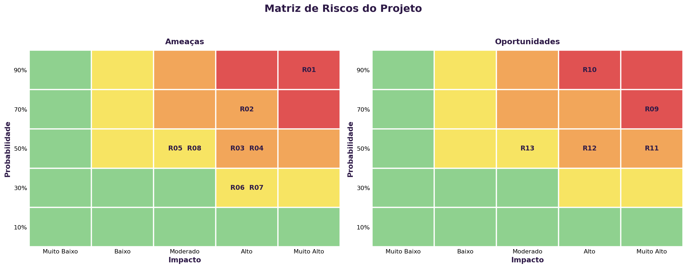
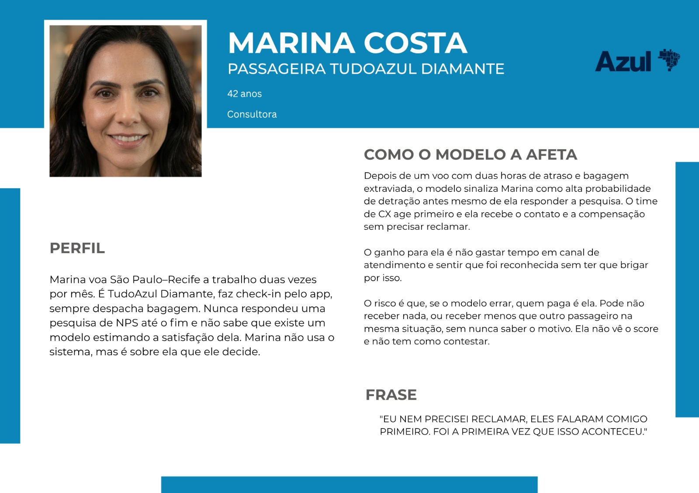

# Documentação Modelo Preditivo - Inteli

```
INSTRUÇÕES GERAIS (remova este trecho ao final)

Você deve editar este documento utilizando notação markdown - siga as convenções neste link 
https://docs.github.com/en/get-started/writing-on-github/getting-started-with-writing-and-formatting-on-github/basic-writing-and-formatting-syntax
```

## Nome da Solução
### Nome do grupo
#### (preencha aqui os nomes dos integrantes, em ordem alfabética, separados por vírgula)

## Sumário
[1. Introdução](#c1)

[2. Objetivos e Justificativa](#c2)

[3. Metodologia](#c3)

[4. Desenvolvimento e Resultados](#c4)

[5. Conclusões e Recomendações](#c5)

[6. Referências](#c6)

[Anexos](#attachments)

### 1. Introdução

A Azul Linhas Aéreas Brasileiras atua na aviação comercial desde 2008. Sua sede administrativa fica em Alphaville, Barueri, na região metropolitana de São Paulo, e seus principais centros de operação são os aeroportos de Viracopos, em Campinas, e Confins, em Belo Horizonte. Com aproximadamente 15 mil Tripulantes e uma malha que alcança mais de uma centena de aeroportos brasileiros, é a companhia de maior capilaridade do país. Em boa parte dessas cidades ela opera sozinha, e essa condição define seu posicionamento de mercado. Enquanto as concorrentes disputam as rotas de maior densidade entre capitais, a Azul construiu vantagem competitiva justamente onde a alternativa de transporte é lenta ou simplesmente não existe.

O alcance da companhia se estende para além do transporte de passageiros. Ela opera também na logística de cargas, no varejo de turismo, na manutenção aeronáutica e em um programa de fidelidade próprio, de modo que a relação com o Cliente não começa nem termina no voo. Esse ponto ganhou peso depois da reestruturação financeira concluída em 2026, da qual a empresa saiu com endividamento reduzido e um plano de crescimento deliberadamente mais moderado, concentrado no mercado doméstico e em rotas de maior rentabilidade. Quando a estratégia deixa de se apoiar na expansão da malha, a base de Clientes existente passa a responder por uma fatia maior do resultado. A experiência entregue em cada viagem deixa de ser apenas atributo de marca e se torna variável econômica.

A leitura dessa experiência cabe à área de Experiência do Cliente e se apoia principalmente no Net Promoter Score. Um dia após o voo, parte dos passageiros recebe uma pesquisa em que indica, numa escala de 0 a 10, o quanto recomendaria a Azul a um amigo ou familiar. As notas 9 e 10 identificam Promotores, 7 e 8 identificam Neutros, e as notas de 0 a 6 identificam Detratores. O questionário vai além da avaliação geral e cobre etapas específicas da jornada, como reserva, check-in, embarque, atendimento a bordo e bagagem. O indicador da companhia se mantém consistentemente acima da média do setor, o que dá à Azul uma posição confortável na comparação com as concorrentes, mas não resolve o problema de como agir sobre os casos individuais de insatisfação.

O desenho da medição impõe dois limites à atuação. O primeiro é de tempo. A informação sobre um Cliente insatisfeito só chega depois que a viagem terminou e depois que ele decidiu responder, o que restringe qualquer intervenção ao campo da recuperação, quando a experiência ruim já foi vivida. O segundo é de cobertura. A taxa de resposta é baixa e alguns perfis participam sistematicamente menos que outros, entre eles quem compra por agência de viagens e quem voa com pouca frequência. Uma parcela relevante da insatisfação real, portanto, nunca chega a ser registrada.

O efeito combinado dos dois limites é que a companhia enxerga com clareza o que já aconteceu, mas não consegue antecipar com quem vai acontecer. Uma mesma falha operacional atinge centenas de passageiros ao mesmo tempo e produz reações bastante distintas, porque o peso de um atraso ou de uma bagagem extraviada varia conforme o perfil do Cliente, o motivo da viagem, a categoria de fidelidade e o histórico de relacionamento com a companhia. Sem uma forma de distinguir esses casos antes que a avaliação ocorra, a priorização dos esforços de atendimento depende de critérios heurísticos e de análise manual, e as decisões de melhoria da jornada acabam apoiadas em um retrato parcial e defasado da experiência do Cliente.

## <a name="c2"></a>2. Objetivos e Justificativa
### 2.1 Objetivos
```
Descreva resumidamente os objetivos gerais e específicos do seu parceiro de negócios.

Remova este bloco ao final
```

### 2.2 Proposta de solução
```
Descreva resumidamente sua proposta de modelo preditivo e como esse modelo pretende resolver o problema, atendendo os objetivos.

Remova este bloco ao final
```

### 2.3 Justificativa
```
Faça uma breve defesa de sua proposta de solução, escreva sobre seus potenciais, seus benefícios e como ela se diferencia.

Remova este bloco ao final
```

## <a name="c3"></a>3. Metodologia
```
Descreva a metodologia CRISP-DM e suas etapas de desenvolvimento, citando o referencial teórico. Você deve apenas enunciar os métodos, sem dizer ainda como eles foram aplicados, nem quais resultados foram obtidos.

Remova este bloco ao final
```

## <a name="c4"></a>4. Desenvolvimento e Resultados
### 4.1. Compreensão do Problema
#### 4.1.1. Contexto da indústria 

**Contexto Setorial**

O mercado doméstico brasileiro é altamente concentrado em três principais companhias — LATAM, GOL e Azul. Em 2025, essas três companhias responderam, juntas, por praticamente todo o mercado doméstico de passageiros em RPK: 39,9% LATAM, 30,9% GOL e 29,1% Azul (ANAC, 2026, p. 62). A LATAM apresenta forte participação no mercado doméstico e ampla atuação nacional e internacional. A GOL possui forte participação no mercado doméstico e historicamente adotou uma estratégia orientada à eficiência operacional e à competitividade de custos, tendo iniciado processo de reestruturação financeira nos Estados Unidos (Chapter 11) em janeiro de 2024 e concluído o processo em junho de 2025 (G1, 2025). A Azul, a mais recente das três, se diferencia por capilaridade e experiência do cliente, sendo a companhia aérea brasileira com o maior número de cidades atendidas — aproximadamente 800 voos diários, mais de 130 destinos e a única companhia em cerca de 80% de suas rotas (AZUL S.A., 2026) —, competindo menos por preço e mais por alcance geográfico e diferenciação de produto. Ambas as concorrentes também passaram por processos de reestruturação financeira nos Estados Unidos, com a Azul concluindo o seu em fevereiro de 2026, após pouco mais de nove meses (FORBES, 2026).
O mercado doméstico brasileiro é altamente concentrado em três principais companhias — LATAM, GOL e Azul. Em 2025, essas três companhias responderam, juntas, por praticamente todo o mercado doméstico de passageiros em RPK: 39,9% LATAM, 30,9% GOL e 29,1% Azul (ANAC, 2026, p. 62). A LATAM apresenta forte participação no mercado doméstico e ampla atuação nacional e internacional. A GOL possui forte participação no mercado doméstico e historicamente adotou uma estratégia orientada à eficiência operacional e à competitividade de custos, tendo iniciado processo de reestruturação financeira nos Estados Unidos (Chapter 11) em janeiro de 2024 e concluído o processo em junho de 2025 (G1, 2025). A Azul, a mais recente das três, se diferencia por capilaridade e experiência do cliente, sendo a companhia aérea brasileira com o maior número de cidades atendidas — aproximadamente 800 voos diários, mais de 130 destinos e a única companhia em cerca de 80% de suas rotas (AZUL S.A., 2026) —, competindo menos por preço e mais por alcance geográfico e diferenciação de produto. Ambas as concorrentes também passaram por processos de reestruturação financeira nos Estados Unidos, com a Azul concluindo o seu em fevereiro de 2026, após pouco mais de nove meses (FORBES, 2026).

A Azul se posiciona como a companhia de maior capilaridade do Brasil. Sua frota diversificada, composta por aeronaves ATR, Embraer E-Jets e Airbus, permite atuar em mercados de menor densidade que os concorrentes, que operam principalmente com aeronaves de maior porte, não conseguiriam explorar de forma rentável (AZUL S.A., 2026). Além da malha ampliada, a empresa aposta na diferenciação da experiência de bordo — entretenimento com TV ao vivo e opções de refeição pouco comuns no setor — como forma de fortalecer a diferenciação e a fidelização dos clientes, competindo menos por preço e mais por alcance geográfico e diferenciação de produto. A companhia também mantém unidades estratégicas de negócio complementares à operação aérea, como o programa de fidelidade Azul Fidelidade, a Azul Cargo e a Azul Viagens, e utiliza o NPS como indicador de satisfação do cliente, tendo registrado média de 38,5 em 2025 (AZUL S.A., 2026).

O setor aéreo brasileiro apresenta elevada complexidade operacional e exposição a ciclos de pressão financeira, associados, entre outros fatores, a custos elevados, volatilidade cambial, combustível, financiamento e restrições na cadeia de suprimentos. Ao mesmo tempo, o mercado doméstico segue em expansão estrutural: o tráfego doméstico brasileiro registrou o maior crescimento em RPK entre os mercados domésticos analisados pela IATA em 2025, com alta de 11,1% sobre 2024 (IATA, 2026). Além dos requisitos de capital e infraestrutura, a atividade é submetida a requisitos regulatórios e operacionais rigorosos, aumentando as barreiras à entrada de novos concorrentes. Some-se a isso a escassez global de aeronaves — a carteira de pedidos ultrapassou 17 mil unidades, equivalente a quase 60% da frota ativa mundial, com déficit acumulado de pelo menos 5.300 entregas nos últimos cinco anos (ENCHIOGLO, 2025) —, que eleva o poder de barganha dos fabricantes (Boeing, Airbus, Embraer), limita a capacidade das companhias de expandir oferta rapidamente e, aliada à necessidade de capital intensivo e escala para negociar com os fabricantes, justifica a barreira de entrada alta do setor — o que favorece a Azul e suas competidoras, já que não precisarão se preocupar com a ameaça de novos entrantes. Soma-se ainda o crescimento do mercado internacional, com disputa acirrada por rotas estratégicas (como Brasil-EUA) via expansão de rede e parcerias como a joint venture Latam-Delta.

---

**5 Forças de Porter**

<div align="center">
  <sub>Figura 1 – 5 Forças de Porter</sub><br>
  <br>
  <sup>Fonte: Autoria própria.</sup>
</div>

**Poder de barganha dos fornecedores: Alto**<br> 
&emsp;As companhias aéreas dependem de uma cadeia de fornecedores altamente especializada e concentrada, composta por fabricantes de aeronaves (Boeing, Airbus e a nacional Embraer), fornecedores de motores e componentes, prestadores de serviços de manutenção e empresas de leasing. O elevado tempo necessário para substituição ou expansão de frota reduz a capacidade das companhias de trocar de fornecedor no curto prazo. O backlog global de aeronaves ultrapassa 17 mil unidades — cerca de 60% da frota ativa mundial —, com déficit acumulado de pelo menos 5.300 entregas nos últimos cinco anos (ENCHIOGLO, 2025), o que tem elevado custos de leasing, manutenção e operação (IATA apud ENCHIOGLO, 2025). A escassez de insumos para fabricação, intensificada após a pandemia, também eleva os custos de produção repassados às companhias aéreas (TAMIOZZO, 2026). Esse cenário reforça a dependência tecnológica das companhias e o alto custo de troca nesse elo da cadeia, sustentando o alto poder de barganha dos fornecedores.

**Poder de barganha dos clientes: Moderado**<br> 
&emsp;Em rotas atendidas por múltiplas companhias, o passageiro consegue comparar preços, horários e condições e trocar de fornecedor com relativa facilidade, o que amplia seu poder de barganha. Esse poder é reduzido, porém, nas rotas de menor densidade atendidas exclusiva ou predominantemente pela Azul — a companhia afirma ser a única operadora em aproximadamente 80% de suas rotas (AZUL S.A., 2026) — e pelos mecanismos de fidelização da empresa, como o programa Azul Fidelidade. Como a exclusividade de rota e a fidelização não se estendem a toda a malha, o poder de barganha dos clientes é classificado como moderado: alto nas rotas competitivas e baixo nas rotas de atuação exclusiva da Azul.

**Rivalidade entre concorrentes: Alta**<br> 
&emsp;O mercado doméstico é altamente concentrado em três companhias, conforme dados previamente apresentados (ANAC, 2026, p. 62), que disputam passageiros e slots por meio de preço, frequência de voos e rotas. O setor é caracterizado por elevados custos fixos e capacidade perecível — um assento vazio em um voo que já partiu não pode ser vendido posteriormente —, o que intensifica a pressão por ocupação e aperta as margens das companhias. Essa dinâmica ajuda a explicar por que as três companhias passaram por processos de reestruturação financeira nos Estados Unidos (Chapter 11) em momentos distintos: a GOL iniciou o processo em janeiro de 2024 e o concluiu em junho de 2025 (G1, 2025), enquanto a Azul concluiu o seu em fevereiro de 2026, após pouco mais de nove meses (FORBES, 2026). A recorrência desses processos entre os três principais players confirma o nível elevado de rivalidade e a pressão estrutural sobre as margens do setor.

**Ameaça de produtos substitutos: Baixa/Moderada**<br> 
&emsp;O transporte rodoviário é a principal alternativa ao transporte aéreo em trajetos curtos e médios, sustentado por preços mais acessíveis e por uma malha rodoviária extensa — o Brasil conta com mais de 75 mil quilômetros somente em rodovias federais —, o que amplia a oferta de rotas e permite que o ônibus alcance destinos sem atendimento aéreo regular. Esse comportamento se reflete também na demanda digital: levantamento da Plataforma 10 registrou, em média, 906 mil buscas mensais por passagens de ônibus no Google, contra 172 mil por passagens aéreas — um interesse de busca cerca de cinco vezes maior (VIANNA, 2026). Em viagens de maior distância ou para passageiros com maior sensibilidade ao tempo, no entanto, o tempo de deslocamento consideravelmente maior do transporte rodoviário reduz sua capacidade de substituição. A capilaridade da Azul e sua atuação em mercados de menor densidade — onde é frequentemente a única operadora (AZUL S.A., 2026) — reduzem ainda mais a disponibilidade de alternativas em parte da malha. Diante disso, a ameaça de substitutos é classificada como baixa a moderada, variando conforme distância da rota e perfil do passageiro.

**Ameaça de novos entrantes: Baixa**<br> 
&emsp;A entrada de novos concorrentes no transporte aéreo regular brasileiro exige elevado investimento em aeronaves, manutenção, tecnologia, pessoal e infraestrutura, além de certificação e atendimento a requisitos regulatórios da ANAC, que estrutura o processo em duas fases — constituição jurídica e homologação técnica — com prazo de até um ano até a emissão do Certificado de Homologação de Empresa de Transporte Aéreo (CHETA) (ANAC, [20--]). O acesso à infraestrutura aeroportuária também é limitado: em aeroportos declarados "coordenados" pela ANAC, a alocação de slots segue regras formais de histórico, prioridade e monitoramento, restringindo a entrada de novos operadores nesses terminais (ANAC, 2022). A esses fatores somam-se as economias de escala já consolidadas pelos players existentes e a necessidade de construir rede de rotas, marca, canais de distribuição e programas de fidelidade — elementos que a Azul, a GOL e a LATAM já possuem de forma madura. Diante desse conjunto de barreiras, a ameaça de novos entrantes é classificada como baixa.

---


#### 4.1.2. Análise SWOT 
```
Posicione aqui sua análise SWOT.

Remova este bloco ao final
```

#### 4.1.3. Planejamento Geral da Solução

**a) Dados disponíveis**

A base utilizada no projeto é a `AMOSTRA_NPS_INTELI_FINAL`, fornecida pela Azul Linhas Aéreas Brasileiras a partir de sua plataforma de dados e disponibilizada à equipe em formato de planilha. O conjunto reúne 98.414 respostas à pesquisa de NPS coletadas entre 1º de junho de 2023 e 26 de julho de 2026, todas referentes a voos domésticos. Cada registro corresponde a uma resposta individual, associada a um localizador de reserva e enriquecida com atributos operacionais do voo realizado. Todos os campos foram anonimizados pela companhia em conformidade com a LGPD, sem qualquer informação que permita identificar o passageiro (AZUL LINHAS AÉREAS BRASILEIRAS, 2026b).

A pesquisa é enviada um dia após o voo a 50% dos Clientes domésticos, que dispõem de sete dias para responder, com quarentena de noventa dias entre envios ao mesmo Cliente (AZUL LINHAS AÉREAS BRASILEIRAS, 2026a). Isso significa que a amostra representa quem respondeu, e não a totalidade dos passageiros transportados no período.

| Nome da Coluna | Tipo de Dado | Preenchimento | Descrição |
|---|---|---|---|
| RESPONDENT_ID | Numérico | 100% | Identificador único da resposta à pesquisa de NPS |
| CLIENTE_RECORDLOCATOR | Texto | 100% | Localizador da reserva à qual a resposta se refere |
| DATA_STD | Data | 100% | Data prevista de partida do voo (Scheduled Time of Departure) |
| EQUIPAMENTO_PREFIXO | Texto | 100% | Prefixo de matrícula da aeronave utilizada. Em jornadas com mais de um trecho, traz os prefixos concatenados |
| BASE_AIRPORTLEG | Texto | 100% | Sequência de aeroportos da jornada, no formato origem/destino ou origem/conexão/destino |
| PERFIL_TUDOAZUL | Texto | 100% | Categoria do Cliente no programa de fidelidade (Cliente Azul, Tudo Azul, Topázio, Safira, Diamante, Azul Diamante Unique, Azul One) |
| VOO_TIPO | Texto | 100% | Natureza da operação: Direto, Conexão ou Escala |
| TIPO_ENTRETENIMENTO | Texto | 100% | Sistema de entretenimento de bordo disponível na aeronave |
| NPS_PRINCIPAL | Numérico | 100% | Classificação do Cliente na pergunta principal de recomendação: -100 (Detrator), 0 (Neutro) ou 100 (Promotor) |
| NPS_ATRASO | Numérico | 14,7% | Avaliação da experiência com atraso no voo |
| NPS_BAGAGEM | Numérico | 34,5% | Avaliação do serviço de bagagem despachada |
| NPS_BAGMAO | Numérico | 79,8% | Avaliação do espaço e serviço de bagagem de mão |
| NPS_CANCELAMENTO24H | Numérico | 1,4% | Avaliação da experiência com cancelamento em até 24 horas |
| NPS_CKBALCAO | Numérico | 11,1% | Avaliação do check-in realizado no balcão |
| NPS_CKMOBILE | Numérico | 54,1% | Avaliação do check-in realizado pelo aplicativo |
| NPS_CKTOTEM | Numérico | 0,3% | Avaliação do check-in realizado no totem de autoatendimento |
| NPS_CKWEB | Numérico | 14,4% | Avaliação do check-in realizado pelo site |
| NPS_COMISSARIOS | Numérico | 78,2% | Avaliação do atendimento dos Tripulantes a bordo |
| NPS_CONFORTO | Numérico | 73,1% | Avaliação do conforto da aeronave, incluindo assento e espaço |
| NPS_EMBARQUE | Numérico | 84,0% | Avaliação do processo de embarque |
| NPS_ENTRETENIMENTO | Numérico | 35,8% | Avaliação do sistema de entretenimento de bordo |
| NPS_LIMPEZA | Numérico | 75,3% | Avaliação da limpeza da aeronave |
| NPS_PILOTOS | Numérico | 76,4% | Avaliação dos pilotos, considerando comunicação e condução do voo |
| NPS_RESAGENCIA | Numérico | 37,5% | Avaliação da reserva realizada por agência de viagem |
| NPS_RESWEB | Numérico | 46,9% | Avaliação da reserva realizada pelos canais digitais próprios |
| NPS_SNACKS | Numérico | 65,1% | Avaliação do serviço de alimentação a bordo |
| NPS_TUDOAZUL | Numérico | 29,4% | Avaliação do programa de fidelidade |
| NPS_WIFI | Numérico | 16,2% | Avaliação do serviço de conexão Wi-Fi a bordo |
| SUB_ENTRETENIMENTO1 | Texto | 31,1% | Indicação de falha no sistema de entretenimento durante o voo (Sim, Não, Não assisti) |
| SUB_ENTRETENIMENTO2 | Texto | 6,7% | Natureza da falha relatada no entretenimento, quando houve |
| SUB_FIL_MOTIVOVIAGEM | Texto | 99,4% | Motivo declarado da viagem: Lazer, Trabalho, Pessoal ou Trabalho combinado com lazer |
| SUB_FIL_FREQUENCIAAZUL | Texto | 99,2% | Frequência de viagens pela companhia, declarada pelo próprio Cliente |
| ESTATISTICA_ATRASOSAIDA | Numérico | 100% | Atraso registrado na partida, em minutos |
| VOO_INTERNACIONAL | Texto | 100% | Classificação do voo como Domestic ou International |
| SEGMENTO | Texto | 100% | Segmento comercial ao qual o Cliente pertence (Corporativo, Azul Viagens, Demais Clientes) |
| TEMPO_VOO | Numérico | 100% | Duração da viagem, em minutos |
| CANCELAMENTO_VOO | Booleano | 100% | Indicação de que houve cancelamento associado à reserva |
| ANTECEDENCIA_CANCELAMENTO | Numérico | 16,3% | Intervalo entre o cancelamento e a partida originalmente prevista, em dias |

**Nota sobre a qualidade e a estrutura dos dados**

A exploração inicial da base revelou características que condicionam diretamente as etapas de preparação de dados previstas na metodologia adotada.

A variável-alvo apresenta desbalanceamento moderado: 65,2% dos registros correspondem a Promotores, 14,5% a Neutros e 20,3% a Detratores. A classe de interesse é minoritária, o que exige atenção à escolha das métricas de avaliação, mas sua proporção permite trabalhar sem recorrer a estratégias agressivas de reamostragem.

As avaliações por etapa da jornada apresentam ausência estrutural, e não aleatória. Cada Cliente avalia apenas o que efetivamente vivenciou, de modo que o preenchimento varia de 84,0% no embarque a 0,3% no check-in por totem. Os quatro campos de check-in são mutuamente exclusivos, com apenas um deles preenchido por registro. Da mesma forma, as avaliações de atraso e de cancelamento só existem quando o evento ocorreu. A ausência, nesses casos, carrega informação sobre a jornada e será tratada como sinal, não como ruído a ser imputado.

Os campos `BASE_AIRPORTLEG` e `EQUIPAMENTO_PREFIXO` não descrevem um único voo. Aproximadamente 30% dos registros trazem valores concatenados que representam jornadas de múltiplos trechos, o que produz 8.746 combinações distintas de rota e 19.456 de aeronave, número muito superior ao tamanho real da frota. A decomposição desses campos em atributos derivados, como aeroporto de origem, aeroporto de destino final, quantidade de trechos e presença de conexão em hub, é condição para que o modelo capte padrões de rota e de equipamento.

Três inconsistências foram identificadas e serão tratadas na preparação dos dados. O campo `TEMPO_VOO`, embora integralmente preenchido, apresenta 1.241 registros com valores incompatíveis com a duração de uma viagem, sendo 1.235 negativos e 6 zerados. Trata-se de erro de conteúdo, não de ausência. O campo `TIPO_ENTRETENIMENTO` contém treze categorias que se reduzem a sete após a padronização de grafias divergentes, como `eX1` e `EX1` ou `não possui entretenimento` e `Nao tem entretenimento`. Por fim, ainda que o campo `VOO_INTERNACIONAL` exista na estrutura, a amostra recebida contém exclusivamente voos domésticos, o que delimita o escopo de aplicação do modelo.

**Distinção entre dados operacionais e dados da pesquisa**

Os campos da base se dividem em dois grupos que não estão disponíveis no mesmo momento, distinção que determina quais deles podem ser usados como preditores.

Doze campos são operacionais e existem antes de qualquer manifestação do Cliente, pois derivam do registro da viagem e do cadastro: data de partida, aeronave, rota, perfil de fidelidade, tipo de operação, sistema de entretenimento da aeronave, atraso na partida, classificação doméstica ou internacional, segmento comercial, duração da viagem, indicação de cancelamento e antecedência do cancelamento.

Vinte e três campos são coletados pela própria pesquisa de NPS: as dezenove avaliações por etapa da jornada e os quatro campos de sub-perguntas, incluindo motivo da viagem e frequência declarada. Todos passam a existir somente no momento em que o Cliente responde, o mesmo instante em que a variável-alvo é registrada.

Utilizar o segundo grupo como preditor produziria um modelo inaplicável na janela descrita no item (c), já que exigiria a resposta à pesquisa para prever o resultado dessa mesma resposta. O modelo destinado à pontuação individual de risco será treinado exclusivamente sobre os campos operacionais e sobre atributos derivados deles. As avaliações por etapa da jornada permanecem na base com finalidade analítica, subsidiando o diagnóstico dos pontos críticos da experiência descrito no segundo modo de uso, sem integrar o conjunto de preditores.

Cabe registrar que motivo da viagem e frequência declarada descrevem características estáveis do Cliente e não a experiência do voo. Ainda assim, nesta base eles chegam pela pesquisa, o que os mantém indisponíveis no momento da predição. Caso a companhia venha a fornecer esses atributos a partir de seus registros internos, eles poderão ser incorporados ao conjunto de preditores em etapa posterior.

**Definição da variável-alvo**

A variável `NPS_PRINCIPAL` assume três valores, correspondentes a Promotores, Neutros e Detratores. Como o objetivo do projeto é estimar a probabilidade de detração, a variável será binarizada: Detratores compõem a classe positiva e Neutros e Promotores são agrupados na classe negativa. A classe positiva concentra 20,3% dos registros. Essa definição vale para todas as métricas estabelecidas no item (e).

**b) Solução proposta**

A solução proposta é um modelo de classificação supervisionada capaz de estimar, para cada Cliente, a probabilidade de que sua experiência resulte em uma avaliação de detração. O modelo é treinado sobre o histórico de respostas de NPS combinado aos registros operacionais do voo, aprendendo a associar configurações de jornada a desfechos de insatisfação.

A Azul já opera um modelo preditivo de NPS em nível agregado, que projeta o comportamento semanal do indicador. O que a companhia não possui é a capacidade de descer ao nível do passageiro individual e responder quem, dentro de um conjunto de voos, tende a se tornar Detrator (AZUL LINHAS AÉREAS BRASILEIRAS, 2026a). É essa lacuna que a solução endereça.

Ao componente preditivo soma-se uma camada de interpretabilidade construída a partir da análise de importância de atributos do modelo treinado. Ela permite hierarquizar quais variáveis da jornada e da operação mais influenciam a probabilidade de detração, revelando quais etapas concentram o peso na formação da nota. O modelo, assim, não apenas ordena Clientes por risco, mas devolve à companhia um mapa dos pontos em que a experiência se deteriora.

O desenvolvimento será conduzido em Python. A manipulação e a preparação dos dados serão feitas com `pandas`, as operações numéricas com `numpy`, o treinamento dos modelos, a divisão dos conjuntos e o cálculo das métricas de avaliação com `scikit-learn`, e a construção dos gráficos de desempenho e de diagnóstico com `matplotlib`.

**c) Como a solução proposta deverá ser utilizada**

A aplicação prevista tem dois modos de operação complementares.

O primeiro é a pontuação individual de risco, executada no intervalo entre a realização do voo e a resposta à pesquisa. A companhia processa os voos de um período por meio da ingestão de um arquivo em formato CSV e recebe, como saída, a probabilidade de detração calculada para cada Cliente, com a respectiva faixa de risco. Como a pesquisa é enviada um dia após o voo e permanece aberta por sete dias, existe uma janela concreta em que a área de Customer Insights pode agir antes que a avaliação seja registrada. A priorização se apoia nessa lista para direcionar as ações de recuperação que a companhia já pratica, do contato personalizado dos Tripulantes ao tratamento diferenciado em solo. Essas ações se apoiam no princípio OPA, sigla para Observar, Perceber e Atender, método interno pelo qual os Tripulantes recebem autonomia para adaptar o atendimento ao contexto de cada passageiro em vez de seguir um roteiro padronizado (AZUL LINHAS AÉREAS BRASILEIRAS, 2026a). O modelo se acopla a esse processo ao indicar antecipadamente quais Clientes concentram maior risco, tornando a personalização mais dirigida.

O segundo modo é o diagnóstico agregado dos fatores de insatisfação. A hierarquia de importância dos atributos, combinada à análise da distribuição do risco por rota, tipo de operação, segmento e perfil de fidelidade, permite identificar onde a detração se concentra e quais condições a antecedem. Esse resultado alimenta a priorização de investimentos e iniciativas de melhoria, sustentando decisões que hoje dependem da análise manual de comentários e de indicadores agregados.

Os dois modos derivam do mesmo artefato. A entrega prevê código executável internamente pela Azul, com documentação que permita a continuidade do trabalho por profissionais que não participaram do desenvolvimento, e saída exportável para os fluxos já utilizados pela área.

**d) Benefícios trazidos pela solução proposta**

- Antecipação da identificação de Clientes insatisfeitos, substituindo um processo hoje reativo, que depende da resposta à pesquisa, por uma atuação preventiva dentro da janela em que ainda é possível intervir.
- Ampliação da cobertura da análise. O processo atual concentra o esforço manual dos analistas em Clientes de alto valor, enquanto o modelo pontua a totalidade dos registros processados.
- Priorização de melhorias operacionais com base em evidência quantitativa sobre o peso de cada etapa da jornada na formação da nota, incluindo limiares de atraso a partir dos quais o risco se eleva de forma relevante.
- Compreensão dos drivers específicos de cada segmento e perfil de fidelidade, permitindo que ações de recuperação sejam calibradas ao Cliente em vez de aplicadas de forma uniforme.
- Identificação de rotas e padrões operacionais sistematicamente associados à detração, subsidiando decisões de malha, alocação de equipamento e serviço de bordo.
- Melhor alocação do investimento em ações de recuperação, ao reduzir tanto o esforço direcionado a Clientes que já seriam Promotores quanto a ausência de ação junto a quem efetivamente detrataria.
- Redução do risco de acomodação de expectativa, uma vez que benefícios passam a ser concedidos com base em risco estimado e não de forma recorrente ao mesmo grupo de Clientes.

**e) Critérios de sucesso**

- Desempenho do modelo

O erro de não identificar um Cliente que efetivamente detratará é mais custoso para a companhia do que o de acionar um Cliente que já seria Promotor, pois o primeiro implica perda de relacionamento e o segundo apenas gasto sem retorno, assimetria apontada pela própria equipe de Customer Experience da Azul (AZUL LINHAS AÉREAS BRASILEIRAS, 2026a). Por essa razão, a revocação na classe positiva, composta pelos Detratores conforme a binarização definida no item (a), é adotada como métrica primária de avaliação.

- Revocação de no mínimo 0,70 na classe Detrator no conjunto de teste.
- ROC-AUC de no mínimo 0,75, demonstrando capacidade de ordenação de risco superior à referência aleatória.
- Precisão de no mínimo 0,40 na classe Detrator, o que representa aproximadamente o dobro da taxa de prevalência observada na base (20,3%) e assegura que a lista priorizada tenha densidade de risco suficiente para justificar a ação.
- F1-score reportado como métrica de equilíbrio, acompanhado da matriz de confusão e da curva Precision-Recall.
- Probabilidades calibradas, verificadas por curva de calibração, condição para que o corte de priorização seja definido em termos de negócio e não de forma arbitrária.
- Estabilidade do desempenho em validação temporal, com o modelo avaliado em período posterior ao de treino, dada a extensão de três anos da base e a presença de fatores sazonais e conjunturais no comportamento do indicador.

- Resultado de negócio

Os patamares a seguir dependem de parâmetros que serão validados junto ao parceiro, entre eles o custo médio das ações de recuperação e o valor associado à retenção do Cliente.

- Redução de ao menos 10% na proporção de Detratores entre os Clientes submetidos a ação preventiva orientada pelo modelo, comparada ao grupo não priorizado.
- Elevação da taxa de conversão das ações de recuperação em relação à média histórica atualmente observada pela companhia.
- Redução do tempo entre a ocorrência do voo e a identificação do Cliente em risco, hoje condicionada à resposta à pesquisa.
- Adoção efetiva pela área de Customer Insights, evidenciada pela execução autônoma do modelo pela equipe da Azul ao término do projeto.
- Aderência integral aos requisitos de privacidade e proteção de dados estabelecidos pela LGPD e às restrições de compartilhamento definidas pela companhia.

- Retorno sobre o investimento

Demonstração de retorno positivo em até doze meses após a entrada em operação, calculado pela comparação entre o custo das ações preventivas direcionadas pelo modelo e o valor preservado pela retenção dos Clientes recuperados. A quantificação depende dos parâmetros de custo e de valor de Cliente a serem fornecidos pela Azul.


#### 4.1.4. Value Proposition Canvas


O Value Proposition Canvas **(VPC)** é uma ferramenta de modelagem estratégica utilizada para alinhar uma proposta de valor às necessidades reais de um segmento de clientes. O modelo é composto por dois blocos principais: o **Perfil do Cliente (Customer Profile)**, que representa as atividades, dores e ganhos esperados pelo usuário, e o **Mapa de Valor (Value Map)**, que descreve como os produtos e serviços oferecidos atendem a essas necessidades. Dessa forma, o Canvas permite verificar se a solução proposta realmente gera valor para seus usuários e auxilia na definição de funcionalidades que atendam aos objetivos do negócio.

No contexto deste projeto, o Value Proposition Canvas foi utilizado para compreender como a solução proposta poderá gerar valor para a equipe de **Customer Experience da Azul Linhas Aéreas**, principal responsável pela utilização do modelo preditivo. Diferentemente do passageiro, que é beneficiado de forma indireta pelas ações decorrentes das previsões do modelo, a equipe de Customer Experience é quem utilizará os resultados gerados para apoiar decisões estratégicas e operacionais relacionadas à melhoria da experiência dos clientes.

A construção do Canvas foi baseada nas informações disponibilizadas pela Azul na proposta inicial do projeto (TAPI), complementadas pelos workshops realizados com a empresa parceira. Durante essas interações foi possível compreender o fluxo atual de análise do NPS, os desafios enfrentados pela equipe, a forma como os dados são utilizados e, principalmente, a expectativa da empresa de obter não apenas previsões de passageiros detratores, mas também novos insights que permitam identificar padrões ainda desconhecidos e apoiar ações preventivas capazes de elevar o NPS.

A partir dessa análise, foram identificados os principais elementos do Perfil do Cliente e do Mapa de Valor, apresentados a seguir, relacionando as necessidades da equipe de Customer Experience às características da solução proposta.

**Tarefas:** a equipe de Customer Experience é responsável por monitorar o NPS, identificar riscos, investigar suas possíveis causas, definir ações, priorizar os casos que demandam atenção e avaliar os resultados obtidos. Essas atividades orientam a utilização das informações geradas pela solução no processo de acompanhamento da experiência dos passageiros.

**Dores:** o Canvas evidencia quatro principais dificuldades enfrentadas pela equipe: um processo predominantemente reativo, o grande volume de dados, a dificuldade de antecipar quais passageiros podem se tornar detratores e a dificuldade de priorizar quais casos devem receber atenção.


**Ganhos:** a solução busca permitir a antecipação de possíveis detratores, gerar novos insights, contribuir para a melhoria do NPS, apoiar decisões mais rápidas e auxiliar na priorização dos recursos disponíveis para atuação da equipe.

**Produtos e serviços:** o Mapa de Valor é composto pelo modelo preditivo, pelo dashboard, pelos insights relacionados aos fatores que influenciam o NPS e pela integração com o Snowflake. Esses elementos concentram e disponibilizam as informações necessárias para apoiar a atuação da equipe.

**Analgésicos:** esses produtos e serviços procuram reduzir as principais dores identificadas por meio da predição antecipada, da automatização da priorização, da redução da análise manual e do apoio a ações preventivas.


**Criadores de ganho:** além de reduzir as dores existentes, a solução busca gerar valor adicional por meio da descoberta de novos padrões, do apoio às decisões, da contribuição para a melhoria do NPS e da geração de insights acionáveis que auxiliem na definição de ações preventivas.

O principal objetivo da solução proposta é deslocar parte das ações da equipe de Customer Experience de uma abordagem reativa para uma abordagem preditiva. Atualmente, muitas ações são realizadas após a identificação de passageiros detratores. Com a utilização do modelo preditivo, espera-se antecipar potenciais experiências negativas, permitindo que a equipe intervenha antes da ocorrência da avaliação do NPS, por meio de ações direcionadas aos passageiros com maior risco de insatisfação.

A análise realizada por meio do Value Proposition Canvas demonstra que a proposta de valor da solução vai além da construção de um modelo de Machine Learning. O projeto busca fornecer informações acionáveis para a equipe de Customer Experience em duas frentes. A primeira é a priorização dos passageiros com maior probabilidade de se tornarem detratores, utilizada na rotina de atendimento. A segunda é a compreensão dos principais fatores que influenciam a satisfação dos clientes, que apoia decisões preventivas de caráter estrutural e é consumida em análises pontuais, e não no dia a dia. Dessa forma, a solução contribui para a melhoria contínua da experiência dos passageiros e para o fortalecimento da estratégia de relacionamento da Azul. A priorização é necessária porque a equipe de Customer Experience atua sobre um volume de passageiros menor do que o total de passageiros em risco. Por isso, o valor do modelo está menos na sua precisão sobre toda a base e mais na sua capacidade de ordenar corretamente os casos mais críticos. Vale destacar que o modelo estima a probabilidade de o passageiro responder à pesquisa como detrator, o que não corresponde exatamente a ter vivido uma experiência negativa, já que passageiros insatisfeitos que não respondem à pesquisa não são capturados por essa métrica.


#### 4.1.5. Matriz de Riscos

&emsp;A matriz abaixo consolida as ameaças e oportunidades identificadas para o desenvolvimento do modelo preditivo de detratores de NPS. A probabilidade e o impacto de cada item foram estimados pelo grupo com base no TAPI e no dicionário de dados fornecidos pela Azul. Os riscos serão revisados a cada sprint, podendo ser reclassificados conforme o avanço do projeto.

<div align="center">
  <sub>Figura 1 – Matriz de Riscos do Projeto</sub><br>
  <br>
  <sup>Fonte: Autoria própria.</sup>
</div>

##### Ameaças

| #   | Descrição                                                                                                                                                                                              | Probabilidade |  Impacto   | Justificativa da Classificação                                                                                                          | Plano de Resposta                                                                                                                                          |
| --- | ------------------------------------------------------------------------------------------------------------------------------------------------------------------------------------------------------ | :-----------: | :--------: | ------------------------------------------------------------------------------------------------------------------------------------------ | ----------------------------------------------------------------------------------------------------------------------------------------------------------- |
| R01 | Vazamento de alvo: usar as sub-notas de NPS (`nps_conforto`, `nps_atraso` etc.) como features, sendo que elas vêm da mesma pesquisa que gera o alvo. O modelo pareceria ótimo, mas seria inútil na prática. |      90%      | Muito Alto | Probabilidade muito alta: as sub-notas ficam na mesma base e o erro é fácil de cometer sem experiência prévia com esse tipo de dado. Impacto muito alto: invalida o modelo inteiro sem que a equipe perceba até a validação final. |Treinar só com dados disponíveis antes da resposta do passageiro (atraso, rota, aeronave, segmento). Acurácia acima de 95% será tratada como sinal de alerta. |
| R02 | Desbalanceamento: bem menos detratores que não detratores, enviesando o modelo para a classe majoritária.                                                                                                |      70%      |    Alto    | Probabilidade alta: é característica intrínseca de dados de NPS, não uma hipótese. Impacto alto: compromete justamente a capacidade de identificar a classe de interesse (detratores). | Balancear classes (SMOTE ou `class_weight`) e avaliar por F1 e ROC-AUC, não por acurácia.                                                                    |
| R03 | Baixo poder preditivo das variáveis operacionais restantes após a remoção das features com vazamento de alvo.                                                                                            |      50%      |    Alto    | Probabilidade moderada: só é mensurável durante a modelagem, após a limpeza do vazamento. Impacto alto: pode inviabilizar a meta de desempenho combinada com a Azul. | Investir em engenharia de features e alinhar com a Azul que o valor do projeto também está nos drivers de insatisfação identificados, não só na métrica final. |
| R04 | Tratar correlação como causa e gerar recomendações de negócio equivocadas.                                                                                                                               |      50%      |    Alto    | Probabilidade moderada: erro recorrente ao interpretar SHAP/feature importance sem cuidado metodológico. Impacto alto: pode levar a recomendações de negócio erradas para a Azul. | Apresentar os resultados do SHAP como associação, não causalidade, e validar as hipóteses com a equipe de Customer Insights antes de recomendar.             |
| R05 | Dados faltantes ou inconsistentes nas variáveis operacionais e de perfil.                                                                                                                                |      50%      |  Moderado  | Probabilidade moderada: comum em bases operacionais reais. Impacto moderado: tratável com técnicas padrão de imputação, sem comprometer o projeto como um todo. | Mapear a completude na EDA e definir tratamento por coluna (imputação, flag ou exclusão).                                                                    |
| R06 | Atraso na entrega da base `AMOSTRA_NPS_INTELI` pela Azul, comprometendo o cronograma.                                                                                                                    |      30%      |    Alto    | Probabilidade baixa: já há alinhamento prévio de cronograma com o ponto focal. Impacto alto: um atraso na base de entrada atrasa todas as sprints seguintes do CRISP-DM. | Alinhar prazo com o ponto focal já na primeira semana e adiantar o pipeline com dados sintéticos.                                                            |
| R07 | Mudança de escopo ao longo das sprints, gerando retrabalho.                                                                                                                                              |      30%      |    Alto    | Probabilidade baixa: escopo já formalizado no TAPI, mitigando mudanças bruscas. Impacto alto: gera retrabalho em entregas já avançadas do projeto. | Validar cada entrega com a Azul antes de avançar e registrar decisões no WAD.                                                                                |
| R08 | Overfitting: modelo bom no treino e ruim em dados novos.                                                                                                                                                 |      50%      |  Moderado  | Probabilidade moderada: comum em modelos com poucas features após a remoção do vazamento de alvo. Impacto moderado: detectável e corrigível via validação cruzada antes da entrega final. | Validação cruzada, conjunto de teste isolado e monitoramento da diferença treino×validação.                                                                  |

##### Oportunidades

| #   | Descrição                                                                       | Probabilidade |  Impacto   | Justificativa da Classificação                                                                                                    | Plano de Aproveitamento                                                             |
| --- | ------------------------------------------------------------------------------- | :-----------: | :--------: | -------------------------------------------------------------------------------------------------------------------------------------- | ------------------------------------------------------------------------------------ |
| R09 | Antecipar o detrator antes da pesquisa, permitindo recuperação do cliente.       |      70%      | Muito Alto | Probabilidade alta: é o objetivo central do modelo preditivo. Impacto muito alto: é o principal valor de negócio entregue à Azul. | Entregar o score em ranking priorizado para a operação agir a tempo.                 |
| R10 | Priorizar melhorias na experiência com base em dados, não em percepção.          |      90%      |    Alto    | Probabilidade muito alta: os drivers de insatisfação emergem naturalmente da análise de importância de features. Impacto alto: orienta decisões operacionais concretas da Azul. | Entregar ranking de drivers com recomendações por etapa da jornada.                  |
| R11 | Impacto em retenção, receita e NPS ao reduzir a base de detratores.              |      50%      | Muito Alto | Probabilidade moderada: depende da adoção operacional das recomendações pela Azul. Impacto muito alto: retenção de detratores afeta diretamente receita e reputação da companhia. | Traduzir os resultados em impacto de negócio no painel para os stakeholders.         |
| R12 | Insights e ações específicas por segmento de cliente (Corporativo, Azul Viagens). |      50%      |    Alto    | Probabilidade moderada: depende da qualidade da variável `segmento_cliente` na base. Impacto alto: personaliza a ação da Azul por tipo de cliente. | Usar `segmento_cliente` como feature e segmentar a análise de drivers.               |
| R13 | Reuso do modelo em outras rotas e padrões operacionais da malha.                 |      50%      |  Moderado  | Probabilidade moderada: depende de decisão futura da Azul, fora do controle do grupo. Impacto moderado: amplia o valor do projeto sem ser o objetivo principal desta sprint. | Construir pipeline modular e documentado, facilitando o reuso além do recorte inicial. |

#### 4.1.6. Personas

&emsp;Compreender profundamente quem são as pessoas envolvidas em um problema é o primeiro passo para construir uma solução que realmente faça sentido. As personas apresentadas a seguir representam perfis reais de usuários e stakeholders impactados pelo modelo, construídas a partir do levantamento realizado com a equipe do projeto sobre os processos atuais de classificação de NPS e recuperação de clientes na Azul. Elas cumprem um papel fundamental neste trabalho: ao colocar rostos, rotinas e necessidades concretas por trás dos dados, tornam mais claro para quem estamos desenvolvendo o modelo, quais dores buscamos resolver e quais consequências, positivas ou negativas, nossas decisões técnicas podem gerar. Mais do que um exercício descritivo, o uso de personas orienta escolhas de modelagem, prioriza funcionalidades e ajuda a antecipar riscos, garantindo que o problema seja compreendido não apenas do ponto de vista analítico, mas também sob a perspectiva de quem utiliza, é afetado ou depende dos resultados gerados pela solução.

##### Fernanda Ribeiro (persona que utiliza o modelo)


&emsp;Fernanda Ribeiro é Analista de Customer Insights e atua como utilizadora direta do modelo. Atualmente, ela é responsável por receber o volume diário de respostas da pesquisa de NPS e realizar a classificação dos passageiros em Promotores, Neutros e Detratores de forma manual, o que torna o processo reativo e trabalhoso, já que a identificação de um detrator só ocorre depois que a nota já foi dada. Com a implementação do modelo, Fernanda passará a utilizá-lo diretamente em sua rotina para antecipar a probabilidade de detração e identificar os principais fatores que influenciam uma nota baixa, tornando a análise mais rápida, organizada e menos dependente de esforço manual. Por isso, ela é considerada uma persona que utiliza o modelo.

##### Rafael Souza (persona afetada pelo modelo)


&emsp;Rafael Souza é Analista de Customer Experience e representa uma persona afetada pelo modelo, ainda que não interaja diretamente com ele. Ele recebe da equipe de Insights a lista de passageiros detratores já classificada e, a partir dessas informações, investiga as possíveis causas da insatisfação e decide quais ações de recuperação ou recompensa devem ser oferecidas a cada cliente. Como seu trabalho depende diretamente da qualidade das informações produzidas pelo modelo, como os principais drivers da detração, a segmentação por perfil e a priorização dos casos, qualquer melhoria ou limitação do modelo impacta diretamente sua capacidade de tomar decisões rápidas e assertivas. Por esse motivo, Rafael é classificado como uma persona afetada pelo modelo, e não como uma usuária direta da ferramenta.

##### Marina Costa (persona afetada pelo modelo)

<div align="center">
  <sub>Figura 2 – Persona afetada pelo modelo: Marina Costa</sub><br>
  <br>
  <sup>Fonte: Autoria própria.</sup>
</div>

&emsp;Marina Costa é passageira TudoAzul Diamante e atua como persona afetada pelo modelo. Ela voa a trabalho com frequência e, embora não utilize o sistema em nenhum momento, é sobre ela que as predições são realizadas. Atualmente, quando enfrenta um problema durante a viagem, como atraso de voo ou extravio de bagagem, Marina precisa acionar os canais de atendimento por conta própria e aguardar a resposta da companhia, o que torna a recuperação lenta e dependente da iniciativa do próprio passageiro. Com a implementação do Safira, sua probabilidade de detração passa a ser identificada antes mesmo da resposta à pesquisa de NPS, permitindo que a equipe de Customer Experience realize o contato e ofereça a compensação de forma proativa. Em contrapartida, Marina não tem visibilidade sobre a classificação atribuída a ela nem meios de contestá-la, o que reforça a necessidade de que a decisão final permaneça sob responsabilidade humana. Por isso, ela é considerada uma persona que é afetada pelo modelo.

##### Conclusão da seção de Personas

&emsp;O mapeamento das personas do Safira evidencia que a solução atende a três posições distintas dentro do fluxo de gestão do NPS da Azul, e não a um único perfil de usuário. Fernanda Ribeiro representa a etapa de identificação e priorização, na qual o modelo substitui a classificação manual dos respondentes pela estimativa antecipada da probabilidade de detração e pela indicação dos fatores de maior peso na nota. Rafael Souza representa a etapa de decisão, na qual o modelo fornece os drivers da insatisfação e o histórico do passageiro para embasar a escolha da ação de recuperação, reduzindo a dependência de julgamento individual. Marina Costa, por sua vez, representa quem recebe o resultado dessa decisão sem participar dela.

&emsp;Essa distinção orienta diretamente as escolhas de projeto do Safira. O fato de Fernanda necessitar de uma leitura agregada dos fatores de detração, enquanto Rafael necessita da explicação individual de cada caso, define que o modelo deve entregar interpretabilidade em dois níveis, e não apenas um resultado de classificação. Já a presença de Marina como persona afetada estabelece que o Safira deve atuar como ferramenta de apoio à decisão humana, e não como mecanismo de decisão automática, uma vez que a consequência de um erro de predição recai sobre o passageiro, que não tem acesso à sua classificação nem meios de questioná-la.

&emsp;Dessa forma, as personas cumprem no projeto a função de traduzir requisitos técnicos em necessidades humanas concretas, garantindo que a construção do modelo preditivo considere tanto a eficiência operacional das equipes de Customer Insights e Customer Experience quanto a responsabilidade sobre os passageiros classificados por ele.

#### 4.1.7. Jornadas do Usuário
```
Posicione aqui seus mapas de jornadas do usuário que utiliza o modelo.

Remova este bloco ao final
```

## 4.1.8 Política de Privacidade — LGPD

## Projeto Modelo Preditivo para Identificação de Clientes Detratores de NPS

#### Informações Gerais

Esta Política de Privacidade apresenta como o projeto **Modelo Preditivo para Identificação de Clientes Detratores de NPS**, desenvolvido pelo grupo **Avatares**, em parceria com a Azul Linhas Aéreas Brasileiras e o Instituto de Tecnologia e Liderança (Inteli), realiza o tratamento dos dados utilizados no desenvolvimento da solução.

O projeto tem como objetivo identificar os fatores associados à insatisfação dos passageiros e estimar a probabilidade de um cliente tornar-se detrator do Net Promoter Score (NPS), contribuindo para a melhoria da experiência dos clientes da Azul.

O tratamento dos dados será realizado em conformidade com a Lei nº 13.709, de 14 de agosto de 2018, denominada Lei Geral de Proteção de Dados Pessoais (LGPD), observando os princípios previstos no art. 6º da LGPD, incluindo finalidade, adequação, necessidade, livre acesso, qualidade dos dados, transparência, segurança, prevenção, não discriminação e responsabilização e prestação de contas (BRASIL, 2018).

#### Dados Coletados

**Dados fornecidos diretamente:** respostas fornecidas pelos passageiros nas pesquisas de satisfação da Azul, incluindo a avaliação geral da experiência de voo e avaliações relacionadas a atraso, bagagem, check-in, embarque, atendimento, conforto, limpeza, entretenimento, Wi-Fi, alimentação, reservas e programa TudoAzul. Também poderão ser utilizados dados referentes ao motivo e à frequência das viagens.

**Dados coletados automaticamente:** informações operacionais registradas pelos sistemas da Azul, como data prevista de partida, origem e destino do voo, tipo de operação, aeronave utilizada, duração do voo, tempo de atraso, ocorrência de cancelamento, segmento do cliente e categoria no programa TudoAzul.

A equipe não realizará uma nova coleta de informações diretamente dos passageiros. Os dados serão fornecidos pela Azul por meio da base **AMOSTRA_NPS_INTELI** e estarão limitados às informações necessárias para a análise das respostas de NPS.

As informações que poderiam identificar o passageiro ou relacioná-lo diretamente a determinado voo serão anonimizadas antes de serem disponibilizadas ao grupo. Não serão fornecidos nomes, documentos, endereços, telefones, e-mails, dados bancários ou dados pessoais sensíveis.

Os dados disponibilizados ao grupo são previamente anonimizados pela Azul. Nos termos do art. 12 da LGPD, dados efetivamente anonimizados não são considerados dados pessoais para os fins da Lei, desde que o processo de anonimização não possa ser revertido por meios próprios ou mediante esforços razoáveis (BRASIL, 2018). A técnica específica de anonimização utilizada pela Azul não foi informada ao grupo.

#### Finalidade do Tratamento

Os dados serão utilizados para desenvolver e avaliar um modelo preditivo capaz de estimar a probabilidade de um passageiro tornar-se detrator do NPS.

O tratamento também permitirá identificar os principais fatores relacionados à insatisfação, reconhecer pontos críticos da jornada do passageiro e gerar análises que auxiliem a Azul na priorização de ações voltadas à melhoria da experiência de seus clientes.

Os dados não serão utilizados para publicidade direcionada, comercialização de informações, discriminação de passageiros ou finalidades incompatíveis com o escopo do projeto.

#### Armazenamento e Retenção

**Local:** ambiente controlado pela Azul Linhas Aéreas Brasileiras. O modelo será desenvolvido e executado na infraestrutura interna de dados da empresa, sem a transferência da base para ambientes públicos ou não autorizados.

**Prazo:** os dados serão utilizados pelo grupo até **7 de outubro de 2026**, data prevista para o encerramento do projeto. Após esse período, eventuais cópias deverão ser eliminadas ou devolvidas à Azul, conforme as orientações da empresa e do Inteli.

Poderão ser mantidos códigos, métricas, gráficos e resultados agregados, desde que não contenham registros individualizados, dados pessoais ou informações confidenciais da Azul.

#### Compartilhamento de Dados

O acesso aos dados será restrito aos integrantes autorizados do grupo **Avatares**, aos professores e orientadores responsáveis pelo projeto no Inteli e aos profissionais da Azul envolvidos no desenvolvimento, acompanhamento ou avaliação da solução.

O acesso será concedido somente aos responsáveis pelas áreas que necessitem das informações para o desempenho de suas atividades.

As bases de dados, completas ou parciais, não serão publicadas no GitHub, no site institucional do Inteli ou em outros ambientes públicos. Os dados também não serão vendidos ou compartilhados com terceiros para finalidades comerciais.

O código-fonte poderá ser publicado desde que não contenha os dados utilizados no treinamento, na validação ou no teste do modelo.

#### Segurança dos Dados

A proteção dos dados será realizada por meio das seguintes medidas:

* anonimização das informações que possam identificar os passageiros;
* armazenamento e processamento em ambiente controlado pela Azul;
* controle de acesso conforme as atribuições de cada usuário;
* acesso concedido somente aos responsáveis autorizados;
* utilização de contas individuais e credenciais protegidas;
* proibição do compartilhamento da base por meios não autorizados;
* proibição da publicação de dados reais em repositórios públicos;
* eliminação ou devolução dos dados após o encerramento do projeto.

A técnica específica utilizada no processo de anonimização não foi informada ao grupo. Dessa forma, não são atribuídos ao processo mecanismos técnicos que não tenham sido formalmente confirmados pela Azul.

Os integrantes do grupo deverão preservar a confidencialidade das informações e utilizá-las exclusivamente para as atividades acadêmicas e técnicas autorizadas.

#### Direitos dos Titulares

Nos termos da LGPD, os titulares poderão solicitar:

* acesso aos dados pessoais tratados pela Azul;
* correção de informações incompletas, inexatas ou desatualizadas;
* exclusão, anonimização ou bloqueio de dados, quando aplicável;
* informações sobre as finalidades do tratamento;
* revogação do consentimento, quando essa for a base legal utilizada;
* informações sobre o compartilhamento dos dados;
* revisão de decisões tomadas exclusivamente por tratamento automatizado, quando aplicável.

A Azul permite que o titular consulte as informações que a companhia mantém a seu respeito, mediante os procedimentos de autenticação e segurança adotados pela empresa.

Como a base disponibilizada ao grupo será anonimizada, os estudantes não poderão localizar os registros de um passageiro por meio de nome, documento ou e-mail. Portanto, as solicitações relacionadas ao exercício dos direitos dos titulares deverão ser encaminhadas diretamente à Azul.

**Solicitações via e-mail:** [privacy@voeazul.com.br](mailto:privacy@voeazul.com.br)

#### Encarregado de Dados (DPO)

**Nome:** Kaylan Alexandre De Paula Sathler.

**E-mail:** [Kaylan.sathler@sou.inteli.edu.com.br](mailto:Kaylan.sathler@sou.inteli.edu.com.br)

#### Atualização da Política

Esta Política de Privacidade poderá ser atualizada conforme alterações no projeto ou novas orientações fornecidas pela Azul Linhas Aéreas Brasileiras e pelo Inteli, prevalecendo sempre a versão mais recente do documento.


### 4.2. Compreensão dos Dados

#### 4.2.1. Exploração de dados
```
Apresentar a estatística descritiva básica de cada coluna, identificar se a coluna é numérica ou categórica e pelo menos 3 gráficos para visualizar a relação entre colunas escolhidas pelo grupo.

Remova este bloco ao final
```

#### 4.2.2. Pré-processamento dos dados
```
Apresentar quais foram as ações realizadas de limpeza (tratamento de missing values e remoção de outliers) e transformação (normalização e codificação) das colunas. Se houverem outliers, cite quais são e qual(is) correção(ões) será(ão) aplicada(s).

Remova este bloco ao final
```

#### 4.2.3. Hipóteses
```
Descreva três hipóteses sobre a relação dos dados e o problema. Justifique cada uma delas. 

Remova este bloco ao final
```

### 4.3. Preparação dos Dados e Modelagem
```
Caso seu projeto seja Modelo Supervisionado, apresentar: 
a) Organização dos dados (conjunto de treinamento, validação e testes)
b) Modelagem para o problema (proposta de features com a explicação completa da linha de raciocínio).
c) Métricas relacionadas ao modelo (pelo menos 3).
d) Apresentar o primeiro modelo candidato, e uma discussão sobre os resultados deste modelo (discussão sobre as métricas para esse modelo candidato).

Caso seu projeto seja Modelo Não-Supervisionado, apresentar:
a) Modelagem para o problema (proposta de features com a explicação completa da linha de raciocínio).
b) Primeiro modelo candidato para o problema.
c) Justificativa para a definição do K do modelo.
d) Escolha de um tipo de sistema de recomendação e a justificativa para essa escolha.

Remova este bloco ao final
```

### 4.4. Comparação de Modelos
```
- Descrever e justificar a escolha da métrica de avaliação dos modelos com base no que é mais importante para o problema ao 
  se medir a qualidade desses modelos;
- Descrever ao menos três modelos candidatos, seus respectivos algoritmos, seus tunings de hiperparâmetros e suas métricas 
  alcançadas;

Remova este bloco ao final
```

### 4.5. Avaliação
```
- Descreva a solução final de modelo preditivo e justifique a escolha. Alinhe sua justificativa com a Seção 4.1, resgatando o entendimento 
  do negócio e das personas, explicando de que formas seu modelo atende os requisitos e definições. 
- Descreva também um plano de contingência para os casos em que o modelo falhar em suas predições.
- Além disso, discuta sobre a explicabilidade do modelo (se aplicável) e realize a verificação de aceitação ou refutação das hipóteses.
- Se aplicável, utilize equações, tabelas e gráficos de visualização de dados para melhor ilustrar seus argumentos. 

Remova este bloco ao final
```

## <a name="c5"></a>5. Conclusões e Recomendações
```
Escreva, de forma resumida, sobre os principais resultados do seu projeto e faça recomendações formais ao seu parceiro de negócios em relação ao uso desse modelo. Você pode aproveitar este espaço para comentar sobre possíveis materiais extras, como um manual de usuário mais detalhado na seção “Anexos”. Não se esqueça também das pessoas que serão potencialmente afetadas pelas decisões do modelo preditivo e elabore recomendações que ajudem seu parceiro a tratá-las de maneira estratégica e ética. 

Remova este bloco ao final
```

## <a name="c6"></a>6. Referências

AZUL LINHAS AÉREAS BRASILEIRAS; INSTITUTO DE TECNOLOGIA E LIDERANÇA. *Projeto parceiro: modelo preditivo para identificação de clientes detratores de NPS*. São Paulo, 2026. Documento interno confidencial.

BRASIL. Lei nº 13.709, de 14 de agosto de 2018. Lei Geral de Proteção de Dados Pessoais — LGPD. *Diário Oficial da União*: seção 1, Brasília, DF, ano 155, n. 157, p. 59, 15 ago. 2018.

CAVALCANTI, Glauce. Avião supera ônibus em viagens no país pela 1a vez desde 2020. Disponível em: <https://oglobo.globo.com/economia/noticia/2025/10/02/aviao-supera-onibus-em-viagens-no-pais-pela-1a-vez-desde-2020.ghtml>. Acesso em: 5 ago. 2026.

INTERNATIONAL AIR TRANSPORT ASSOCIATION (IATA). Strong 2025 Passenger Demand Masks Ongoing Capacity Constraints. Geneva: IATA, 29 jan. 2026. Disponível em: https://www.iata.org/en/pressroom/2026-releases/2026-01-29-02/. Acesso em: 11 ago. 2026.

AGÊNCIA NACIONAL DE AVIAÇÃO CIVIL (ANAC). Anuário do Transporte Aéreo 2025. Brasília: ANAC, 2026. p. 62.

MARQUES, Vinícius. Brasil é o único grande mercado doméstico de aviação a crescer em junho; demanda global recua, diz IATA. Disponível em: <https://timesbrasil.com.br/empresas-e-negocios/aviacao/brasil-e-o-unico-grande-mercado-domestico-de-aviacao-a-crescer-em-junho-demanda-global-recua-diz-iata/>. Acesso em: 5 ago. 2026.

AZUL S.A. Por que investir na Azul? Relações com Investidores Azul, [2026]. Disponível em: https://ri.voeazul.com.br/a-azul/por-que-investir-na-azul/. Acesso em: 11 ago. 2026.


MAGALHAES, Luciana Novaes. Gol exits Chapter 11 with plans to add new routes and expand fleet. Disponível em: <https://www.reuters.com/world/americas/gol-exits-chapter-11-with-plans-add-new-routes-expand-fleet-2025-06-06/>. Acesso em: 11 ago. 2026.

SABÓIA, Gabriel. Azul anuncia a saída do processo de recuperação judicial nos Estados Unidos Leia mais em: https://veja.abril.com.br/economia/azul-anuncia-a-saida-do-processo-de-recuperacao-judicial-nos-estados-unidos/. Disponível em: <https://veja.abril.com.br/economia/azul-anuncia-a-saida-do-processo-de-recuperacao-judicial-nos-estados-unidos/>. Acesso em: 11 ago. 2026.


TAMIOZZO, Mateus. Por que faltam aviões para as companhias aéreas e como isso prejudica a sua viagem? Disponível em: <https://www.melhoresdestinos.com.br/falta-de-avioes.html>. Acesso em: 4 ago. 2026.


Pesquisa do IBGE revela mudança nos meios de transporte: avião supera ônibus pela primeira vez. YouTube, 2025. 1 vídeo (5:28). Disponível em: https://www.youtube.com/watch?v=jiSMLAnPCaQ. Acesso em: 05/08/2026.

Por que as Companhias Aéreas Brasileiras dão tanto PREJUÍZO? | Curioso Explica. YouTube, 2026. 1 vídeo (11:30). Disponível em: https://www.youtube.com/watch?v=hwI6NVrZGig. Acesso em: 05/08/2026.

VIANNA, Vitor. Buscas por passagens de ônibus superam em 5 vezes as de avião. iG Turismo, 1 maio 2026. Disponível em: https://turismo.ig.com.br/colunas/vitor-vianna/2026-05-01/buscas-por-passagens-de-onibus-superam-em-5-vezes-as-de-aviao.html. Acesso em: 13 ago. 2026.

AGÊNCIA NACIONAL DE AVIAÇÃO CIVIL (ANAC). Como ocorre o processo de constituição de uma Empresa Aérea. [20--]. Disponível em: https://www2.anac.gov.br/empresas/constituicaoEmpresa.asp. Acesso em: 13 ago. 2026.

AGÊNCIA NACIONAL DE AVIAÇÃO CIVIL (ANAC). Resolução nº 682, de 7 de junho de 2022. Regulamenta a coordenação de aeroportos e dispõe sobre as regras de alocação e monitoramento do uso da infraestrutura aeroportuária. Diário Oficial da União, Brasília, DF, 9 jun. 2022, Seção 1, p. 65-68. Disponível em: https://www.anac.gov.br/assuntos/legislacao/legislacao-1/resolucoes/2022/resolucao-682. Acesso em: 13 ago. 2026.


## <a name="attachments"></a>Anexos
```
Utilize esta seção para anexar materiais como manuais de usuário, documentos complementares que ficaram grandes e não couberam no corpo do texto etc.

Remova este bloco ao final
```
