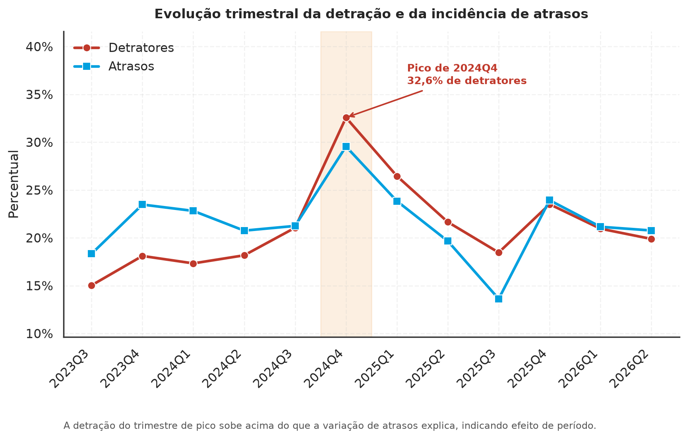
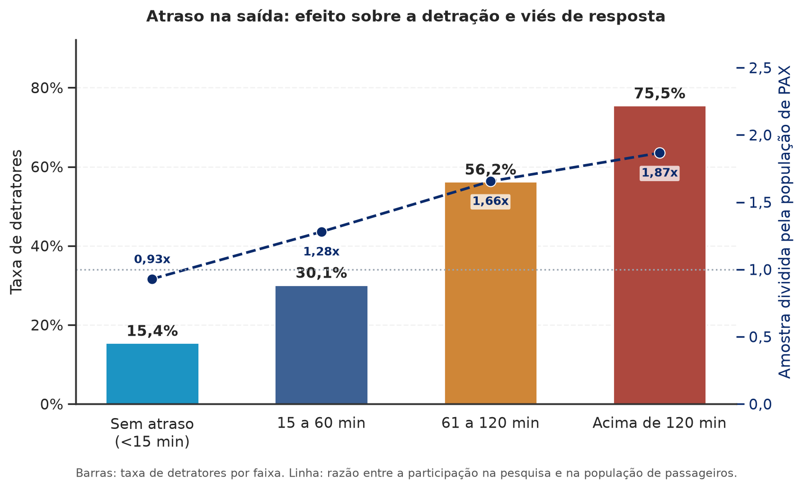
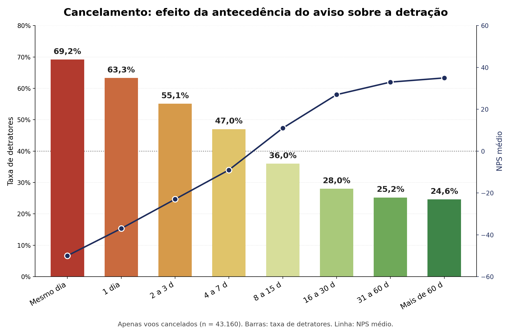
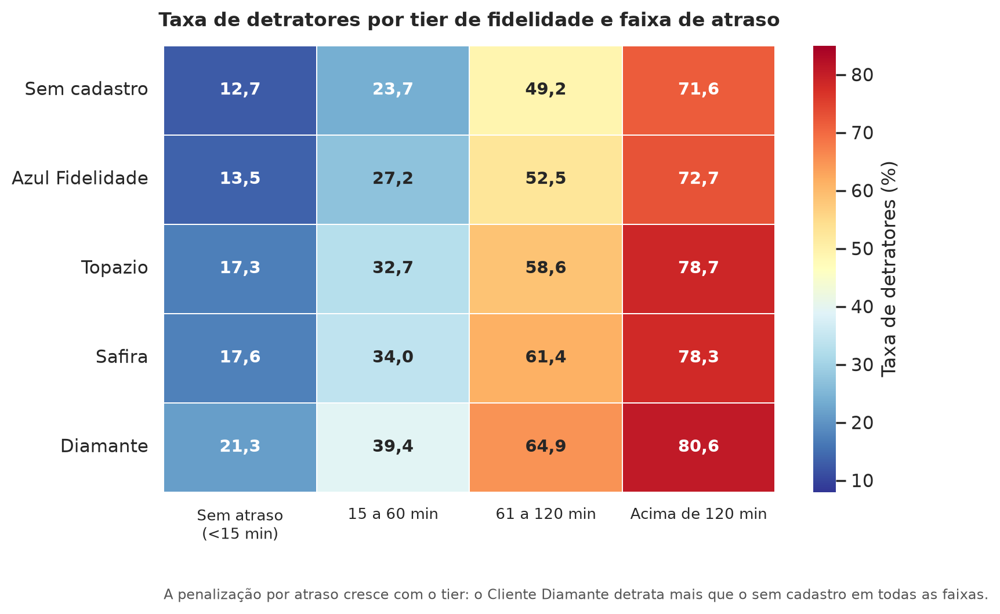
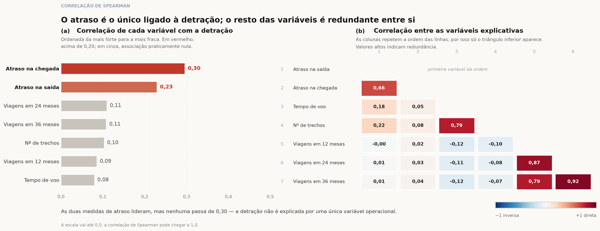

# Documentação Modelo Preditivo - Inteli

## Safira
### Avatares
#### Arthur Augusto Proença Gonçalves, Cassio Reis Costa, Felipe Menossi Estrada, Fernanda Jawetz Steiner, Gabriel Gomes Pimentel, Kaylan Alexandre de Paula Sathler, Luiza Chaccur de Cresci, Pedro Estellita Leal

## Sumário
[1. Introdução](#c1)

[2. Objetivos e Justificativa](#c2)

[3. Metodologia](#c3)

[4. Desenvolvimento e Resultados](#c4)

[5. Conclusões e Recomendações](#c5)

[6. Referências](#c6)

[Anexos](#attachments)

### 1. Introdução

A Azul Linhas Aéreas Brasileiras atua na aviação comercial desde 2008. Sua sede administrativa fica em Alphaville, Barueri, na região metropolitana de São Paulo, e seus principais centros de operação são os aeroportos de Viracopos, em Campinas, e Confins, em Belo Horizonte. Com aproximadamente 15 mil Tripulantes e uma malha que alcança mais de uma centena de aeroportos brasileiros, é a companhia de maior capilaridade do país. Em boa parte dessas cidades ela opera sozinha, e essa condição define seu posicionamento de mercado. Enquanto as concorrentes disputam as rotas de maior densidade entre capitais, a Azul construiu vantagem competitiva justamente onde a alternativa de transporte é lenta ou simplesmente não existe.

O alcance da companhia se estende para além do transporte de passageiros. Ela opera também na logística de cargas, no varejo de turismo, na manutenção aeronáutica e em um programa de fidelidade próprio, de modo que a relação com o Cliente não começa nem termina no voo. Esse ponto ganhou peso depois da reestruturação financeira concluída em 2026, da qual a empresa saiu com endividamento reduzido e um plano de crescimento deliberadamente mais moderado, concentrado no mercado doméstico e em rotas de maior rentabilidade. Quando a estratégia deixa de se apoiar na expansão da malha, a base de Clientes existente passa a responder por uma fatia maior do resultado. A experiência entregue em cada viagem deixa de ser apenas atributo de marca e se torna variável econômica.

A leitura dessa experiência cabe à área de Experiência do Cliente e se apoia principalmente no Net Promoter Score. Um dia após o voo, parte dos passageiros recebe uma pesquisa em que indica, numa escala de 0 a 10, o quanto recomendaria a Azul a um amigo ou familiar. As notas 9 e 10 identificam Promotores, 7 e 8 identificam Neutros, e as notas de 0 a 6 identificam Detratores. O questionário vai além da avaliação geral e cobre etapas específicas da jornada, como reserva, check-in, embarque, atendimento a bordo e bagagem. O indicador da companhia se mantém consistentemente acima da média do setor, o que dá à Azul uma posição confortável na comparação com as concorrentes, mas não resolve o problema de como agir sobre os casos individuais de insatisfação.

O desenho da medição impõe dois limites à atuação. O primeiro é de tempo. A informação sobre um Cliente insatisfeito só chega depois que a viagem terminou e depois que ele decidiu responder, o que restringe qualquer intervenção ao campo da recuperação, quando a experiência ruim já foi vivida. O segundo é de cobertura. A taxa de resposta é baixa e alguns perfis participam sistematicamente menos que outros, entre eles quem compra por agência de viagens e quem voa com pouca frequência. Uma parcela relevante da insatisfação real, portanto, nunca chega a ser registrada.

O efeito combinado dos dois limites é que a companhia enxerga com clareza o que já aconteceu, mas não consegue antecipar com quem vai acontecer. Uma mesma falha operacional atinge centenas de passageiros ao mesmo tempo e produz reações bastante distintas, porque o peso de um atraso ou de uma bagagem extraviada varia conforme o perfil do Cliente, o motivo da viagem, a categoria de fidelidade e o histórico de relacionamento com a companhia. Sem uma forma de distinguir esses casos antes que a avaliação ocorra, a priorização dos esforços de atendimento depende de critérios heurísticos e de análise manual, e as decisões de melhoria da jornada acabam apoiadas em um retrato parcial e defasado da experiência do Cliente.

## <a name="c2"></a>2. Objetivos e Justificativa
### 2.1 Objetivos
```
Descreva resumidamente os objetivos gerais e específicos do seu parceiro de negócios.

Remova este bloco ao final
```

### 2.2 Proposta de solução
```
Descreva resumidamente sua proposta de modelo preditivo e como esse modelo pretende resolver o problema, atendendo os objetivos.

Remova este bloco ao final
```

### 2.3 Justificativa
```
Faça uma breve defesa de sua proposta de solução, escreva sobre seus potenciais, seus benefícios e como ela se diferencia.

Remova este bloco ao final
```

## <a name="c3"></a>3. Metodologia
```
Descreva a metodologia CRISP-DM e suas etapas de desenvolvimento, citando o referencial teórico. Você deve apenas enunciar os métodos, sem dizer ainda como eles foram aplicados, nem quais resultados foram obtidos.

Remova este bloco ao final
```

## <a name="c4"></a>4. Desenvolvimento e Resultados
### 4.1. Compreensão do Problema
#### 4.1.1. Contexto da indústria 

**Contexto Setorial**

O mercado doméstico brasileiro é altamente concentrado em três principais companhias — LATAM, GOL e Azul. Em 2025, essas três companhias responderam, juntas, por praticamente todo o mercado doméstico de passageiros em RPK: 39,9% LATAM, 30,9% GOL e 29,1% Azul (ANAC, 2026, p. 62). A LATAM apresenta forte participação no mercado doméstico e ampla atuação nacional e internacional. A GOL possui forte participação no mercado doméstico e historicamente adotou uma estratégia orientada à eficiência operacional e à competitividade de custos, tendo iniciado processo de reestruturação financeira nos Estados Unidos (Chapter 11) em janeiro de 2024 e concluído o processo em junho de 2025 (Magalhães, 2025). A Azul, a mais recente das três, se diferencia por capilaridade e experiência do cliente, sendo a companhia aérea brasileira com o maior número de cidades atendidas — aproximadamente 800 voos diários, mais de 130 destinos e a única companhia em cerca de 80% de suas rotas (Azul S.A., 2026) —, competindo menos por preço e mais por alcance geográfico e diferenciação de produto. Ambas as concorrentes também passaram por processos de reestruturação financeira nos Estados Unidos, com a Azul concluindo o seu em fevereiro de 2026, após pouco mais de nove meses (Forbes Money, 2026).

A Azul se posiciona como a companhia de maior capilaridade do Brasil. Sua frota diversificada, composta por aeronaves ATR, Embraer E-Jets e Airbus, permite atuar em mercados de menor densidade que os concorrentes, que operam principalmente com aeronaves de maior porte, não conseguiriam explorar de forma rentável (AZUL S.A., 2026). Além da malha ampliada, a empresa aposta na diferenciação da experiência de bordo — entretenimento com TV ao vivo e opções de refeição pouco comuns no setor — como forma de fortalecer a diferenciação e a fidelização dos clientes, competindo menos por preço e mais por alcance geográfico e diferenciação de produto. A companhia também mantém unidades estratégicas de negócio complementares à operação aérea, como o programa de fidelidade Azul Fidelidade, a Azul Cargo e a Azul Viagens, e utiliza o NPS como indicador de satisfação do cliente, tendo registrado média de 38,5 em 2025 (AZUL S.A., 2026).

O setor aéreo brasileiro apresenta elevada complexidade operacional e exposição a ciclos de pressão financeira, associados, entre outros fatores, a custos elevados, volatilidade cambial, combustível, financiamento e restrições na cadeia de suprimentos. Ao mesmo tempo, o mercado doméstico segue em expansão estrutural: o tráfego doméstico brasileiro registrou o maior crescimento em RPK entre os mercados domésticos analisados pela International Air Transport Association (IATA) em 2025, com alta de 11,1% sobre 2024 (IATA, 2026). Além dos requisitos de capital e infraestrutura, a atividade é submetida a requisitos regulatórios e operacionais rigorosos, aumentando as barreiras à entrada de novos concorrentes. Some-se a isso a escassez global de aeronaves — a carteira de pedidos ultrapassou 17 mil unidades, equivalente a quase 60% da frota ativa mundial, com déficit acumulado de pelo menos 5.300 entregas nos últimos cinco anos (IATA, 2025) —, que eleva o poder de barganha dos fabricantes (Boeing, Airbus, Embraer), limita a capacidade das companhias de expandir oferta rapidamente e, aliada à necessidade de capital intensivo e escala para negociar com os fabricantes, justifica a barreira de entrada alta do setor — o que favorece a Azul e suas competidoras, já que não precisarão se preocupar com a ameaça de novos entrantes. Soma-se ainda o crescimento do mercado internacional, com disputa acirrada por rotas estratégicas (como Brasil-EUA) via expansão de rede e parcerias como a joint venture Latam-Delta.

---

**5 Forças de Porter**

<div align="center">
  <sub>Figura 1 – 5 Forças de Porter</sub><br>
  <br>
  <sup>Fonte: Autoria própria.</sup>
</div>

**Poder de barganha dos fornecedores: Alto**<br>
&emsp;As companhias aéreas dependem de uma cadeia de fornecedores altamente especializada e concentrada, composta por fabricantes de aeronaves (Boeing, Airbus e a nacional Embraer), fornecedores de motores e componentes, prestadores de serviços de manutenção e empresas de leasing. O elevado tempo necessário para substituição ou expansão de frota reduz a capacidade das companhias de trocar de fornecedor no curto prazo. O backlog global de aeronaves ultrapassa 17 mil unidades — cerca de 60% da frota ativa mundial —, com déficit acumulado de pelo menos 5.300 entregas nos últimos cinco anos (IATA, 2025), o que tem elevado custos de leasing, manutenção e operação. A escassez de insumos para fabricação, intensificada após a pandemia, também eleva os custos de produção repassados às companhias aéreas (Tamiozzo, 2025). Esse cenário reforça a dependência tecnológica das companhias e o alto custo de troca nesse elo da cadeia, sustentando o alto poder de barganha dos fornecedores.

**Poder de barganha dos clientes: Moderado**<br>
&emsp;Em rotas atendidas por múltiplas companhias, o passageiro consegue comparar preços, horários e condições e trocar de fornecedor com relativa facilidade, o que amplia seu poder de barganha. Esse poder é reduzido, porém, nas rotas de menor densidade atendidas exclusiva ou predominantemente pela Azul — a companhia afirma ser a única operadora em aproximadamente 80% de suas rotas (AZUL S.A., 2026) — e pelos mecanismos de fidelização da empresa, como o programa Azul Fidelidade. Como a exclusividade de rota e a fidelização não se estendem a toda a malha, o poder de barganha dos clientes é classificado como moderado: alto nas rotas competitivas e baixo nas rotas de atuação exclusiva da Azul.

**Rivalidade entre concorrentes: Alta**<br>
&emsp;O mercado doméstico é altamente concentrado em três companhias, conforme dados previamente apresentados (ANAC, 2026, p. 62), que disputam passageiros e slots por meio de preço, frequência de voos e rotas. O setor é caracterizado por elevados custos fixos e capacidade perecível — um assento vazio em um voo que já partiu não pode ser vendido posteriormente —, o que intensifica a pressão por ocupação e aperta as margens das companhias. Essa dinâmica ajuda a explicar por que as três companhias passaram por processos de reestruturação financeira nos Estados Unidos (Chapter 11) em momentos distintos: a GOL iniciou o processo em janeiro de 2024 e o concluiu em junho de 2025 (Magalhães, 2025), enquanto a Azul concluiu o seu em fevereiro de 2026, após pouco mais de nove meses (Forbes Money, 2026). A recorrência desses processos entre os três principais players confirma o nível elevado de rivalidade e a pressão estrutural sobre as margens do setor.

**Ameaça de produtos substitutos: Baixa/Moderada**<br>
&emsp;O transporte rodoviário é a principal alternativa ao transporte aéreo em trajetos curtos e médios, sustentado por preços mais acessíveis e por uma malha rodoviária extensa — o Brasil conta com mais de 75 mil quilômetros somente em rodovias federais —, o que amplia a oferta de rotas e permite que o ônibus alcance destinos sem atendimento aéreo regular. Esse comportamento se reflete também na demanda digital: levantamento da Plataforma 10 registrou, em média, 906 mil buscas mensais por passagens de ônibus no Google, contra 172 mil por passagens aéreas — um interesse de busca cerca de cinco vezes maior (VIANNA, 2026). Em viagens de maior distância ou para passageiros com maior sensibilidade ao tempo, no entanto, o tempo de deslocamento consideravelmente maior do transporte rodoviário reduz sua capacidade de substituição. A capilaridade da Azul e sua atuação em mercados de menor densidade — onde é frequentemente a única operadora (AZUL S.A., 2026) — reduzem ainda mais a disponibilidade de alternativas em parte da malha. Diante disso, a ameaça de substitutos é classificada como baixa a moderada, variando conforme distância da rota e perfil do passageiro.

**Ameaça de novos entrantes: Baixa**<br>
&emsp;A entrada de novos concorrentes no transporte aéreo regular brasileiro exige elevado investimento em aeronaves, manutenção, tecnologia, pessoal e infraestrutura, além de certificação e atendimento a requisitos regulatórios da ANAC, que estrutura o processo em duas fases — constituição jurídica e homologação técnica — com prazo de até um ano até a emissão do Certificado de Homologação de Empresa de Transporte Aéreo (CHETA) (ANAC, 2006). O acesso à infraestrutura aeroportuária também é limitado: em aeroportos declarados "coordenados" pela ANAC, a alocação de slots segue regras formais de histórico, prioridade e monitoramento, restringindo a entrada de novos operadores nesses terminais (ANAC, 2022). A esses fatores somam-se as economias de escala já consolidadas pelos players existentes e a necessidade de construir rede de rotas, marca, canais de distribuição e programas de fidelidade — elementos que a Azul, a GOL e a LATAM já possuem de forma madura. Diante desse conjunto de barreiras, a ameaça de novos entrantes é classificada como baixa.

#### 4.1.2. Análise SWOT 
- A matriz SWOT é uma ferramenta de diagnóstico estratégico dividida em quatro quadrantes: Forças e Fraquezas, que são fatores internos da organização e estão sob seu controle, e Oportunidades e Ameaças, que são fatores externos do mercado e não dependem diretamente da organização.

- As Forças são os pontos em que a organização já se destaca, como recursos, competências ou processos bem estabelecidos. As Fraquezas são as limitações internas que ainda pesam contra ela, como falhas de processo, dados incompletos ou dependências não resolvidas. Já as Oportunidades são condições externas favoráveis que a organização pode aproveitar, como tendências de mercado ou brechas deixadas pela concorrência, enquanto as Ameaças são riscos externos que fogem do seu controle, como mudanças regulatórias, movimentos da concorrência ou instabilidade econômica.

- A ideia é cruzar esses dois eixos, interno e externo, favorável e desfavorável, para dar uma visão organizada da situação de um projeto, produto ou empresa em determinado momento. Esse diagnóstico serve de base para decisões estratégicas antes de partir para a definição de soluções, ajudando a identificar onde investir, o que corrigir e quais riscos monitorar de perto.

<div align="center">
  <sub>Análise SWOT</sub><br>
  <br>
  <sup>Fonte: Autoria própria.</sup>
</div>

**Texto Analítico**

**Critério de classificação escolhido pelo grupo**

A matriz se organiza em dois eixos: interno ou externo, e favorável ou desfavorável. O teste aplicado para o primeiro eixo foi a capacidade de decisão da companhia. Se a Azul pode alterar o fator por decisão própria, ele é interno; se apenas reage a ele, é externo.

Esse critério explica duas escolhas que poderiam gerar dúvida. A saída do Chapter 11 foi classificada como força, e não oportunidade, porque decorre de reestruturação conduzida pela própria empresa e se materializa no balanço (Azul S.A., 2026b). Já a entrada de United e American no capital é oportunidade, pois depende de decisão de terceiros e de aprovação regulatória (Conselho Administrativo de Defesa Econômica [CADE], 2026).

**Forças**

Descrevem capacidades próprias da companhia. A malha capilar, com 132 destinos domésticos e cerca de 800 voos diários, é o ativo central, já que a exclusividade em parte das rotas regionais reduz a pressão sobre tarifas (Azul S.A., 2026a). A frota compatível com esse modelo é a condição técnica que a viabiliza, existindo relação de causa entre os dois pontos (Azul S.A., 2026a). A reestruturação concluída entra como força por se traduzir em indicadores internos de balanço: dívida bruta de R$ 34,6 bi para R$ 20,6 bi, alavancagem de 2,4x e liquidez de R$ 4,7 bi (Azul S.A., 2026b, 2026c). A pontualidade, com a quarta colocação mundial em 2025, resulta de gestão operacional (Cirium, 2026). A diversificação de receita, via fidelidade com 20 milhões de clientes (Azul Fidelidade, 2026) e logística em 96% dos municípios (Azul Logística, 2026), reduz a dependência da venda de passagens.

**Fraquezas**

Foram escolhidas de modo a não apenas espelhar o inverso das forças. A terceira posição no mercado doméstico, com 28,6% no primeiro semestre de 2026, limita a diluição de custos fixos (Agência Nacional de Aviação Civil [ANAC], 2026b). A complexidade de sete tipos de aeronave é o contraponto direto da segunda força: a diversidade que viabiliza a malha encarece manutenção, peças e treinamento (Azul S.A., 2026a). As 52 aeronaves fora de operação imobilizam capital sem receita (Azul S.A., 2026b). A estrutura de custos dolarizada foi mantida como interna porque resulta do modelo de financiamento adotado, ainda que a cotação da moeda seja externa (Azul S.A., 2026c). A diluição acionária é a contrapartida negativa da recuperação do balanço (InfoMoney, 2026).

**Oportunidades**

Reúnem movimentos externos que a companhia pode capturar. A entrada de United e American, com cerca de 8% cada e assento no conselho, fornece o canal internacional (CADE, 2026; Azul S.A., 2026b), enquanto a expansão do mercado internacional brasileiro, com 15 milhões de passageiros no primeiro semestre de 2026, fornece a demanda (ANAC, 2026a). As duas se reforçam. O crescimento do e-commerce sustenta o plano de triplicar a capacidade de cargas até 2027, dialogando com a força da diversificação (Azul Logística, 2026). A postergação das tarifas de navegação aérea é decisão de política pública que melhora o fluxo de caixa. A baixa concorrência nas rotas regionais é condição de mercado, não atributo da empresa, o que justifica sua posição neste quadrante (ANAC, 2026b).

**Ameaças**

O quadrante foi consolidado para evitar redundância. Combustível e câmbio, antes separados, foram unificados, pois o querosene responde por cerca de 45% dos custos do setor e é reajustado com base no dólar (Associação Brasileira das Empresas Aéreas [ABEAR], 2026; Petrobras, 2026). A desaceleração da demanda, que recuou de dois dígitos no início de 2026 para praticamente estabilidade em junho, limita o repasse de custos via tarifa (ANAC, 2026a). A concorrência de Latam e Gol, somando mais de 70% do mercado, articula-se com a fraqueza de escala (ANAC, 2026b). O custo estruturalmente mais alto do combustível no Brasil é risco distinto da volatilidade, por tratar de nível de preço e não de oscilação (ABEAR, 2026). A dependência de infraestrutura e tarifas reguladas completa o quadrante como risco institucional (ANAC, 2026b).

**Conexões SWOT**

Três tensões organizam a leitura. A primeira é que malha capilar e complexidade de frota têm a mesma origem, de modo que a vantagem competitiva carrega seu próprio custo. A segunda é que a recomposição do balanço é justamente o que torna acessíveis a expansão internacional, a retomada regional e o crescimento de cargas, tendo como contrapartida a diluição acionária. A terceira é que a menor escala se torna mais crítica em um mercado que deixou de crescer aceleradamente, pois a disputa passa a ocorrer por participação.

**Síntese**

A Azul apresenta vantagem competitiva defensável, sustentada pela capilaridade da malha e pela reputação operacional, mas opera com margem financeira estreita e alta exposição a custos externos. A prioridade estratégica é usar o fôlego da reestruturação e a conectividade dos parceiros internacionais para proteger o ativo regional, avançando na logística para reduzir a sensibilidade a combustível, câmbio e ciclo da demanda doméstica.

#### 4.1.3. Planejamento Geral da Solução

**a) Dados disponíveis**

A base utilizada no projeto é a `AMOSTRA_NPS_INTELI_FINAL`, fornecida pela Azul Linhas Aéreas Brasileiras a partir de sua plataforma de dados e disponibilizada à equipe em formato de planilha. O conjunto reúne 98.414 respostas à pesquisa de NPS coletadas entre 1º de junho de 2023 e 26 de julho de 2026, todas referentes a voos domésticos. Cada registro corresponde a uma resposta individual, associada a um localizador de reserva e enriquecida com atributos operacionais do voo realizado. Todos os campos foram anonimizados pela companhia em conformidade com a LGPD, sem qualquer informação que permita identificar o passageiro (Azul Linhas Aéreas Brasileiras & Instituto de Tecnologia e Liderança, 2026).

A pesquisa é enviada um dia após o voo a 50% dos Clientes domésticos, que dispõem de sete dias para responder, com quarentena de noventa dias entre envios ao mesmo Cliente (Azul Linhas Aéreas Brasileiras & Instituto de Tecnologia e Liderança, 2026). Isso significa que a amostra representa quem respondeu, e não a totalidade dos passageiros transportados no período.

| Nome da Coluna | Tipo de Dado | Preenchimento | Descrição |
|---|---|---|---|
| RESPONDENT_ID | Numérico | 100% | Identificador único da resposta à pesquisa de NPS |
| CLIENTE_RECORDLOCATOR | Texto | 100% | Localizador da reserva à qual a resposta se refere |
| DATA_STD | Data | 100% | Data prevista de partida do voo (Scheduled Time of Departure) |
| EQUIPAMENTO_PREFIXO | Texto | 100% | Prefixo de matrícula da aeronave utilizada. Em jornadas com mais de um trecho, traz os prefixos concatenados |
| BASE_AIRPORTLEG | Texto | 100% | Sequência de aeroportos da jornada, no formato origem/destino ou origem/conexão/destino |
| PERFIL_TUDOAZUL | Texto | 100% | Categoria do Cliente no programa de fidelidade (Cliente Azul, Tudo Azul, Topázio, Safira, Diamante, Azul Diamante Unique, Azul One) |
| VOO_TIPO | Texto | 100% | Natureza da operação: Direto, Conexão ou Escala |
| TIPO_ENTRETENIMENTO | Texto | 100% | Sistema de entretenimento de bordo disponível na aeronave |
| NPS_PRINCIPAL | Numérico | 100% | Classificação do Cliente na pergunta principal de recomendação: -100 (Detrator), 0 (Neutro) ou 100 (Promotor) |
| NPS_ATRASO | Numérico | 14,7% | Avaliação da experiência com atraso no voo |
| NPS_BAGAGEM | Numérico | 34,5% | Avaliação do serviço de bagagem despachada |
| NPS_BAGMAO | Numérico | 79,8% | Avaliação do espaço e serviço de bagagem de mão |
| NPS_CANCELAMENTO24H | Numérico | 1,4% | Avaliação da experiência com cancelamento em até 24 horas |
| NPS_CKBALCAO | Numérico | 11,1% | Avaliação do check-in realizado no balcão |
| NPS_CKMOBILE | Numérico | 54,1% | Avaliação do check-in realizado pelo aplicativo |
| NPS_CKTOTEM | Numérico | 0,3% | Avaliação do check-in realizado no totem de autoatendimento |
| NPS_CKWEB | Numérico | 14,4% | Avaliação do check-in realizado pelo site |
| NPS_COMISSARIOS | Numérico | 78,2% | Avaliação do atendimento dos Tripulantes a bordo |
| NPS_CONFORTO | Numérico | 73,1% | Avaliação do conforto da aeronave, incluindo assento e espaço |
| NPS_EMBARQUE | Numérico | 84,0% | Avaliação do processo de embarque |
| NPS_ENTRETENIMENTO | Numérico | 35,8% | Avaliação do sistema de entretenimento de bordo |
| NPS_LIMPEZA | Numérico | 75,3% | Avaliação da limpeza da aeronave |
| NPS_PILOTOS | Numérico | 76,4% | Avaliação dos pilotos, considerando comunicação e condução do voo |
| NPS_RESAGENCIA | Numérico | 37,5% | Avaliação da reserva realizada por agência de viagem |
| NPS_RESWEB | Numérico | 46,9% | Avaliação da reserva realizada pelos canais digitais próprios |
| NPS_SNACKS | Numérico | 65,1% | Avaliação do serviço de alimentação a bordo |
| NPS_TUDOAZUL | Numérico | 29,4% | Avaliação do programa de fidelidade |
| NPS_WIFI | Numérico | 16,2% | Avaliação do serviço de conexão Wi-Fi a bordo |
| SUB_ENTRETENIMENTO1 | Texto | 31,1% | Indicação de falha no sistema de entretenimento durante o voo (Sim, Não, Não assisti) |
| SUB_ENTRETENIMENTO2 | Texto | 6,7% | Natureza da falha relatada no entretenimento, quando houve |
| SUB_FIL_MOTIVOVIAGEM | Texto | 99,4% | Motivo declarado da viagem: Lazer, Trabalho, Pessoal ou Trabalho combinado com lazer |
| SUB_FIL_FREQUENCIAAZUL | Texto | 99,2% | Frequência de viagens pela companhia, declarada pelo próprio Cliente |
| ESTATISTICA_ATRASOSAIDA | Numérico | 100% | Atraso registrado na partida, em minutos |
| VOO_INTERNACIONAL | Texto | 100% | Classificação do voo como Domestic ou International |
| SEGMENTO | Texto | 100% | Segmento comercial ao qual o Cliente pertence (Corporativo, Azul Viagens, Demais Clientes) |
| TEMPO_VOO | Numérico | 100% | Duração da viagem, em minutos |
| CANCELAMENTO_VOO | Booleano | 100% | Indicação de que houve cancelamento associado à reserva |
| ANTECEDENCIA_CANCELAMENTO | Numérico | 16,3% | Intervalo entre o cancelamento e a partida originalmente prevista, em dias |

**Nota sobre a qualidade e a estrutura dos dados**

A exploração inicial da base revelou características que condicionam diretamente as etapas de preparação de dados previstas na metodologia adotada.

A variável-alvo apresenta desbalanceamento moderado: 65,2% dos registros correspondem a Promotores, 14,5% a Neutros e 20,3% a Detratores. A classe de interesse é minoritária, o que exige atenção à escolha das métricas de avaliação, mas sua proporção permite trabalhar sem recorrer a estratégias agressivas de reamostragem.

As avaliações por etapa da jornada apresentam ausência estrutural, e não aleatória. Cada Cliente avalia apenas o que efetivamente vivenciou, de modo que o preenchimento varia de 84,0% no embarque a 0,3% no check-in por totem. Os quatro campos de check-in são mutuamente exclusivos, com apenas um deles preenchido por registro. Da mesma forma, as avaliações de atraso e de cancelamento só existem quando o evento ocorreu. A ausência, nesses casos, carrega informação sobre a jornada e será tratada como sinal, não como ruído a ser imputado.

Os campos `BASE_AIRPORTLEG` e `EQUIPAMENTO_PREFIXO` não descrevem um único voo. Aproximadamente 30% dos registros trazem valores concatenados que representam jornadas de múltiplos trechos, o que produz 8.746 combinações distintas de rota e 19.456 de aeronave, número muito superior ao tamanho real da frota. A decomposição desses campos em atributos derivados, como aeroporto de origem, aeroporto de destino final, quantidade de trechos e presença de conexão em hub, é condição para que o modelo capte padrões de rota e de equipamento.

Três inconsistências foram identificadas e serão tratadas na preparação dos dados. O campo `TEMPO_VOO`, embora integralmente preenchido, apresenta 1.241 registros com valores incompatíveis com a duração de uma viagem, sendo 1.235 negativos e 6 zerados. Trata-se de erro de conteúdo, não de ausência. O campo `TIPO_ENTRETENIMENTO` contém treze categorias que se reduzem a sete após a padronização de grafias divergentes, como `eX1` e `EX1` ou `não possui entretenimento` e `Nao tem entretenimento`. Por fim, ainda que o campo `VOO_INTERNACIONAL` exista na estrutura, a amostra recebida contém exclusivamente voos domésticos, o que delimita o escopo de aplicação do modelo.

**Distinção entre dados operacionais e dados da pesquisa**

Os campos da base se dividem em dois grupos que não estão disponíveis no mesmo momento, distinção que determina quais deles podem ser usados como preditores.

Doze campos são operacionais e existem antes de qualquer manifestação do Cliente, pois derivam do registro da viagem e do cadastro: data de partida, aeronave, rota, perfil de fidelidade, tipo de operação, sistema de entretenimento da aeronave, atraso na partida, classificação doméstica ou internacional, segmento comercial, duração da viagem, indicação de cancelamento e antecedência do cancelamento.

Vinte e três campos são coletados pela própria pesquisa de NPS: as dezenove avaliações por etapa da jornada e os quatro campos de sub-perguntas, incluindo motivo da viagem e frequência declarada. Todos passam a existir somente no momento em que o Cliente responde, o mesmo instante em que a variável-alvo é registrada.

Utilizar o segundo grupo como preditor produziria um modelo inaplicável na janela descrita no item (c), já que exigiria a resposta à pesquisa para prever o resultado dessa mesma resposta. O modelo destinado à pontuação individual de risco será treinado exclusivamente sobre os campos operacionais e sobre atributos derivados deles. As avaliações por etapa da jornada permanecem na base com finalidade analítica, subsidiando o diagnóstico dos pontos críticos da experiência descrito no segundo modo de uso, sem integrar o conjunto de preditores.

Cabe registrar que motivo da viagem e frequência declarada descrevem características estáveis do Cliente e não a experiência do voo. Ainda assim, nesta base eles chegam pela pesquisa, o que os mantém indisponíveis no momento da predição. Caso a companhia venha a fornecer esses atributos a partir de seus registros internos, eles poderão ser incorporados ao conjunto de preditores em etapa posterior.

**Definição da variável-alvo**

A variável `NPS_PRINCIPAL` assume três valores, correspondentes a Promotores, Neutros e Detratores. Como o objetivo do projeto é estimar a probabilidade de detração, a variável será binarizada: Detratores compõem a classe positiva e Neutros e Promotores são agrupados na classe negativa. A classe positiva concentra 20,3% dos registros. Essa definição vale para todas as métricas estabelecidas no item (e).

**b) Solução proposta**

A solução proposta é um modelo de classificação supervisionada capaz de estimar, para cada Cliente, a probabilidade de que sua experiência resulte em uma avaliação de detração. O modelo é treinado sobre o histórico de respostas de NPS combinado aos registros operacionais do voo, aprendendo a associar configurações de jornada a desfechos de insatisfação.

A Azul já opera um modelo preditivo de NPS em nível agregado, que projeta o comportamento semanal do indicador. O que a companhia não possui é a capacidade de descer ao nível do passageiro individual e responder quem, dentro de um conjunto de voos, tende a se tornar Detrator (Azul Linhas Aéreas Brasileiras & Instituto de Tecnologia e Liderança, 2026). É essa lacuna que a solução endereça.

Ao componente preditivo soma-se uma camada de interpretabilidade construída a partir da análise de importância de atributos do modelo treinado. Ela permite hierarquizar quais variáveis da jornada e da operação mais influenciam a probabilidade de detração, revelando quais etapas concentram o peso na formação da nota. O modelo, assim, não apenas ordena Clientes por risco, mas devolve à companhia um mapa dos pontos em que a experiência se deteriora.

O desenvolvimento será conduzido em Python. A manipulação e a preparação dos dados serão feitas com `pandas`, as operações numéricas com `numpy`, o treinamento dos modelos, a divisão dos conjuntos e o cálculo das métricas de avaliação com `scikit-learn`, e a construção dos gráficos de desempenho e de diagnóstico com `matplotlib`.

**c) Como a solução proposta deverá ser utilizada**

A aplicação prevista tem dois modos de operação complementares.

O primeiro é a pontuação individual de risco, executada no intervalo entre a realização do voo e a resposta à pesquisa. A companhia processa os voos de um período por meio da ingestão de um arquivo em formato CSV e recebe, como saída, a probabilidade de detração calculada para cada Cliente, com a respectiva faixa de risco. Como a pesquisa é enviada um dia após o voo e permanece aberta por sete dias, existe uma janela concreta em que a área de Customer Insights pode agir antes que a avaliação seja registrada. A priorização se apoia nessa lista para direcionar as ações de recuperação que a companhia já pratica, do contato personalizado dos Tripulantes ao tratamento diferenciado em solo. Essas ações se apoiam no princípio OPA, sigla para Observar, Perceber e Atender, método interno pelo qual os Tripulantes recebem autonomia para adaptar o atendimento ao contexto de cada passageiro em vez de seguir um roteiro padronizado (Azul Linhas Aéreas Brasileiras & Instituto de Tecnologia e Liderança, 2026). O modelo se acopla a esse processo ao indicar antecipadamente quais Clientes concentram maior risco, tornando a personalização mais dirigida.

O segundo modo é o diagnóstico agregado dos fatores de insatisfação. A hierarquia de importância dos atributos, combinada à análise da distribuição do risco por rota, tipo de operação, segmento e perfil de fidelidade, permite identificar onde a detração se concentra e quais condições a antecedem. Esse resultado alimenta a priorização de investimentos e iniciativas de melhoria, sustentando decisões que hoje dependem da análise manual de comentários e de indicadores agregados.

Os dois modos derivam do mesmo artefato. A entrega prevê código executável internamente pela Azul, com documentação que permita a continuidade do trabalho por profissionais que não participaram do desenvolvimento, e saída exportável para os fluxos já utilizados pela área.

**d) Benefícios trazidos pela solução proposta**

- Antecipação da identificação de Clientes insatisfeitos, substituindo um processo hoje reativo, que depende da resposta à pesquisa, por uma atuação preventiva dentro da janela em que ainda é possível intervir.
- Ampliação da cobertura da análise. O processo atual concentra o esforço manual dos analistas em Clientes de alto valor, enquanto o modelo pontua a totalidade dos registros processados.
- Priorização de melhorias operacionais com base em evidência quantitativa sobre o peso de cada etapa da jornada na formação da nota, incluindo limiares de atraso a partir dos quais o risco se eleva de forma relevante.
- Compreensão dos drivers específicos de cada segmento e perfil de fidelidade, permitindo que ações de recuperação sejam calibradas ao Cliente em vez de aplicadas de forma uniforme.
- Identificação de rotas e padrões operacionais sistematicamente associados à detração, subsidiando decisões de malha, alocação de equipamento e serviço de bordo.
- Melhor alocação do investimento em ações de recuperação, ao reduzir tanto o esforço direcionado a Clientes que já seriam Promotores quanto a ausência de ação junto a quem efetivamente detrataria.
- Redução do risco de acomodação de expectativa, uma vez que benefícios passam a ser concedidos com base em risco estimado e não de forma recorrente ao mesmo grupo de Clientes.

**e) Critérios de sucesso**

- Desempenho do modelo

O erro de não identificar um Cliente que efetivamente detratará é mais custoso para a companhia do que o de acionar um Cliente que já seria Promotor, pois o primeiro implica perda de relacionamento e o segundo apenas gasto sem retorno, assimetria apontada pela própria equipe de Customer Experience da Azul (Azul Linhas Aéreas Brasileiras & Instituto de Tecnologia e Liderança, 2026). Por essa razão, a revocação na classe positiva, composta pelos Detratores conforme a binarização definida no item (a), é adotada como métrica primária de avaliação.

- Revocação de no mínimo 0,70 na classe Detrator no conjunto de teste.
- ROC-AUC de no mínimo 0,75, demonstrando capacidade de ordenação de risco superior à referência aleatória.
- Precisão de no mínimo 0,40 na classe Detrator, o que representa aproximadamente o dobro da taxa de prevalência observada na base (20,3%) e assegura que a lista priorizada tenha densidade de risco suficiente para justificar a ação.
- F1-score reportado como métrica de equilíbrio, acompanhado da matriz de confusão e da curva Precision-Recall.
- Probabilidades calibradas, verificadas por curva de calibração, condição para que o corte de priorização seja definido em termos de negócio e não de forma arbitrária.
- Estabilidade do desempenho em validação temporal, com o modelo avaliado em período posterior ao de treino, dada a extensão de três anos da base e a presença de fatores sazonais e conjunturais no comportamento do indicador.

- Resultado de negócio

Os patamares a seguir dependem de parâmetros que serão validados junto ao parceiro, entre eles o custo médio das ações de recuperação e o valor associado à retenção do Cliente.

- Redução de ao menos 10% na proporção de Detratores entre os Clientes submetidos a ação preventiva orientada pelo modelo, comparada ao grupo não priorizado.
- Elevação da taxa de conversão das ações de recuperação em relação à média histórica atualmente observada pela companhia.
- Redução do tempo entre a ocorrência do voo e a identificação do Cliente em risco, hoje condicionada à resposta à pesquisa.
- Adoção efetiva pela área de Customer Insights, evidenciada pela execução autônoma do modelo pela equipe da Azul ao término do projeto.
- Aderência integral aos requisitos de privacidade e proteção de dados estabelecidos pela LGPD e às restrições de compartilhamento definidas pela companhia.

- Retorno sobre o investimento

Demonstração de retorno positivo em até doze meses após a entrada em operação, calculado pela comparação entre o custo das ações preventivas direcionadas pelo modelo e o valor preservado pela retenção dos Clientes recuperados. A quantificação depende dos parâmetros de custo e de valor de Cliente a serem fornecidos pela Azul.


#### 4.1.4. Value Proposition Canvas

<div align="center">
  <sub>Figura 2 – Value Proposition Canvas da solução</sub><br>
  <br>
  <sup>Fonte: Autoria própria.</sup>
</div>


O Value Proposition Canvas **(VPC)** é uma ferramenta de modelagem estratégica utilizada para alinhar uma proposta de valor às necessidades reais de um segmento de clientes. O modelo é composto por dois blocos principais: o **Perfil do Cliente (Customer Profile)**, que representa as atividades, dores e ganhos esperados pelo usuário, e o **Mapa de Valor (Value Map)**, que descreve como os produtos e serviços oferecidos atendem a essas necessidades. Dessa forma, o Canvas permite verificar se a solução proposta realmente gera valor para seus usuários e auxilia na definição de funcionalidades que atendam aos objetivos do negócio.

No contexto deste projeto, o Value Proposition Canvas foi utilizado para compreender como a solução proposta poderá gerar valor para a equipe de **Customer Experience da Azul Linhas Aéreas**, principal responsável pela utilização do modelo preditivo. Diferentemente do passageiro, que é beneficiado de forma indireta pelas ações decorrentes das previsões do modelo, a equipe de Customer Experience é quem utilizará os resultados gerados para apoiar decisões estratégicas e operacionais relacionadas à melhoria da experiência dos clientes.

A construção do Canvas foi baseada nas informações disponibilizadas pela Azul na proposta inicial do projeto (TAPI), complementadas pelos workshops realizados com a empresa parceira. Durante essas interações foi possível compreender o fluxo atual de análise do NPS, os desafios enfrentados pela equipe, a forma como os dados são utilizados e, principalmente, a expectativa da empresa de obter não apenas previsões de passageiros detratores, mas também novos insights que permitam identificar padrões ainda desconhecidos e apoiar ações preventivas capazes de elevar o NPS.

A partir dessa análise, foram identificados os principais elementos do Perfil do Cliente e do Mapa de Valor, apresentados a seguir, relacionando as necessidades da equipe de Customer Experience às características da solução proposta.

**Tarefas:** a equipe de Customer Experience é responsável por monitorar o NPS, identificar riscos, investigar suas possíveis causas, definir ações, priorizar os casos que demandam atenção e avaliar os resultados obtidos. Essas atividades orientam a utilização das informações geradas pela solução no processo de acompanhamento da experiência dos passageiros.

**Dores:** o Canvas evidencia quatro principais dificuldades enfrentadas pela equipe: um processo predominantemente reativo, o grande volume de dados, a dificuldade de antecipar quais passageiros podem se tornar detratores e a dificuldade de priorizar quais casos devem receber atenção.


**Ganhos:** a solução busca permitir a antecipação de possíveis detratores, gerar novos insights, contribuir para a melhoria do NPS, apoiar decisões mais rápidas e auxiliar na priorização dos recursos disponíveis para atuação da equipe.

**Produtos e serviços:** o Mapa de Valor é composto pelo modelo preditivo, pelo dashboard, pelos insights relacionados aos fatores que influenciam o NPS e pela integração com o Snowflake. Esses elementos concentram e disponibilizam as informações necessárias para apoiar a atuação da equipe.

**Analgésicos:** esses produtos e serviços procuram reduzir as principais dores identificadas por meio da predição antecipada, da automatização da priorização, da redução da análise manual e do apoio a ações preventivas.


**Criadores de ganho:** além de reduzir as dores existentes, a solução busca gerar valor adicional por meio da descoberta de novos padrões, do apoio às decisões, da contribuição para a melhoria do NPS e da geração de insights acionáveis que auxiliem na definição de ações preventivas.

O principal objetivo da solução proposta é deslocar parte das ações da equipe de Customer Experience de uma abordagem reativa para uma abordagem preditiva. Atualmente, muitas ações são realizadas após a identificação de passageiros detratores. Com a utilização do modelo preditivo, espera-se antecipar potenciais experiências negativas, permitindo que a equipe intervenha antes da ocorrência da avaliação do NPS, por meio de ações direcionadas aos passageiros com maior risco de insatisfação.

A análise realizada por meio do Value Proposition Canvas demonstra que a proposta de valor da solução vai além da construção de um modelo de Machine Learning. O projeto busca fornecer informações acionáveis para a equipe de Customer Experience em duas frentes. A primeira é a priorização dos passageiros com maior probabilidade de se tornarem detratores, utilizada na rotina de atendimento. A segunda é a compreensão dos principais fatores que influenciam a satisfação dos clientes, que apoia decisões preventivas de caráter estrutural e é consumida em análises pontuais, e não no dia a dia. Dessa forma, a solução contribui para a melhoria contínua da experiência dos passageiros e para o fortalecimento da estratégia de relacionamento da Azul. A priorização é necessária porque a equipe de Customer Experience atua sobre um volume de passageiros menor do que o total de passageiros em risco. Por isso, o valor do modelo está menos na sua precisão sobre toda a base e mais na sua capacidade de ordenar corretamente os casos mais críticos. Vale destacar que o modelo estima a probabilidade de o passageiro responder à pesquisa como detrator, o que não corresponde exatamente a ter vivido uma experiência negativa, já que passageiros insatisfeitos que não respondem à pesquisa não são capturados por essa métrica.


#### 4.1.5. Matriz de Riscos

&emsp;A matriz abaixo consolida as ameaças e oportunidades identificadas para o desenvolvimento do modelo preditivo de detratores de NPS. A probabilidade e o impacto de cada item foram estimados pelo grupo com base no TAPI e no dicionário de dados fornecidos pela Azul. Os riscos serão revisados a cada sprint, podendo ser reclassificados conforme o avanço do projeto.

<div align="center">
  <sub>Figura 3 – Matriz de Riscos do Projeto</sub><br>
  <br>
  <sup>Fonte: Autoria própria.</sup>
</div>

##### Ameaças

| #   | Descrição                                                                                                                                                                                              | Probabilidade |  Impacto   | Justificativa da Classificação                                                                                                          | Plano de Resposta                                                                                                                                          |
| --- | ------------------------------------------------------------------------------------------------------------------------------------------------------------------------------------------------------ | :-----------: | :--------: | ------------------------------------------------------------------------------------------------------------------------------------------ | ----------------------------------------------------------------------------------------------------------------------------------------------------------- |
| R01 | Vazamento de alvo: usar as sub-notas de NPS (`nps_conforto`, `nps_atraso` etc.) como features, sendo que elas vêm da mesma pesquisa que gera o alvo. O modelo pareceria ótimo, mas seria inútil na prática. |      90%      | Muito Alto | Probabilidade muito alta: as sub-notas ficam na mesma base e o erro é fácil de cometer sem experiência prévia com esse tipo de dado. Impacto muito alto: invalida o modelo inteiro sem que a equipe perceba até a validação final. |Treinar só com dados disponíveis antes da resposta do passageiro (atraso, rota, aeronave, segmento). Acurácia acima de 95% será tratada como sinal de alerta. |
| R02 | Desbalanceamento: bem menos detratores que não detratores, enviesando o modelo para a classe majoritária.                                                                                                |      70%      |    Alto    | Probabilidade alta: é característica intrínseca de dados de NPS, não uma hipótese. Impacto alto: compromete justamente a capacidade de identificar a classe de interesse (detratores). | Balancear classes (SMOTE ou `class_weight`) e avaliar por F1 e ROC-AUC, não por acurácia.                                                                    |
| R03 | Baixo poder preditivo das variáveis operacionais restantes após a remoção das features com vazamento de alvo.                                                                                            |      50%      |    Alto    | Probabilidade moderada: só é mensurável durante a modelagem, após a limpeza do vazamento. Impacto alto: pode inviabilizar a meta de desempenho combinada com a Azul. | Investir em engenharia de features e alinhar com a Azul que o valor do projeto também está nos drivers de insatisfação identificados, não só na métrica final. |
| R04 | Tratar correlação como causa e gerar recomendações de negócio equivocadas.                                                                                                                               |      50%      |    Alto    | Probabilidade moderada: erro recorrente ao interpretar SHAP/feature importance sem cuidado metodológico. Impacto alto: pode levar a recomendações de negócio erradas para a Azul. | Apresentar os resultados do SHAP como associação, não causalidade, e validar as hipóteses com a equipe de Customer Insights antes de recomendar.             |
| R05 | Dados faltantes ou inconsistentes nas variáveis operacionais e de perfil.                                                                                                                                |      50%      |  Moderado  | Probabilidade moderada: comum em bases operacionais reais. Impacto moderado: tratável com técnicas padrão de imputação, sem comprometer o projeto como um todo. | Mapear a completude na EDA e definir tratamento por coluna (imputação, flag ou exclusão).                                                                    |
| R06 | Atraso na entrega da base `AMOSTRA_NPS_INTELI` pela Azul, comprometendo o cronograma.                                                                                                                    |      30%      |    Alto    | Probabilidade baixa: já há alinhamento prévio de cronograma com o ponto focal. Impacto alto: um atraso na base de entrada atrasa todas as sprints seguintes do CRISP-DM. | Alinhar prazo com o ponto focal já na primeira semana e adiantar o pipeline com dados sintéticos.                                                            |
| R07 | Mudança de escopo ao longo das sprints, gerando retrabalho.                                                                                                                                              |      30%      |    Alto    | Probabilidade baixa: escopo já formalizado no TAPI, mitigando mudanças bruscas. Impacto alto: gera retrabalho em entregas já avançadas do projeto. | Validar cada entrega com a Azul antes de avançar e registrar decisões no WAD.                                                                                |
| R08 | Overfitting: modelo bom no treino e ruim em dados novos.                                                                                                                                                 |      50%      |  Moderado  | Probabilidade moderada: comum em modelos com poucas features após a remoção do vazamento de alvo. Impacto moderado: detectável e corrigível via validação cruzada antes da entrega final. | Validação cruzada, conjunto de teste isolado e monitoramento da diferença treino×validação.                                                                  |

##### Oportunidades

| #   | Descrição                                                                       | Probabilidade |  Impacto   | Justificativa da Classificação                                                                                                    | Plano de Aproveitamento                                                             |
| --- | ------------------------------------------------------------------------------- | :-----------: | :--------: | -------------------------------------------------------------------------------------------------------------------------------------- | ------------------------------------------------------------------------------------ |
| R09 | Antecipar o detrator antes da pesquisa, permitindo recuperação do cliente.       |      70%      | Muito Alto | Probabilidade alta: é o objetivo central do modelo preditivo. Impacto muito alto: é o principal valor de negócio entregue à Azul. | Entregar o score em ranking priorizado para a operação agir a tempo.                 |
| R10 | Priorizar melhorias na experiência com base em dados, não em percepção.          |      90%      |    Alto    | Probabilidade muito alta: os drivers de insatisfação emergem naturalmente da análise de importância de features. Impacto alto: orienta decisões operacionais concretas da Azul. | Entregar ranking de drivers com recomendações por etapa da jornada.                  |
| R11 | Impacto em retenção, receita e NPS ao reduzir a base de detratores.              |      50%      | Muito Alto | Probabilidade moderada: depende da adoção operacional das recomendações pela Azul. Impacto muito alto: retenção de detratores afeta diretamente receita e reputação da companhia. | Traduzir os resultados em impacto de negócio no painel para os stakeholders.         |
| R12 | Insights e ações específicas por segmento de cliente (Corporativo, Azul Viagens). |      50%      |    Alto    | Probabilidade moderada: depende da qualidade da variável `segmento_cliente` na base. Impacto alto: personaliza a ação da Azul por tipo de cliente. | Usar `segmento_cliente` como feature e segmentar a análise de drivers.               |
| R13 | Reuso do modelo em outras rotas e padrões operacionais da malha.                 |      50%      |  Moderado  | Probabilidade moderada: depende de decisão futura da Azul, fora do controle do grupo. Impacto moderado: amplia o valor do projeto sem ser o objetivo principal desta sprint. | Construir pipeline modular e documentado, facilitando o reuso além do recorte inicial. |

#### 4.1.6. Personas

&emsp;Compreender profundamente quem são as pessoas envolvidas em um problema é o primeiro passo para construir uma solução que realmente faça sentido. Personas são uma das ferramentas centrais do design thinking de serviços justamente por tornarem tangíveis, em torno de um perfil concreto, as necessidades e motivações de quem participa de uma experiência (Stickdorn & Schneider, 2014). As personas apresentadas a seguir representam perfis reais de usuários e stakeholders impactados pelo modelo, construídas a partir do levantamento realizado com a equipe do projeto sobre os processos atuais de classificação de NPS e recuperação de clientes na Azul. Elas cumprem um papel fundamental neste trabalho: ao colocar rostos, rotinas e necessidades concretas por trás dos dados, tornam mais claro para quem estamos desenvolvendo o modelo, quais dores buscamos resolver e quais consequências, positivas ou negativas, nossas decisões técnicas podem gerar. Mais do que um exercício descritivo, o uso de personas orienta escolhas de modelagem, prioriza funcionalidades e ajuda a antecipar riscos, garantindo que o problema seja compreendido não apenas do ponto de vista analítico, mas também sob a perspectiva de quem utiliza, é afetado ou depende dos resultados gerados pela solução.

##### Fernanda Ribeiro (persona que utiliza o modelo)

<div align="center">
  <sub>Figura 4 – Persona que utiliza o modelo: Fernanda Ribeiro</sub><br>
  <br>
  <sup>Fonte: Autoria própria.</sup>
</div>

&emsp;Fernanda Ribeiro é Analista de Customer Insights e atua como utilizadora direta do modelo. Atualmente, ela é responsável por receber o volume diário de respostas da pesquisa de NPS e realizar a classificação dos passageiros em Promotores, Neutros e Detratores de forma manual, o que torna o processo reativo e trabalhoso, já que a identificação de um detrator só ocorre depois que a nota já foi dada. Com a implementação do modelo, Fernanda passará a utilizá-lo diretamente em sua rotina para antecipar a probabilidade de detração e identificar os principais fatores que influenciam uma nota baixa, tornando a análise mais rápida, organizada e menos dependente de esforço manual. Por isso, ela é considerada uma persona que utiliza o modelo.

##### Rafael Souza (persona afetada pelo modelo)

<div align="center">
  <sub>Figura 5 – Persona afetada pelo modelo: Rafael Souza</sub><br>
  <br>
  <sup>Fonte: Autoria própria.</sup>
</div>

&emsp;Rafael Souza é Analista de Customer Experience e representa uma persona afetada pelo modelo, ainda que não interaja diretamente com ele. Ele recebe da equipe de Insights a lista de passageiros detratores já classificada e, a partir dessas informações, investiga as possíveis causas da insatisfação e decide quais ações de recuperação ou recompensa devem ser oferecidas a cada cliente. Como seu trabalho depende diretamente da qualidade das informações produzidas pelo modelo, como os principais drivers da detração, a segmentação por perfil e a priorização dos casos, qualquer melhoria ou limitação do modelo impacta diretamente sua capacidade de tomar decisões rápidas e assertivas. Por esse motivo, Rafael é classificado como uma persona afetada pelo modelo, e não como uma usuária direta da ferramenta.

##### Marina Costa (persona afetada pelo modelo)

<div align="center">
  <sub>Figura 6 – Persona afetada pelo modelo: Marina Costa</sub><br>
  <br>
  <sup>Fonte: Autoria própria.</sup>
</div>

&emsp;Marina Costa é passageira TudoAzul Diamante e atua como persona afetada pelo modelo. Ela voa a trabalho com frequência e, embora não utilize o sistema em nenhum momento, é sobre ela que as predições são realizadas. Atualmente, quando enfrenta um problema durante a viagem, como atraso de voo ou extravio de bagagem, Marina precisa acionar os canais de atendimento por conta própria e aguardar a resposta da companhia, o que torna a recuperação lenta e dependente da iniciativa do próprio passageiro. Com a implementação do Safira, sua probabilidade de detração passa a ser identificada antes mesmo da resposta à pesquisa de NPS, permitindo que a equipe de Customer Experience realize o contato e ofereça a compensação de forma proativa. Em contrapartida, Marina não tem visibilidade sobre a classificação atribuída a ela nem meios de contestá-la, o que reforça a necessidade de que a decisão final permaneça sob responsabilidade humana. Por isso, ela é considerada uma persona que é afetada pelo modelo.

##### Conclusão da seção de Personas

&emsp;O mapeamento das personas do Safira evidencia que a solução atende a três posições distintas dentro do fluxo de gestão do NPS da Azul, e não a um único perfil de usuário. Fernanda Ribeiro representa a etapa de identificação e priorização, na qual o modelo substitui a classificação manual dos respondentes pela estimativa antecipada da probabilidade de detração e pela indicação dos fatores de maior peso na nota. Rafael Souza representa a etapa de decisão, na qual o modelo fornece os drivers da insatisfação e o histórico do passageiro para embasar a escolha da ação de recuperação, reduzindo a dependência de julgamento individual. Marina Costa, por sua vez, representa quem recebe o resultado dessa decisão sem participar dela.

&emsp;Essa distinção orienta diretamente as escolhas de projeto do Safira. O fato de Fernanda necessitar de uma leitura agregada dos fatores de detração, enquanto Rafael necessita da explicação individual de cada caso, define que o modelo deve entregar interpretabilidade em dois níveis, e não apenas um resultado de classificação. Já a presença de Marina como persona afetada estabelece que o Safira deve atuar como ferramenta de apoio à decisão humana, e não como mecanismo de decisão automática, uma vez que a consequência de um erro de predição recai sobre o passageiro, que não tem acesso à sua classificação nem meios de questioná-la.

&emsp;Dessa forma, as personas cumprem no projeto a função de traduzir requisitos técnicos em necessidades humanas concretas, garantindo que a construção do modelo preditivo considere tanto a eficiência operacional das equipes de Customer Insights e Customer Experience quanto a responsabilidade sobre os passageiros classificados por ele.

#### 4.1.7. Jornadas do Usuário

&emsp;O mapa de jornada do usuário é uma representação visual da experiência de uma pessoa ao longo do tempo, organizada em fases e descrita por meio do que ela faz, pensa e sente em cada momento, de modo a evidenciar onde a experiência falha e onde há espaço para intervenção (Kalbach, 2017). Diferentemente do fluxo de processo, que descreve como o trabalho deveria ocorrer, a jornada parte do ponto de vista de quem executa esse trabalho e registra também o que não está previsto no procedimento: a dúvida antes de uma decisão, a espera por uma informação que não chega, a insegurança de assumir a responsabilidade por um caso mal resolvido. É justamente esse registro que transforma o mapa em instrumento de projeto, e não em documentação descritiva (Gibbons, 2018).

&emsp;A escolha da ferramenta se justifica pela natureza do Safira. Um modelo preditivo não é consumido como um relatório, mas como um insumo de decisão inserido em uma rotina que já existe e que tem prazo, capacidade limitada e consequência sobre terceiros. Pesquisas sobre interação entre pessoas e sistemas de inteligência artificial mostram que a adoção desse tipo de ferramenta depende menos da acurácia isolada do algoritmo e mais de o usuário compreender o que o sistema faz, por que produziu determinado resultado e o que acontece quando ele erra (Amershi et al., 2019). Mapear a jornada é, portanto, a forma de verificar se a saída do modelo chega ao usuário no momento certo, no formato certo e acompanhada da informação necessária para que a decisão seja tomada com responsabilidade.

&emsp;Esta seção apresenta o mapa de jornada de **Fernanda Ribeiro**, Analista de Customer Insights e usuária direta do Safira, responsável por transformar a saída do modelo em uma lista priorizada de Clientes. Ela foi escolhida como persona central do mapeamento porque sua rotina é o ponto de passagem obrigatório entre as outras duas posições descritas na seção 4.1.6: é sobre a experiência de Marina que Fernanda pontua o risco, e é para a decisão de Rafael que ela entrega o resultado dessa pontuação. Mapear a jornada de Fernanda, portanto, mapeia por extensão a janela de tempo em que Marina ainda pode ser recuperada e a qualidade do insumo do qual depende a decisão de Rafael, sem exigir dois mapas adicionais para tornar esse elo visível. Por isso, Rafael Souza e Marina Costa, já caracterizados na seção 4.1.6, permanecem essenciais para compreender o que está em jogo em cada fase, mas não compõem jornadas formais nesta seção. A jornada mapeada é a de quem opera o modelo, e não a do passageiro que compra a passagem.

&emsp;O mapa é construído em dois estados, a rotina como ela ocorre hoje e a mesma rotina com o Safira em operação, lidos lado a lado nas mesmas seis fases e na mesma ordem cronológica. Essa estrutura isola o ponto exato em que a solução intervém e torna explícito o que ela não altera: a rotina de Fernanda não muda de forma, muda de fundamento, já que o critério que sustenta a lista deixa de ser a regra fixa e passa a ser a probabilidade calculada por Cliente.

---

**Cenário**

&emsp;Em um sábado de julho, uma frente de mau tempo sobre o Sudeste compromete as operações em Viracopos e Confins a partir do meio da tarde. Os atrasos se acumulam em cascata, estendem-se pelo domingo e afetam aproximadamente 40 voos e cerca de 6 mil Clientes, com atrasos que variam de 40 minutos a mais de 4 horas e alguns realocamentos de malha. Na segunda-feira seguinte, a área de Experiência do Cliente inicia a semana diante do resultado desse fim de semana atípico.

&emsp;A janela de atuação é conhecida e curta. A pesquisa de NPS é enviada um dia após o voo a metade dos Clientes domésticos, que dispõem de sete dias para responder (Azul Linhas Aéreas Brasileiras & Instituto de Tecnologia e Liderança, 2026). Existe, portanto, um intervalo concreto entre a experiência vivida e o registro da nota, o mesmo intervalo em que ainda é possível recuperar o Cliente antes que ele classifique a companhia de 0 a 6 e passe a compor a base de Detratores, conforme a lógica do indicador proposta por Reichheld (2003). Encerrado o prazo, a informação deixa de ser acionável e passa a ser histórico.

&emsp;A restrição que organiza toda a jornada é a assimetria entre volume e capacidade: são milhares de Clientes potencialmente afetados e uma equipe capaz de tratar algumas centenas de casos por dia. A pergunta que Fernanda precisa responder até o fim do expediente não é quantos Clientes tiveram uma experiência ruim, e sim quais deles devem ser contatados primeiro.

<div align="center">
  <sub>Figura 7 – Jornada de Fernanda Ribeiro: Estado Atual (sem o Safira)</sub><br>
  <br>
  <sup>Fonte: Conteúdo textual de autoria do grupo; imagem gerada por IA (Claude, Anthropic).</sup><br>
  <sup>Escala emocional de 1 (frustração) a 5 (confiança).</sup>
</div>

&emsp;A leitura da linha emocional reforça esse diagnóstico: os pontos mais baixos não ocorrem na abertura do processo, quando o volume de Clientes afetados é maior, e sim nas fases 3 e 5, priorização e chegada das respostas de NPS, exatamente os momentos em que Fernanda decide sem um critério de risco individual e, depois, descobre tarde demais quem esse critério deixou de fora. O problema não é a falta de dados sobre o incidente, mas a ausência de um critério que os traduza em uma ordem de atendimento defensável.

<div align="center">
  <sub>Figura 8 – Jornada de Fernanda Ribeiro: Estado Futuro (com o Safira)</sub><br>
  <br>
  <sup>Fonte: Conteúdo textual de autoria do grupo; imagem gerada por IA (Claude, Anthropic).</sup><br>
  <sup>Escala emocional de 1 (frustração) a 5 (confiança).</sup>
</div>

&emsp;O comparativo com a Figura 7 mostra que a intervenção do Safira concentra-se exatamente nos dois pontos mais baixos da linha emocional identificados no estado atual: na fase 3, a probabilidade calibrada substitui o julgamento sem critério e a nota sobe de Sobrecarregada (1) para Segura (4); na fase 5, a revocação mensurável do modelo substitui a descoberta tardia do erro e a nota sobe de Frustrada (1) para Atenta (3). Como estabelecido no início desta seção, a jornada de Fernanda é o elo entre a experiência de Marina e a decisão de Rafael: ao tornar esses dois momentos defensáveis, o Safira não apenas melhora a rotina de Fernanda, mas amplia a janela em que Marina ainda pode ser recuperada e melhora a qualidade da informação que chega a Rafael.

## 4.1.8 Política de Privacidade — LGPD

## Projeto Modelo Preditivo para Identificação de Clientes Detratores de NPS

#### Informações Gerais

Esta Política de Privacidade apresenta como o projeto **Modelo Preditivo para Identificação de Clientes Detratores de NPS**, desenvolvido pelo grupo **Avatares**, em parceria com a Azul Linhas Aéreas Brasileiras e o Instituto de Tecnologia e Liderança (Inteli), realiza o tratamento dos dados utilizados no desenvolvimento da solução.

O projeto tem como objetivo identificar os fatores associados à insatisfação dos passageiros e estimar a probabilidade de um cliente tornar-se detrator do Net Promoter Score (NPS), contribuindo para a melhoria da experiência dos clientes da Azul.

O tratamento dos dados será realizado em conformidade com a Lei nº 13.709, de 14 de agosto de 2018, denominada Lei Geral de Proteção de Dados Pessoais (LGPD), observando os princípios previstos no art. 6º da LGPD, incluindo finalidade, adequação, necessidade, livre acesso, qualidade dos dados, transparência, segurança, prevenção, não discriminação e responsabilização e prestação de contas (BRASIL, 2018).

#### Dados Coletados

**Dados fornecidos diretamente:** respostas fornecidas pelos passageiros nas pesquisas de satisfação da Azul, incluindo a avaliação geral da experiência de voo e avaliações relacionadas a atraso, bagagem, check-in, embarque, atendimento, conforto, limpeza, entretenimento, Wi-Fi, alimentação, reservas e programa TudoAzul. Também poderão ser utilizados dados referentes ao motivo e à frequência das viagens.

**Dados coletados automaticamente:** informações operacionais registradas pelos sistemas da Azul, como data prevista de partida, origem e destino do voo, tipo de operação, aeronave utilizada, duração do voo, tempo de atraso, ocorrência de cancelamento, segmento do cliente e categoria no programa TudoAzul.

A equipe não realizará uma nova coleta de informações diretamente dos passageiros. Os dados serão fornecidos pela Azul por meio da base **AMOSTRA_NPS_INTELI** e estarão limitados às informações necessárias para a análise das respostas de NPS.

As informações que poderiam identificar o passageiro ou relacioná-lo diretamente a determinado voo serão anonimizadas antes de serem disponibilizadas ao grupo. Não serão fornecidos nomes, documentos, endereços, telefones, e-mails, dados bancários ou dados pessoais sensíveis.

Os dados disponibilizados ao grupo são previamente anonimizados pela Azul. Nos termos do art. 12 da LGPD, dados efetivamente anonimizados não são considerados dados pessoais para os fins da Lei, desde que o processo de anonimização não possa ser revertido por meios próprios ou mediante esforços razoáveis (BRASIL, 2018). A técnica específica de anonimização utilizada pela Azul não foi informada ao grupo.

#### Finalidade do Tratamento

Os dados serão utilizados para desenvolver e avaliar um modelo preditivo capaz de estimar a probabilidade de um passageiro tornar-se detrator do NPS.

O tratamento também permitirá identificar os principais fatores relacionados à insatisfação, reconhecer pontos críticos da jornada do passageiro e gerar análises que auxiliem a Azul na priorização de ações voltadas à melhoria da experiência de seus clientes.

Os dados não serão utilizados para publicidade direcionada, comercialização de informações, discriminação de passageiros ou finalidades incompatíveis com o escopo do projeto.

#### Armazenamento e Retenção

**Local:** ambiente controlado pela Azul Linhas Aéreas Brasileiras. O modelo será desenvolvido e executado na infraestrutura interna de dados da empresa, sem a transferência da base para ambientes públicos ou não autorizados.

**Prazo:** os dados serão utilizados pelo grupo até **7 de outubro de 2026**, data prevista para o encerramento do projeto. Após esse período, eventuais cópias deverão ser eliminadas ou devolvidas à Azul, conforme as orientações da empresa e do Inteli.

Poderão ser mantidos códigos, métricas, gráficos e resultados agregados, desde que não contenham registros individualizados, dados pessoais ou informações confidenciais da Azul.

#### Compartilhamento de Dados

O acesso aos dados será restrito aos integrantes autorizados do grupo **Avatares**, aos professores e orientadores responsáveis pelo projeto no Inteli e aos profissionais da Azul envolvidos no desenvolvimento, acompanhamento ou avaliação da solução.

O acesso será concedido somente aos responsáveis pelas áreas que necessitem das informações para o desempenho de suas atividades.

As bases de dados, completas ou parciais, não serão publicadas no GitHub, no site institucional do Inteli ou em outros ambientes públicos. Os dados também não serão vendidos ou compartilhados com terceiros para finalidades comerciais.

O código-fonte poderá ser publicado desde que não contenha os dados utilizados no treinamento, na validação ou no teste do modelo.

#### Segurança dos Dados

A proteção dos dados será realizada por meio das seguintes medidas:

* anonimização das informações que possam identificar os passageiros;
* armazenamento e processamento em ambiente controlado pela Azul;
* controle de acesso conforme as atribuições de cada usuário;
* acesso concedido somente aos responsáveis autorizados;
* utilização de contas individuais e credenciais protegidas;
* proibição do compartilhamento da base por meios não autorizados;
* proibição da publicação de dados reais em repositórios públicos;
* eliminação ou devolução dos dados após o encerramento do projeto.

A técnica específica utilizada no processo de anonimização não foi informada ao grupo. Dessa forma, não são atribuídos ao processo mecanismos técnicos que não tenham sido formalmente confirmados pela Azul.

Os integrantes do grupo deverão preservar a confidencialidade das informações e utilizá-las exclusivamente para as atividades acadêmicas e técnicas autorizadas.

#### Direitos dos Titulares

Nos termos da LGPD, os titulares poderão solicitar:

* acesso aos dados pessoais tratados pela Azul;
* correção de informações incompletas, inexatas ou desatualizadas;
* exclusão, anonimização ou bloqueio de dados, quando aplicável;
* informações sobre as finalidades do tratamento;
* revogação do consentimento, quando essa for a base legal utilizada;
* informações sobre o compartilhamento dos dados;
* revisão de decisões tomadas exclusivamente por tratamento automatizado, quando aplicável.

A Azul permite que o titular consulte as informações que a companhia mantém a seu respeito, mediante os procedimentos de autenticação e segurança adotados pela empresa.

Como a base disponibilizada ao grupo será anonimizada, os estudantes não poderão localizar os registros de um passageiro por meio de nome, documento ou e-mail. Portanto, as solicitações relacionadas ao exercício dos direitos dos titulares deverão ser encaminhadas diretamente à Azul.

**Solicitações via e-mail:** [azulpreditivo@gmail.com](mailto:azulpreditivo@gmail.com)

#### Encarregado de Dados (DPO)

**Nome:** Kaylan Alexandre De Paula Sathler.


**E-mail:** [kaylan.sathler@sou.inteli.edu.br](mailto:kaylan.sathler@sou.inteli.edu.br)

#### Atualização da Política

Esta Política de Privacidade poderá ser atualizada conforme alterações no projeto ou novas orientações fornecidas pela Azul Linhas Aéreas Brasileiras e pelo Inteli, prevalecendo sempre a versão mais recente do documento.


### 4.2. Compreensão dos Dados

#### 4.2.1. Exploração de dados

A exploração de dados do SAFIRA foi conduzida sobre o conjunto de bases disponibilizado pela Azul Linhas Aéreas Brasileiras, com o objetivo de caracterizar a estrutura, a qualidade e a representatividade dos dados antes da etapa de preparação. Além da estatística descritiva exigida pela metodologia CRISP-DM na fase de *Data Understanding* (CHAPMAN et al., 2000), esta seção documenta as decisões de filtragem adotadas, os vieses amostrais identificados e as hipóteses de negócio testadas, incluindo aquelas que não se confirmaram, uma vez que todos esses elementos condicionam a validade do modelo de propensão à detração.

---

##### a) Estrutura e integração das bases

O material recebido é composto por cinco arquivos que, em conjunto, descrevem a jornada do Cliente sob três perspectivas distintas:

| Base | Registros | Natureza dos dados |
|---|---:|---|
| `PROJETO_INTELI.NPS_01` a `NPS_04` | 484.916 | Respostas da pesquisa de satisfação e contexto do voo avaliado |
| `PROJETO_INTELI.INFORMACAO_VIAGEM` | 484.915 | Dados operacionais do voo (atraso, cancelamento, assentos) |
| `PROJETO_INTELI.PERFIL_CLIENTE_01` e `_02` | 484.915 | Perfil comportamental e de relacionamento do Cliente |
| `PROJETO_INTELI.DISTRIBUICAO_PAX_NORMALIZADO` | 864 | Proporções populacionais de passageiros por mês, faixa de atraso e canal de compra |

As três primeiras compartilham a chave `RESPONDENT_ID` em relação **1:1**, com cobertura integral: todas as respostas da pesquisa possuem contrapartida operacional e de perfil. A integração foi realizada por junção interna, resultando em uma base analítica única.

Essa cardinalidade não é presumida, e sim **verificada em execução**. Antes da junção, a implementação confere a cobertura da chave nas três tabelas e interrompe o processamento caso alguma resposta fique sem correspondência, situação em que a junção interna a descartaria em silêncio. A junção em si usa `validate="one_to_one"`, que faz o `pandas` levantar exceção se a chave não for única dos dois lados, em vez de multiplicar linhas. O log de cada execução registra os dois resultados.

A quarta base tem natureza distinta. Não é transacional, mas agregada. Ela informa a composição real do universo de passageiros da Azul no período, e por isso constitui o instrumento de referência para diagnosticar o viés da amostra de pesquisa, uso detalhado no item (e).

O período coberto é de **01/07/2023 a 30/06/2026**, correspondendo a 36 meses completos de operação doméstica.

---

##### b) Filtros aplicados e tratamento de duplicidades

A verificação de duplicidades produziu um resultado atipicamente limpo, o que por si só é uma informação relevante sobre a maturidade do processo de extração da Azul:

| Filtro | Registros afetados | Justificativa |
|---|---:|---|
| Remoção de linhas integralmente duplicadas | 0 | Nenhuma duplicação de ingestão identificada |
| Consolidação de `RESPONDENT_ID` duplicado com conflito aprovado | 1 | Registro com duas medições de `TEMPO_VOO` (340 e 1.084 minutos); as demais colunas eram equivalentes, o valor foi consolidado pela média (712 minutos) e a intervenção recebeu a flag `TEMPO_VOO_CONSOLIDADO` |
| Remoção de colunas constantes | 1 coluna | `VOO_INTERNACIONAL` assume o valor `Domestic` em 100% dos registros, não possuindo poder discriminativo |

**Base integrada usada no pré-processamento: 484.915 registros e 46 colunas**, incluindo `TEMPO_VOO_CONSOLIDADO`, criada para auditar a consolidação. As variáveis derivadas são acrescentadas posteriormente, como descrito no item (f).

**Registro importante sobre a unidade de análise.** Embora não haja duplicidade de chave, 484.915 respostas correspondem a apenas **407.139 Clientes distintos** (`ID_GOLDENRECORD`). Cerca de **26,8% das respostas provêm de Clientes que responderam à pesquisa mais de uma vez**, chegando a dez vezes no caso extremo. Esses registros **não foram removidos**, por duas razões:

1. A unidade de decisão da área de Customer Experience é o voo, não o Cliente. O mesmo Cliente pode ser detrator em um voo com atraso e promotor no voo seguinte, situação observada em 14.435 Clientes da base. Colapsar os registros por Cliente eliminaria justamente a variação intraindividual que o modelo precisa aprender.
2. A manutenção dos registros repetidos não distorce a variável resposta: a taxa de detração é de 20,56% entre Clientes com uma única resposta e 19,24% entre os que responderam quatro ou mais vezes.

Há, contudo, uma **dependência intracliente mensurável** que impõe uma restrição à etapa de modelagem. Entre os Clientes com exatamente duas respostas, 8,9% detrataram em ambas. Sob independência estatística, o valor esperado seria de 4,2%, o que corresponde a uma razão de aproximadamente 2,1. Adicionalmente, os Clientes respondentes recorrentes são substancialmente mais fidelizados: 31,6% são Diamante, contra 9,6% entre os respondentes únicos.

> **Restrição derivada para a fase de modelagem:** a partição entre treino e teste deverá ser agrupada por `ID_GOLDENRECORD` (`GroupKFold` ou `GroupShuffleSplit`). Uma partição aleatória simples permitiria que o mesmo Cliente figurasse em ambos os conjuntos, levando o modelo a memorizar padrões individuais e superestimando artificialmente as métricas de desempenho.
>
> Ressalva: `ID_GOLDENRECORD` é nulo em 103 registros, equivalentes a 0,02% da base, nas tabelas de pesquisa e de perfil simultaneamente. Esses voos não podem ser agrupados por Cliente, e a decisão foi **excluí-los da validação**, o que já está implementado em `dividir_treino_teste_temporal_por_cliente` (`scripts/preprocessamento_nps.py`): eles ficam fora do treino e do teste, a exclusão é registrada em log e o total aparece nos metadados da partição, no campo `registros_sem_cliente_excluidos`. A alternativa de tratar cada um como grupo unitário foi descartada porque o nulo ocorre nas duas tabelas ao mesmo tempo, de modo que não há como afirmar que duas dessas linhas pertencem a Clientes diferentes; supor que pertencem reabriria o vazamento que a partição agrupada existe para impedir. O custo da exclusão é de 0,02% da base.

---

##### c) Classificação e estatística descritiva das colunas

A classificação abaixo cobre as 25 colunas que descrevem o contexto do voo e o perfil do Cliente: 8 numéricas e 17 categóricas. As demais colunas da base integrada são as respostas da própria pesquisa, os campos `NPS_*` e `SUB_*`, que estão tipadas, descritas e com percentual de preenchimento no dicionário de dados do item (a) da seção 4.1.3. Elas ficam fora desta tabela por serem coletadas no mesmo instrumento que origina a variável-alvo, condição que as exclui do modelo pelo contrato temporal da seção 4.2.3, de modo que sua estatística descritiva caracterizaria a nota dada e não o contexto que se quer descrever aqui.

**Variáveis numéricas (8)**

| Variável | Média | Mediana | Desvio | Mín | Máx | P95 | % Nulo | Assimetria |
|---|---:|---:|---:|---:|---:|---:|---:|---:|
| `TEMPO_VOO` | 207,16 | 130,0 | 208,29 | 35 | 4.320 | 575 | 0,05 | 3,68 |
| `ESTATISTICA_ATRASOSAIDA` | 13,02 | 0,0 | 32,02 | 0 | 777 | 67 | 0,00 | 5,22 |
| `ATRASO_CHEGADA` | 25,66 | 0,0 | 136,46 | 0 | 4.319 | 94 | 0,00 | 10,76 |
| `ANTECEDENCIA_CANCELAMENTO` | 24,99 | 10,0 | 31,59 | 0 | 400 | 85 | 91,10 | 1,95 |
| `QTDE_VIAGENS_12M` | 3,17 | 1,0 | 5,41 | 0 | 107 | 13 | 0,03 | 4,12 |
| `QTDE_VIAGENS_24M` | 6,60 | 3,0 | 10,34 | 0 | 236 | 26 | 0,03 | 4,11 |
| `QTDE_VIAGENS_36M` | 10,01 | 5,0 | 14,79 | 0 | 329 | 38 | 0,03 | 4,08 |
| `N_TRECHOS` (derivada) | 1,35 | 1,0 | 0,58 | 1 | 6 | 3 | 0,00 | 1,49 |

Todas as variáveis numéricas apresentam **forte assimetria positiva**, com mediana consistentemente inferior à média. Nos campos de atraso, a mediana igual a zero reflete o fato de que a maior parte da operação é pontual: 78,3% dos voos da amostra partiram com menos de 15 minutos de atraso. A consequência metodológica é que transformações logarítmicas ou discretização em faixas serão preferíveis ao uso das variáveis em escala bruta, e que métricas baseadas em média, como o desvio padrão de `ATRASO_CHEGADA` de 136 minutos, descrevem mal a distribuição.

**Variáveis categóricas (17)**

| Variável | Categorias | Categoria modal | % da moda | % Nulo |
|---|---:|---|---:|---:|
| `CLASSE_NPS` (alvo) | 3 | Promotor | 64,98 | 0,00 |
| `VOO_TIPO` | 3 | Direto | 70,24 | 0,00 |
| `TIPO_ENTRETENIMENTO` | 3 | AO VIVO | 31,62 | 29,49 |
| `CANAL_COMPRA` | 6 | Agency | 42,78 | 0,00 |
| `SEGMENTO` | 3 | Demais Clientes | 89,41 | 0,00 |
| `TIER_VIAGEM` | 7 | Azul Fidelidade | 50,34 | 0,00 |
| `SUB_FIL_MOTIVOVIAGEM` | 4 | Lazer | 39,87 | 0,61 |
| `SUB_FIL_FREQUENCIAAZUL` | 4 | De 2 a 5 vezes por ano | 53,81 | 0,81 |
| `CANCELAMENTO_VOO` | 2 | False | 91,10 | 0,00 |
| `SUB_ENTRETENIMENTO1` | 3 | Não | 19,58 | 69,04 |
| `SUB_ENTRETENIMENTO2` | 5 | Sinal Ruim | 2,02 | 93,36 |
| `FAIXA_ATRASO` (derivada) | 4 | a. Sem Atraso | 78,29 | 0,00 |
| `AEROPORTO_ORIGEM` (derivada) | 156 | VCP | 12,14 | 0,00 |
| `EQUIPAMENTO_TIPO` | 927 | 32N | 21,78 | 0,00 |
| `BASE_AIRPORTLEG` | 17.167 | SDU/CGH | 1,30 | 0,00 |
| `ASSENTOS` | 48.877 | 3A | 1,07 | 0,12 |
| `VOO_NUMERO` | 58.039 | 4712 | 0,23 | 0,00 |

As quatro últimas variáveis apresentam **cardinalidade muito elevada** e não podem ser utilizadas diretamente por codificação categórica convencional. `BASE_AIRPORTLEG`, `ASSENTOS` e `EQUIPAMENTO_TIPO` são campos compostos, cujo valor informacional foi extraído por decomposição, conforme item (f). `VOO_NUMERO`, por identificar operações específicas, será descartado do conjunto de preditores.

**Força de associação das variáveis categóricas com o alvo.** Como o coeficiente de correlação não se aplica a variáveis nominais, a associação foi medida pelo **V de Cramér** (CRAMÉR, 1946):

| Variável | V de Cramér |
|---|---:|
| `FAIXA_ATRASO` | 0,293 |
| `CANCELAMENTO_VOO` | 0,178 |
| `SUB_FIL_FREQUENCIAAZUL` | 0,136 |
| `TIPO_ENTRETENIMENTO` | 0,105 |
| `VOO_TIPO` | 0,100 |
| `TIER_VIAGEM` | 0,093 |
| `SUB_FIL_MOTIVOVIAGEM` | 0,080 |
| `AEROPORTO_ORIGEM` | 0,052 |
| `SEGMENTO` | 0,037 |
| `CANAL_COMPRA` | 0,027 |

Nenhuma variável categórica isolada apresenta associação forte com a detração. O maior valor, de 0,293, corresponde à faixa de atraso. O canal de compra, apesar do peso que assume no diagnóstico de viés amostral, praticamente não discrimina o alvo, com 0,027. O resultado reforça o caráter multivariado do fenômeno e justifica a escolha de algoritmos capazes de capturar interações, discutida na seção de modelagem.

**Variável-alvo.** `NPS_PRINCIPAL` assume três valores (100, 0, -100), correspondentes às três classes definidas por Reichheld (2003) na formulação original do Net Promoter Score: Promotor, Neutro e Detrator. A distribuição observada é de **64,98% Promotores, 14,57% Neutros e 20,44% Detratores**. Conforme definido na seção 4.1.3, o alvo é binarizado em Detrator *versus* não-Detrator, resultando em um problema de classificação com desbalanceamento moderado, de aproximadamente 1:4.

---

##### d) Qualidade dos dados: inconsistências identificadas

**Nulidade estrutural em `TIPO_ENTRETENIMENTO`.** A ausência de 29,49% dos valores neste campo não decorre de falha de coleta. A tabulação cruzada com `VOO_TIPO` mostra correspondência exata: os 143.004 registros nulos são precisamente os 143.004 voos classificados como Conexão. Como uma conexão envolve mais de uma aeronave, não existe um único sistema de entretenimento associado ao trecho. A imputação seria conceitualmente incorreta. O tratamento adequado é a criação de uma categoria explícita, denominada `Não aplicável (conexão)`.

O mesmo raciocínio se aplica a `ANTECEDENCIA_CANCELAMENTO`, com 91,10% de nulos. O campo está preenchido em 100% dos voos cancelados e nulo em 100% dos não cancelados, sendo portanto condicionado a `CANCELAMENTO_VOO`.

**Divergência entre os campos de atraso.** A correlação de Spearman entre `ESTATISTICA_ATRASOSAIDA` e `ATRASO_CHEGADA` é de 0,664, valor abaixo do esperado para duas medidas do mesmo evento operacional. Foram identificados 3.598 registros com partida pontual e atraso de chegada superior a 60 minutos, e 2.370 registros com o padrão inverso. Adicionalmente, `ATRASO_CHEGADA` apresenta 79,6% de valores iguais a zero e máximo de 4.319 minutos, equivalentes a 72 horas, com média de 113 minutos em voos cancelados contra 17 minutos nos demais.

A hipótese de trabalho é que o campo agrega semânticas distintas: chegada antecipada codificada como zero, e tempo até a reacomodação nos casos de cancelamento. Esta observação é consistente com o apontamento feito pela própria equipe da Azul quanto à necessidade de revisão dos campos utilizados em situações de atraso, registrado em reunião de alinhamento técnico. **A validação da regra de cálculo de `ATRASO_CHEGADA` foi encaminhada ao ponto focal da Azul como pendência.**

**Inconsistência entre frequência declarada e frequência observada.** O campo `SUB_FIL_FREQUENCIAAZUL` registra a frequência de viagem autodeclarada pelo respondente. Confrontando-o com o histórico operacional de `QTDE_VIAGENS_36M`, identificou-se divergência relevante. Entre os 92.454 respondentes que declararam "Esta foi a primeira vez", **49,4% possuem mais de uma viagem registrada nos últimos 36 meses** e **8,1% pertencem aos tiers Diamante, Safira ou Topázio**, categorias que exigem volume recorrente de voos.

A divergência pode refletir ambiguidade na formulação da pergunta, referindo-se à primeira vez naquela rota e não na companhia, ou erro de recordação. Independentemente da causa, o campo apresenta **erro de medida substancial** e, por ser coletado no mesmo instrumento que origina a variável resposta, acumula risco de vazamento. Apesar de seu V de Cramér relativamente alto, de 0,136, **recomenda-se seu descarte em favor de `QTDE_VIAGENS_12M`**, que mensura o mesmo construto a partir de registro operacional.

**Outliers em `TEMPO_VOO`.** O valor máximo de 4.320 minutos, equivalentes a 72 horas, é implausível para operação doméstica. A segmentação por tipo de voo mostra que a distribuição é aceitável em voos Diretos, com mediana de 95 minutos, P99 de 225 minutos e apenas 17 registros acima de 600 minutos, mas apresenta cauda extensa em Conexões, com P99 de 1.405 minutos. Como `TEMPO_VOO` mede a viagem completa e não o tempo em voo, valores elevados em conexões refletem esperas prolongadas, informação legítima e potencialmente preditiva. Os valores extremos foram identificados pela regra do IQR e por percentis, mas serão preservados nesta etapa, sem remoção, correção ou winsorização. Na preparação da matriz de modelagem, será utilizado escalonamento robusto para reduzir sua influência sem alterar os valores originais.

---

##### e) Representatividade e vieses da amostra

Esta subseção constitui a contribuição analítica central da exploração. A pesquisa de NPS da Azul é enviada a aproximadamente 50% dos Clientes domésticos, com taxa de resposta inferior a 10%. A amostra disponível é, portanto, **autosselecionada**. A literatura de survey demonstra que baixas taxas de resposta não geram viés por si mesmas, mas o produzem quando a propensão a responder se correlaciona com a variável de interesse (GROVES; PEYTCHEVA, 2008), condição que se verifica neste caso, conforme demonstrado a seguir. A base `DISTRIBUICAO_PAX_NORMALIZADO` permite quantificar exatamente o quanto a amostra se afasta da população real de passageiros.

**Viés de resposta associado ao atraso.** Comparando a composição da amostra com a da população:

| Faixa de atraso na saída | % população PAX | % amostra | Razão | Taxa de detratores |
|---|---:|---:|---:|---:|
| Sem atraso (menos de 15 min) | 84,17 | 78,29 | 0,93 | 15,42% |
| 15 a 60 min | 12,52 | 16,03 | 1,28 | 30,10% |
| 61 a 120 min | 2,32 | 3,84 | 1,66 | 56,21% |
| Acima de 120 min | 0,99 | 1,84 | **1,87** | **75,49%** |

Passageiros que sofreram atraso superior a 120 minutos têm **87% mais probabilidade de responder à pesquisa** do que sua participação na operação justificaria, e detratam a uma taxa cinco vezes superior à dos voos pontuais. Trata-se do cenário mais crítico de viés amostral: **a propensão a responder está correlacionada com a variável-alvo**.

**Viés de canal de compra.** Clientes que adquirem passagens via agência representam 56,99% da população, mas apenas 42,78% da amostra, com razão de 0,75, enquanto os canais Web e Mobile aparecem sobre-representados, com 1,38 e 1,44 respectivamente. O padrão confirma a hipótese levantada pela equipe da Azul de que o contato indireto com a companhia reduz a taxa de resposta.

**Quantificação do efeito por pós-estratificação.** A pós-estratificação corrige desvios de composição amostral atribuindo a cada observação um peso proporcional à razão entre sua frequência na população e na amostra (VALLIANT, 1993). Foram calculados pesos amostrais pela razão entre a proporção populacional e a proporção observada, estratificando por mês, faixa de atraso e canal de compra, chave que cobre 100% dos registros. Os resultados:

| Métrica | Amostra bruta | IC 95% | Pós-estratificada | IC 95% |
|---|---:|:---:|---:|:---:|
| Taxa de detratores | 20,44% | [20,33; 20,56] | **18,98%** | [18,87; 19,10] |
| NPS médio | 44,5 | [44,31; 44,77] | **47,5** | [47,30; 47,78] |

A amostra bruta **superestima a detração em 7,7%** em termos relativos. Os intervalos de confiança acrescentam o que a comparação pontual não mostra: **eles não se sobrepõem**, nem para a taxa de detratores nem para o NPS. A diferença entre bruto e ponderado é, portanto, deslocamento real de composição amostral, e não flutuação de amostragem.

O resultado ganha credibilidade por um teste externo: o NPS pós-estratificado de 47,5 situa-se dentro da faixa de 45 a 50 declarada pela Azul como seu patamar corrente, e o intervalo inteiro, de 47,30 a 47,78, permanece dentro dessa faixa. O valor bruto, de 44,5, fica abaixo dela com o intervalo inteiro. A ponderação, portanto, reconcilia a amostra com a métrica oficial da companhia.

O intervalo da média ponderada é obtido por linearização do estimador de Hájek, com variância igual à soma de w²(y − média) ao quadrado dividida pelo quadrado da soma dos pesos. O método trata os pesos como fixos e não incorpora o desenho estratificado, sendo portanto aproximado e tendencialmente conservador.

**Cobertura como condição de parada.** A chave de estratificação cobre 807 estratos de mês, faixa de atraso e canal de compra, com correspondência para 100% das respostas. Essa condição é verificada em execução e **interrompe o processamento** caso deixe de valer. Atribuir peso zero a um estrato sem contrapartida populacional removeria aqueles respondentes do estimador ponderado em silêncio, deslocando a taxa de detração sem sinalizar erro.

**Dispersão dos pesos e tamanho amostral efetivo.** Pesos válidos não bastam: pesos muito desiguais inflam a variância das estimativas ainda que a cobertura seja completa.

| Estatística do peso | Valor |
|---|---:|
| Mínimo | 0,107 |
| P1 | 0,378 |
| Mediana | 0,842 |
| P99 | 1,553 |
| Máximo | 21,188 |
| Razão P99/P1 | 4,11 |
| n efetivo de Kish | 421.625 |
| Perda de eficiência | 13,05% |

O corpo da distribuição é bem comportado, com razão P99/P1 de 4,11. O máximo de 21,19, contudo, indica ao menos um estrato em que a amostra é vinte vezes menor do que a população justificaria, e cuja resposta passa a pesar por muitas. O **tamanho amostral efetivo de Kish**, dado por (soma dos pesos)² dividida pela soma dos pesos ao quadrado, é de 421.625 contra os 484.915 registros observados: em termos de precisão, a amostra ponderada equivale a uma amostra sem peso 13,05% menor.

A implicação para a modelagem é dupla. Primeiro, qualquer métrica ponderada deve reportar incerteza calculada sobre o n efetivo, e não sobre o n bruto. Segundo, se os pesos vierem a ser usados no treinamento, convém avaliar truncamento no P99, porque observações com peso vinte vezes acima da mediana dominam a função de perda.

Conforme decisão da equipe, o viés é **diagnosticado nesta fase e sua incorporação será decidida na etapa de modelagem**, quando serão avaliadas as alternativas de uso dos pesos no treinamento, na avaliação, ou apenas na comunicação dos resultados ao negócio.

**Efeito de período.** A série trimestral revela um choque em 2024Q4, quando a taxa de detratores atingiu 32,58%, contra uma média de 20,44% no período completo.



<div align="center"><sup>Fonte: Autoria própria.</sup></div>

A análise condicional mostra que o fenômeno **não é explicado pela composição operacional**. A detração subiu dentro de todas as faixas de atraso, inclusive entre voos pontuais, que passaram de 16,6% em 2024Q3 para 25,4% em 2024Q4. O período coincide com o contexto que antecedeu a reestruturação financeira concluída pela companhia em 2026, sugerindo componente reputacional externo à operação do voo.

Os registros do período foram **mantidos e documentados como efeito de período**, com duas implicações. Primeiro, a validação do modelo deverá adotar partição temporal, de modo a não vazar informação de conjuntura entre treino e teste. Segundo, a variável temporal deve ser tratada como covariável de contexto, e não como preditor estável.

**Piso irredutível de detração.** Isolando o cenário operacionalmente ideal, composto por voo direto, sem cancelamento e com partida e chegada pontuais, restam 263.134 registros, equivalentes a 54,3% da base, com NPS médio de **62,3** e taxa de detratores de **12,0%**. Ou seja, mesmo na ausência completa de falha operacional, aproximadamente um em cada oito Clientes avalia a experiência entre 0 e 6.

O achado delimita o teto de desempenho realista do projeto. Nem toda detração é operacionalmente evitável, e a segmentação por tier reforça a leitura: 17,6% de detratores Diamante contra 9,6% de Clientes sem cadastro na mesma condição ideal. Para a modelagem, isso indica que preditores puramente operacionais terão limite de poder discriminativo.

---

##### f) Variáveis derivadas construídas na exploração

| Variável | Origem | Justificativa |
|---|---|---|
| `N_TRECHOS` | Contagem de separadores em `BASE_AIRPORTLEG` | Complexidade do itinerário |
| `AEROPORTO_ORIGEM` e `AEROPORTO_DESTINO` | Decomposição de `BASE_AIRPORTLEG` | Reduz a cardinalidade de 17.167 para 156 categorias |
| `FAIXA_ATRASO` | Discretização de `ESTATISTICA_ATRASOSAIDA` | Compatibiliza com a taxonomia usada pela Azul |
| `MES_ANO` | Extração de `DATA_STD` | Captura o efeito sazonal documentado no item (g) |
| `PESO_POP` | Pós-estratificação | Correção do viés amostral |

A decomposição de `BASE_AIRPORTLEG` produziu `N_TRECHOS`, cuja relação com o alvo é monotônica: a taxa de detratores cresce de 17,81% em itinerários de trecho único para 25,83% em dois trechos, 30,16% em três e 47,53% em quatro ou mais, patamar que reúne os 768 itinerários de quatro a seis trechos. **A complexidade do itinerário é, isoladamente, um fator de risco relevante**, e a variável está disponível no momento da predição, sem risco de vazamento.

Cabe registrar uma **tentativa de derivação descartada**. O campo `ASSENTOS` foi inicialmente interpretado como indicador do tamanho do grupo viajante, hipótese que a verificação cruzada refutou. A tabulação entre a contagem de assentos e a contagem de trechos revela correspondência quase perfeita, com correlação de Spearman de 0,984: o registro `20A/17A/28A`, associado ao itinerário `FOR/UDI/CNF/POA`, corresponde a três assentos do **mesmo passageiro em três trechos consecutivos**, e não a três passageiros. A variável foi mantida apenas como campo de auditoria e **excluída do conjunto de preditores por redundância** com `N_TRECHOS`. Nenhum campo da base permite, portanto, identificar viagens em grupo, limitação que fica registrada como pedido de dado adicional ao parceiro.

---

##### g) Análise das relações entre variáveis

> **Nota sobre a natureza das relações.** Esta é uma análise observacional sobre dados de pesquisa autosselecionada. Nenhuma das relações descritas a seguir foi obtida por desenho experimental ou quase-experimental, e portanto **nenhuma delas estabelece causalidade**. A redação adota deliberadamente a forma "está associada a" em vez de "produz" ou "causa". Onde há recomendação operacional, ela é apresentada como **hipótese de trabalho a validar**, e não como efeito estimado.
>
> Duas limitações estruturais sustentam essa cautela. A primeira é a autosseleção documentada no item (e): quem responde à pesquisa não é uma amostra aleatória de quem voa. A segunda é a ausência, na base, de variáveis que plausivelmente confundem as relações observadas, com destaque para a **causa do cancelamento e a causa do atraso**, ambas registradas como pedido de dado adicional ao parceiro.

**Gráfico 1. Atraso na saída: relação com a detração e com o viés de resposta**



<div align="center"><sup>Fonte: Autoria própria.</sup></div>

*Tipo:* gráfico de barras com eixo secundário. *Variáveis:* `FAIXA_ATRASO` (categórica derivada), taxa de detratores (numérica) e razão de representatividade (numérica).

O gráfico sobrepõe deliberadamente dois fenômenos que a literatura de pesquisa costuma tratar em separado. As barras evidenciam um **gradiente monotônico** de magnitude expressiva: a taxa de detratores observada multiplica-se por 4,9 entre voos pontuais e voos com mais de 120 minutos de atraso. O padrão é compatível com uma relação dose-resposta, mas o desenho observacional não permite afirmá-la. A linha revela que essas mesmas faixas são as mais sobre-representadas na pesquisa.

A leitura conjunta é o principal insight desta exploração. O atraso é simultaneamente o maior driver de insatisfação e o maior fator de distorção amostral. Qualquer modelo treinado sobre a amostra bruta herdará essa distorção, e qualquer indicador de detração calculado sem ponderação estará inflado.

**Gráfico 2. Limiar de atraso: curva de risco e impacto marginal**


<div align="center"><sup>Fonte: Autoria própria.</sup></div>

*Tipo:* série de linha com painel de variação marginal. *Variáveis:* `ESTATISTICA_ATRASOSAIDA` discretizada em treze faixas (numérica) e taxa de detratores (numérica).

Esta análise responde diretamente à pergunta 5 do escopo definido pela Azul: existe um limiar de atraso a partir do qual o risco de detração aumenta significativamente?

A resposta é afirmativa e localizável. O painel inferior, que apresenta a variação em pontos percentuais entre faixas consecutivas, mostra que **até 15 minutos o custo marginal do atraso é estável, na ordem de 2 p.p. por faixa**. A partir de 20 minutos esse custo dobra, chegando a 4,1 p.p., e segue acelerando: 7,1 p.p. na faixa de 31 a 45 minutos, 8,9 p.p. na de 46 a 60 e 9,8 p.p. na de 61 a 90, quando atinge o máximo. Acima de 180 minutos o incremento desacelera, por efeito de saturação, já que a taxa se aproxima de 80%.

A leitura operacional é que **a janela de 20 a 30 minutos é o ponto de maior retorno para a atuação preventiva**. É onde a curva muda de regime e onde a intervenção ainda alcança um contingente grande de Clientes. Recomenda-se que este intervalo seja considerado na definição do *threshold* de acionamento do modelo.

**Gráfico 3. Cancelamento: efeito da antecedência do aviso**



<div align="center"><sup>Fonte: Autoria própria.</sup></div>

*Tipo:* barras com eixo secundário. *Variáveis:* `ANTECEDENCIA_CANCELAMENTO` discretizada (numérica), taxa de detratores (numérica) e NPS médio (numérica). Recorte: 43.160 voos cancelados.

É a associação de maior magnitude identificada na exploração. Mantido constante o evento negativo, que é o cancelamento do voo, a antecedência do aviso **está associada a** uma variação de 69,20% a 24,58% na taxa de detratores e de -48,8 a +35,4 no NPS médio.

| Antecedência do aviso | n | Taxa de detratores | IC 95% | NPS médio |
|---|---:|---:|:---:|---:|
| Mesmo dia | 12.196 | 69,20% | [68,38; 70,02] | -48,8 |
| 1 dia | 624 | 63,30% | [59,45; 66,99] | -38,8 |
| 2 a 3 dias | 2.686 | 55,10% | [53,21; 56,97] | -23,1 |
| 4 a 7 dias | 4.666 | 47,00% | [45,57; 48,43] | -8,6 |
| 8 a 15 dias | 3.099 | 36,01% | [34,34; 37,72] | 13,2 |
| 16 a 30 dias | 5.051 | 27,97% | [26,75; 29,23] | 29,3 |
| 31 a 60 dias | 9.737 | 25,17% | [24,32; 26,04] | 34,4 |
| Mais de 60 dias | 5.101 | 24,58% | [23,42; 25,78] | 35,4 |

O gradiente é monotônico e os intervalos de faixas adjacentes praticamente não se sobrepõem, exceto entre as três faixas mais longas, onde a curva já estabilizou. A faixa de 1 dia é a de menor suporte amostral, com 624 observações e intervalo de 7,5 pontos de amplitude, e por isso não sustenta leitura isolada.

Note que a estabilização **não** leva a taxa ao patamar geral da base: com mais de 60 dias de aviso, a taxa observada é de 24,58%, com intervalo de 23,42 a 25,78, inteiramente acima da média geral de 20,44%. A leitura correta é que o cancelamento avisado com antecedência **continua associado a detração acima da média**, ainda que muito abaixo do aviso de última hora.

**Análise de sensibilidade.** A ressalva central é que a antecedência não é aleatória: cancelamentos de mesmo dia decorrem tipicamente de causas operacionais agudas, que carregam transtorno adicional além da falta de aviso. Para medir quanto da diferença entre os extremos decorre de composição observável, a diferença de 44,62 pontos percentuais entre "mesmo dia" e "mais de 60 dias" foi recalculada dentro de cada nível de cinco variáveis de controle e ponderada pelo tamanho do estrato:

| Controle | Estratos | n coberto | Diferença |
|---|---:|---:|---:|
| Nenhum, diferença bruta | 1 | 17.297 | 44,62 p.p. |
| `TIER_VIAGEM` | 5 | 17.267 | 44,58 p.p. |
| `TRIMESTRE` | 12 | 17.297 | 44,50 p.p. |
| `AEROPORTO_ORIGEM` | 62 | 16.772 | 44,99 p.p. |
| `VOO_TIPO` | 3 | 17.297 | 44,83 p.p. |
| `CANAL_COMPRA` | 4 | 17.176 | 44,75 p.p. |

A diferença permanece entre 44,50 e 44,99 pontos percentuais sob todos os controles disponíveis. **Nenhuma das variáveis observáveis explica a associação por composição.** Isso a torna robusta ao que se pode medir, mas não a converte em efeito causal: o fator de confusão mais provável, que é a causa do cancelamento, não existe na base e portanto não pôde ser controlado.

**Hipótese operacional derivada.** A comunicação antecipada do cancelamento é candidata a alavanca de mitigação de alto retorno, e o achado é consistente com a observação da equipe da Azul de que a comunicação proativa eleva o NPS. A magnitude aqui observada é substancialmente superior à estimada internamente. Sustentar essa recomendação como efeito exigiria controle pela causa e pelo tipo do cancelamento, e idealmente um desenho quase-experimental que comparasse Clientes avisados com antecedências distintas para cancelamentos de causa equivalente. **Fica registrada como hipótese prioritária de validação com o parceiro.**

**Gráfico 4. Taxa de detratores por tier de fidelidade e faixa de atraso**



<div align="center"><sup>Fonte: Autoria própria.</sup></div>

*Tipo:* mapa de calor. *Variáveis:* `TIER_VIAGEM` (categórica), `FAIXA_ATRASO` (categórica) e taxa de detratores (numérica).

O mapa revela uma **interação entre fidelização e falha operacional** que não seria visível em análises marginais. Em voos pontuais, o Cliente Diamante detrata a 21,3% contra 12,7% do Cliente sem cadastro, uma diferença de 8,6 pontos. Em voos com mais de 120 minutos de atraso, ambos convergem para o patamar de 71% a 81%.

O padrão é consistente com o princípio de que a expectativa de serviço cresce com o nível de relacionamento, hipótese que a exploração não testa: **o Cliente mais fidelizado aparece como o menos tolerante à falha, e também como o que mais reconhece a operação quando ela funciona**. Para a modelagem, isso indica que `TIER_VIAGEM` e `FAIXA_ATRASO` não devem ser tratadas apenas como efeitos aditivos. Modelos baseados em árvores capturam essa interação naturalmente, enquanto uma regressão logística exigiria termo de interação explícito.

**Gráfico 5. Sazonalidade da detração, controlada por faixa de atraso**


<div align="center"><sup>Fonte: Autoria própria.</sup></div>

*Tipo:* pequenos múltiplos, com séries de linha paralelas. *Variáveis:* mês do ano (temporal), `FAIXA_ATRASO` (categórica) e taxa de detratores (numérica).

A detração agregada varia de 16,9% em agosto a 26,3% em dezembro. A questão metodológica é se a diferença decorre apenas da operação, já que dezembro registra atraso médio de 18,5 minutos contra 10,5 em agosto, ou se há componente sazonal próprio.

Os pequenos múltiplos respondem à questão ao decompor a série por faixa de atraso. **O padrão de dezembro alto e agosto baixo persiste dentro de todas as quatro faixas.** Entre voos sem atraso algum, dezembro apresenta 18,7% de detratores contra 13,3% em agosto, diferença de 5,4 p.p. que não pode ser atribuída à pontualidade.

A hipótese explicativa combina composição de passageiro, com alta concentração de viajantes de lazer e de primeira viagem no período de férias e menor familiaridade com o processo aeroportuário, e congestionamento de infraestrutura, que afeta a experiência sem se traduzir em atraso registrado. A sazonalidade deve, portanto, ser incorporada como covariável e não tratada como ruído.

**Gráfico 6. Correlação entre variáveis operacionais e a detração**



<div align="center"><sup>Fonte: Autoria própria.</sup></div>

*Tipo:* matriz de correlação de Spearman, triangular inferior. *Variáveis:* oito variáveis numéricas, incluindo o alvo binarizado.

A matriz confirma que **nenhuma variável operacional isolada apresenta correlação forte com a detração**. A maior é `ATRASO_CHEGADA`, com 0,296, seguida de `ESTATISTICA_ATRASOSAIDA`, com 0,229. Combinado com os valores de V de Cramér apresentados no item (c), o resultado sustenta que a detração é fenômeno multivariado e que a escolha de um classificador não linear se justifica pela ausência de preditor dominante.

O fato de o atraso na chegada superar o atraso na saída como preditor é coerente com a experiência do Cliente, já que o custo percebido do atraso se materializa no destino e não no portão de embarque. A observação, contudo, deve ser lida com a ressalva do item (d): a regra de cálculo de `ATRASO_CHEGADA` ainda aguarda validação do parceiro, e parte da associação pode decorrer da inclusão de tempo de reacomodação em voos cancelados.

Destacam-se dois blocos de colinearidade. O primeiro é a correlação de 0,664 entre os campos de atraso, discutida no item (d). O segundo, mais severo, envolve `QTDE_VIAGENS_12M`, `_24M` e `_36M`, com correlações entre 0,790 e 0,924, o que exigirá seleção de apenas uma das janelas ou construção de razão entre elas. Há ainda associação de 0,788 entre `TEMPO_VOO` e `N_TRECHOS`, esperada por construção, já que itinerários com mais conexões são necessariamente mais longos.

---

##### h) Hipóteses de negócio testadas e não confirmadas

O registro de resultados negativos integra o rigor metodológico do CRISP-DM (CHAPMAN et al., 2000) e evita que hipóteses não verificadas sejam transportadas para a fase de modelagem como pressupostos.

**Rota de Manaus.** A equipe da Azul indicou, em reunião de alinhamento, que a rota de Manaus apresentaria NPS estruturalmente inferior em razão da duração do voo, das limitações do serviço de bordo e da indisponibilidade de sinal para o sistema de entretenimento. A hipótese **não se replicou no nível de aeroporto de origem**. MAO registra 20,5% de detratores em 9.275 respostas, praticamente idêntico à média geral de 20,44%.

Entre os aeroportos com ao menos 3.000 respostas, os de maior detração são UDI, com 26,1%, VIX, com 24,1%, e CGR, com 24,0%. O corte de volume é necessário para evitar que praças de baixo movimento, sujeitas a grande variância amostral, dominem o ranking. Cabe registrar que a divergência pode decorrer do nível de agregação adotado. A percepção da companhia pode referir-se a pares origem-destino específicos ou a indicadores de etapa da jornada, e não ao NPS principal por aeroporto de origem. **Sugere-se aprofundamento no nível de par OD junto ao ponto focal.**

**Canal de compra como preditor.** Embora o canal seja o segundo maior eixo de viés amostral, sua associação com o alvo é a mais fraca entre as variáveis categóricas, com V de Cramér de 0,027. O canal explica **quem responde**, e não **quem detrata**. A distinção é relevante, pois indica que a variável é necessária para a correção de viés, mas dispensável como preditor.

---

##### i) Síntese e implicações para as próximas fases

1. **A base é de alta qualidade estrutural.** Junção 1:1 completa entre as três tabelas transacionais, ausência de duplicidades e cobertura temporal de 36 meses.
2. **A amostra não é representativa da população de passageiros.** O viés está correlacionado com o alvo, e a pós-estratificação com a tabela fornecida pela Azul reconcilia o NPS da amostra com a métrica oficial da companhia.
3. **A operação explica a maior parte da detração, mas não toda.** O piso irredutível de 12,0% em condições operacionais ideais delimita o teto de desempenho realista de um modelo baseado em variáveis de operação.
4. **Duas hipóteses operacionais de alto retorno seguem para validação:** o limiar de 20 a 30 minutos como janela de intervenção preventiva, e a antecedência do aviso de cancelamento como alavanca de mitigação. Ambas são associações observacionais robustas aos controles disponíveis, e nenhuma delas foi estabelecida como efeito causal.
5. **Quatro restrições metodológicas ficam registradas para a fase de modelagem:** partição agrupada por `ID_GOLDENRECORD`; validação com partição temporal em razão do efeito de período de 2024Q4; uso de apenas uma das três janelas de `QTDE_VIAGENS` por colinearidade, que chega a 0,924; e substituição de `SUB_FIL_FREQUENCIAAZUL` por `QTDE_VIAGENS_12M`.
6. **Uma pendência técnica permanece aberta com o parceiro:** a validação da regra de cálculo de `ATRASO_CHEGADA`.
7. **A separação entre variáveis operacionais e variáveis oriundas da pesquisa**, estabelecida na seção 4.1.3, é reafirmada por esta exploração. Os campos `NPS_*` de etapa da jornada apresentam correlações elevadas com o alvo, chegando a 0,642 no caso de `NPS_EMBARQUE`, mas são coletados no mesmo instrumento que origina a variável resposta e, portanto, indisponíveis no momento da predição. Seu uso como preditor configuraria vazamento de dados.

---

##### Ferramentas e bibliotecas utilizadas

A exploração foi conduzida em Python, com `pandas` para manipulação e agregação (McKINNEY, 2010), `numpy` para cálculo dos pesos de pós-estratificação e `scipy` para os testes de associação pelo V de Cramér.

As visualizações combinam `seaborn` e `matplotlib`, em divisão de responsabilidades deliberada. O `seaborn` responde pela gramática estatística e pela camada de dados, com `heatmap` nos gráficos 4 e 6, `relplot` nos pequenos múltiplos do gráfico 5, e `barplot` e `lineplot` nos demais, além da definição do tema visual e da paleta institucional por meio de `set_theme`. O `matplotlib` responde pelos elementos que o `seaborn` não abstrai: eixos secundários nos gráficos 1 e 3, anotações posicionais, formatação percentual dos eixos e composição de subplots com proporções assimétricas no gráfico 2. A escolha reflete a arquitetura das bibliotecas, já que o `seaborn` (WASKOM, 2021) é construído sobre o `matplotlib` (HUNTER, 2007) e o uso conjunto é o padrão recomendado.

As rotinas de limpeza, cálculo estatístico e geração de gráficos estão versionadas no repositório do projeto, em `src/clean.py`, `src/stats.py` e `src/graficos.py`, com registro auditável dos filtros aplicados. A execução completa e reprodutível está em [`notebooks/exploracao_dados.ipynb`](../notebooks/exploracao_dados.ipynb), onde cada figura é renderizada como saída da célula que a constrói.

---

##### Referências

CHAPMAN, P. et al. **CRISP-DM 1.0: step-by-step data mining guide**. Chicago: SPSS Inc., 2000.

CRAMÉR, H. **Mathematical methods of statistics**. Princeton: Princeton University Press, 1946.

GROVES, R. M.; PEYTCHEVA, E. The impact of nonresponse rates on nonresponse bias: a meta-analysis. **Public Opinion Quarterly**, v. 72, n. 2, p. 167-189, 2008.

HUNTER, J. D. Matplotlib: a 2D graphics environment. **Computing in Science & Engineering**, v. 9, n. 3, p. 90-95, 2007.

McKINNEY, W. Data structures for statistical computing in Python. In: **Proceedings of the 9th Python in Science Conference**, p. 56-61, 2010.

REICHHELD, F. F. The one number you need to grow. **Harvard Business Review**, v. 81, n. 12, p. 46-54, 2003.

VALLIANT, R. Post-stratification and conditional variance estimation. **Journal of the American Statistical Association**, v. 88, n. 421, p. 89-96, 1993.

WASKOM, M. L. Seaborn: statistical data visualization. **Journal of Open Source Software**, v. 6, n. 60, 3021, 2021.


#### 4.2.2. Pré-processamento dos dados

O pré-processamento foi estruturado em duas etapas: a criação de uma base analítica, na qual se preserva a informação original e se realizam apenas transformações semanticamente justificadas, e a preparação da matriz de modelagem. Essa separação evita que decisões necessárias ao algoritmo, como imputação e escalonamento, alterem a base usada nas análises exploratórias e nas hipóteses.

Inicialmente, foram integrados os arquivos transacionais de NPS, perfil do cliente e informações da viagem pela chave RESPONDENT_ID, empregando validação de cardinalidade um-para-um. A distribuição de passageiros, por ser agregada e não possuir a chave de respondente, foi excluída da integração. A rotina identificou uma única duplicidade de ID: as duas linhas eram equivalentes em todos os campos, exceto em TEMPO_VOO. Para manter uma única observação por respondente sem selecionar arbitrariamente uma das medições, o valor foi consolidado pela média aritmética e a intervenção foi registrada na variável indicadora TEMPO_VOO_CONSOLIDADO. Assim, a base integrada resultou em 484.915 registros com IDs únicos e 46 colunas; os arquivos brutos não foram modificados.

Nas variáveis categóricas, foram removidos espaços excedentes e padronizadas as grafias para letras maiúsculas. Essa operação reduz categorias artificiais produzidas por diferenças de digitação, sem preencher valores ausentes ou criar novas respostas. A validação e a conversão de DATA_STD ocorrem na leitura de cada arquivo, antes da concatenação: formatos mistos são reconhecidos com `format='mixed'` e qualquer data ausente ou inválida, convertida para `NaT` por `errors='coerce'`, interrompe a integração. A base analítica mantém DATA_STD já convertida e recebe DATA_STD_CONVERTIDA para uso explícito nas análises temporais; a partir dela é criada MES_ANO. Também foram derivadas DETRATOR, igual a 1 quando NPS_PRINCIPAL = -100 e 0 nos demais casos, e CATEGORIA_NPS, que classifica a resposta como detrator, neutro ou promotor. Essas variáveis preservam o valor original de NPS.

Quanto aos valores ausentes, não foi aplicado dropna() global, imputação pela moda ou substituição indiscriminada por zero. A ausência em diversas avaliações NPS_* e subperguntas representa, frequentemente, uma etapa da jornada que não foi vivenciada pelo passageiro; portanto, possui significado operacional. O mesmo critério foi adotado para ANTECEDENCIA_CANCELAMENTO: há 441.755 valores ausentes, correspondentes a voos não cancelados, e substituí-los por zero confundiria a inexistência de cancelamento com um cancelamento sem antecedência. Foram igualmente preservados os nulos de SUB_FIL_MOTIVOVIAGEM (2.970), SUB_FIL_FREQUENCIAAZUL (3.930), ASSENTOS (580), TEMPO_VOO (240) e das variáveis de quantidade de viagens (155 em cada horizonte). Em SUB_ENTRETENIMENTO2, os nulos são predominantemente condicionais à resposta anterior; por isso, não foram imputados. Por fim, não foram identificados valores de TEMPO_VOO menores ou iguais a zero na execução atual; caso ocorram em nova carga, a rotina os marca em TEMPO_VOO_INVALIDO e os converte para ausentes, preservando a indicação da correção.

Os valores extremos foram diagnosticados pela regra do intervalo interquartil (IQR) e pelos percentis 95 e 99, mas não foram removidos, corrigidos ou winsorizados. A Tabela 1 sintetiza os principais resultados. Em ATRASO_CHEGADA, o IQR é igual a zero, de modo que qualquer atraso positivo é classificado pela regra como extremo; esse resultado não permite concluir que o valor seja um erro. Da mesma forma, os maiores tempos de voo concentram-se em conexões (P99 de 1.405 minutos), cenário compatível com jornadas de múltiplos trechos. Portanto, os extremos foram mantidos para não eliminar eventos potencialmente relevantes à explicação da detração; os valores elevados de voos diretos e de escala permanecem sinalizados para verificação junto à área responsável pela captura dos dados de voo.

*Tabela 1 — Diagnóstico de valores extremos na base integrada*

| Variável | P95 | P99 | Máximo | Registros identificados pelo IQR | Decisão |
|---|---:|---:|---:|---:|---|
| TEMPO_VOO | 575 | 1.060 | 4.320 | 32.124 | Preservar; viagens de conexão podem incluir múltiplos trechos e espera. |
| ESTATISTICA_ATRASOSAIDA | 67 | 161 | 777 | 57.977 | Preservar; atrasos elevados podem explicar a insatisfação. |
| ATRASO_CHEGADA | 94 | 615 | 4.319 | 98.904 | Preservar; como o IQR é zero, a regra não distingue atraso legítimo de erro. |
| ANTECEDENCIA_CANCELAMENTO | 85 | 134 | 400 | 1.055 | Preservar; variável aplicável somente a voos cancelados. |
| QTDE_VIAGENS_12M | 13 | 26 | 107 | 35.627 | Preservar; alta frequência pode representar comportamento real. |
| QTDE_VIAGENS_24M | 26 | 50 | 236 | 43.117 | Preservar; alta frequência pode representar comportamento real. |
| QTDE_VIAGENS_36M | 38 | 72 | 329 | 50.314 | Preservar; alta frequência pode representar comportamento real. |

Na etapa posterior de modelagem, a divisão treino-teste é realizada antes de qualquer ajuste estatístico, prevenindo vazamento de dados. As variáveis numéricas recebem imputação pela mediana, acompanhada de um indicador de ausência, e são escalonadas com RobustScaler, escolha adequada à presença de extremos preservados. Nas variáveis categóricas, os valores ausentes são representados pela categoria NAO_INFORMADO somente na matriz do modelo e as categorias são codificadas por one-hot encoding, com tratamento de categorias desconhecidas. A codificação, a imputação e a normalização são aprendidas exclusivamente no conjunto de treinamento e, depois, aplicadas ao conjunto de teste.

**Contrato de schema e features do score pós-viagem.** A integração só é aceita com **46 colunas**, já incluída a flag `TEMPO_VOO_CONSOLIDADO`; quantidade diferente interrompe o pipeline para investigação. Antes de ler uma fonte Parquet, o pipeline valida seus metadados com `pyarrow`, bloqueando arquivo inválido ou corrompido. A validação de `DATA_STD` continua ocorrendo por arquivo, antes da concatenação: data ausente ou inválida interrompe o processo.

A matriz do modelo não é mais definida por inferência de tipo ou cardinalidade. Para o score pós-viagem, a allowlist implementada contém exclusivamente: `PERFIL_TUDOAZUL`, `VOO_TIPO`, `TIPO_ENTRETENIMENTO`, `CANAL_COMPRA`, `SEGMENTO`, `ESTATISTICA_ATRASOSAIDA`, `ATRASO_CHEGADA`, `CANCELAMENTO_VOO`, `ANTECEDENCIA_CANCELAMENTO`, `TEMPO_VOO` e `QTDE_VIAGENS_12M`. Campos ausentes nessa lista são registrados; campos fora dela não entram automaticamente. Portanto ficam excluídos identificadores, datas, alvo e derivados (`NPS_PRINCIPAL`, `DETRATOR`, `CATEGORIA_NPS`), todos os campos `NPS_*` e `SUB_*`, campos técnicos como `TEMPO_VOO_CONSOLIDADO` e `TEMPO_VOO_INVALIDO`, pesos de pós-estratificação e atributos de rota/equipamento brutos. A derivação de rota e equipamento permanece fora deste recorte de implementação.


#### 4.2.3. Contrato temporal do score e prevenção de vazamento

O score é a probabilidade estimada de uma resposta tornar-se Detratora. Ele não é calculado quando a pesquisa é respondida: nesse momento a variável-alvo já existe e qualquer predição perderia utilidade operacional. A janela prevista é **após o encerramento operacional da jornada e antes do registro da resposta à pesquisa**. Para uma jornada concluída, o processo recebe os dados operacionais já consolidados, calcula uma única pontuação por passageiro/jornada e encaminha a lista priorizada para a ação de recuperação. Em uma jornada cancelada, o evento que abre a janela é o registro do cancelamento; não se deve aguardar uma chegada que não ocorrerá.

O marco que governa a inclusão de cada atributo é `t_score`, o instante exato em que a pontuação é produzida. Um atributo é elegível somente se seu valor tiver sido disponibilizado de forma confiável no sistema de origem em `t_disponibilidade <= t_score`. A ocorrência do fato antes do score não é suficiente: por exemplo, um voo pode já ter chegado, mas o atraso definitivo ainda estar sujeito a conciliação ou chegar ao repositório analítico apenas em carga posterior. A versão da feature usada pelo modelo deve refletir o valor que estava disponível em `t_score`, e não uma atualização posterior.

**Linha do tempo de referência**

```text
reserva ── partida ── chegada/encerramento ── t_score ── convite à pesquisa ── resposta NPS
                                      │              │                         │
                         dados operacionais          score                    alvo
                         consolidados                e ação                   DETRATOR
```

O treinamento deve reproduzir essa mesma linha do tempo. Para cada observação histórica, as features precisam ser reconstruídas como eram no respectivo `t_score`; usar uma extração atual, enriquecida por atualizações feitas depois, é vazamento temporal mesmo que o split entre treino e teste seja cronológico.

| Grupo de atributos | Uso no score pós-viagem | Risco temporal e condição de uso |
|---|---|---|
| Data programada, rota, tipo de voo, equipamento previsto, canal de compra, segmento e perfil cadastral | Permitido, desde que provenham de uma fotografia anterior a `t_score`. | Alterações posteriores de reserva, remarcação, categoria de fidelidade ou cadastro não podem substituir o estado conhecido no momento do score. |
| `ESTATISTICA_ATRASOSAIDA` | Permitido somente após a partida e após a estabilização do registro operacional. | É indisponível para score antes do voo; correções de atraso recebidas depois do score não podem entrar no treinamento histórico. |
| `ATRASO_CHEGADA` | Permitido apenas no modo pós-viagem, depois da chegada e da consolidação da informação. | É vazamento em um score pré-voo ou calculado antes do fim da jornada. Também é vazamento se o valor final for carregado no data warehouse depois de `t_score`. |
| `CANCELAMENTO_VOO` | Permitido quando o cancelamento já foi comunicado/registrado antes de `t_score`. | Para uma jornada não cancelada, a flag só pode ser usada se o score ocorrer depois do horário em que o estado foi encerrado. Antes disso, o modelo não pode saber que não haverá cancelamento futuro. |
| `ANTECEDENCIA_CANCELAMENTO` | Permitido somente para jornadas já canceladas e com horário do aviso registrado. | A ausência deve continuar significando “não aplicável”; imputá-la com zero mistura não cancelamento e aviso imediato. O cálculo deve usar o aviso disponível até `t_score`, nunca uma correção posterior. |
| Duração real, número de trechos efetivamente realizados e aeroporto final efetivamente percorrido | Permitidos no modo pós-viagem se consolidados antes de `t_score`. | São vazamento no modo pré-voo, pois refletem a execução da jornada, não apenas o planejado. |
| Quantidade de viagens em janelas de 12, 24 ou 36 meses e histórico de NPS | Permitidos apenas com corte estrito em `t_score`. | Contagens recalculadas incluindo a viagem corrente, uma viagem posterior ou uma resposta NPS futura vazam informação. Histórico de NPS deve conter somente respostas já registradas antes de `t_score`. |
| `NPS_PRINCIPAL`, `DETRATOR`, `CATEGORIA_NPS`, campos `NPS_*` e `SUB_*` | Proibidos como features do score individual. | São a própria resposta ou dados coletados junto dela; usá-los permite inferir o alvo com informação indisponível no momento da decisão. Podem permanecer em análises descritivas separadas. |

Há dois produtos temporalmente diferentes, que não devem compartilhar indiscriminadamente as mesmas features. O produto documentado neste projeto é o **score pós-viagem**, usado antes da resposta. Se futuramente houver necessidade de atuar antes do embarque, deverá existir outro modelo, com contrato de features restrito a informações de reserva, cadastro e previsões operacionais disponíveis naquele momento. Atrasos realizados, cancelamento futuro, duração real e atributos de chegada ficam fora desse segundo modelo.

**Exemplos sintéticos de validação**

1. Uma jornada chega às 15h00 e o score é executado às 16h00. Se o atraso de chegada foi fechado no sistema operacional às 15h20, ele pode compor o score pós-viagem. Se o valor definitivo só é reconciliado às 18h00, o treinamento não pode usar esse valor para simular a execução das 16h00; deve usar a última versão disponível até esse horário ou marcar a feature como ainda indisponível.
2. Um voo é cancelado às 09h00 para partida originalmente prevista às 14h00 e o score é calculado às 09h15. A flag de cancelamento e a antecedência baseada no aviso das 09h00 são elegíveis. A hora de reacomodação definida às 11h00 não é, pois ainda não existia no instante do score.
3. Em um score pré-voo calculado às 08h00 para uma partida às 12h00, a coluna `ATRASO_CHEGADA` da extração histórica deve ser excluída, ainda que esteja preenchida hoje. O atraso ocorreu depois da decisão e faria a avaliação parecer melhor do que a operação real permitiria.
4. Para uma contagem de viagens em 12 meses calculada às 10h00, incluem-se somente viagens concluídas antes das 10h00. A própria jornada pontuada não entra na contagem, nem uma resposta NPS recebida às 12h00.

**Controles de mitigação recomendados**

- Registrar, para cada execução, `t_score`, identificador técnico da execução, versão do modelo e versão/fotografia das fontes. A saída operacional deve carregar esses metadados para auditoria, sem registrar conteúdo confidencial fora do ambiente autorizado.
- Criar um catálogo de features com nome, sistema de origem, evento de disponibilidade, atraso máximo de atualização aceito, modalidade permitida (`pré-voo` ou `pós-viagem`) e responsável pela validação. A inclusão de uma nova coluna deve depender desse catálogo, e não apenas de seu tipo de dado ou cardinalidade.
- Materializar ou consultar snapshots com corte temporal. Em particular, manter a data/hora de atualização de atrasos, cancelamentos, reacomodações e perfil cadastral; sem essa informação não é possível comprovar que a reconstrução histórica respeita `t_score`.
- Manter a allowlist explícita por modalidade no código de modelagem. A inclusão de uma nova coluna exige decisão documentada sobre sua disponibilidade temporal; tipo de dado e cardinalidade não são critérios suficientes.
- Testar o contrato com dados sintéticos: uma feature atualizada depois de `t_score` deve ser rejeitada; uma contagem histórica deve permanecer inalterada quando se acrescenta uma viagem futura; e nenhum campo de pesquisa pode aparecer na matriz de features. Esses testes devem rodar antes de cada alteração do pipeline.
- Manter a avaliação fora do período de treino, como já faz a divisão temporal por cliente, e ajustar imputação, codificação e escala exclusivamente no treino. Essa proteção evita vazamento estatístico entre conjuntos, mas é complementar — não substitui o corte de disponibilidade por feature.

Na implementação atual, `criar_preprocessador_modelagem` separa treino e teste temporalmente, aplica a allowlist pós-viagem e exclui o alvo, a resposta NPS, subperguntas, identificadores e campos técnicos antes de ajustar o pré-processador. A allowlist reduz a inclusão acidental de variáveis, mas não substitui a obrigação operacional de usar snapshots comprovadamente disponíveis antes de `t_score`, especialmente para `ESTATISTICA_ATRASOSAIDA`, `ATRASO_CHEGADA`, `CANCELAMENTO_VOO` e `ANTECEDENCIA_CANCELAMENTO`.

#### 4.2.4. Hipóteses

As seis hipóteses a seguir foram testadas em `notebooks/hipoteses_nps.ipynb`, sobre a base analítica que integra os registros de NPS, o perfil do Cliente e a informação de viagem (`data/processed/base_analitica.parquet`, 484.915 registros). Uma versão anterior deste notebook havia rodado contra uma base diferente, sem as colunas derivadas no pré-processamento, e por isso os números publicados a seguir substituem integralmente os de versões anteriores deste documento.

**Hipótese 1: Uma tripulação mal avaliada pode pesar tanto quanto um atraso grave**

A primeira hipótese levantada é que a avaliação da tripulação, comissários e pilotos, tem um peso na detração de NPS comparável ao de uma falha operacional severa, como um atraso muito longo.

Para testar essa hipótese, foram isolados na base apenas os voos pontuais e sem cancelamento (238.104 de 484.915 registros), retirando da análise qualquer influência de problemas operacionais. Dentro desse grupo, quando o passageiro avalia negativamente os comissários de bordo, 46,6% se tornam detratores (n = 25.355). Quando a avaliação negativa é sobre os pilotos, esse número sobe para 48,4% (n = 16.281). Em contraste, quando a avaliação da tripulação é positiva, a taxa de detratores cai para 7,5% no caso dos comissários (n = 160.765) e 9,4% no caso dos pilotos (n = 165.778).

O ponto de comparação é o pior cenário puramente operacional presente na base: voos com atraso na chegada superior a 120 minutos, que reúnem 20.099 registros e apresentam 75,7% de detratores. Uma tripulação mal avaliada não chega a igualar esse patamar, mas se aproxima dele de forma expressiva: partindo de uma base de 7,5% a 9,4% de detratores num voo perfeitamente pontual, a avaliação negativa da tripulação sozinha eleva essa taxa para a faixa de 46,6% a 48,4%, entre 62% e 64% da taxa observada no pior atraso da malha.

Essa hipótese é relevante porque mostra que fatores humanos e subjetivos, difíceis de medir e de padronizar, podem ter um impacto tão grande quanto fatores operacionais objetivos, que normalmente recebem mais atenção nos indicadores de desempenho da companhia. As notas de comissários e pilotos servem, portanto, como diagnóstico de fatores da experiência e como referência para ações de melhoria, mas não entram no modelo preditivo individual: são coletadas na mesma pesquisa que registra a variável-alvo.

**Hipótese 2: O canal de compra revela um perfil de cliente com sensibilidades diferentes**

A segunda hipótese levantada é que o canal usado para comprar a passagem não é apenas um detalhe da reserva, mas também um indicador do perfil do Cliente, refletindo sensibilidades diferentes diante dos mesmos problemas durante a viagem.

Assim como na primeira hipótese, a análise foi feita isolando voos pontuais e sem cancelamento, para garantir que a diferença encontrada não fosse simplesmente reflexo de uma operação pior em um canal específico. Dentro desse grupo, os clientes que compraram pelo site (`WEB`) apresentam a menor taxa de detração, 11,6%, seguidos por agência de viagens (`AGENCY`, 12,7%), aplicativo (`MOBILE`, 13,0%) e central de atendimento (`CALLCENTER`, 14,1%). O balcão do aeroporto (`AEROPORTO`, 18,7%) e os demais canais agrupados (`OTHER`, 22,7%) apresentam as taxas mais altas. Isso mostra que, mesmo com o voo saindo e chegando no horário previsto, o canal de compra já separa grupos de Clientes com níveis de satisfação diferentes.

Além dessa diferença de base, o canal de compra também muda a forma como o Cliente reage a problemas específicos durante a viagem. A sensibilidade ao wifi é a que mais varia por canal: uma avaliação negativa eleva a detração em 14,6 pontos percentuais entre os clientes de aplicativo e em apenas 3,3 pontos entre os do balcão do aeroporto, o canal menos digital da base. Já a sensibilidade à tripulação e ao embarque segue o padrão oposto e é mais consistente: o balcão do aeroporto é o canal mais afetado por uma avaliação negativa de comissários (+53,8 pontos) e de embarque (+60,8 pontos), acima de todos os canais digitais. A central de atendimento fica numa posição intermediária nos quatro recursos, sem se destacar como a mais nem a menos sensível em nenhum deles.

Esse padrão sugere que o Cliente que compra por canais menos digitais, como o balcão do aeroporto, valoriza mais o atendimento humano e a parte prática da viagem do que os recursos de conectividade a bordo, enquanto o Cliente de canais digitais é mais sensível a falhas de wifi. A sensibilidade à qualidade do entretenimento, porém, não segue essa mesma separação de forma clara e varia menos entre os canais do que wifi, tripulação e embarque. Para o modelo preditivo, isso indica que o canal de compra pode funcionar como uma variável de segmentação útil, mais fortemente associada a wifi, tripulação e embarque do que a entretenimento.

**Hipótese 3: Cancelamentos repentinos geram mais detratores**

A terceira hipótese levantada é que, entre os voos cancelados, quanto menor o tempo de antecedência com que o Cliente é avisado, maior a incidência de detratores, ou seja, que um cancelamento repentino é pior do que um cancelamento comunicado com antecedência.

Essa hipótese foi testada isolando os 43.160 voos cancelados da base e segmentando-os pela antecedência do aviso, registrada em dias pelo campo `ANTECEDENCIA_CANCELAMENTO` (seção 4.1.3). Quando o aviso ocorre no mesmo dia da partida prevista, 69,2% dos passageiros se tornam detratores (n = 12.196). A taxa cai para 52,3% quando há de um a seis dias de antecedência (n = 6.816), para 34,3% entre sete e vinte e quatro dias (n = 7.122), para 25,9% entre vinte e cinco e quarenta e oito dias (n = 8.515) e para 24,6% acima de quarenta e oito dias (n = 8.511). A associação entre a faixa de antecedência e a detração é estatisticamente significativa (qui-quadrado = 6.063,0; gl = 4; p < 0,001).

O ponto que sustenta a hipótese é que a queda é monotônica e gradual, e não um salto associado apenas à existência ou não do cancelamento: quanto antes o Cliente é avisado, mais tempo ele tem para reorganizar a viagem, e mais a taxa de detração se aproxima da taxa observada nos voos que nunca foram cancelados, 18,2%. A antecedência, e não o cancelamento em si, é o que melhor explica a reação do passageiro.

Essa hipótese é relevante porque mostra que nem todo cancelamento deve ser tratado como um evento igualmente ruim. O problema central é a falta de tempo de reação do passageiro, e não o cancelamento em si, o que abre espaço para investimentos em antecipação e comunicação do aviso, sem depender da eliminação completa dos cancelamentos, o que na prática é inviável. Para o modelo preditivo, isso indica que `ANTECEDENCIA_CANCELAMENTO` deve entrar como variável contínua ou discretizada, e não apenas como a indicação booleana de que houve cancelamento.

**Hipótese 4: O detrator crônico**

A quarta hipótese levantada é que existe um traço individual de propensão à detração: o Cliente que detratou uma vez tende a detratar de novo, mesmo quando o voo seguinte não apresenta nenhuma falha operacional.

A evidência vem de três testes que se reforçam, resumidos no quadro a seguir e detalhados na sequência. Os valores foram produzidos pela seção da Hipótese 4 no notebook `notebooks/hipoteses_nps.ipynb`, que consome a base analítica oficial (`data/processed/base_analitica.parquet`, 484.915 registros). O notebook é versionado sem as saídas de execução, de modo que reproduzir os valores exige executá-lo sobre a base local, que não é versionada por compromisso entre o Inteli e o parceiro.

| Teste | Resultado | O que sustenta |
|---|---|---|
| Concentração | Entre os 37.101 clientes com exatamente duas respostas, a combinação "detratou nas duas" aparece 3.288 vezes, contra 1.572 esperadas sob independência (qui-quadrado = 2.972,4; gl = 1; p < 0,001) | A repetição não é produto do acaso |
| Predição | 42,9% de quem já havia detratado volta a detratar, contra 14,3% de quem não havia | O histórico separa dois grupos com risco distinto |
| Resistência ao controle | A razão entre os dois grupos sobe de 3,0 para 4,2 vezes conforme as causas operacionais são removidas da análise | O que explica a repetição é a pessoa, não o voo |

&emsp;O primeiro teste mede concentração. Se detratar fosse um evento independente a cada viagem, a combinação "detratou nas duas" deveria aparecer cerca de 1.572 vezes entre os 37.101 clientes com exatamente duas respostas; ela aparece 3.288 vezes, mais que o dobro do esperado. O qui-quadrado de 2.972,4 com um grau de liberdade corresponde a um valor de p inferior a 0,001, ou seja, uma diferença que praticamente não poderia ocorrer por acaso.

&emsp;O segundo teste mede predição. Tomando as 77.673 respostas de clientes que já haviam respondido antes (16,0% da base), quem detratou na resposta anterior volta a detratar em 42,9% dos casos (n = 15.771), contra 14,3% entre os que não haviam detratado (n = 61.902). O histórico, sozinho, separa a base em dois grupos com risco três vezes diferente.

&emsp;O terceiro teste é o decisivo, porque submete essa diferença a controles progressivos. Considerando todas as respostas com histórico (n = 77.673), a razão entre os dois grupos é de 3,0 vezes (14,3% contra 42,9%). Restringindo a análise a voos com o voo atual sem atraso na saída, sem atraso na chegada e sem cancelamento (n = 39.029), ela sobe para 3,9 vezes (8,0% contra 31,4%). Restringindo ainda mais, exigindo também que o voo anterior tenha chegado sem atraso (n = 31.469), chega a 4,2 vezes (8,2% contra 34,3%).

&emsp;Esse padrão é o oposto do que se esperaria caso o efeito fosse apenas consequência de piores condições de voo: à medida que as causas operacionais são removidas, a razão aumenta em vez de encolher. O que explica a repetição é a pessoa, e não o voo. O mesmo resultado aparece no modelo ajustado. Uma regressão logística estimada sobre as 77.673 respostas de clientes com histórico indica que a chance de detratar entre quem já havia detratado é 4,61 vezes a chance entre quem não havia, com intervalo de confiança de 95% entre 4,43 e 4,79 e valor de p inferior a 0,001. O modelo inclui como controles o atraso na chegada e o cancelamento do voo, de modo que esse efeito já está descontado das duas principais falhas operacionais registradas na base.

Para o modelo preditivo, isso significa duas coisas ao mesmo tempo. É um preditor forte e legítimo, já que a resposta anterior existe antes do voo novo e portanto não gera vazamento de informação. E é também um alerta de viés, porque parte do que hoje se atribui ao atraso pode ser o mesmo Cliente insatisfeito aparecendo repetidas vezes. A ressalva é que o histórico existe para apenas 16,0% da base, o que torna a variável um preditor complementar e nunca principal. Além disso, os dados não permitem separar insatisfação crônica de estilo de resposta, ou seja, a tendência de certas pessoas a usarem sempre o extremo baixo da escala. Por isso, o padrão aqui documentado é tratado como indício consistente de um traço de detrator crônico, e não como confirmação definitiva de sua existência.

**Hipótese 5: O Cliente mais fidelizado é o menos tolerante à falha operacional**

A quinta hipótese levantada é que o efeito do atraso sobre a taxa de detração não é o mesmo para todos os tiers de fidelidade, e que os Clientes mais fidelizados, por terem uma expectativa de serviço mais alta, reagem de forma mais dura ao atraso do que os Clientes sem cadastro no programa.

A base foi segmentada por `TIER_VIAGEM` e por uma faixa de atraso na partida (sem atraso, 15 a 60 minutos, 61 a 120 minutos e mais de 120 minutos, a mesma discretização da seção 4.2.1). A taxa de detratores cresce com o atraso em todos os tiers, mas parte de patamares diferentes: sem atraso, vai de 12,7% entre os Clientes sem cadastro a 21,3% entre os Diamante; com mais de 120 minutos de atraso, os tiers convergem para a faixa de 71,6% a 80,6%. O padrão bruto é consistente com a hipótese: os tiers mais altos partem de uma base de insatisfação maior mesmo sem falha operacional.

O primeiro teste formal aplicado foi um teste de razão de verossimilhanças entre um modelo logístico aditivo (tier mais faixa de atraso) e um modelo com termo de interação explícito entre os sete tiers e as quatro faixas (tier vezes faixa de atraso). Esse teste resultou em estatística de 28,76 com 18 graus de liberdade e p = 0,0514, no limiar do alfa de 0,05 adotado, mas sem ultrapassá-lo. Uma verificação de robustez excluindo o tier `AZUL ONE`, que reúne apenas 189 respostas e tem uma célula com somente 2 registros, resultou em p = 0,0991, confirmando a mesma decisão sem depender do tier de menor volume.

Esse resultado, porém, testa uma pergunta mais ampla do que a hipótese propõe: com 18 graus de liberdade, o teste também absorve contrastes que a hipótese não afirma, como saber se `TOPÁZIO` reage de forma diferente de `SAFIRA`, o que dilui sua potência. A hipótese é especificamente sobre os extremos de fidelização, o Cliente mais fidelizado contra o Cliente sem cadastro, uma comparação de dois grupos, não de sete. Reformulando o teste para essa comparação específica, a interação passa a ser estatisticamente significativa nas três variações aplicadas: com atraso contínuo em vez de discretizado e todos os tiers (18 para 6 graus de liberdade, estatística = 19,06, p = 0,0041), com a comparação direta entre `SEM CADASTRO` e `DIAMANTE` usando a faixa de atraso discretizada (estatística = 12,94, gl = 3, p = 0,0048) e com a mesma comparação usando atraso contínuo (estatística = 15,15, gl = 1, p < 0,0001). A direção do efeito é consistente com a hipótese: em relação ao tier de referência `AZUL FIDELIDADE`, os tiers `DIAMANTE`, `SAFIRA` e `AZUL ONE` têm inclinação positiva (a detração cresce mais rápido por minuto de atraso), enquanto `SEM CADASTRO` tem inclinação negativa (a detração cresce mais devagar).

Essa hipótese é relevante porque ilustra um cuidado metodológico tão importante quanto o resultado em si: um teste omnibus com muitos graus de liberdade pode não rejeitar H0 mesmo quando o efeito específico que a hipótese descreve é real e estatisticamente robusto, se o teste responder a uma pergunta mais ampla do que a hipótese propõe. A hipótese é considerada confirmada, com a ressalva de que a evidência é mais forte na comparação entre os tiers nomeados nela do que no conjunto completo de sete tiers. Para o modelo preditivo, isso indica que `TIER_VIAGEM` deve entrar em interação com a faixa de atraso, e não apenas como efeito aditivo, e que a segmentação de risco por tier de fidelidade é uma variável útil para priorizar a atuação preventiva nos tiers mais altos quando o atraso ultrapassa as faixas de maior risco.

**Hipótese 6: A fragmentação da jornada eleva a detração por exposição, não por desgaste**

A sexta hipótese levantada é que jornadas com mais trechos detratam mais não porque o trecho adicional cansa o passageiro, mas porque cada trecho é mais uma chance de algo dar errado na operação. Controladas as falhas operacionais e a duração da viagem, o número de trechos deixaria de ter efeito próprio sobre a taxa de detração.

O número de trechos foi derivado da contagem de aeroportos na sequência da jornada (`BASE_AIRPORTLEG`). O gradiente bruto entre número de trechos e taxa de detração é forte e cresce de forma monotônica: 17,8% nos voos diretos (n = 340.584), 25,8% nos voos com dois trechos (n = 119.439) e 30,7% nos voos com três trechos ou mais (n = 24.892), associação estatisticamente significativa (qui-quadrado = 5.189,4; gl = 2; p < 0,001). Há, porém, um problema de identificação: número de trechos e duração da viagem são quase inseparáveis, já que a mediana de duração é de 95 minutos para voos diretos, 340 minutos para dois trechos e 575 minutos para três trechos ou mais. Comparar jornadas de um e dois trechos é, na prática, comparar viagem curta com viagem longa, de modo que o teste precisa ser restrito à faixa de duração em que os dois grupos coexistem, viagens de três a seis horas.

| Recorte (3h a 6h, duração controlada) | 1 trecho | 2 trechos | Resultado |
|---|---|---|---|
| Todos os voos (n = 111.696) | 18,5% | 22,7% | Diferença significativa (qui-quadrado = 293,1; gl = 1; p < 0,001) |
| Apenas voos perfeitos (n = 47.400) | 14,6% | 14,8% | Diferença não significativa (qui-quadrado = 0,66; gl = 1; p = 0,416) |

Quando nada dá errado na operação e a duração é equivalente, a conexão não acrescenta diferença estatisticamente detectável na taxa de detração, 14,6% contra 14,8%. O padrão é compatível com a hipótese de que parte relevante da associação bruta reflete maior exposição a falhas operacionais, mas não demonstra mediação causal nem exclui outros mecanismos não observados.

Essa hipótese separa duas explicações que precisam ser investigadas de modo distinto. O resultado ajustado e a análise de sensibilidade informam se o padrão é consistente com confiabilidade operacional; não autorizam concluir que reduzir conexões não teria efeito sobre a experiência.

A ressalva é que a colinearidade entre número de trechos e duração obriga o recorte à faixa de três a seis horas, o que reduz o alcance da conclusão fora dessa janela. Além disso, a base não registra o tempo de conexão entre trechos, que é o mecanismo mais provável de qualquer efeito próprio que a conexão de fato tenha. Para o modelo preditivo, isso indica que o número de trechos por si só é um preditor fraco: o sinal relevante está nas variáveis de atraso e cancelamento, e usar a fragmentação da jornada como preditor direto correria o risco de capturar, de forma indireta e menos precisa, um efeito que essas variáveis operacionais já explicam melhor.

### 4.3. Preparação dos Dados e Modelagem

#### Métricas relacionadas ao modelo

&emsp;As métricas escolhidas para medir a performance do modelo são frutos da Matriz de Confusão. Ela é composta por quatro categorias: Verdadeiro Positivo, Verdadeiro Negativo, Falso Positivo e Falso Negativo, sendo todas utilizadas no cálculo de diversas métricas. Para o nosso modelo, foram escolhidas as métricas Acurácia, Especificidade e Sensibilidade.

---

- **Métrica 2: Especificidade**

&emsp;A segunda métrica escolhida para ser utilizada no modelo é a Especificidade. A especificidade consiste em medir a proporção de valores negativos verdadeiros que o modelo conseguiu identificar corretamente, assemelhando-se à métrica de Sensibilidade, porém diferindo por focar na identificação de valores negativos verdadeiros, ao invés de valores positivos verdadeiros.

&emsp;A Especificidade pode ser calculada utilizando a fórmula:

$$
\frac{TN}{TN+FP}
$$

Onde:
* **TN**: Negativo Verdadeiro (*True Negative*)
* **FP**: Falso Positivo (*False Positive*)

&emsp;A razão por trás da escolha desta métrica é que, assim como a Sensibilidade, ela indica o aproveitamento do modelo, desta vez quantificando quantas respostas dentre as negativas o modelo realmente identificou como negativas. Vale notar também que falsos negativos podem ser prejudiciais para o parceiro, pois indicam que um usuário foi classificado como não detrator quando na verdade é, ofuscando possíveis ações ou intervenções necessárias sobre esse usuário — reforçando assim a importância da Especificidade para o modelo.

---

&emsp;As métricas escolhidas serão cruciais para medir a efetividade do modelo, ajudando o time a identificar pontos específicos de melhoria para que o modelo possa ser aprimorado de forma contínua.


### 4.4. Comparação de Modelos
```
- Descrever e justificar a escolha da métrica de avaliação dos modelos com base no que é mais importante para o problema ao 
  se medir a qualidade desses modelos;
- Descrever ao menos três modelos candidatos, seus respectivos algoritmos, seus tunings de hiperparâmetros e suas métricas 
  alcançadas;

Remova este bloco ao final
```

### 4.5. Avaliação
```
- Descreva a solução final de modelo preditivo e justifique a escolha. Alinhe sua justificativa com a Seção 4.1, resgatando o entendimento 
  do negócio e das personas, explicando de que formas seu modelo atende os requisitos e definições. 
- Descreva também um plano de contingência para os casos em que o modelo falhar em suas predições.
- Além disso, discuta sobre a explicabilidade do modelo (se aplicável) e realize a verificação de aceitação ou refutação das hipóteses.
- Se aplicável, utilize equações, tabelas e gráficos de visualização de dados para melhor ilustrar seus argumentos. 

Remova este bloco ao final
```

## <a name="c5"></a>5. Conclusões e Recomendações
```
Escreva, de forma resumida, sobre os principais resultados do seu projeto e faça recomendações formais ao seu parceiro de negócios em relação ao uso desse modelo. Você pode aproveitar este espaço para comentar sobre possíveis materiais extras, como um manual de usuário mais detalhado na seção “Anexos”. Não se esqueça também das pessoas que serão potencialmente afetadas pelas decisões do modelo preditivo e elabore recomendações que ajudem seu parceiro a tratá-las de maneira estratégica e ética. 

Remova este bloco ao final
```

## <a name="c6"></a>6. Referências

Agência Nacional de Aviação Civil. (2006, 28 de setembro). *Como ocorre o processo de constituição de uma empresa aérea*. https://www2.anac.gov.br/empresas/constituicaoEmpresa.asp

Agência Nacional de Aviação Civil. (2022, 7 de junho). *Resolução nº 682, de 7 de junho de 2022*. https://www.anac.gov.br/assuntos/legislacao/legislacao-1/resolucoes/2022/resolucao-682

Agência Nacional de Aviação Civil. (2026). *Anuário do transporte aéreo 2025*. https://www.gov.br/anac/pt-br/assuntos/dados-e-estatisticas/mercado-do-transporte-aereo/panorama-do-mercado/anuario-transporte-aereo

Amershi, S., Weld, D., Vorvoreanu, M., Fourney, A., Nushi, B., Collisson, P., Suh, J., Iqbal, S., Bennett, P. N., Inkpen, K., Teevan, J., Kikin-Gil, R., & Horvitz, E. (2019). Guidelines for human-AI interaction. Em *Proceedings of the 2019 CHI Conference on Human Factors in Computing Systems* (pp. 1-13). Association for Computing Machinery. https://doi.org/10.1145/3290605.3300233

Azul Linhas Aéreas Brasileiras & Instituto de Tecnologia e Liderança. (2026). *Projeto parceiro: modelo preditivo para identificação de clientes detratores de NPS* [Documento interno confidencial].

Azul S.A. (2026, 13 de março). *Por que investir na Azul?* https://ri.voeazul.com.br/a-azul/por-que-investir-na-azul/

Brasil. (2018). *Lei nº 13.709, de 14 de agosto de 2018: Lei Geral de Proteção de Dados Pessoais (LGPD)*. https://www.planalto.gov.br/ccivil_03/_ato2015-2018/2018/lei/l13709compilado.htm

CHAPMAN, P. et al. **CRISP-DM 1.0: step-by-step data mining guide**. Chicago: SPSS Inc., 2000.

Cramér, H. (1946). *Mathematical methods of statistics*. Princeton University Press.

Forbes Money. (2026, 21 de fevereiro). *Azul anuncia saída de processo de recuperação judicial nos EUA*. https://forbes.com.br/forbes-money/2026/02/azul-anuncia-saida-de-processo-de-recuperacao-judicial-nos-eua/

Gibbons, S. (2018, 9 de dezembro). *Journey mapping 101*. Nielsen Norman Group. https://www.nngroup.com/articles/journey-mapping-101/

Google PAIR. (2021). *People + AI guidebook*. https://pair.withgoogle.com/guidebook/

Groves, R. M., & Peytcheva, E. (2008). The impact of nonresponse rates on nonresponse bias: A meta-analysis. *Public Opinion Quarterly*, *72*(2), 167-189. https://doi.org/10.1093/poq/nfn011

Hunter, J. D. (2007). Matplotlib: a 2D graphics environment. *Computing in Science & Engineering*, *9*(3), 90-95. https://doi.org/10.1109/MCSE.2007.55

International Air Transport Association. (2025, 9 de dezembro). *Aerospace supply chain bottlenecks continue to constrain airlines*. https://www.iata.org/en/pressroom/2025-releases/2025-12-09-02/

International Air Transport Association. (2026, 29 de janeiro). *Strong 2025 passenger demand masks ongoing capacity constraints*. https://www.iata.org/en/pressroom/2026-releases/2026-01-29-02/

Jarque, C. M., & Bera, A. K. (1987). A test for normality of observations and regression residuals. *International Statistical Review*, *55*(2), 163-172. https://doi.org/10.2307/1403192

Kalbach, J. (2017). *Mapeando experiências: um guia para criar valor por meio de jornadas, blueprints e diagramas*. Alta Books.

Magalhães, L. N. (2025, 6 de junho). Gol exits Chapter 11 with plans to add new routes and expand fleet. *Reuters*. https://www.reuters.com/world/americas/gol-exits-chapter-11-with-plans-add-new-routes-expand-fleet-2025-06-06/

McKinney, W. (2010). Data structures for statistical computing in Python. Em *Proceedings of the 9th Python in Science Conference* (pp. 56-61). https://doi.org/10.25080/Majora-92bf1922-00a

Reichheld, F. F. (2003). The one number you need to grow. *Harvard Business Review*, *81*(12), 46-54. https://hbr.org/2003/12/the-one-number-you-need-to-grow

SCHRÖER, C.; KRUSE, F.; GÓMEZ, J. M. A systematic literature review on applying CRISP-DM process model. **Procedia Computer Science**, v. 181, p. 526-534, 2021.

Stickdorn, M., & Schneider, J. (2014). *Isto é design thinking de serviços: fundamentos, ferramentas, casos*. Bookman.

Tamiozzo, M. (2025, 12 de outubro). Por que faltam aviões para as companhias aéreas e como isso prejudica a sua viagem? *Melhores Destinos*. https://www.melhoresdestinos.com.br/falta-de-avioes.html

Valliant, R. (1993). Poststratification and conditional variance estimation. *Journal of the American Statistical Association*, *88*(421), 89-96. https://doi.org/10.1080/01621459.1993.10594298

Vianna, V. (2026, 1 de maio). Buscas por passagens de ônibus superam em 5 vezes as de avião. *iG Turismo*. https://turismo.ig.com.br/colunas/vitor-vianna/2026-05-01/buscas-por-passagens-de-onibus-superam-em-5-vezes-as-de-aviao.html

Waskom, M. L. (2021). seaborn: statistical data visualization. *Journal of Open Source Software*, *6*(60), 3021. https://doi.org/10.21105/joss.03021

WIRTH, R.; HIPP, J. CRISP-DM: towards a standard process model for data mining. In: **Proceedings of the 4th International Conference on the Practical Applications of Knowledge Discovery and Data Mining**. Manchester, UK, p. 29-39, 2000.


## <a name="attachments"></a>Anexos

### A.1. Distribuição normal e teste de hipótese

&emsp;Esta subseção documenta a análise de normalidade e o escalonamento das variáveis quantitativas da base analítica do projeto. O objetivo é caracterizar a forma da distribuição de cada variável — simetria, cauda e presença de valores concentrados ou extremos — e, a partir dessa caracterização, escolher a transformação de escala mais adequada antes de alimentar o modelo. A verificação de normalidade não é um pré-requisito estatístico dos algoritmos de modelagem, mas orienta a escolha do escalonador: variáveis com cauda longa ou concentração de valores em um único ponto, como ATRASO_CHEGADA, tendem a ser melhor tratadas por escalonadores robustos a outliers do que pela padronização clássica, que assume implicitamente uma distribuição mais simétrica. Já a escolha da escala em si é pré-requisito da seção 4.3, porque algoritmos sensíveis à magnitude das variáveis, como regressão logística regularizada e modelos baseados em distância, calculam a penalização de regularização e a distância entre observações de forma proporcional aos valores numéricos de cada coluna. Sem escalonamento, colunas com magnitudes maiores dominam essas operações e distorcem o peso relativo de cada variável no modelo — não porque o resultado fique enviesado em sentido estatístico, mas porque a otimização e a métrica de distância passam a refletir a escala numérica das colunas, e não sua relevância real para o problema.

&emsp;As estatísticas descritivas e as constantes de escalonamento apresentadas neste anexo foram calculadas sobre o conjunto completo, com 484.915 registros; o desvio padrão é o populacional, com divisor N. A exceção é o teste de normalidade da seção A.1.1, realizado sobre amostras aleatórias de 2.000 observações para evitar o poder estatístico excessivo da base completa. Os valores reproduzem a saída do notebook `notebooks/escalonamento_anexo_a1.ipynb`, que lê a base analítica produzida por `notebooks/pre-processamento.ipynb`.

&emsp;As três variáveis analisadas foram `TEMPO_VOO`, `ATRASO_CHEGADA` e `QTDE_VIAGENS_12M`. A escolha cobre três dimensões distintas do problema: a duração programada da operação, a falha operacional efetivamente sofrida pelo Cliente e o histórico de relacionamento dele com a companhia. Nenhuma das três é derivada das demais, o que evita que a análise se repita sobre a mesma informação em três formatos.

#### A.1.1. Teste de normalidade das variáveis quantitativas

&emsp;Antes de definir o tipo de escalonamento apresentado em A.1.2, foi verificado se as três variáveis quantitativas da base analítica seguem distribuição normal.

&emsp;**a) Afirmação e hipóteses.** Para cada variável, a afirmação testada é: “A variável segue uma distribuição normal na população de respostas à pesquisa de NPS.” As hipóteses são:

- **H0:** a variável provém de uma distribuição normal.
- **H1:** a variável não provém de uma distribuição normal.

&emsp;**b) Nível de significância.** Foi adotado α = 0,05. Se o p-valor for inferior a α, rejeita-se H0, pois há evidência contra a normalidade; caso contrário, não se rejeita H0.

&emsp;**c) Teste de normalidade aplicado.** Foi utilizado o teste de Jarque–Bera (Jarque & Bera, 1987), implementado manualmente com `numpy`, sem `scipy`, conforme a restrição do módulo. A estatística combina a assimetria e a curtose da amostra; sob H0, sua distribuição assintótica é qui-quadrado com dois graus de liberdade. Para dois graus de liberdade, o p-valor é calculado pela forma fechada `exp(−JB / 2)`.

```python
import numpy as np
import pandas as pd

def jarque_bera_manual(dados):
    dados = np.asarray(dados, dtype=float)
    n = len(dados)
    media = dados.mean()
    desvio = dados.std(ddof=0)
    skew = np.mean(((dados - media) / desvio) ** 3)
    kurt = np.mean(((dados - media) / desvio) ** 4)
    jb = (n / 6) * (skew**2 + ((kurt - 3)**2) / 4)
    p_valor = np.exp(-jb / 2)
    return jb, p_valor

amostra = df[variavel].dropna().sample(n=2000, random_state=42)
jb, p_valor = jarque_bera_manual(amostra)
```

&emsp;A base possui mais de 400 mil registros. Em amostras tão grandes, testes de normalidade têm poder estatístico excessivo e podem rejeitar H0 por desvios muito pequenos, sem relevância prática. Por isso, o teste foi aplicado a uma amostra aleatória de 2.000 observações de cada variável, com `random_state=42`. Ainda assim, os resultados abaixo são inequívocos; os p-valores calculados sofrem *underflow* e são apresentados como menores que 0,001.

| Variável | Tamanho da amostra | Estatística JB | p-valor | Conclusão (α = 0,05) |
|---|---:|---:|---|---|
| `TEMPO_VOO` | 2.000 | 58.037,67 | < 0,001 | Rejeita-se H0 (não normal) |
| `ATRASO_CHEGADA` | 2.000 | 2.249.569,72 | < 0,001 | Rejeita-se H0 (não normal) |
| `QTDE_VIAGENS_12M` | 2.000 | 121.081,47 | < 0,001 | Rejeita-se H0 (não normal) |

&emsp;As três variáveis rejeitam H0. Como se tratam, respectivamente, de duração, atraso e contagem de viagens, todas apresentam características que dificultam uma forma gaussiana: cauda longa ou acúmulo de observações em zero. A tabela indica a rejeição estatística; os histogramas e a comparação entre média e mediana, a seguir, permitem avaliar a relevância prática desse afastamento.

&emsp;**d) Histogramas.** As figuras mostram a distribuição de cada variável sobre a base completa, e não sobre a amostra de 2.000 observações usada no item (c). A diferença é intencional: a amostragem existe para conter o poder estatístico do teste, que é sensível ao tamanho da amostra, enquanto o histograma é descritivo e não produz valor de p, de modo que exibi-lo sobre todos os registros dá a leitura mais fiel da forma da distribuição. As duas visões são compatíveis, já que a assimetria da amostra reproduz a da base completa nas três variáveis, com 3,68 contra 3,68 em `TEMPO_VOO`, 10,77 contra 10,76 em `ATRASO_CHEGADA` e 4,74 contra 4,12 em `QTDE_VIAGENS_12M`. Três decisões de desenho são necessárias para que cada figura sustente a afirmação que a acompanha. O eixo de frequência usa escala logarítmica, porque em escala linear a barra mais alta achata todas as demais contra o eixo e as três variáveis ficam visualmente indistinguíveis. O eixo horizontal é cortado no percentil 99, com o número de registros omitidos declarado no rodapé de cada figura, para que a área do gráfico não seja tomada por valores extremos isolados. E, em `ATRASO_CHEGADA`, o valor zero recebe barra própria: com intervalos de largura uniforme ele se misturaria aos atrasos curtos, e a barra deixaria de corresponder à proporção citada no texto.

<div align="center">
  <sub>Figura 9 – Distribuição de TEMPO_VOO</sub><br>
  <br>
  <sup>Fonte: Autoria própria.</sup>
</div>

&emsp;`TEMPO_VOO` concentra a maior parte dos registros abaixo de 250 minutos, faixa que reúne 74,3% da base, e decai a partir daí de forma assimétrica à direita, sem o pico centralizado nem a simetria de um sino. O decaimento, porém, não é monotônico: a escala logarítmica revela um patamar entre aproximadamente 300 e 370 minutos, no qual as barras deixam de cair e voltam a subir. Esse patamar não é ruído. Ele coincide com o que a seção A.1.2 documenta sobre a variável, que itinerários diretos têm mediana de 95 minutos enquanto itinerários com conexão têm mediana de 370 minutos, e corresponde portanto à população de conexões emergindo dentro da mesma distribuição. Por isso a variável não é bem descrita como unimodal: ela reúne duas populações com centros distintos, e tanto a assimetria quanto essa mistura são, cada uma por si, incompatíveis com a forma gaussiana. O histograma reforça a rejeição de H0.

<div align="center">
  <sub>Figura 10 – Distribuição de ATRASO_CHEGADA</sub><br>
  <br>
  <sup>Fonte: Autoria própria.</sup>
</div>

&emsp;`ATRASO_CHEGADA` é a distribuição mais distante da normalidade entre as três. A barra isolada do zero reúne 386.011 registros, os 79,6% de voos pontuais, e fica mais de uma ordem de grandeza acima da barra seguinte, ainda que o eixo esteja em escala logarítmica. Toda a variação restante se distribui numa cauda que se estende até o percentil 99, em 615 minutos, decrescente no conjunto ainda que com oscilações nas faixas mais altas, em que cada intervalo reúne poucas centenas de registros. Uma concentração dessa magnitude em um único valor é incompatível com uma distribuição contínua e simétrica, e reforça a rejeição de H0.

<div align="center">
  <sub>Figura 11 – Distribuição de QTDE_VIAGENS_12M</sub><br>
  <br>
  <sup>Fonte: Autoria própria.</sup>
</div>

&emsp;`QTDE_VIAGENS_12M` concentra-se nos valores baixos e decai gradualmente até os poucos Clientes de alta frequência. Por ser variável de contagem, cada intervalo do histograma corresponde a um valor inteiro, o que evita os vãos artificiais que intervalos fracionários produziriam. A cauda positiva e a natureza discreta da contagem não sustentam a forma simétrica esperada sob normalidade, reforçando a rejeição de H0.

&emsp;**e) Comparação entre média e mediana.** Em uma distribuição normal, média e mediana tendem a coincidir. A diferença absoluta entre elas foi calculada sobre os valores válidos de toda a base.

| Variável | Média | Mediana | Diferença absoluta | Interpretação |
|---|---:|---:|---:|---|
| `TEMPO_VOO` | 207,16 | 130,00 | 77,16 | A média superior à mediana reforça a assimetria positiva e a não normalidade. |
| `ATRASO_CHEGADA` | 25,66 | 0,00 | 25,66 | A mediana nula e a média positiva mostram o efeito da cauda de atrasos longos, reforçando a não normalidade. |
| `QTDE_VIAGENS_12M` | 3,17 | 1,00 | 2,17 | A média é mais de três vezes a mediana, reforçando a assimetria positiva e a não normalidade. |

&emsp;Em todos os casos, a média acima da mediana segue a mesma direção apontada pelos histogramas: poucos valores altos deslocam a média para a direita sem alterar proporcionalmente a mediana. Portanto, a comparação descritiva reforça, e não contradiz, a conclusão do teste de Jarque–Bera para as três variáveis.

#### A.1.2. Tipo de escalonamento adotado por variável

&emsp;O escalonamento tem duas formas usuais. A **padronização**, ou escore z, subtrai a média e divide pelo desvio padrão, reposicionando a distribuição em torno de zero com desvio unitário, sem limite superior ou inferior. A **normalização**, ou min-max, recoloca os valores no intervalo de 0 a 1 usando o mínimo e o máximo observados como âncoras. A diferença prática entre as duas está em como reagem a valores extremos: a padronização os preserva como escores altos, enquanto a normalização os transforma em âncora da escala, comprimindo todo o restante da distribuição contra o limite inferior.

&emsp;Como nenhuma das três variáveis apresenta evidência de normalidade, todas exibindo forte assimetria positiva e mediana bastante inferior à média, a escolha entre os dois métodos não pôde se apoiar nesse critério e passou a depender do comportamento da cauda de cada distribuição. O quadro a seguir resume a decisão:

| Variável | Assimetria | Máximo | P95 | Escalonamento adotado |
|---|---:|---:|---:|---|
| `TEMPO_VOO` | 3,68 | 4.320 | 575 | Padronização (escore z) |
| `ATRASO_CHEGADA` | 10,76 | 4.319 | 94 | Padronização (escore z) |
| `QTDE_VIAGENS_12M` | 4,12 | 107 | 13 | Normalização min-max |

&emsp;**`TEMPO_VOO` recebe padronização.** Duas características da variável desaconselham a normalização. A primeira é que ela não mede a duração de um voo, mas a duração total do deslocamento, incluindo conexões, e por isso reúne populações bastante distintas: itinerários diretos têm mediana de 95 minutos e máximo de 1.844, enquanto itinerários com conexão têm mediana de 370 minutos e máximo de 4.320. A segunda é que esse máximo de 4.320 minutos corresponde a 72 horas de deslocamento em malha doméstica, um valor pouco plausível como viagem real e sustentado por um único registro entre os 484.915 da base. Ancorar a escala nele significaria deixar que uma observação isolada, e provavelmente inconsistente, definisse o teto de toda a coluna, de modo que qualquer correção futura nesse registro alteraria o valor escalonado de todos os demais. A padronização evita essa fragilidade porque se apoia na média de 207,16 minutos e no desvio padrão populacional de 208,29 minutos, calculados sobre a distribuição inteira.

&emsp;**`ATRASO_CHEGADA` recebe padronização.** Aqui a normalização seria tecnicamente possível e substantivamente errada. A variável vai de 0 a 4.319 minutos, mas o percentil 95 é de apenas 94 minutos, o que significa que 95% dos registros cairiam abaixo de 0,022 numa escala de 0 a 1. Somando-se a isso o fato de que 79,6% dos voos da base chegam sem atraso e portanto seriam mapeados exatamente em zero, a normalização produziria uma coluna em que quase toda a variação útil se concentraria em duas casas decimais, enquanto um único voo com atraso de 4.319 minutos, pouco menos de 72 horas, definiria sozinho o topo da escala. A padronização evita esse colapso porque não usa os extremos como âncora: ela se apoia na média de 25,66 minutos e no desvio padrão populacional de 136,46 minutos, calculados sobre a distribuição inteira, preservando a distância relativa entre um atraso de 30 minutos e um de 300.

&emsp;**`QTDE_VIAGENS_12M` recebe normalização min-max.** É uma variável de contagem, com intervalo curto e inteiramente interpretável: de 0 a 107 viagens em doze meses. O valor normalizado tem leitura de negócio imediata, como a posição do Cliente entre o menos e o mais frequente da base, o que é útil tanto para o modelo quanto para a leitura da equipe de Customer Insights descrita na seção 4.1.7.

&emsp;Cabe reconhecer que essa variável também sofre compressão sob a normalização: seu percentil 95, de 13 viagens, corresponde a 0,1215 na escala de 0 a 1, valor muito próximo do que `TEMPO_VOO` apresentaria pelo mesmo método, 0,1260. A diferença que sustenta o tratamento distinto não é o grau de compressão, e sim a natureza do valor que ancora a escala. Cento e sete viagens em doze meses correspondem a cerca de duas viagens por semana, um comportamento verificável de Cliente corporativo de alta frequência, ao passo que 72 horas de deslocamento doméstico não descreve uma viagem plausível. Quando a âncora é uma observação legítima, a compressão é uma característica conhecida da escala e pode ser considerada na modelagem; quando a âncora é provavelmente um erro, a escala inteira herda esse erro.

&emsp;Registre-se que a decisão foi tomada por variável e não por bloco, e que o critério aplicado foi duplo: o grau de compressão que a normalização produziria e a plausibilidade do valor extremo que serviria de âncora. Aplicar o mesmo método às três colunas seria mais simples de documentar, mas trataria como equivalentes distribuições cujo comportamento de cauda é substancialmente diferente. O caso de `ATRASO_CHEGADA`, em que 79,6% dos registros são zero e o percentil 95 corresponde a 0,0218 na escala normalizada, mostra que essa diferença tem consequência direta sobre a qualidade da coluna entregue ao modelo.


#### A.1.3. Estatísticas do conjunto completo usadas no escalonamento

&emsp;Antes de apresentar os valores, é preciso definir sobre qual conjunto eles foram calculados. A base analítica deste projeto não é um arquivo único: ela resulta da integração das quatro fontes recebidas do parceiro. Os quatro arquivos de resposta à pesquisa, `NPS_01` a `NPS_04`, são partições de um mesmo conjunto e somam 484.916 registros quando concatenados. Essa concatenação é então integrada, pela chave `RESPONDENT_ID`, aos dados operacionais de `INFORMACAO_VIAGEM` e ao perfil comportamental de `PERFIL_CLIENTE_01` e `PERFIL_CLIENTE_02`. A integração identifica um único `RESPONDENT_ID` duplicado, com duas medições divergentes de `TEMPO_VOO`; como todas as demais colunas são equivalentes, o valor foi consolidado pela média aritmética e a intervenção registrada em `TEMPO_VOO_CONSOLIDADO`. O resultado são **484.915 registros e 46 colunas** na base analítica, cada um correspondendo a uma resposta individual à pesquisa.

&emsp;As constantes que alimentam as equações de escalonamento precisam vir desse conjunto completo, e não de uma amostra ou de um recorte de treino, porque é sobre a distribuição inteira que a escala é definida. A tabela a seguir apresenta os quatro valores exigidos por cada método: o valor mínimo e o valor máximo, que ancoram a normalização, e a média e o desvio padrão populacional, que ancoram a padronização. Os valores foram calculados sobre a base completa, excluídos de cada variável os registros sem valor válido para aquela variável, conforme a coluna de n válido da própria tabela.

&emsp;Antes da tabela, cabe situar duas das três variáveis, que não constam do dicionário de dados apresentado no item (a) da seção 4.1.3 por virem das bases de informação de viagem e de perfil do Cliente, e não da pesquisa de NPS:

| Variável | Origem | Definição |
|---|---|---|
| `ATRASO_CHEGADA` | Informação de viagem | Atraso registrado na chegada, em minutos. Distinto de `ESTATISTICA_ATRASOSAIDA`, que mede o atraso na partida. Voos pontuais recebem o valor zero, e não nulo |
| `QTDE_VIAGENS_12M` | Perfil do Cliente | Quantidade de viagens realizadas pelo Cliente na companhia nos doze meses anteriores à resposta. Existe também nas versões de 24 e 36 meses, não utilizadas aqui |

&emsp;`TEMPO_VOO` consta daquele dicionário e é descrito ali como a duração da viagem em minutos.

| Variável | n válido | Nulos | Mínimo | Máximo | Média | Desvio padrão populacional |
|---|---:|---:|---:|---:|---:|---:|
| `TEMPO_VOO` | 484.675 | 240 | 35 | 4.320 | 207,1565 | 208,2920 |
| `ATRASO_CHEGADA` | 484.915 | 0 | 0 | 4.319 | 25,6551 | 136,4553 |
| `QTDE_VIAGENS_12M` | 484.760 | 155 | 0 | 107 | 3,1690 | 5,4124 |

&emsp;Duas observações metodológicas sobre a tabela. A primeira é que o desvio padrão apresentado é o **populacional**, calculado com divisor N e não com divisor N−1, conforme pede a definição usada no escalonamento por padronização. Com 484.915 registros, a diferença entre as duas formas é desprezível, aparecendo apenas na quarta casa decimal no caso de `TEMPO_VOO`, cujo desvio amostral é 208,2922 contra o populacional de 208,2920. Ainda assim, o valor reportado é o populacional, porque é ele que entra na equação da seção seguinte.

&emsp;A segunda observação diz respeito ao critério de exclusão, que precisa ser explicitado porque o item (a) da seção 4.1.3 apresenta números diferentes dos que constam da tabela acima. A verificação direta sobre as quatro bases recebidas mostra que `TEMPO_VOO` apresenta nelas 240 células sem valor entre os 484.915 registros da base analítica, o que corresponde a 99,95% de preenchimento, e que essa variável não registra nenhum valor negativo nem zerado.

&emsp;Convém distinguir os dois casos, porque eles têm alcances diferentes. A ausência de **valores negativos** vale para todas as colunas numéricas das quatro bases, com exceção dos campos `NPS_*`, que usam o valor −100 por definição da escala. Já a ausência de **valores zerados** vale apenas para `TEMPO_VOO`, e é justamente o que se espera: nenhuma viagem dura zero minutos. Nas outras duas variáveis o zero é frequente e legítimo, correspondendo a 386.011 registros em `ATRASO_CHEGADA`, ou 79,6%, e a 152.200 em `QTDE_VIAGENS_12M`, ou 31,4%. Nesses casos o zero informa pontualidade e ausência de viagens anteriores, respectivamente, e não erro de conteúdo. As contagens de ausências, de zeros e de negativos desta subseção, assim como a consolidação da linha duplicada, estão reproduzidas na seção 2 do notebook `notebooks/escalonamento_anexo_a1.ipynb`.

&emsp;Esse resultado não contradiz o que a seção 4.1.3 registra. Aquela seção descreve a `AMOSTRA_NPS_INTELI_FINAL`, entrega inicial de 98.414 respostas, e as inconsistências de conteúdo ali apontadas, incluindo os registros de duração negativa, referem-se àquele conjunto. As quatro bases utilizadas neste anexo constituem a entrega completa posterior, com 484.916 registros antes da deduplicação. Os dois enunciados descrevem conjuntos de dados diferentes e são, portanto, compatíveis entre si.

&emsp;O critério de limpeza adotado é, portanto, a exclusão dos registros sem valor, e não a correção de valores incompatíveis, já que estes não ocorrem. As 240 ausências de `TEMPO_VOO` e as 155 de `QTDE_VIAGENS_12M` foram retiradas do cálculo das constantes de cada variável, o que explica a coluna de n válido da tabela acima. Cabe precisar o alcance dessa exclusão: ela vale para o cálculo das constantes, e não para a composição da base. Os registros continuam nos 484.915 da base analítica e apenas não entram na média, no desvio, no mínimo e no máximo da variável em que estão ausentes, porque uma estatística não é definida sobre valor inexistente. O que fazer com eles na matriz entregue ao modelo é decisão da preparação dos dados descrita na seção 4.3, e o efeito da transformação sobre eles está detalhado na seção A.1.4.

&emsp;A opção foi por excluir e não por imputar. Substituir esses registros por zero deslocaria a média para baixo e alteraria o mínimo usado como âncora, e substituí-los pela média criaria concentração artificial no centro da distribuição. Como o volume afetado é inferior a 0,1% da base, sendo 0,05% em `TEMPO_VOO` e 0,03% em `QTDE_VIAGENS_12M`, a exclusão preserva a representatividade sem exigir hipótese adicional sobre o valor correto. O mesmo critério vale para `QTDE_VIAGENS_12M`. Já `ATRASO_CHEGADA` não apresenta ausências, porque nela a pontualidade é registrada como zero, valor legítimo e não lacuna.

&emsp;Uma terceira observação, relevante porque a decisão de escalonamento da seção A.1.2 se apoia no valor máximo. Os máximos de `TEMPO_VOO` e de `ATRASO_CHEGADA` são 4.320 e 4.319 minutos, que correspondem exatamente a três dias e a três dias menos um minuto. Nenhum registro da base ultrapassa esse limite em qualquer das variáveis de tempo. A coincidência entre duas variáveis independentes indica que não se trata do maior valor efetivamente observado, e sim de um **teto de truncamento do sistema de origem**, que interrompe a contagem em 72 horas. A consequência é que o máximo dessas duas variáveis deve ser lido como limite do instrumento de medição e não como fronteira real do fenômeno, o que reforça a decisão de não usá-lo como âncora de escala e de adotar a padronização para ambas.

&emsp;O truncamento no limite superior tem contrapartida no limite inferior de `ATRASO_CHEGADA`. A variável não apresenta nenhum valor negativo, embora chegadas adiantadas sejam ocorrência comum na operação aérea. Isso significa que a antecipação foi registrada como zero, e não como atraso negativo, o que caracteriza um **piso**, simétrico ao teto descrito acima. A variável é, portanto, limitada nas duas pontas pelo instrumento de medição, e não pelo fenômeno: ela não distingue um voo que chegou no horário exato de um que chegou vinte minutos adiantado, e não registra atrasos superiores a 72 horas. Essa dupla limitação precisa ser considerada ao interpretar tanto a concentração de 79,6% em zero quanto a extensão real da cauda superior.

&emsp;Cabe verificar se o truncamento contamina as constantes de escalonamento, já que a média e o desvio padrão são calculados sobre os mesmos valores truncados. O volume envolvido é desprezível: apenas um registro está exatamente no teto em cada variável, sete registros de `TEMPO_VOO` e onze de `ATRASO_CHEGADA` atingem ou superam 4.000 minutos, e mesmo ampliando o corte para dois dias ou mais são 93 e 81 registros, sempre abaixo de 0,02% da base. O efeito sobre as constantes é da mesma ordem: excluindo de `TEMPO_VOO` os registros de 4.000 minutos ou mais, a média passa de 207,1565 para 207,0989 e o desvio padrão de 208,2920 para 207,7408, variações de 0,03% e 0,26% respectivamente. As constantes publicadas na tabela acima podem, portanto, ser consideradas livres de contaminação pelo truncamento. A contagem dos registros no teto e o recálculo das constantes sem eles estão na seção 2 do notebook `notebooks/escalonamento_anexo_a1.ipynb`.

&emsp;Vale registrar, por fim, o contraste entre a média e o desvio padrão como leitura preliminar da dispersão. Em `ATRASO_CHEGADA`, o desvio padrão de 136,46 minutos é mais de cinco vezes a média de 25,66 minutos, o que já indica uma distribuição dominada por poucos valores extremos, e é a evidência quantitativa que sustenta a escolha da padronização para essa variável na seção anterior. Em `TEMPO_VOO` a razão entre desvio padrão e média é de 1,01, e em `QTDE_VIAGENS_12M` é de 1,71, dispersões de ordem de grandeza comparável à da própria média e portanto bem menos extremas que a de `ATRASO_CHEGADA`.


#### A.1.4. Equações de escalonamento

&emsp;Com as constantes definidas na seção anterior, cada variável passa a ter uma equação própria, apresentada abaixo já com os valores substituídos. As duas formas gerais são a normalização, em que o valor escalonado é dado por `(x - mínimo) / (máximo - mínimo)`, e a padronização, em que ele é dado por `(x - média) / desvio padrão populacional`.

&emsp;**`TEMPO_VOO`, por padronização:**

```
TEMPO_VOO_esc = (TEMPO_VOO - 207,1565) / 208,2920
```

&emsp;**`ATRASO_CHEGADA`, por padronização:**

```
ATRASO_CHEGADA_esc = (ATRASO_CHEGADA - 25,6551) / 136,4553
```

&emsp;**`QTDE_VIAGENS_12M`, por normalização min-max:**

```
QTDE_VIAGENS_12M_esc = (QTDE_VIAGENS_12M - 0) / (107 - 0)
                     = QTDE_VIAGENS_12M / 107
```

&emsp;No caso de `QTDE_VIAGENS_12M` o mínimo observado é zero, o que faz a subtração desaparecer e reduz a equação a uma divisão pelo máximo. Isso não é uma simplificação arbitrária: significa que o valor escalonado dessa variável pode ser lido diretamente como a fração que o Cliente representa em relação ao viajante mais frequente da base.

&emsp;Cabe registrar o efeito dessa equação sobre o conjunto, porque ele é o mesmo que levou à rejeição da normalização nas outras duas variáveis. A média de `QTDE_VIAGENS_12M` escalonada é 0,0296 e 74,3% dos registros ficam em 0,03 ou abaixo, faixa que corresponde a três viagens ou menos, porque o máximo de 107 viagens está a 19,18 desvios padrão da média de 3,1690, os três valores calculados na seção 8 do notebook `notebooks/escalonamento_anexo_a1.ipynb`. A contagem é de registros, e não de Clientes: a base é de respostas à pesquisa, e um mesmo Cliente pode responder mais de uma vez, o que é justamente o motivo de a divisão de treino e teste ser agrupada por `ID_GOLDENRECORD`. O critério que sustenta o tratamento distinto não é o grau de compressão, e sim a plausibilidade do valor que ancora a escala, conforme discutido na seção A.1.2: cento e sete viagens em doze meses correspondem a cerca de duas viagens por semana e descrevem um Cliente corporativo de alta frequência, ao passo que os 4.320 minutos de `TEMPO_VOO` são um teto de truncamento do sistema de origem, conforme demonstrado na seção A.1.3. Quando a âncora é uma observação legítima, a compressão é característica conhecida da escala e pode ser considerada na modelagem; quando é provavelmente um erro, a escala inteira herda esse erro.

&emsp;**Registros sem valor.** As 240 ausências de `TEMPO_VOO` e as 155 de `QTDE_VIAGENS_12M`, retiradas do cálculo das constantes na seção A.1.3, permanecem na base e passam pela transformação. A equação não é definida para ausência, de modo que a coluna escalonada recebe nulo, e não um valor calculado. Atribuir zero seria incorreto nos dois métodos, porque na padronização o zero corresponde à média da distribuição e na normalização corresponde ao mínimo observado, o que converteria dado ausente em voo pontual ou em Cliente sem viagens. A seção 5 do notebook `notebooks/escalonamento_anexo_a1.ipynb` mostra os 240 e os 155 registros atravessando a transformação sem mudança de contagem. A escolha entre imputar e descartar esses registros pertence à preparação dos dados descrita na seção 4.3, e não ao escalonamento.

&emsp;**Valores fora do intervalo.** As constantes são fixas e serão aplicadas também a dados futuros, então a equação de `QTDE_VIAGENS_12M` pode devolver valor acima de 1: um Cliente com 120 viagens em doze meses resulta em 1,1215. Nenhum truncamento é aplicado. Cortar no teto faria Clientes de frequências diferentes receberem o mesmo valor, romperia a relação linear entre a variável e sua versão escalonada e esconderia justamente a informação de que o comportamento observado ultrapassou o máximo da base. A seção 7 do notebook `notebooks/escalonamento_anexo_a1.ipynb` demonstra o comportamento com valores acima do máximo observado. Modelos que exijam entrada estritamente contida em [0, 1] precisam tratar esse corte na etapa de modelagem. Pelo limite inferior não há risco equivalente, porque o mínimo da escala é zero e uma contagem de viagens não assume valor negativo.

&emsp;Cabe delimitar com precisão o que a padronização faz e o que ela não faz, para que a justificativa da seção A.1.2 não seja lida além do que sustenta. **A padronização não encurta a cauda da distribuição.** Ela recentra a escala na média e a divide pelo desvio padrão, o que reposiciona os valores sem alterar as distâncias relativas entre eles. Os extremos permanecem extremos: depois de padronizada, `ATRASO_CHEGADA` vai de −0,1880 a 31,4634, e `TEMPO_VOO` vai de −0,8265 a 19,7456. O voo com 4.319 minutos de atraso, pouco menos de 72 horas, continua sendo um ponto isolado a 31,4634 desvios padrão da média.

&emsp;O que a padronização evita é outra coisa, mais específica: ela não usa o valor extremo como **âncora** da escala. Na normalização min-max, o máximo define o teto e todo o restante da distribuição é medido em relação a ele, de modo que um único registro atípico, ou um teto de truncamento como o descrito na seção A.1.3, determina a posição de todos os demais. Na padronização, o extremo é apenas mais uma observação que participa do cálculo da média e do desvio, sem definir sozinho os limites da escala. A ressalva é que isso torna a padronização menos frágil, e não imune: o desvio padrão também não é uma estatística robusta, e em `ATRASO_CHEGADA` ele chega a 5,32 vezes a média porque a cauda o infla. A unidade da escala padronizada é, portanto, uma dispersão que os próprios valores extremos ajudaram a formar. A diferença em relação à normalização é de grau, e não de natureza: ali o extremo define o teto por construção, aqui ele entra como uma parcela entre 484.915.

&emsp;Tratar de fato a cauda exigiria transformações de outra natureza, como a aplicação de logaritmo, que reduz a assimetria de `TEMPO_VOO` de 3,68 para 0,69, ambos os valores calculados na seção 3 do notebook `notebooks/escalonamento_anexo_a1.ipynb`, ou o winsorizing dos percentis superiores, que substitui os valores extremos por um limite escolhido. Ambas foram consideradas e descartadas nesta entrega por duas razões: alteram a distribuição original, e não apenas sua escala, o que exigiria reinterpretar as variáveis; e o escopo desta subseção é comparar padronização e normalização, conforme o enunciado da atividade. Ficam registradas como alternativas a avaliar na etapa de modelagem descrita na seção 4.3.

&emsp;Para verificar a consistência entre a equação publicada e a transformação aplicada, três registros da base analítica foram conferidos manualmente. Os três foram escolhidos por apresentarem as três variáveis com valores não triviais, porque um registro em que a contagem de viagens ou o atraso valem zero exercita pouco a equação: `0 / 107` devolve zero por construção e o atraso zero apenas testa o mínimo observado. A seleção dos três é feita pelo `RESPONDENT_ID`, chave de integração das quatro fontes e único na base, ainda que o identificador não seja reproduzido na tabela: os registros aparecem como A, B e C, e o A é o mesmo registro 6 da seção A.1.6, o que permite conferir os dois quadros um contra o outro. Selecionar por posição deixaria a tabela dependente da ordem em que `notebooks/pre-processamento.ipynb` concatena as fontes: uma alteração nessa ordem ou na regra de deduplicação invalidaria a conferência sem que a verificação do notebook acusasse, já que ela confronta valores e não linhas. A seleção por chave, ao contrário, falha de forma explícita se o registro deixar de existir.

| Registro | Variável | Valor original | Substituição na equação | Valor escalonado |
|---:|---|---:|---|---:|
| A | `TEMPO_VOO` | 65 | (65 − 207,1565) / 208,2920 | −0,6825 |
| A | `ATRASO_CHEGADA` | 76 | (76 − 25,6551) / 136,4553 | 0,3689 |
| A | `QTDE_VIAGENS_12M` | 13 | 13 / 107 | 0,1215 |
| B | `TEMPO_VOO` | 590 | (590 − 207,1565) / 208,2920 | 1,8380 |
| B | `ATRASO_CHEGADA` | 178 | (178 − 25,6551) / 136,4553 | 1,1164 |
| B | `QTDE_VIAGENS_12M` | 3 | 3 / 107 | 0,0280 |
| C | `TEMPO_VOO` | 140 | (140 − 207,1565) / 208,2920 | −0,3224 |
| C | `ATRASO_CHEGADA` | 11 | (11 − 25,6551) / 136,4553 | −0,1074 |
| C | `QTDE_VIAGENS_12M` | 45 | 45 / 107 | 0,4206 |

&emsp;Os nove valores conferidos à mão coincidem com as colunas geradas pela transformação. A comparação está reproduzida na seção 6 do notebook `notebooks/escalonamento_anexo_a1.ipynb`, que confronta as duas versões e interrompe a execução caso divirjam. Registre-se ainda que as constantes fixadas no código são exatamente as quatro casas decimais publicadas aqui, e não a precisão cheia: a seção 4 do mesmo notebook mostra que a diferença entre as duas formas não passa de 0,000011 no valor escalonado.

&emsp;Duas leituras interessam para a modelagem. A primeira é que o deslocamento de 590 minutos do registro B, quase dez horas, resulta em 1,8380 na escala padronizada, ou seja, quase dois desvios padrão acima da média da base. A leitura é imediatamente informativa sobre o quanto aquele itinerário se afasta do comportamento típico, algo que a normalização não tornaria imediato: pelo método min-max, esse mesmo registro apareceria como 0,1295, um número que sugere proximidade do piso da escala justamente para uma viagem atípica. Registre-se que as duas escalas são transformações afins uma da outra e portanto carregam exatamente a mesma informação; o que muda é o ponto de referência adotado, e com ele a facilidade de leitura.

&emsp;A segunda leitura é que a ausência de atraso produz um valor negativo, −0,1880, e não zero. Na padronização o zero corresponde à média da distribuição, de modo que qualquer voo pontual fica necessariamente abaixo dela. E esse valor não caracteriza um registro isolado: como 79,6% dos voos da base chegam sem atraso, os 386.011 registros pontuais recebem todos exatamente −0,1880, que passa a ser de longe o valor mais frequente da coluna escalonada. A consequência precisa ser considerada na interpretação dos coeficientes do modelo, já que o sinal do valor escalonado deixa de indicar presença ou ausência de atraso e passa a indicar posição em relação ao atraso médio da operação.

&emsp;Resta uma consequência de ter aplicado métodos diferentes às três colunas, que fica registrada aqui por pertencer à modelagem e não ao escalonamento. As duas variáveis padronizadas chegam ao modelo com amplitude de −0,8265 a 19,7456 e de −0,1880 a 31,4634, enquanto a normalizada fica contida em [0, 1] com desvio padrão de 0,0506, conforme a seção 8 do notebook `notebooks/escalonamento_anexo_a1.ipynb`. Como as três entram com magnitudes distintas, o peso efetivo de cada uma difere nos algoritmos sensíveis à escala: a regularização L1 e L2 penaliza mais o coeficiente da coluna de menor amplitude, que precisa ser maior para produzir o mesmo efeito, e métodos apoiados em distância, como kNN e redes neurais sem normalização interna, atribuem influência menor à coluna comprimida. Uniformizar o método nas três colunas resolveria a assimetria, mas ao custo das razões de qualidade por variável expostas na seção A.1.2. A consequência foi considerada e o ajuste cabível, se necessário, é feito na etapa de modelagem da seção 4.3, pela escolha do algoritmo ou por uma reponderação explícita.

&emsp;Cabe, por fim, delimitar o alcance deste anexo em relação ao pipeline de modelagem, para que a seção 4.3 não herde uma contradição aparente. O escalonamento descrito aqui é o exercício comparativo que a atividade pede: constantes calculadas sobre o conjunto completo, publicadas com valor fixo, padronização em duas variáveis e normalização na terceira. A matriz efetivamente entregue ao modelo é outra. A função `criar_preprocessador_modelagem`, em `scripts/preprocessamento_nps.py`, imputa a mediana com indicador de ausência e ajusta um `RobustScaler` apenas sobre a partição de treino devolvida por `dividir_treino_teste_temporal_por_cliente`, que separa os meses mais recentes e retira do treino todo Cliente presente no teste. Ajustar o escalonador só no treino é o procedimento correto, porque usar a distribuição inteira ali faria estatísticas do teste vazarem para a estimação.

&emsp;As duas coisas convivem porque respondem a perguntas diferentes. O anexo compara métodos de escala sobre a distribuição completa, que é o recorte pedido pelo enunciado e o único em que a comparação faz sentido, já que uma constante calculada sobre um recorte de treino descreveria aquele recorte e não a variável. O pipeline prepara dados para estimação e por isso obedece à restrição de vazamento. Quando esta subseção diz que as constantes são fixas e valem para dados futuros, descreve o comportamento das equações publicadas aqui, e não o do pré-processador de modelagem. Decidir se algum dos dois métodos comparados neste anexo substitui o `RobustScaler` na matriz do modelo é tarefa da seção 4.3, e essa decisão ainda não está tomada.

#### A.1.5. Histogramas antes e depois do escalonamento

&emsp;Os pares de histogramas a seguir apresentam cada variável em sua escala original e após a transformação. A comparação serve a um propósito específico: verificar o que o escalonamento de fato faz com os dados. As oito figuras são geradas pela seção 2 do notebook `notebooks/histogramas_anexo_a1.ipynb`, que grava os arquivos em `assets/` com a mesma quantidade de classes e o mesmo estilo nos dois lados de cada par, justamente para que a única diferença visível seja o eixo horizontal.

<div align="center">
  <sub>Figura A.1 – Distribuição de TEMPO_VOO antes do escalonamento</sub><br>
  <br>
  <sup>Fonte: Autoria própria.</sup>
</div>

<div align="center">
  <sub>Figura A.2 – Distribuição de TEMPO_VOO após padronização</sub><br>
  <br>
  <sup>Fonte: Autoria própria.</sup>
</div>

<div align="center">
  <sub>Figura A.3 – Distribuição de ATRASO_CHEGADA antes do escalonamento</sub><br>
  <br>
  <sup>Fonte: Autoria própria.</sup>
</div>

<div align="center">
  <sub>Figura A.4 – Distribuição de ATRASO_CHEGADA após padronização</sub><br>
  <br>
  <sup>Fonte: Autoria própria.</sup>
</div>

<div align="center">
  <sub>Figura A.5 – Distribuição de QTDE_VIAGENS_12M antes do escalonamento</sub><br>
  <br>
  <sup>Fonte: Autoria própria.</sup>
</div>

<div align="center">
  <sub>Figura A.6 – Distribuição de QTDE_VIAGENS_12M após normalização</sub><br>
  <br>
  <sup>Fonte: Autoria própria.</sup>
</div>

&emsp;As três variáveis têm cauda longa, e isso tem uma consequência visual que precisa ser registrada para que as figuras acima não sejam lidas além do que mostram. Com 60 classes sobre o intervalo de 0 a 4.319 minutos de `ATRASO_CHEGADA`, cada classe cobre cerca de 72 minutos, de modo que a primeira delas reúne 454.993 registros, ou 93,83% da base, somando os 386.011 voos pontuais aos 68.982 com atraso de 1 a 71 minutos. Esses quatro valores não foram obtidos à mão: a seção 2 do notebook `notebooks/histogramas_anexo_a1.ipynb` os calcula com `numpy.histogram` sobre a mesma constante de 60 classes usada para desenhar as figuras, de modo que a contagem sai do mesmo agrupamento que gerou o gráfico. Na escala linear essa classe achata todo o restante da distribuição. O par abaixo repete a mesma variável com o eixo vertical em escala logarítmica, o que torna a cauda visível sem alterar o argumento desta subseção: como os dois lados usam a mesma escala, a silhueta continua idêntica antes e depois da transformação.

<div align="center">
  <sub>Figura A.7 – Distribuição de ATRASO_CHEGADA antes do escalonamento, com eixo vertical logarítmico</sub><br>
  <br>
  <sup>Fonte: Autoria própria.</sup>
</div>

<div align="center">
  <sub>Figura A.8 – Distribuição de ATRASO_CHEGADA após padronização, com eixo vertical logarítmico</sub><br>
  <br>
  <sup>Fonte: Autoria própria.</sup>
</div>

&emsp;A comparação entre cada par revela o ponto central desta subseção: **o escalonamento não altera a forma da distribuição, apenas a escala em que ela é lida**. Os histogramas antes e depois são visualmente idênticos em silhueta, e o que muda é exclusivamente o eixo horizontal. Em `TEMPO_VOO`, o eixo deixa de ir de 35 a 4.320 minutos e passa a ir de −0,8265 a 19,7456 em escore z. Em `QTDE_VIAGENS_12M`, ele deixa de ir de 0 a 107 viagens e passa a ir de 0 a 1. A assimetria positiva, a concentração à esquerda e a cauda longa à direita permanecem exatamente as mesmas.

&emsp;Essa constatação é importante porque delimita o que o escalonamento resolve e o que ele não resolve. Ele resolve o problema de magnitude, colocando variáveis medidas em unidades diferentes, minutos e contagens, em faixas comparáveis, o que é pré-requisito para algoritmos sensíveis à escala. Ele **não** resolve o problema de assimetria: uma variável não normal continua não normal depois de escalonada. Nos testes usuais de normalidade, como Shapiro-Wilk e D’Agostino, os dados transformados produzem exatamente os mesmos valores de p obtidos sobre os dados originais, porque essas estatísticas não se alteram sob transformação afim de escala positiva, que é o caso tanto da padronização quanto da normalização min-max. A ressalva é que isso não vale para um teste que compare a amostra com uma normal fixa, como o Kolmogorov-Smirnov contra a normal padrão, cujo resultado depende da escala e portanto muda entre os dois lados do par. Corrigir assimetria exigiria outro tipo de transformação, como a logarítmica, que altera de fato o formato da distribuição.

&emsp;Duas observações específicas. Em `ATRASO_CHEGADA`, a classe que contém os voos pontuais permanece dominante depois da padronização, e o valor de referência dela deixa de ser o zero original e passa a ser −0,1880. Convém não confundir essa classe com os 79,6% de voos pontuais: por ter cerca de 72 minutos de largura, ela reúne também os atrasos curtos, e chega a 93,83% da base, conforme detalhado logo acima. Em `QTDE_VIAGENS_12M`, a normalização comprime toda a massa da distribuição contra a extremidade esquerda do intervalo de 0 a 1, tornando visualmente evidente o efeito de compressão que havia sido descrito numericamente na seção A.1.2 e quantificado na A.1.4.

#### A.1.6. Comparação entre dados originais e escalonados

&emsp;As duas tabelas abaixo apresentam dez registros da base analítica, primeiro em sua forma original e depois após a aplicação das equações da seção A.1.4. As linhas são as mesmas nas duas tabelas, de modo que cada registro pode ser acompanhado de uma para a outra. Os dez são fixados pelo `RESPONDENT_ID`, chave de integração das quatro fontes e único na base, e nunca pela posição, ainda que o identificador em si não seja reproduzido aqui: as tabelas usam um índice sequencial, que vale para as duas, porque o identificador é dado do parceiro e não é necessário ao que este anexo demonstra. O motivo é concreto: a rotina que descobre os arquivos em `scripts/preprocessamento_nps.py` os lista com `Path.iterdir()`, que não garante ordem alguma, de modo que `NPS_01` a `NPS_04` podem ser concatenados em ordens diferentes conforme o sistema de arquivos, e uma seleção posicional devolveria dez registros distintos sem que nada acusasse. Os escolhidos são os de menor `RESPONDENT_ID` da base, sem seleção por valor, para que a amostra não fique escolhida a favor do argumento.

**Dados originais**

| Registro | `TEMPO_VOO` (min) | `ATRASO_CHEGADA` (min) | `QTDE_VIAGENS_12M` |
|---:|---:|---:|---:|
| 1 | 640 | 0 | 0 |
| 2 | 90 | 0 | 0 |
| 3 | 110 | 0 | 0 |
| 4 | 75 | 0 | 1 |
| 5 | 210 | 0 | 0 |
| 6 | 65 | 76 | 13 |
| 7 | 95 | 0 | 10 |
| 8 | 340 | 33 | 0 |
| 9 | 65 | 31 | 0 |
| 10 | 80 | 104 | 0 |

**Dados escalonados**

| Registro | `TEMPO_VOO` (escore z) | `ATRASO_CHEGADA` (escore z) | `QTDE_VIAGENS_12M` (0 a 1) |
|---:|---:|---:|---:|
| 1 | 2,0781 | −0,1880 | 0,0000 |
| 2 | −0,5625 | −0,1880 | 0,0000 |
| 3 | −0,4664 | −0,1880 | 0,0000 |
| 4 | −0,6345 | −0,1880 | 0,0093 |
| 5 | 0,0137 | −0,1880 | 0,0000 |
| 6 | −0,6825 | 0,3689 | 0,1215 |
| 7 | −0,5385 | −0,1880 | 0,0935 |
| 8 | 0,6378 | 0,0538 | 0,0000 |
| 9 | −0,6825 | 0,0392 | 0,0000 |
| 10 | −0,6105 | 0,5741 | 0,0000 |

&emsp;A leitura conjunta das duas tabelas torna concreto o efeito de cada método. Três dos dez registros ficam acima da média de 207,1565 minutos e aparecem com escore positivo: o registro 1, com 640 minutos de deslocamento, em 2,0781; o registro 8, com 340 minutos, em 0,6378; e o registro 5, com 210 minutos, em 0,0137. Os outros sete produzem escores negativos. O registro 5 é o mais ilustrativo dos três, porque está a apenas três minutos da média e por isso quase coincide com o zero da escala padronizada, mostrando que o escore mede distância até a média e não magnitude absoluta. Os registros 2 e 9, com 90 e 65 minutos, ficam em −0,5625 e −0,6825: a diferença de 25 minutos entre eles vira uma diferença de 0,12 na escala padronizada, o que dá noção de quanto um desvio padrão de 208 minutos comprime as variações pequenas.

&emsp;Em `ATRASO_CHEGADA`, os seis registros com atraso zero produzem todos o mesmo valor, −0,1880, o que confirma que na padronização o valor de referência é a média e não o zero original. A amostra reproduz aqui, em escala reduzida, o que ocorre na base inteira: como 79,6% dos voos chegam pontualmente, esse mesmo −0,1880 se repete em 386.011 registros e é de longe o valor mais frequente da coluna transformada. Os registros 6, 8, 9 e 10, com 76, 33, 31 e 104 minutos de atraso, resultam em 0,3689, 0,0538, 0,0392 e 0,5741, preservando a ordem e as distâncias relativas entre eles.

&emsp;As duas tabelas e as três verificações comentadas abaixo, a contagem de registros pontuais, os registros acima da média de `TEMPO_VOO` e a faixa ocupada pela coluna normalizada, estão na seção 3 do notebook `notebooks/histogramas_anexo_a1.ipynb`. Em `QTDE_VIAGENS_12M`, os valores escalonados desta amostra vão de 0,0000 a 0,1215, ou seja, ocupam menos de 13% do intervalo disponível. O registro 6, de um Cliente com 13 viagens em doze meses, que está no percentil 95 da base inteira, aparece como 0,1215. É a ilustração mais direta do efeito de compressão discutido na seção A.1.2: mesmo um Cliente entre os 5% mais frequentes da companhia ocupa apenas a oitava parte da escala, porque o teto dela é definido pelo Cliente com 107 viagens.
