# Documentação Modelo Preditivo - Inteli

## Safira
### Avatares
#### Arthur Augusto Proença Gonçalves, Cassio Reis Costa, Felipe Menossi Estrada, Fernanda Jawetz Steiner, Gabriel Gomes Pimentel, Kaylan Alexandre de Paula Sathler, Luiza Chaccur de Cresci, Pedro Estellita Leal

## Sumário
[1. Introdução](#c1)

[2. Objetivos e Justificativa](#c2)

[3. Metodologia](#c3)

[4. Desenvolvimento e Resultados](#c4)

[5. Conclusões e Recomendações](#c5)

[6. Referências](#c6)

[Anexos](#attachments)

## <a name="c1"></a>1. Introdução

A Azul Linhas Aéreas Brasileiras atua na aviação comercial desde 2008. Sua sede administrativa fica em Alphaville, Barueri, na região metropolitana de São Paulo, e seus principais centros de operação são os aeroportos de Viracopos, em Campinas, e Confins, em Belo Horizonte. Com aproximadamente 15 mil Tripulantes e uma malha que alcança mais de uma centena de aeroportos brasileiros, é a companhia de maior capilaridade do país. Em boa parte dessas cidades ela opera sozinha, e essa condição define seu posicionamento de mercado. Enquanto as concorrentes disputam as rotas de maior densidade entre capitais, a Azul construiu vantagem competitiva justamente onde a alternativa de transporte é lenta ou simplesmente não existe.

O alcance da companhia se estende para além do transporte de passageiros. Ela opera também na logística de cargas, no varejo de turismo, na manutenção aeronáutica e em um programa de fidelidade próprio, de modo que a relação com o Cliente não começa nem termina no voo. Esse ponto ganhou peso depois da reestruturação financeira concluída em 2026, da qual a empresa saiu com endividamento reduzido e um plano de crescimento deliberadamente mais moderado, concentrado no mercado doméstico e em rotas de maior rentabilidade. Quando a estratégia deixa de se apoiar na expansão da malha, a base de Clientes existente passa a responder por uma fatia maior do resultado. A experiência entregue em cada viagem deixa de ser apenas atributo de marca e se torna variável econômica.

A leitura dessa experiência cabe à área de Experiência do Cliente e se apoia principalmente no Net Promoter Score. Um dia após o voo, parte dos passageiros recebe uma pesquisa em que indica, numa escala de 0 a 10, o quanto recomendaria a Azul a um amigo ou familiar. As notas 9 e 10 identificam Promotores, 7 e 8 identificam Neutros, e as notas de 0 a 6 identificam Detratores. O questionário vai além da avaliação geral e cobre etapas específicas da jornada, como reserva, check-in, embarque, atendimento a bordo e bagagem. O indicador da companhia se mantém consistentemente acima da média do setor, o que dá à Azul uma posição confortável na comparação com as concorrentes, mas não resolve o problema de como agir sobre os casos individuais de insatisfação.

O desenho da medição impõe dois limites à atuação. O primeiro é de tempo. A informação sobre um Cliente insatisfeito só chega depois que a viagem terminou e depois que ele decidiu responder, o que restringe qualquer intervenção ao campo da recuperação, quando a experiência ruim já foi vivida. O segundo é de cobertura. A taxa de resposta é baixa e alguns perfis participam sistematicamente menos que outros, entre eles quem compra por agência de viagens e quem voa com pouca frequência. Uma parcela relevante da insatisfação real, portanto, nunca chega a ser registrada.

O efeito combinado dos dois limites é que a companhia enxerga com clareza o que já aconteceu, mas não consegue antecipar com quem vai acontecer. Uma mesma falha operacional atinge centenas de passageiros ao mesmo tempo e produz reações bastante distintas, porque o peso de um atraso ou de uma bagagem extraviada varia conforme o perfil do Cliente, o motivo da viagem, a categoria de fidelidade e o histórico de relacionamento com a companhia. Sem uma forma de distinguir esses casos antes que a avaliação ocorra, a priorização dos esforços de atendimento depende de critérios heurísticos e de análise manual, e as decisões de melhoria da jornada acabam apoiadas em um retrato parcial e defasado da experiência do Cliente.

## <a name="c2"></a>2. Objetivos e Justificativa
### 2.1 Objetivos
```
Descreva resumidamente os objetivos gerais e específicos do seu parceiro de negócios.

Remova este bloco ao final
```

### 2.2 Proposta de solução
```
Descreva resumidamente sua proposta de modelo preditivo e como esse modelo pretende resolver o problema, atendendo os objetivos.

Remova este bloco ao final
```

### 2.3 Justificativa
```
Faça uma breve defesa de sua proposta de solução, escreva sobre seus potenciais, seus benefícios e como ela se diferencia.

Remova este bloco ao final
```

## <a name="c3"></a>3. Metodologia

&emsp;O desenvolvimento do projeto segue o CRISP-DM (*Cross Industry Standard Process for Data Mining*), modelo de processo de referência para projetos de mineração de dados e aprendizado de máquina (CHAPMAN et al., 2000; WIRTH; HIPP, 2000). Revisões da literatura apontam o CRISP-DM como o modelo de processo mais adotado na condução de projetos de mineração de dados (SCHRÖER; KRUSE; GÓMEZ, 2021). O modelo organiza o trabalho em seis fases, descritas a seguir em sua formulação geral, sem referência a como cada uma delas será conduzida neste projeto específico.

&emsp;**Entendimento do negócio.** Primeira fase, em que os objetivos de negócio orientam a definição do problema de mineração de dados e um plano inicial para alcançá-los: entender o que a organização precisa vem antes de qualquer decisão técnica.

&emsp;**Entendimento dos dados.** Etapa de contato inicial com os dados coletados, voltada a familiarizar-se com o conjunto, mapear problemas de qualidade e localizar subconjuntos que sugiram hipóteses sobre padrões ainda não explicados.

&emsp;**Preparação dos dados.** Transforma os dados brutos coletados na etapa anterior no conjunto final que alimenta a modelagem, por meio da seleção de tabelas, registros e atributos relevantes, e da limpeza e transformação necessárias para o formato exigido pelas ferramentas.

&emsp;**Modelagem.** Seleciona e aplica as técnicas de modelagem, calibrando seus parâmetros para o resultado ideal. Como técnicas diferentes podem servir ao mesmo problema mas exigir formatos distintos de entrada, é comum essa fase demandar um retorno à preparação dos dados.

&emsp;**Avaliação.** Antes da implantação, o modelo passa por uma avaliação mais rigorosa, que revisa também os passos que levaram a ele, para confirmar que os objetivos de negócio foram de fato atendidos e identificar algum problema relevante que tenha ficado de fora.

&emsp;**Implantação.** O projeto normalmente não termina com o modelo pronto: o conhecimento gerado precisa ser organizado e apresentado de um jeito que quem toma as decisões de negócio consiga usar, mesmo quando o objetivo era só ampliar o entendimento sobre os dados.

&emsp;A representação do CRISP-DM como um ciclo de seis fases não implica uma sequência estritamente linear. O modelo é usualmente representado dessa forma para indicar as dependências mais frequentes e importantes entre as fases, mas o processo é iterativo: o resultado de uma fase pode indicar a necessidade de retornar a uma fase anterior, e diferentes fases também podem ocorrer em paralelo (CHAPMAN et al., 2000).

<div align="center">
  <sub>Figura 1 – Ciclo do CRISP-DM</sub><br>
  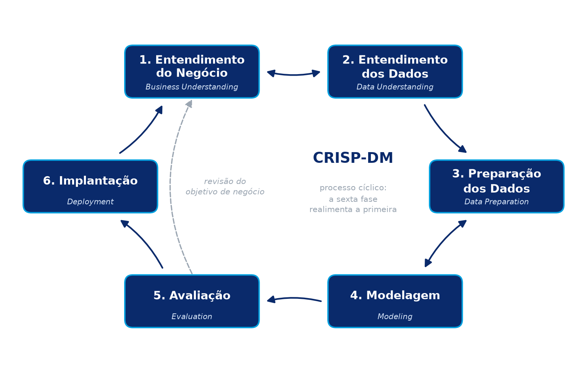<br>
  <sup>Fonte: Autoria própria, com base em Chapman et al. (2000).</sup>
</div>

## <a name="c4"></a>4. Desenvolvimento e Resultados
### 4.1. Compreensão do Problema
#### 4.1.1. Contexto da indústria 

**Contexto Setorial**

O mercado doméstico brasileiro é altamente concentrado em três principais companhias — LATAM, GOL e Azul. Em 2025, essas três companhias responderam, juntas, por praticamente todo o mercado doméstico de passageiros em RPK: 39,9% LATAM, 30,9% GOL e 29,1% Azul (ANAC, 2026, p. 62). A LATAM apresenta forte participação no mercado doméstico e ampla atuação nacional e internacional. A GOL possui forte participação no mercado doméstico e historicamente adotou uma estratégia orientada à eficiência operacional e à competitividade de custos, tendo iniciado processo de reestruturação financeira nos Estados Unidos (Chapter 11) em janeiro de 2024 e concluído o processo em junho de 2025 (MAGALHÃES, 2025). A Azul, a mais recente das três, se diferencia por capilaridade e experiência do cliente, sendo a companhia aérea brasileira com o maior número de cidades atendidas — aproximadamente 800 voos diários, mais de 130 destinos e a única companhia em cerca de 80% de suas rotas (AZUL S.A., 2026) —, competindo menos por preço e mais por alcance geográfico e diferenciação de produto. Ambas as concorrentes também passaram por processos de reestruturação financeira nos Estados Unidos, com a Azul concluindo o seu em fevereiro de 2026, após pouco mais de nove meses (FORBES MONEY, 2026).

A Azul se posiciona como a companhia de maior capilaridade do Brasil. Sua frota diversificada, composta por aeronaves ATR, Embraer E-Jets e Airbus, permite atuar em mercados de menor densidade que os concorrentes, que operam principalmente com aeronaves de maior porte, não conseguiriam explorar de forma rentável (AZUL S.A., 2026). Além da malha ampliada, a empresa aposta na diferenciação da experiência de bordo — entretenimento com TV ao vivo e opções de refeição pouco comuns no setor — como forma de fortalecer a diferenciação e a fidelização dos clientes, competindo menos por preço e mais por alcance geográfico e diferenciação de produto. A companhia também mantém unidades estratégicas de negócio complementares à operação aérea, como o programa de fidelidade Azul Fidelidade, a Azul Cargo e a Azul Viagens, e utiliza o NPS como indicador de satisfação do cliente, tendo registrado média de 38,5 em 2025 (AZUL S.A., 2026).

O setor aéreo brasileiro apresenta elevada complexidade operacional e exposição a ciclos de pressão financeira, associados, entre outros fatores, a custos elevados, volatilidade cambial, combustível, financiamento e restrições na cadeia de suprimentos. Ao mesmo tempo, o mercado doméstico segue em expansão estrutural: o tráfego doméstico brasileiro registrou o maior crescimento em RPK entre os mercados domésticos analisados pela International Air Transport Association (IATA) em 2025, com alta de 11,1% sobre 2024 (IATA, 2026). Além dos requisitos de capital e infraestrutura, a atividade é submetida a requisitos regulatórios e operacionais rigorosos, aumentando as barreiras à entrada de novos concorrentes. Some-se a isso a escassez global de aeronaves — a carteira de pedidos ultrapassou 17 mil unidades, equivalente a quase 60% da frota ativa mundial, com déficit acumulado de pelo menos 5.300 entregas nos últimos cinco anos (IATA, 2025) —, que eleva o poder de barganha dos fabricantes (Boeing, Airbus, Embraer), limita a capacidade das companhias de expandir oferta rapidamente e, aliada à necessidade de capital intensivo e escala para negociar com os fabricantes, justifica a barreira de entrada alta do setor — o que favorece a Azul e suas competidoras, já que não precisarão se preocupar com a ameaça de novos entrantes. Soma-se ainda o crescimento do mercado internacional, com disputa acirrada por rotas estratégicas (como Brasil-EUA) via expansão de rede e parcerias como a joint venture Latam-Delta.

---

**5 Forças de Porter**

<div align="center">
  <sub>Figura 2 – 5 Forças de Porter</sub><br>
  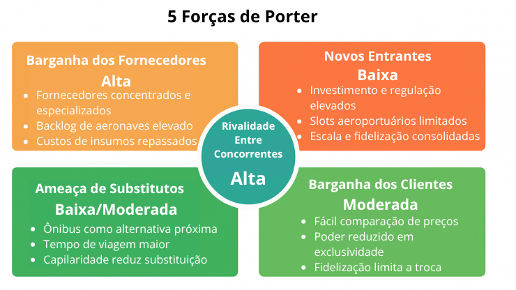<br>
  <sup>Fonte: Autoria própria.</sup>
</div>

**Poder de barganha dos fornecedores: Alto**<br>
&emsp;As companhias aéreas dependem de uma cadeia de fornecedores altamente especializada e concentrada, composta por fabricantes de aeronaves (Boeing, Airbus e a nacional Embraer), fornecedores de motores e componentes, prestadores de serviços de manutenção e empresas de leasing. O elevado tempo necessário para substituição ou expansão de frota reduz a capacidade das companhias de trocar de fornecedor no curto prazo. O backlog global de aeronaves ultrapassa 17 mil unidades — cerca de 60% da frota ativa mundial —, com déficit acumulado de pelo menos 5.300 entregas nos últimos cinco anos (IATA, 2025), o que tem elevado custos de leasing, manutenção e operação. A escassez de insumos para fabricação, intensificada após a pandemia, também eleva os custos de produção repassados às companhias aéreas (TAMIOZZO, 2025). Esse cenário reforça a dependência tecnológica das companhias e o alto custo de troca nesse elo da cadeia, sustentando o alto poder de barganha dos fornecedores.

**Poder de barganha dos clientes: Moderado**<br>
&emsp;Em rotas atendidas por múltiplas companhias, o passageiro consegue comparar preços, horários e condições e trocar de fornecedor com relativa facilidade, o que amplia seu poder de barganha. Esse poder é reduzido, porém, nas rotas de menor densidade atendidas exclusiva ou predominantemente pela Azul — a companhia afirma ser a única operadora em aproximadamente 80% de suas rotas (AZUL S.A., 2026) — e pelos mecanismos de fidelização da empresa, como o programa Azul Fidelidade. Como a exclusividade de rota e a fidelização não se estendem a toda a malha, o poder de barganha dos clientes é classificado como moderado: alto nas rotas competitivas e baixo nas rotas de atuação exclusiva da Azul.

**Rivalidade entre concorrentes: Alta**<br>
&emsp;O mercado doméstico é altamente concentrado em três companhias, conforme dados previamente apresentados (ANAC, 2026, p. 62), que disputam passageiros e slots por meio de preço, frequência de voos e rotas. O setor é caracterizado por elevados custos fixos e capacidade perecível — um assento vazio em um voo que já partiu não pode ser vendido posteriormente —, o que intensifica a pressão por ocupação e aperta as margens das companhias. Essa dinâmica ajuda a explicar por que as três companhias passaram por processos de reestruturação financeira nos Estados Unidos (Chapter 11) em momentos distintos: a GOL iniciou o processo em janeiro de 2024 e o concluiu em junho de 2025 (MAGALHÃES, 2025), enquanto a Azul concluiu o seu em fevereiro de 2026, após pouco mais de nove meses (FORBES MONEY, 2026). A recorrência desses processos entre os três principais players confirma o nível elevado de rivalidade e a pressão estrutural sobre as margens do setor.

**Ameaça de produtos substitutos: Baixa/Moderada**<br>
&emsp;O transporte rodoviário é a principal alternativa ao transporte aéreo em trajetos curtos e médios, sustentado por preços mais acessíveis e por uma malha rodoviária extensa — o Brasil conta com mais de 75 mil quilômetros somente em rodovias federais —, o que amplia a oferta de rotas e permite que o ônibus alcance destinos sem atendimento aéreo regular. Esse comportamento se reflete também na demanda digital: levantamento da Plataforma 10 registrou, em média, 906 mil buscas mensais por passagens de ônibus no Google, contra 172 mil por passagens aéreas — um interesse de busca cerca de cinco vezes maior (VIANNA, 2026). Em viagens de maior distância ou para passageiros com maior sensibilidade ao tempo, no entanto, o tempo de deslocamento consideravelmente maior do transporte rodoviário reduz sua capacidade de substituição. A capilaridade da Azul e sua atuação em mercados de menor densidade — onde é frequentemente a única operadora (AZUL S.A., 2026) — reduzem ainda mais a disponibilidade de alternativas em parte da malha. Diante disso, a ameaça de substitutos é classificada como baixa a moderada, variando conforme distância da rota e perfil do passageiro.

**Ameaça de novos entrantes: Baixa**<br>
&emsp;A entrada de novos concorrentes no transporte aéreo regular brasileiro exige elevado investimento em aeronaves, manutenção, tecnologia, pessoal e infraestrutura, além de certificação e atendimento a requisitos regulatórios da ANAC, que estrutura o processo em duas fases — constituição jurídica e homologação técnica — com prazo de até um ano até a emissão do Certificado de Homologação de Empresa de Transporte Aéreo (CHETA) (ANAC, 2006). O acesso à infraestrutura aeroportuária também é limitado: em aeroportos declarados "coordenados" pela ANAC, a alocação de slots segue regras formais de histórico, prioridade e monitoramento, restringindo a entrada de novos operadores nesses terminais (ANAC, 2022). A esses fatores somam-se as economias de escala já consolidadas pelos players existentes e a necessidade de construir rede de rotas, marca, canais de distribuição e programas de fidelidade — elementos que a Azul, a GOL e a LATAM já possuem de forma madura. Diante desse conjunto de barreiras, a ameaça de novos entrantes é classificada como baixa.

#### 4.1.2. Análise SWOT 
- A matriz SWOT é uma ferramenta de diagnóstico estratégico dividida em quatro quadrantes: Forças e Fraquezas, que são fatores internos da organização e estão sob seu controle, e Oportunidades e Ameaças, que são fatores externos do mercado e não dependem diretamente da organização.

- As Forças são os pontos em que a organização já se destaca, como recursos, competências ou processos bem estabelecidos. As Fraquezas são as limitações internas que ainda pesam contra ela, como falhas de processo, dados incompletos ou dependências não resolvidas. Já as Oportunidades são condições externas favoráveis que a organização pode aproveitar, como tendências de mercado ou brechas deixadas pela concorrência, enquanto as Ameaças são riscos externos que fogem do seu controle, como mudanças regulatórias, movimentos da concorrência ou instabilidade econômica.

- A ideia é cruzar esses dois eixos, interno e externo, favorável e desfavorável, para dar uma visão organizada da situação de um projeto, produto ou empresa em determinado momento. Esse diagnóstico serve de base para decisões estratégicas antes de partir para a definição de soluções, ajudando a identificar onde investir, o que corrigir e quais riscos monitorar de perto.

<div align="center">
  <sub>Análise SWOT</sub><br>
  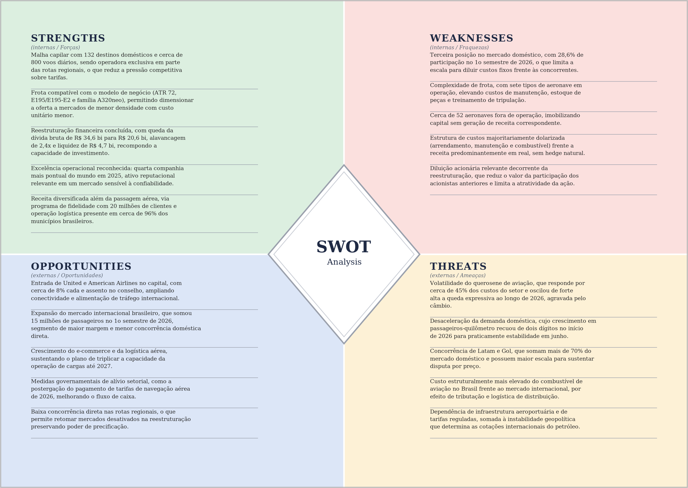<br>
  <sup>Fonte: Autoria própria.</sup>
</div>

**Texto Analítico**

**Critério de classificação escolhido pelo grupo**

A matriz se organiza em dois eixos: interno ou externo, e favorável ou desfavorável. O teste aplicado para o primeiro eixo foi a capacidade de decisão da companhia. Se a Azul pode alterar o fator por decisão própria, ele é interno; se apenas reage a ele, é externo.

Esse critério explica duas escolhas que poderiam gerar dúvida. A saída do Chapter 11 foi classificada como força, e não oportunidade, porque decorre de reestruturação conduzida pela própria empresa e se materializa no balanço (AZUL S.A., 2026b). Já a entrada de United e American no capital é oportunidade, pois depende de decisão de terceiros e de aprovação regulatória (Conselho Administrativo de Defesa Econômica [CADE], 2026a, 2026b).

**Forças**

Descrevem capacidades próprias da companhia. A malha capilar, com 132 destinos domésticos e cerca de 800 voos diários, é o ativo central, já que a exclusividade em parte das rotas regionais reduz a pressão sobre tarifas (AZUL S.A., 2026a). A frota compatível com esse modelo é a condição técnica que a viabiliza, existindo relação de causa entre os dois pontos (AZUL S.A., 2026a). A reestruturação concluída entra como força por se traduzir em indicadores internos de balanço: dívida bruta de R$ 34,6 bi para R$ 20,6 bi, alavancagem de 2,4x e liquidez de R$ 4,7 bi (Azul S.A., 2026b, 2026c). A pontualidade, com a quarta colocação mundial em 2025, resulta de gestão operacional (CIRIUM, 2026). A diversificação de receita, via fidelidade com 20 milhões de clientes (AZUL FIDELIDADE, 2026) e logística em 96% dos municípios (AZUL LOGÍSTICA, 2026), reduz a dependência da venda de passagens.

**Fraquezas**

Foram escolhidas de modo a não apenas espelhar o inverso das forças. A terceira posição no mercado doméstico, com 28,6% no primeiro semestre de 2026, limita a diluição de custos fixos (AGÊNCIA NACIONAL DE AVIAÇÃO CIVIL, 2026b). A complexidade de sete tipos de aeronave é o contraponto direto da segunda força: a diversidade que viabiliza a malha encarece manutenção, peças e treinamento (AZUL S.A., 2026a). As 52 aeronaves fora de operação imobilizam capital sem receita (AZUL S.A., 2026b). A estrutura de custos dolarizada foi mantida como interna porque resulta do modelo de financiamento adotado, ainda que a cotação da moeda seja externa (Azul S.A., 2026c). A diluição acionária é a contrapartida negativa da recuperação do balanço (INFOMONEY, 2026).

**Oportunidades**

Reúnem movimentos externos que a companhia pode capturar. A entrada de United e American, com cerca de 8% cada, fornece o canal internacional (Azul S.A., 2026b; CADE, 2026a, 2026b), enquanto a expansão do mercado internacional brasileiro, com 15 milhões de passageiros no primeiro semestre de 2026, fornece a demanda (ANAC, 2026a). As duas se reforçam. Os dois movimentos societários, porém, estão em estágios distintos: o aumento da participação da United foi aprovado pelo Tribunal do CADE em 11 de fevereiro de 2026, enquanto o investimento da American contava, em 5 de agosto de 2026, com parecer favorável da Superintendência-Geral ainda sujeito a avocação pelo Tribunal ou a recurso, o que reforça a leitura do fator como oportunidade dependente de terceiros, e não como força (CADE, 2026a, 2026b). O crescimento do e-commerce sustenta o plano de triplicar a capacidade de cargas até 2027, dialogando com a força da diversificação (AZUL LOGÍSTICA, 2026). A postergação das tarifas de navegação aérea é decisão de política pública que melhora o fluxo de caixa. A baixa concorrência nas rotas regionais é condição de mercado, não atributo da empresa, o que justifica sua posição neste quadrante (ANAC, 2026b).

**Ameaças**

O quadrante foi consolidado para evitar redundância. Combustível e câmbio, antes separados, foram unificados, pois o querosene responde por cerca de 45% dos custos do setor e é reajustado com base no dólar (Associação Brasileira das Empresas Aéreas [ABEAR], 2026; Petrobras, 2026). A desaceleração da demanda, que recuou de dois dígitos no início de 2026 para praticamente estabilidade em junho, limita o repasse de custos via tarifa (ANAC, 2026a). A concorrência de Latam e Gol, somando mais de 70% do mercado, articula-se com a fraqueza de escala (ANAC, 2026b). O custo estruturalmente mais alto do combustível no Brasil é risco distinto da volatilidade, por tratar de nível de preço e não de oscilação (ABEAR, 2026). A dependência de infraestrutura e tarifas reguladas completa o quadrante como risco institucional (ANAC, 2026b).

**Conexões SWOT**

Três tensões organizam a leitura. A primeira é que malha capilar e complexidade de frota têm a mesma origem, de modo que a vantagem competitiva carrega seu próprio custo. A segunda é que a recomposição do balanço é justamente o que torna acessíveis a expansão internacional, a retomada regional e o crescimento de cargas, tendo como contrapartida a diluição acionária. A terceira é que a menor escala se torna mais crítica em um mercado que deixou de crescer aceleradamente, pois a disputa passa a ocorrer por participação.

**Síntese**

A Azul apresenta vantagem competitiva defensável, sustentada pela capilaridade da malha e pela reputação operacional, mas opera com margem financeira estreita e alta exposição a custos externos. A prioridade estratégica é usar o fôlego da reestruturação e a conectividade dos parceiros internacionais para proteger o ativo regional, avançando na logística para reduzir a sensibilidade a combustível, câmbio e ciclo da demanda doméstica.

#### 4.1.3. Planejamento Geral da Solução

**a) Dados disponíveis**

A base utilizada no projeto é a `AMOSTRA_NPS_INTELI_FINAL`, fornecida pela Azul Linhas Aéreas Brasileiras a partir de sua plataforma de dados e disponibilizada à equipe em formato de planilha. O conjunto reúne 98.414 respostas à pesquisa de NPS coletadas entre 1º de junho de 2023 e 26 de julho de 2026, todas referentes a voos domésticos. Cada registro corresponde a uma resposta individual, associada a um localizador de reserva e enriquecida com atributos operacionais do voo realizado. Todos os campos foram anonimizados pela companhia em conformidade com a LGPD, sem qualquer informação que permita identificar o passageiro (AZUL LINHAS AÉREAS BRASILEIRAS; INSTITUTO DE TECNOLOGIA E LIDERANÇA, 2026).

A pesquisa é enviada um dia após o voo a 50% dos Clientes domésticos, que dispõem de sete dias para responder, com quarentena de noventa dias entre envios ao mesmo Cliente (AZUL LINHAS AÉREAS BRASILEIRAS; INSTITUTO DE TECNOLOGIA E LIDERANÇA, 2026). Isso significa que a amostra representa quem respondeu, e não a totalidade dos passageiros transportados no período.

| Nome da Coluna | Tipo de Dado | Preenchimento | Descrição |
|---|---|---|---|
| RESPONDENT_ID | Numérico | 100% | Identificador único da resposta à pesquisa de NPS |
| CLIENTE_RECORDLOCATOR | Texto | 100% | Localizador da reserva à qual a resposta se refere |
| DATA_STD | Data | 100% | Data prevista de partida do voo (Scheduled Time of Departure) |
| EQUIPAMENTO_PREFIXO | Texto | 100% | Prefixo de matrícula da aeronave utilizada. Em jornadas com mais de um trecho, traz os prefixos concatenados |
| BASE_AIRPORTLEG | Texto | 100% | Sequência de aeroportos da jornada, no formato origem/destino ou origem/conexão/destino |
| PERFIL_TUDOAZUL | Texto | 100% | Categoria do Cliente no programa de fidelidade (Cliente Azul, Tudo Azul, Topázio, Safira, Diamante, Azul Diamante Unique, Azul One) |
| VOO_TIPO | Texto | 100% | Natureza da operação: Direto, Conexão ou Escala |
| TIPO_ENTRETENIMENTO | Texto | 100% | Sistema de entretenimento de bordo disponível na aeronave |
| NPS_PRINCIPAL | Numérico | 100% | Classificação do Cliente na pergunta principal de recomendação: -100 (Detrator), 0 (Neutro) ou 100 (Promotor) |
| NPS_ATRASO | Numérico | 14,7% | Avaliação da experiência com atraso no voo |
| NPS_BAGAGEM | Numérico | 34,5% | Avaliação do serviço de bagagem despachada |
| NPS_BAGMAO | Numérico | 79,8% | Avaliação do espaço e serviço de bagagem de mão |
| NPS_CANCELAMENTO24H | Numérico | 1,4% | Avaliação da experiência com cancelamento em até 24 horas |
| NPS_CKBALCAO | Numérico | 11,1% | Avaliação do check-in realizado no balcão |
| NPS_CKMOBILE | Numérico | 54,1% | Avaliação do check-in realizado pelo aplicativo |
| NPS_CKTOTEM | Numérico | 0,3% | Avaliação do check-in realizado no totem de autoatendimento |
| NPS_CKWEB | Numérico | 14,4% | Avaliação do check-in realizado pelo site |
| NPS_COMISSARIOS | Numérico | 78,2% | Avaliação do atendimento dos Tripulantes a bordo |
| NPS_CONFORTO | Numérico | 73,1% | Avaliação do conforto da aeronave, incluindo assento e espaço |
| NPS_EMBARQUE | Numérico | 84,0% | Avaliação do processo de embarque |
| NPS_ENTRETENIMENTO | Numérico | 35,8% | Avaliação do sistema de entretenimento de bordo |
| NPS_LIMPEZA | Numérico | 75,3% | Avaliação da limpeza da aeronave |
| NPS_PILOTOS | Numérico | 76,4% | Avaliação dos pilotos, considerando comunicação e condução do voo |
| NPS_RESAGENCIA | Numérico | 37,5% | Avaliação da reserva realizada por agência de viagem |
| NPS_RESWEB | Numérico | 46,9% | Avaliação da reserva realizada pelos canais digitais próprios |
| NPS_SNACKS | Numérico | 65,1% | Avaliação do serviço de alimentação a bordo |
| NPS_TUDOAZUL | Numérico | 29,4% | Avaliação do programa de fidelidade |
| NPS_WIFI | Numérico | 16,2% | Avaliação do serviço de conexão Wi-Fi a bordo |
| SUB_ENTRETENIMENTO1 | Texto | 31,1% | Indicação de falha no sistema de entretenimento durante o voo (Sim, Não, Não assisti) |
| SUB_ENTRETENIMENTO2 | Texto | 6,7% | Natureza da falha relatada no entretenimento, quando houve |
| SUB_FIL_MOTIVOVIAGEM | Texto | 99,4% | Motivo declarado da viagem: Lazer, Trabalho, Pessoal ou Trabalho combinado com lazer |
| SUB_FIL_FREQUENCIAAZUL | Texto | 99,2% | Frequência de viagens pela companhia, declarada pelo próprio Cliente |
| ESTATISTICA_ATRASOSAIDA | Numérico | 100% | Atraso registrado na partida, em minutos |
| VOO_INTERNACIONAL | Texto | 100% | Classificação do voo como Domestic ou International |
| SEGMENTO | Texto | 100% | Segmento comercial ao qual o Cliente pertence (Corporativo, Azul Viagens, Demais Clientes) |
| TEMPO_VOO | Numérico | 100% | Duração da viagem, em minutos |
| CANCELAMENTO_VOO | Booleano | 100% | Indicação de que houve cancelamento associado à reserva |
| ANTECEDENCIA_CANCELAMENTO | Numérico | 16,3% | Intervalo entre o cancelamento e a partida originalmente prevista, em dias |

**Nota sobre a qualidade e a estrutura dos dados**

A exploração inicial da base revelou características que condicionam diretamente as etapas de preparação de dados previstas na metodologia adotada.

A variável-alvo apresenta desbalanceamento moderado: 65,2% dos registros correspondem a Promotores, 14,5% a Neutros e 20,3% a Detratores. A classe de interesse é minoritária, o que exige atenção à escolha das métricas de avaliação, mas sua proporção permite trabalhar sem recorrer a estratégias agressivas de reamostragem.

As avaliações por etapa da jornada apresentam ausência estrutural, e não aleatória. Cada Cliente avalia apenas o que efetivamente vivenciou, de modo que o preenchimento varia de 84,0% no embarque a 0,3% no check-in por totem. Os quatro campos de check-in são mutuamente exclusivos, com apenas um deles preenchido por registro. Da mesma forma, as avaliações de atraso e de cancelamento só existem quando o evento ocorreu. A ausência, nesses casos, carrega informação sobre a jornada e será tratada como sinal, não como ruído a ser imputado.

Os campos `BASE_AIRPORTLEG` e `EQUIPAMENTO_PREFIXO` não descrevem um único voo. Aproximadamente 30% dos registros trazem valores concatenados que representam jornadas de múltiplos trechos, o que produz 8.746 combinações distintas de rota e 19.456 de aeronave, número muito superior ao tamanho real da frota. A decomposição desses campos em atributos derivados, como aeroporto de origem, aeroporto de destino final, quantidade de trechos e presença de conexão em hub, é condição para que o modelo capte padrões de rota e de equipamento.

Três inconsistências foram identificadas e serão tratadas na preparação dos dados. O campo `TEMPO_VOO`, embora integralmente preenchido, apresenta 1.241 registros com valores incompatíveis com a duração de uma viagem, sendo 1.235 negativos e 6 zerados. Trata-se de erro de conteúdo, não de ausência. O campo `TIPO_ENTRETENIMENTO` contém treze categorias que se reduzem a sete após a padronização de grafias divergentes, como `eX1` e `EX1` ou `não possui entretenimento` e `Nao tem entretenimento`. Por fim, ainda que o campo `VOO_INTERNACIONAL` exista na estrutura, a amostra recebida contém exclusivamente voos domésticos, o que delimita o escopo de aplicação do modelo.

**Distinção entre dados operacionais e dados da pesquisa**

Os campos da base se dividem em dois grupos que não estão disponíveis no mesmo momento, distinção que determina quais deles podem ser usados como preditores.

Doze campos são operacionais e existem antes de qualquer manifestação do Cliente, pois derivam do registro da viagem e do cadastro: data de partida, aeronave, rota, perfil de fidelidade, tipo de operação, sistema de entretenimento da aeronave, atraso na partida, classificação doméstica ou internacional, segmento comercial, duração da viagem, indicação de cancelamento e antecedência do cancelamento.

Vinte e três campos são coletados pela própria pesquisa de NPS: as dezenove avaliações por etapa da jornada e os quatro campos de sub-perguntas, incluindo motivo da viagem e frequência declarada. Todos passam a existir somente no momento em que o Cliente responde, o mesmo instante em que a variável-alvo é registrada.

Utilizar o segundo grupo como preditor produziria um modelo inaplicável na janela descrita no item (c), já que exigiria a resposta à pesquisa para prever o resultado dessa mesma resposta. O modelo destinado à pontuação individual de risco será treinado exclusivamente sobre os campos operacionais e sobre atributos derivados deles. As avaliações por etapa da jornada permanecem na base com finalidade analítica, subsidiando o diagnóstico dos pontos críticos da experiência descrito no segundo modo de uso, sem integrar o conjunto de preditores.

Cabe registrar que motivo da viagem e frequência declarada descrevem características estáveis do Cliente e não a experiência do voo. Ainda assim, nesta base eles chegam pela pesquisa, o que os mantém indisponíveis no momento da predição. Caso a companhia venha a fornecer esses atributos a partir de seus registros internos, eles poderão ser incorporados ao conjunto de preditores em etapa posterior.

**Definição da variável-alvo**

A variável `NPS_PRINCIPAL` assume três valores, correspondentes a Promotores, Neutros e Detratores. Como o objetivo do projeto é estimar a probabilidade de detração, a variável será binarizada: Detratores compõem a classe positiva e Neutros e Promotores são agrupados na classe negativa. A classe positiva concentra 20,44% dos registros. Essa definição vale para todas as métricas estabelecidas no item (e).

**b) Solução proposta**

A solução proposta é um modelo de classificação supervisionada capaz de estimar, para cada Cliente, a probabilidade de que sua experiência resulte em uma avaliação de detração. O modelo é treinado sobre o histórico de respostas de NPS combinado aos registros operacionais do voo, aprendendo a associar configurações de jornada a desfechos de insatisfação.

A Azul já opera um modelo preditivo de NPS em nível agregado, que projeta o comportamento semanal do indicador. O que a companhia não possui é a capacidade de descer ao nível do passageiro individual e responder quem, dentro de um conjunto de voos, tende a se tornar Detrator (AZUL LINHAS AÉREAS BRASILEIRAS; INSTITUTO DE TECNOLOGIA E LIDERANÇA, 2026). É essa lacuna que a solução endereça.

Ao componente preditivo soma-se uma camada de interpretabilidade construída a partir da análise de importância de atributos do modelo treinado. Ela permite hierarquizar quais variáveis da jornada e da operação mais influenciam a probabilidade de detração, revelando quais etapas concentram o peso na formação da nota. O modelo, assim, não apenas ordena Clientes por risco, mas devolve à companhia um mapa dos pontos em que a experiência se deteriora.

O desenvolvimento será conduzido em Python. A manipulação e a preparação dos dados serão feitas com `pandas`, as operações numéricas com `numpy`, o treinamento dos modelos, a divisão dos conjuntos e o cálculo das métricas de avaliação com `scikit-learn`, e a construção dos gráficos de desempenho e de diagnóstico com `matplotlib`.

**c) Como a solução proposta deverá ser utilizada**

A aplicação prevista tem dois modos de operação complementares.

O primeiro é a pontuação individual de risco, executada no intervalo entre a realização do voo e a resposta à pesquisa. A companhia processa os voos de um período por meio da ingestão de um arquivo em formato CSV e recebe, como saída, a probabilidade de detração calculada para cada Cliente, com a respectiva faixa de risco. Como a pesquisa é enviada um dia após o voo e permanece aberta por sete dias, existe uma janela concreta em que a área de Customer Insights pode agir antes que a avaliação seja registrada. A priorização se apoia nessa lista para direcionar as ações de recuperação que a companhia já pratica, do contato personalizado dos Tripulantes ao tratamento diferenciado em solo. Essas ações se apoiam no princípio OPA, sigla para Observar, Perceber e Atender, método interno pelo qual os Tripulantes recebem autonomia para adaptar o atendimento ao contexto de cada passageiro em vez de seguir um roteiro padronizado (AZUL LINHAS AÉREAS BRASILEIRAS; INSTITUTO DE TECNOLOGIA E LIDERANÇA, 2026). O modelo se acopla a esse processo ao indicar antecipadamente quais Clientes concentram maior risco, tornando a personalização mais dirigida.

O segundo modo é o diagnóstico agregado dos fatores de insatisfação. A hierarquia de importância dos atributos, combinada à análise da distribuição do risco por rota, tipo de operação, segmento e perfil de fidelidade, permite identificar onde a detração se concentra e quais condições a antecedem. Esse resultado alimenta a priorização de investimentos e iniciativas de melhoria, sustentando decisões que hoje dependem da análise manual de comentários e de indicadores agregados.

Os dois modos derivam do mesmo artefato. A entrega prevê código executável internamente pela Azul, com documentação que permita a continuidade do trabalho por profissionais que não participaram do desenvolvimento, e saída exportável para os fluxos já utilizados pela área.

**d) Benefícios trazidos pela solução proposta**

- Antecipação da identificação de Clientes insatisfeitos, substituindo um processo hoje reativo, que depende da resposta à pesquisa, por uma atuação preventiva dentro da janela em que ainda é possível intervir.
- Ampliação da cobertura da análise. O processo atual concentra o esforço manual dos analistas em Clientes de alto valor, enquanto o modelo pontua a totalidade dos registros processados.
- Priorização de melhorias operacionais com base em evidência quantitativa sobre o peso de cada etapa da jornada na formação da nota, incluindo limiares de atraso a partir dos quais o risco se eleva de forma relevante.
- Compreensão dos drivers específicos de cada segmento e perfil de fidelidade, permitindo que ações de recuperação sejam calibradas ao Cliente em vez de aplicadas de forma uniforme.
- Identificação de rotas e padrões operacionais sistematicamente associados à detração, subsidiando decisões de malha, alocação de equipamento e serviço de bordo.
- Melhor alocação do investimento em ações de recuperação, ao reduzir tanto o esforço direcionado a Clientes que já seriam Promotores quanto a ausência de ação junto a quem efetivamente detrataria.
- Redução do risco de acomodação de expectativa, uma vez que benefícios passam a ser concedidos com base em risco estimado e não de forma recorrente ao mesmo grupo de Clientes.

**e) Critérios de sucesso**

- Desempenho do modelo

O erro de não identificar um Cliente que efetivamente detratará é mais custoso para a companhia do que o de acionar um Cliente que já seria Promotor, pois o primeiro implica perda de relacionamento e o segundo apenas gasto sem retorno, assimetria apontada pela própria equipe de Customer Experience da Azul (AZUL LINHAS AÉREAS BRASILEIRAS; INSTITUTO DE TECNOLOGIA E LIDERANÇA, 2026). Por essa razão, a Sensibilidade (Recall) na classe positiva, composta pelos Detratores conforme a binarização definida no item (a), é adotada como métrica primária de avaliação.

- Sensibilidade (Recall) de no mínimo 0,70 na classe Detrator no conjunto de teste.
- ROC-AUC de no mínimo 0,75, demonstrando capacidade de ordenação de risco superior à referência aleatória.
- Precisão Média de no mínimo 0,40 na classe Detrator, o que representa aproximadamente o dobro da taxa de prevalência observada na base (20,44%) — valor que corresponde à Precisão Média esperada de um modelo aleatório, sem poder preditivo — e assegura que a lista priorizada tenha densidade de risco suficiente para justificar a ação.
- F1-score reportado como métrica de equilíbrio, acompanhado da matriz de confusão e da curva Precision-Recall.
- Probabilidades calibradas, verificadas por curva de calibração, condição para que o corte de priorização seja definido em termos de negócio e não de forma arbitrária.
- Estabilidade do desempenho em validação temporal, com o modelo avaliado em período posterior ao de treino, dada a extensão de três anos da base e a presença de fatores sazonais e conjunturais no comportamento do indicador.

- Resultado de negócio

Os patamares a seguir dependem de parâmetros que serão validados junto ao parceiro, entre eles o custo médio das ações de recuperação e o valor associado à retenção do Cliente.

- Redução de ao menos 10% na proporção de Detratores entre os Clientes submetidos a ação preventiva orientada pelo modelo, comparada ao grupo não priorizado.
- Elevação da taxa de conversão das ações de recuperação em relação à média histórica atualmente observada pela companhia.
- Redução do tempo entre a ocorrência do voo e a identificação do Cliente em risco, hoje condicionada à resposta à pesquisa.
- Adoção efetiva pela área de Customer Insights, evidenciada pela execução autônoma do modelo pela equipe da Azul ao término do projeto.
- Aderência integral aos requisitos de privacidade e proteção de dados estabelecidos pela LGPD e às restrições de compartilhamento definidas pela companhia.

- Retorno sobre o investimento

Demonstração de retorno positivo em até doze meses após a entrada em operação, calculado pela comparação entre o custo das ações preventivas direcionadas pelo modelo e o valor preservado pela retenção dos Clientes recuperados. A quantificação depende dos parâmetros de custo e de valor de Cliente a serem fornecidos pela Azul.


#### 4.1.4. Value Proposition Canvas

<div align="center">
  <sub>Figura 3 – Value Proposition Canvas da solução</sub><br>
  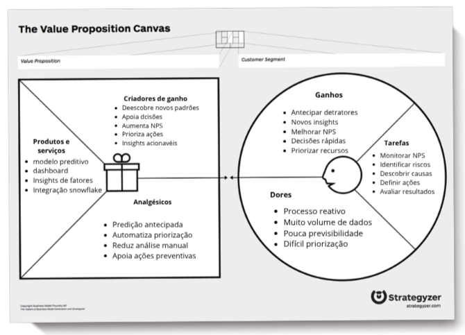<br>
  <sup>Fonte: Autoria própria.</sup>
</div>


O Value Proposition Canvas **(VPC)** é uma ferramenta de modelagem estratégica utilizada para alinhar uma proposta de valor às necessidades reais de um segmento de clientes. O modelo é composto por dois blocos principais: o **Perfil do Cliente (Customer Profile)**, que representa as atividades, dores e ganhos esperados pelo usuário, e o **Mapa de Valor (Value Map)**, que descreve como os produtos e serviços oferecidos atendem a essas necessidades. Dessa forma, o Canvas permite verificar se a solução proposta realmente gera valor para seus usuários e auxilia na definição de funcionalidades que atendam aos objetivos do negócio.

No contexto deste projeto, o Value Proposition Canvas foi utilizado para compreender como a solução proposta poderá gerar valor para a equipe de **Customer Experience da Azul Linhas Aéreas**, principal responsável pela utilização do modelo preditivo. Diferentemente do passageiro, que é beneficiado de forma indireta pelas ações decorrentes das previsões do modelo, a equipe de Customer Experience é quem utilizará os resultados gerados para apoiar decisões estratégicas e operacionais relacionadas à melhoria da experiência dos clientes.

A construção do Canvas foi baseada nas informações disponibilizadas pela Azul na proposta inicial do projeto (TAPI), complementadas pelos workshops realizados com a empresa parceira. Durante essas interações foi possível compreender o fluxo atual de análise do NPS, os desafios enfrentados pela equipe, a forma como os dados são utilizados e, principalmente, a expectativa da empresa de obter não apenas previsões de passageiros detratores, mas também novos insights que permitam identificar padrões ainda desconhecidos e apoiar ações preventivas capazes de elevar o NPS.

A partir dessa análise, foram identificados os principais elementos do Perfil do Cliente e do Mapa de Valor, apresentados a seguir, relacionando as necessidades da equipe de Customer Experience às características da solução proposta.

**Tarefas:** a equipe de Customer Experience é responsável por monitorar o NPS, identificar riscos, investigar suas possíveis causas, definir ações, priorizar os casos que demandam atenção e avaliar os resultados obtidos. Essas atividades orientam a utilização das informações geradas pela solução no processo de acompanhamento da experiência dos passageiros.

**Dores:** o Canvas evidencia quatro principais dificuldades enfrentadas pela equipe: um processo predominantemente reativo, o grande volume de dados, a dificuldade de antecipar quais passageiros podem se tornar detratores e a dificuldade de priorizar quais casos devem receber atenção.


**Ganhos:** a solução busca permitir a antecipação de possíveis detratores, gerar novos insights, contribuir para a melhoria do NPS, apoiar decisões mais rápidas e auxiliar na priorização dos recursos disponíveis para atuação da equipe.

**Produtos e serviços:** o Mapa de Valor é composto pelo modelo preditivo, pelo dashboard, pelos insights relacionados aos fatores que influenciam o NPS e pela integração com o Snowflake. Esses elementos concentram e disponibilizam as informações necessárias para apoiar a atuação da equipe.

**Analgésicos:** esses produtos e serviços procuram reduzir as principais dores identificadas por meio da predição antecipada, da automatização da priorização, da redução da análise manual e do apoio a ações preventivas.


**Criadores de ganho:** além de reduzir as dores existentes, a solução busca gerar valor adicional por meio da descoberta de novos padrões, do apoio às decisões, da contribuição para a melhoria do NPS e da geração de insights acionáveis que auxiliem na definição de ações preventivas.

O principal objetivo da solução proposta é deslocar parte das ações da equipe de Customer Experience de uma abordagem reativa para uma abordagem preditiva. Atualmente, muitas ações são realizadas após a identificação de passageiros detratores. Com a utilização do modelo preditivo, espera-se antecipar potenciais experiências negativas, permitindo que a equipe intervenha antes da ocorrência da avaliação do NPS, por meio de ações direcionadas aos passageiros com maior risco de insatisfação.

A análise realizada por meio do Value Proposition Canvas demonstra que a proposta de valor da solução vai além da construção de um modelo de Machine Learning. O projeto busca fornecer informações acionáveis para a equipe de Customer Experience em duas frentes. A primeira é a priorização dos passageiros com maior probabilidade de se tornarem detratores, utilizada na rotina de atendimento. A segunda é a compreensão dos principais fatores que influenciam a satisfação dos clientes, que apoia decisões preventivas de caráter estrutural e é consumida em análises pontuais, e não no dia a dia. Dessa forma, a solução contribui para a melhoria contínua da experiência dos passageiros e para o fortalecimento da estratégia de relacionamento da Azul. A priorização é necessária porque a equipe de Customer Experience atua sobre um volume de passageiros menor do que o total de passageiros em risco. Por isso, o valor do modelo está menos na sua precisão sobre toda a base e mais na sua capacidade de ordenar corretamente os casos mais críticos. Vale destacar que o modelo estima a probabilidade de o passageiro responder à pesquisa como detrator, o que não corresponde exatamente a ter vivido uma experiência negativa, já que passageiros insatisfeitos que não respondem à pesquisa não são capturados por essa métrica.


#### 4.1.5. Matriz de Riscos

&emsp;A matriz abaixo consolida as ameaças e oportunidades identificadas para o desenvolvimento do modelo preditivo de detratores de NPS. A probabilidade e o impacto de cada item foram estimados pelo grupo com base no TAPI e no dicionário de dados fornecidos pela Azul. Os riscos serão revisados a cada sprint, podendo ser reclassificados conforme o avanço do projeto.

<div align="center">
  <sub>Figura 4 – Matriz de Riscos do Projeto</sub><br>
  <br>
  <sup>Fonte: Autoria própria.</sup>
</div>

##### Ameaças

| #   | Descrição                                                                                                                                                                                              | Probabilidade |  Impacto   | Justificativa da Classificação                                                                                                          | Plano de Resposta                                                                                                                                          |
| --- | ------------------------------------------------------------------------------------------------------------------------------------------------------------------------------------------------------ | :-----------: | :--------: | ------------------------------------------------------------------------------------------------------------------------------------------ | ----------------------------------------------------------------------------------------------------------------------------------------------------------- |
| R01 | Vazamento de alvo: usar as sub-notas de NPS (`nps_conforto`, `nps_atraso` etc.) como features, sendo que elas vêm da mesma pesquisa que gera o alvo. O modelo pareceria ótimo, mas seria inútil na prática. |      90%      | Muito Alto | Probabilidade muito alta: as sub-notas ficam na mesma base e o erro é fácil de cometer sem experiência prévia com esse tipo de dado. Impacto muito alto: invalida o modelo inteiro sem que a equipe perceba até a validação final. |Treinar só com dados disponíveis antes da resposta do passageiro (atraso, rota, aeronave, segmento). Acurácia acima de 95% será tratada como sinal de alerta. |
| R02 | Desbalanceamento: bem menos detratores que não detratores, enviesando o modelo para a classe majoritária.                                                                                                |      70%      |    Alto    | Probabilidade alta: é característica intrínseca de dados de NPS, não uma hipótese. Impacto alto: compromete justamente a capacidade de identificar a classe de interesse (detratores). | Balancear classes (SMOTE ou `class_weight`) e avaliar por F1 e ROC-AUC, não por acurácia.                                                                    |
| R03 | Baixo poder preditivo das variáveis operacionais restantes após a remoção das features com vazamento de alvo.                                                                                            |      50%      |    Alto    | Probabilidade moderada: só é mensurável durante a modelagem, após a limpeza do vazamento. Impacto alto: pode inviabilizar a meta de desempenho combinada com a Azul. | Investir em engenharia de features e alinhar com a Azul que o valor do projeto também está nos drivers de insatisfação identificados, não só na métrica final. |
| R04 | Tratar correlação como causa e gerar recomendações de negócio equivocadas.                                                                                                                               |      50%      |    Alto    | Probabilidade moderada: erro recorrente ao interpretar SHAP/feature importance sem cuidado metodológico. Impacto alto: pode levar a recomendações de negócio erradas para a Azul. | Apresentar os resultados do SHAP como associação, não causalidade, e validar as hipóteses com a equipe de Customer Insights antes de recomendar.             |
| R05 | Dados faltantes ou inconsistentes nas variáveis operacionais e de perfil.                                                                                                                                |      50%      |  Moderado  | Probabilidade moderada: comum em bases operacionais reais. Impacto moderado: tratável com técnicas padrão de imputação, sem comprometer o projeto como um todo. | Mapear a completude na EDA e definir tratamento por coluna (imputação, flag ou exclusão).                                                                    |
| R06 | Atraso na entrega da base `AMOSTRA_NPS_INTELI` pela Azul, comprometendo o cronograma.                                                                                                                    |      30%      |    Alto    | Probabilidade baixa: já há alinhamento prévio de cronograma com o ponto focal. Impacto alto: um atraso na base de entrada atrasa todas as sprints seguintes do CRISP-DM. | Alinhar prazo com o ponto focal já na primeira semana e adiantar o pipeline com dados sintéticos.                                                            |
| R07 | Mudança de escopo ao longo das sprints, gerando retrabalho.                                                                                                                                              |      30%      |    Alto    | Probabilidade baixa: escopo já formalizado no TAPI, mitigando mudanças bruscas. Impacto alto: gera retrabalho em entregas já avançadas do projeto. | Validar cada entrega com a Azul antes de avançar e registrar decisões no WAD.                                                                                |
| R08 | Overfitting: modelo bom no treino e ruim em dados novos.                                                                                                                                                 |      50%      |  Moderado  | Probabilidade moderada: comum em modelos com poucas features após a remoção do vazamento de alvo. Impacto moderado: detectável e corrigível via validação cruzada antes da entrega final. | Validação cruzada, conjunto de teste isolado e monitoramento da diferença treino×validação.                                                                  |

##### Oportunidades

| #   | Descrição                                                                       | Probabilidade |  Impacto   | Justificativa da Classificação                                                                                                    | Plano de Aproveitamento                                                             |
| --- | ------------------------------------------------------------------------------- | :-----------: | :--------: | -------------------------------------------------------------------------------------------------------------------------------------- | ------------------------------------------------------------------------------------ |
| R09 | Antecipar o detrator antes da pesquisa, permitindo recuperação do cliente.       |      70%      | Muito Alto | Probabilidade alta: é o objetivo central do modelo preditivo. Impacto muito alto: é o principal valor de negócio entregue à Azul. | Entregar o score em ranking priorizado para a operação agir a tempo.                 |
| R10 | Priorizar melhorias na experiência com base em dados, não em percepção.          |      90%      |    Alto    | Probabilidade muito alta: os drivers de insatisfação emergem naturalmente da análise de importância de features. Impacto alto: orienta decisões operacionais concretas da Azul. | Entregar ranking de drivers com recomendações por etapa da jornada.                  |
| R11 | Impacto em retenção, receita e NPS ao reduzir a base de detratores.              |      50%      | Muito Alto | Probabilidade moderada: depende da adoção operacional das recomendações pela Azul. Impacto muito alto: retenção de detratores afeta diretamente receita e reputação da companhia. | Traduzir os resultados em impacto de negócio no painel para os stakeholders.         |
| R12 | Insights e ações específicas por segmento de cliente (Corporativo, Azul Viagens). |      50%      |    Alto    | Probabilidade moderada: depende da qualidade da variável `segmento_cliente` na base. Impacto alto: personaliza a ação da Azul por tipo de cliente. | Usar `segmento_cliente` como feature e segmentar a análise de drivers.               |
| R13 | Reuso do modelo em outras rotas e padrões operacionais da malha.                 |      50%      |  Moderado  | Probabilidade moderada: depende de decisão futura da Azul, fora do controle do grupo. Impacto moderado: amplia o valor do projeto sem ser o objetivo principal desta sprint. | Construir pipeline modular e documentado, facilitando o reuso além do recorte inicial. |

#### 4.1.6. Personas

&emsp;Compreender profundamente quem são as pessoas envolvidas em um problema é o primeiro passo para construir uma solução que realmente faça sentido. Personas são uma das ferramentas centrais do design thinking de serviços justamente por tornarem tangíveis, em torno de um perfil concreto, as necessidades e motivações de quem participa de uma experiência (STICKDORN; SCHNEIDER, 2014). As personas apresentadas a seguir representam perfis reais de usuários e stakeholders impactados pelo modelo, construídas a partir do levantamento realizado com a equipe do projeto sobre os processos atuais de classificação de NPS e recuperação de clientes na Azul. Elas cumprem um papel fundamental neste trabalho: ao colocar rostos, rotinas e necessidades concretas por trás dos dados, tornam mais claro para quem estamos desenvolvendo o modelo, quais dores buscamos resolver e quais consequências, positivas ou negativas, nossas decisões técnicas podem gerar. Mais do que um exercício descritivo, o uso de personas orienta escolhas de modelagem, prioriza funcionalidades e ajuda a antecipar riscos, garantindo que o problema seja compreendido não apenas do ponto de vista analítico, mas também sob a perspectiva de quem utiliza, é afetado ou depende dos resultados gerados pela solução.

##### Fernanda Ribeiro (persona que utiliza o modelo)

<div align="center">
  <sub>Figura 5 – Persona que utiliza o modelo: Fernanda Ribeiro</sub><br>
  <br>
  <sup>Fonte: Autoria própria.</sup>
</div>

&emsp;Fernanda Ribeiro é Analista de Customer Insights e atua como utilizadora direta do modelo. Atualmente, ela é responsável por receber o volume diário de respostas da pesquisa de NPS e realizar a classificação dos passageiros em Promotores, Neutros e Detratores de forma manual, o que torna o processo reativo e trabalhoso, já que a identificação de um detrator só ocorre depois que a nota já foi dada. Com a implementação do modelo, Fernanda passará a utilizá-lo diretamente em sua rotina para antecipar a probabilidade de detração e identificar os principais fatores que influenciam uma nota baixa, tornando a análise mais rápida, organizada e menos dependente de esforço manual. Por isso, ela é considerada uma persona que utiliza o modelo.

##### Rafael Souza (persona afetada pelo modelo)

<div align="center">
  <sub>Figura 6 – Persona afetada pelo modelo: Rafael Souza</sub><br>
  <br>
  <sup>Fonte: Autoria própria.</sup>
</div>

&emsp;Rafael Souza é Analista de Customer Experience e representa uma persona afetada pelo modelo, ainda que não interaja diretamente com ele. Ele recebe da equipe de Insights a lista de passageiros detratores já classificada e, a partir dessas informações, investiga as possíveis causas da insatisfação e decide quais ações de recuperação ou recompensa devem ser oferecidas a cada cliente. Como seu trabalho depende diretamente da qualidade das informações produzidas pelo modelo, como os principais drivers da detração, a segmentação por perfil e a priorização dos casos, qualquer melhoria ou limitação do modelo impacta diretamente sua capacidade de tomar decisões rápidas e assertivas. Por esse motivo, Rafael é classificado como uma persona afetada pelo modelo, e não como uma usuária direta da ferramenta.

##### Marina Costa (persona afetada pelo modelo)

<div align="center">
  <sub>Figura 7 – Persona afetada pelo modelo: Marina Costa</sub><br>
  <br>
  <sup>Fonte: Autoria própria.</sup>
</div>

&emsp;Marina Costa é passageira TudoAzul Diamante e atua como persona afetada pelo modelo. Ela voa a trabalho com frequência e, embora não utilize o sistema em nenhum momento, é sobre ela que as predições são realizadas. Atualmente, quando enfrenta um problema durante a viagem, como atraso de voo ou extravio de bagagem, Marina precisa acionar os canais de atendimento por conta própria e aguardar a resposta da companhia, o que torna a recuperação lenta e dependente da iniciativa do próprio passageiro. Com a implementação do Safira, sua probabilidade de detração passa a ser identificada antes mesmo da resposta à pesquisa de NPS, permitindo que a equipe de Customer Experience realize o contato e ofereça a compensação de forma proativa. Em contrapartida, Marina não tem visibilidade sobre a classificação atribuída a ela nem meios de contestá-la, o que reforça a necessidade de que a decisão final permaneça sob responsabilidade humana. Por isso, ela é considerada uma persona que é afetada pelo modelo.

##### Conclusão da seção de Personas

&emsp;O mapeamento das personas do Safira evidencia que a solução atende a três posições distintas dentro do fluxo de gestão do NPS da Azul, e não a um único perfil de usuário. Fernanda Ribeiro representa a etapa de identificação e priorização, na qual o modelo substitui a classificação manual dos respondentes pela estimativa antecipada da probabilidade de detração e pela indicação dos fatores de maior peso na nota. Rafael Souza representa a etapa de decisão, na qual o modelo fornece os drivers da insatisfação e o histórico do passageiro para embasar a escolha da ação de recuperação, reduzindo a dependência de julgamento individual. Marina Costa, por sua vez, representa quem recebe o resultado dessa decisão sem participar dela.

&emsp;Essa distinção orienta diretamente as escolhas de projeto do Safira. O fato de Fernanda necessitar de uma leitura agregada dos fatores de detração, enquanto Rafael necessita da explicação individual de cada caso, define que o modelo deve entregar interpretabilidade em dois níveis, e não apenas um resultado de classificação. Já a presença de Marina como persona afetada estabelece que o Safira deve atuar como ferramenta de apoio à decisão humana, e não como mecanismo de decisão automática, uma vez que a consequência de um erro de predição recai sobre o passageiro, que não tem acesso à sua classificação nem meios de questioná-la.

&emsp;Dessa forma, as personas cumprem no projeto a função de traduzir requisitos técnicos em necessidades humanas concretas, garantindo que a construção do modelo preditivo considere tanto a eficiência operacional das equipes de Customer Insights e Customer Experience quanto a responsabilidade sobre os passageiros classificados por ele.

#### 4.1.7. Jornadas do Usuário

&emsp;O mapa de jornada do usuário é uma representação visual da experiência de uma pessoa ao longo do tempo, organizada em fases e descrita por meio do que ela faz, pensa e sente em cada momento, de modo a evidenciar onde a experiência falha e onde há espaço para intervenção (KALBACH, 2017). Diferentemente do fluxo de processo, que descreve como o trabalho deveria ocorrer, a jornada parte do ponto de vista de quem executa esse trabalho e registra também o que não está previsto no procedimento: a dúvida antes de uma decisão, a espera por uma informação que não chega, a insegurança de assumir a responsabilidade por um caso mal resolvido. É justamente esse registro que transforma o mapa em instrumento de projeto, e não em documentação descritiva (GIBBONS, 2018).

&emsp;A escolha da ferramenta se justifica pela natureza do Safira. Um modelo preditivo não é consumido como um relatório, mas como um insumo de decisão inserido em uma rotina que já existe e que tem prazo, capacidade limitada e consequência sobre terceiros. Pesquisas sobre interação entre pessoas e sistemas de inteligência artificial mostram que a adoção desse tipo de ferramenta depende menos da acurácia isolada do algoritmo e mais de o usuário compreender o que o sistema faz, por que produziu determinado resultado e o que acontece quando ele erra (AMERSHI et al., 2019). O guia de projeto de produtos baseados em inteligência artificial do Google chega ao mesmo ponto pelo lado do desenho: decidir em que momento a saída do modelo aparece para o usuário, de que forma ela é apresentada e o que o produto faz quando erra são tratados ali como decisões de projeto, e não como detalhe de implementação (GOOGLE PAIR, 2021). Mapear a jornada é, portanto, a forma de verificar se a saída do modelo chega ao usuário no momento certo, no formato certo e acompanhada da informação necessária para que a decisão seja tomada com responsabilidade.

&emsp;Esta seção apresenta o mapa de jornada de **Fernanda Ribeiro**, Analista de Customer Insights e usuária direta do Safira, responsável por transformar a saída do modelo em uma lista priorizada de Clientes. Ela foi escolhida como persona central do mapeamento porque sua rotina é o ponto de passagem obrigatório entre as outras duas posições descritas na seção 4.1.6: é sobre a experiência de Marina que Fernanda pontua o risco, e é para a decisão de Rafael que ela entrega o resultado dessa pontuação. Mapear a jornada de Fernanda, portanto, mapeia por extensão a janela de tempo em que Marina ainda pode ser recuperada e a qualidade do insumo do qual depende a decisão de Rafael, sem exigir dois mapas adicionais para tornar esse elo visível. Por isso, Rafael Souza e Marina Costa, já caracterizados na seção 4.1.6, permanecem essenciais para compreender o que está em jogo em cada fase, mas não compõem jornadas formais nesta seção. A jornada mapeada é a de quem opera o modelo, e não a do passageiro que compra a passagem.

&emsp;O mapa é construído em dois estados, a rotina como ela ocorre hoje e a mesma rotina com o Safira em operação, lidos lado a lado nas mesmas seis fases e na mesma ordem cronológica. Essa estrutura isola o ponto exato em que a solução intervém e torna explícito o que ela não altera: a rotina de Fernanda não muda de forma, muda de fundamento, já que o critério que sustenta a lista deixa de ser a regra fixa e passa a ser a probabilidade calculada por Cliente.

---

**Cenário**

&emsp;Em um sábado de julho, uma frente de mau tempo sobre o Sudeste compromete as operações em Viracopos e Confins a partir do meio da tarde. Os atrasos se acumulam em cascata, estendem-se pelo domingo e afetam aproximadamente 40 voos e cerca de 6 mil Clientes, com atrasos que variam de 40 minutos a mais de 4 horas e alguns realocamentos de malha. Na segunda-feira seguinte, a área de Experiência do Cliente inicia a semana diante do resultado desse fim de semana atípico.

&emsp;A janela de atuação é conhecida e curta. A pesquisa de NPS é enviada um dia após o voo a metade dos Clientes domésticos, que dispõem de sete dias para responder (AZUL LINHAS AÉREAS BRASILEIRAS; INSTITUTO DE TECNOLOGIA E LIDERANÇA, 2026). Existe, portanto, um intervalo concreto entre a experiência vivida e o registro da nota, o mesmo intervalo em que ainda é possível recuperar o Cliente antes que ele classifique a companhia de 0 a 6 e passe a compor a base de Detratores, conforme a lógica do indicador proposta por Reichheld (2003). Encerrado o prazo, a informação deixa de ser acionável e passa a ser histórico.

&emsp;A restrição que organiza toda a jornada é a assimetria entre volume e capacidade: são milhares de Clientes potencialmente afetados e uma equipe capaz de tratar algumas centenas de casos por dia. A pergunta que Fernanda precisa responder até o fim do expediente não é quantos Clientes tiveram uma experiência ruim, e sim quais deles devem ser contatados primeiro.

<div align="center">
  <sub>Figura 8 – Jornada de Fernanda Ribeiro: Estado Atual (sem o Safira)</sub><br>
  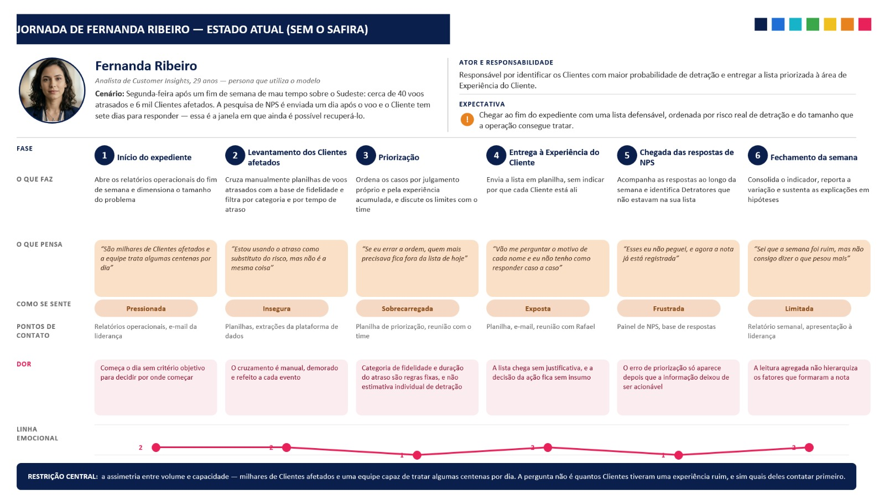<br>
  <sup>Fonte: Conteúdo textual de autoria do grupo; imagem gerada por IA (Claude, Anthropic).</sup><br>
  <sup>Escala emocional de 1 (frustração) a 5 (confiança).</sup>
</div>

&emsp;A leitura da linha emocional reforça esse diagnóstico: os pontos mais baixos não ocorrem na abertura do processo, quando o volume de Clientes afetados é maior, e sim nas fases 3 e 5, priorização e chegada das respostas de NPS, exatamente os momentos em que Fernanda decide sem um critério de risco individual e, depois, descobre tarde demais quem esse critério deixou de fora. O problema não é a falta de dados sobre o incidente, mas a ausência de um critério que os traduza em uma ordem de atendimento defensável.

<div align="center">
  <sub>Figura 9 – Jornada de Fernanda Ribeiro: Estado Futuro (com o Safira)</sub><br>
  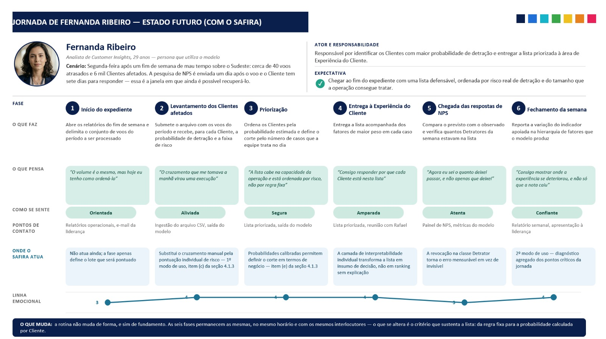<br>
  <sup>Fonte: Conteúdo textual de autoria do grupo; imagem gerada por IA (Claude, Anthropic).</sup><br>
  <sup>Escala emocional de 1 (frustração) a 5 (confiança).</sup>
</div>

&emsp;O comparativo com a Figura 8 mostra que a intervenção do Safira concentra-se exatamente nos dois pontos mais baixos da linha emocional identificados no estado atual: na fase 3, a probabilidade calibrada substitui o julgamento sem critério e a nota sobe de Sobrecarregada (1) para Segura (4); na fase 5, a revocação mensurável do modelo substitui a descoberta tardia do erro e a nota sobe de Frustrada (1) para Atenta (3). Como estabelecido no início desta seção, a jornada de Fernanda é o elo entre a experiência de Marina e a decisão de Rafael: ao tornar esses dois momentos defensáveis, o Safira não apenas melhora a rotina de Fernanda, mas amplia a janela em que Marina ainda pode ser recuperada e melhora a qualidade da informação que chega a Rafael.

#### 4.1.8. Política de Privacidade — LGPD

##### Informações Gerais

Esta Política de Privacidade apresenta como o projeto **Modelo Preditivo para Identificação de Clientes Detratores de NPS**, desenvolvido pelo grupo **Avatares**, em parceria com a Azul Linhas Aéreas Brasileiras e o Instituto de Tecnologia e Liderança (Inteli), realiza o tratamento dos dados utilizados no desenvolvimento da solução.

O projeto tem como objetivo identificar os fatores associados à insatisfação dos passageiros e estimar a probabilidade de um cliente tornar-se detrator do Net Promoter Score (NPS), contribuindo para a melhoria da experiência dos clientes da Azul.

O tratamento dos dados será realizado em conformidade com a Lei nº 13.709, de 14 de agosto de 2018, denominada Lei Geral de Proteção de Dados Pessoais (LGPD), observando os princípios previstos no art. 6º da LGPD, incluindo finalidade, adequação, necessidade, livre acesso, qualidade dos dados, transparência, segurança, prevenção, não discriminação e responsabilização e prestação de contas (BRASIL, 2018).

##### Dados Coletados

**Dados fornecidos diretamente:** respostas fornecidas pelos passageiros nas pesquisas de satisfação da Azul, incluindo a avaliação geral da experiência de voo e avaliações relacionadas a atraso, bagagem, check-in, embarque, atendimento, conforto, limpeza, entretenimento, Wi-Fi, alimentação, reservas e programa TudoAzul. Também poderão ser utilizados dados referentes ao motivo e à frequência das viagens.

**Dados coletados automaticamente:** informações operacionais registradas pelos sistemas da Azul, como data prevista de partida, origem e destino do voo, tipo de operação, aeronave utilizada, duração do voo, tempo de atraso, ocorrência de cancelamento, segmento do cliente e categoria no programa TudoAzul.

A equipe não realizará uma nova coleta de informações diretamente dos passageiros. Os dados serão fornecidos pela Azul por meio da base **AMOSTRA_NPS_INTELI** e estarão limitados às informações necessárias para a análise das respostas de NPS.

As informações que poderiam identificar o passageiro ou relacioná-lo diretamente a determinado voo serão anonimizadas antes de serem disponibilizadas ao grupo. Não serão fornecidos nomes, documentos, endereços, telefones, e-mails, dados bancários ou dados pessoais sensíveis.

Os dados disponibilizados ao grupo são previamente anonimizados pela Azul. Nos termos do art. 12 da LGPD, dados efetivamente anonimizados não são considerados dados pessoais para os fins da Lei, desde que o processo de anonimização não possa ser revertido por meios próprios ou mediante esforços razoáveis (BRASIL, 2018). A técnica específica de anonimização utilizada pela Azul não foi informada ao grupo.

##### Finalidade do Tratamento

Os dados serão utilizados para desenvolver e avaliar um modelo preditivo capaz de estimar a probabilidade de um passageiro tornar-se detrator do NPS.

O tratamento também permitirá identificar os principais fatores relacionados à insatisfação, reconhecer pontos críticos da jornada do passageiro e gerar análises que auxiliem a Azul na priorização de ações voltadas à melhoria da experiência de seus clientes.

Os dados não serão utilizados para publicidade direcionada, comercialização de informações, discriminação de passageiros ou finalidades incompatíveis com o escopo do projeto.

##### Armazenamento e Retenção

**Local:** ambiente controlado pela Azul Linhas Aéreas Brasileiras. O modelo será desenvolvido e executado na infraestrutura interna de dados da empresa, sem a transferência da base para ambientes públicos ou não autorizados.

**Prazo:** os dados serão utilizados pelo grupo até **7 de outubro de 2026**, data prevista para o encerramento do projeto. Após esse período, eventuais cópias deverão ser eliminadas ou devolvidas à Azul, conforme as orientações da empresa e do Inteli.

Poderão ser mantidos códigos, métricas, gráficos e resultados agregados, desde que não contenham registros individualizados, dados pessoais ou informações confidenciais da Azul.

##### Compartilhamento de Dados

O acesso aos dados será restrito aos integrantes autorizados do grupo **Avatares**, aos professores e orientadores responsáveis pelo projeto no Inteli e aos profissionais da Azul envolvidos no desenvolvimento, acompanhamento ou avaliação da solução.

O acesso será concedido somente aos responsáveis pelas áreas que necessitem das informações para o desempenho de suas atividades.

As bases de dados, completas ou parciais, não serão publicadas no GitHub, no site institucional do Inteli ou em outros ambientes públicos. Os dados também não serão vendidos ou compartilhados com terceiros para finalidades comerciais.

O código-fonte poderá ser publicado desde que não contenha os dados utilizados no treinamento, na validação ou no teste do modelo.

##### Segurança dos Dados

A proteção dos dados será realizada por meio das seguintes medidas:

* anonimização das informações que possam identificar os passageiros;
* armazenamento e processamento em ambiente controlado pela Azul;
* controle de acesso conforme as atribuições de cada usuário;
* acesso concedido somente aos responsáveis autorizados;
* utilização de contas individuais e credenciais protegidas;
* proibição do compartilhamento da base por meios não autorizados;
* proibição da publicação de dados reais em repositórios públicos;
* eliminação ou devolução dos dados após o encerramento do projeto.

A técnica específica utilizada no processo de anonimização não foi informada ao grupo. Dessa forma, não são atribuídos ao processo mecanismos técnicos que não tenham sido formalmente confirmados pela Azul.

Os integrantes do grupo deverão preservar a confidencialidade das informações e utilizá-las exclusivamente para as atividades acadêmicas e técnicas autorizadas.

##### Direitos dos Titulares

Nos termos da LGPD, os titulares poderão solicitar:

* acesso aos dados pessoais tratados pela Azul;
* correção de informações incompletas, inexatas ou desatualizadas;
* exclusão, anonimização ou bloqueio de dados, quando aplicável;
* informações sobre as finalidades do tratamento;
* revogação do consentimento, quando essa for a base legal utilizada;
* informações sobre o compartilhamento dos dados;
* revisão de decisões tomadas exclusivamente por tratamento automatizado, quando aplicável.

A Azul permite que o titular consulte as informações que a companhia mantém a seu respeito, mediante os procedimentos de autenticação e segurança adotados pela empresa.

Como a base disponibilizada ao grupo será anonimizada, os estudantes não poderão localizar os registros de um passageiro por meio de nome, documento ou e-mail. Portanto, as solicitações relacionadas ao exercício dos direitos dos titulares deverão ser encaminhadas diretamente à Azul.

**Solicitações via e-mail:** [azulpreditivo@gmail.com](mailto:azulpreditivo@gmail.com)

##### Encarregado de Dados (DPO)

**Nome:** Kaylan Alexandre De Paula Sathler.


**E-mail:** [kaylan.sathler@sou.inteli.edu.br](mailto:kaylan.sathler@sou.inteli.edu.br)

##### Atualização da Política

Esta Política de Privacidade poderá ser atualizada conforme alterações no projeto ou novas orientações fornecidas pela Azul Linhas Aéreas Brasileiras e pelo Inteli, prevalecendo sempre a versão mais recente do documento.


### 4.2. Compreensão dos Dados

#### 4.2.1. Exploração de dados

A exploração de dados do SAFIRA foi conduzida sobre o conjunto de bases disponibilizado pela Azul Linhas Aéreas Brasileiras, com o objetivo de caracterizar a estrutura, a qualidade e a representatividade dos dados antes da etapa de preparação. Além da estatística descritiva exigida pela metodologia CRISP-DM na fase de *Data Understanding* (CHAPMAN et al., 2000), esta seção documenta as decisões de filtragem adotadas, os vieses amostrais identificados e as hipóteses de negócio testadas, incluindo aquelas que não se confirmaram, uma vez que todos esses elementos condicionam a validade do modelo de propensão à detração.

---

##### a) Estrutura e integração das bases

O material recebido é composto por cinco arquivos que, em conjunto, descrevem a jornada do Cliente sob três perspectivas distintas:

| Base | Registros | Natureza dos dados |
|---|---:|---|
| `PROJETO_INTELI.NPS_01` a `NPS_04` | 484.916 | Respostas da pesquisa de satisfação e contexto do voo avaliado |
| `PROJETO_INTELI.INFORMACAO_VIAGEM` | 484.915 | Dados operacionais do voo (atraso, cancelamento, assentos) |
| `PROJETO_INTELI.PERFIL_CLIENTE_01` e `_02` | 484.915 | Perfil comportamental e de relacionamento do Cliente |
| `PROJETO_INTELI.DISTRIBUICAO_PAX_NORMALIZADO` | 864 | Proporções populacionais de passageiros por mês, faixa de atraso e canal de compra |

As três primeiras compartilham a chave `RESPONDENT_ID` em relação **1:1**, com cobertura integral: todas as respostas da pesquisa possuem contrapartida operacional e de perfil. A integração foi realizada por junção interna, resultando em uma base analítica única.

Essa cardinalidade não é presumida, e sim **verificada em execução**. Antes da junção, a implementação confere a cobertura da chave nas três tabelas e interrompe o processamento caso alguma resposta fique sem correspondência, situação em que a junção interna a descartaria em silêncio. A junção em si usa `validate="one_to_one"`, que faz o `pandas` levantar exceção se a chave não for única dos dois lados, em vez de multiplicar linhas. O log de cada execução registra os dois resultados.

A quarta base tem natureza distinta. Não é transacional, mas agregada. Ela informa a composição real do universo de passageiros da Azul no período, e por isso constitui o instrumento de referência para diagnosticar o viés da amostra de pesquisa, uso detalhado no item (e).

O período coberto é de **01/07/2023 a 30/06/2026**, correspondendo a 36 meses completos de operação doméstica.

---

##### b) Filtros aplicados e tratamento de duplicidades

A verificação de duplicidades produziu um resultado atipicamente limpo, o que por si só é uma informação relevante sobre a maturidade do processo de extração da Azul:

| Filtro | Registros afetados | Justificativa |
|---|---:|---|
| Remoção de linhas integralmente duplicadas | 0 | Nenhuma duplicação de ingestão identificada |
| Consolidação de `RESPONDENT_ID` duplicado com conflito aprovado | 1 | Registro com duas medições de `TEMPO_VOO` (340 e 1.084 minutos); as demais colunas eram equivalentes, o valor foi consolidado pela média (712 minutos) e a intervenção recebeu a flag `TEMPO_VOO_CONSOLIDADO` |
| Remoção de colunas constantes | 1 coluna | `VOO_INTERNACIONAL` assume o valor `Domestic` em 100% dos registros, não possuindo poder discriminativo |

**Base integrada usada no pré-processamento: 484.915 registros e 46 colunas**, incluindo `TEMPO_VOO_CONSOLIDADO`, criada para auditar a consolidação. As variáveis derivadas são acrescentadas posteriormente, como descrito no item (f).

**Registro importante sobre a unidade de análise.** Embora não haja duplicidade de chave, 484.915 respostas correspondem a apenas **407.139 Clientes distintos** (`ID_GOLDENRECORD`). Cerca de **26,8% das respostas provêm de Clientes que responderam à pesquisa mais de uma vez**, chegando a dez vezes no caso extremo. Esses registros **não foram removidos**, por duas razões:

1. A unidade de decisão da área de Customer Experience é o voo, não o Cliente. O mesmo Cliente pode ser detrator em um voo com atraso e promotor no voo seguinte, situação observada em 14.435 Clientes da base. Colapsar os registros por Cliente eliminaria justamente a variação intraindividual que o modelo precisa aprender.
2. A manutenção dos registros repetidos não distorce a variável resposta: a taxa de detração é de 20,56% entre Clientes com uma única resposta e 19,24% entre os que responderam quatro ou mais vezes.

Há, contudo, uma **dependência intracliente mensurável** que impõe uma restrição à etapa de modelagem. Entre os Clientes com exatamente duas respostas, 8,9% detrataram em ambas. Sob independência estatística, o valor esperado seria de 4,2%, o que corresponde a uma razão de aproximadamente 2,1. Adicionalmente, os Clientes respondentes recorrentes são substancialmente mais fidelizados: 31,6% são Diamante, contra 9,6% entre os respondentes únicos.

> **Restrição derivada para a fase de modelagem:** a partição entre treino e teste deverá ser agrupada por `ID_GOLDENRECORD` (`GroupKFold` ou `GroupShuffleSplit`). Uma partição aleatória simples permitiria que o mesmo Cliente figurasse em ambos os conjuntos, levando o modelo a memorizar padrões individuais e superestimando artificialmente as métricas de desempenho.
>
> Ressalva: `ID_GOLDENRECORD` é nulo em 103 registros, equivalentes a 0,02% da base, nas tabelas de pesquisa e de perfil simultaneamente. Esses voos não podem ser agrupados por Cliente, e a decisão foi **excluí-los da validação**, o que já está implementado em `dividir_treino_teste_temporal_por_cliente` (`scripts/preprocessamento_nps.py`): eles ficam fora do treino e do teste, a exclusão é registrada em log e o total aparece nos metadados da partição, no campo `registros_sem_cliente_excluidos`. A alternativa de tratar cada um como grupo unitário foi descartada porque o nulo ocorre nas duas tabelas ao mesmo tempo, de modo que não há como afirmar que duas dessas linhas pertencem a Clientes diferentes; supor que pertencem reabriria o vazamento que a partição agrupada existe para impedir. O custo da exclusão é de 0,02% da base.

---

##### c) Classificação e estatística descritiva das colunas

A classificação abaixo cobre as 25 colunas que descrevem o contexto do voo e o perfil do Cliente: 8 numéricas e 17 categóricas. As demais colunas da base integrada são as respostas da própria pesquisa, os campos `NPS_*` e `SUB_*`, que estão tipadas, descritas e com percentual de preenchimento no dicionário de dados do item (a) da seção 4.1.3. Elas ficam fora desta tabela por serem coletadas no mesmo instrumento que origina a variável-alvo, condição que as exclui do modelo pelo contrato temporal da seção 4.2.3, de modo que sua estatística descritiva caracterizaria a nota dada e não o contexto que se quer descrever aqui.

**Variáveis numéricas (8)**

| Variável | Média | Mediana | Desvio | Mín | Máx | P95 | % Nulo | Assimetria |
|---|---:|---:|---:|---:|---:|---:|---:|---:|
| `TEMPO_VOO` | 207,16 | 130,0 | 208,29 | 35 | 4.320 | 575 | 0,05 | 3,68 |
| `ESTATISTICA_ATRASOSAIDA` | 13,02 | 0,0 | 32,02 | 0 | 777 | 67 | 0,00 | 5,22 |
| `ATRASO_CHEGADA` | 25,66 | 0,0 | 136,46 | 0 | 4.319 | 94 | 0,00 | 10,76 |
| `ANTECEDENCIA_CANCELAMENTO` | 24,99 | 10,0 | 31,59 | 0 | 400 | 85 | 91,10 | 1,95 |
| `QTDE_VIAGENS_12M` | 3,17 | 1,0 | 5,41 | 0 | 107 | 13 | 0,03 | 4,12 |
| `QTDE_VIAGENS_24M` | 6,60 | 3,0 | 10,34 | 0 | 236 | 26 | 0,03 | 4,11 |
| `QTDE_VIAGENS_36M` | 10,01 | 5,0 | 14,79 | 0 | 329 | 38 | 0,03 | 4,08 |
| `N_TRECHOS` (derivada) | 1,35 | 1,0 | 0,58 | 1 | 6 | 3 | 0,00 | 1,49 |

Todas as variáveis numéricas apresentam **forte assimetria positiva**, com mediana consistentemente inferior à média. Nos campos de atraso, a mediana igual a zero reflete o fato de que a maior parte da operação é pontual: 78,3% dos voos da amostra partiram com menos de 15 minutos de atraso. A consequência metodológica é que transformações logarítmicas ou discretização em faixas serão preferíveis ao uso das variáveis em escala bruta, e que métricas baseadas em média, como o desvio padrão de `ATRASO_CHEGADA` de 136 minutos, descrevem mal a distribuição.

**Variáveis categóricas (17)**

| Variável | Categorias | Categoria modal | % da moda | % Nulo |
|---|---:|---|---:|---:|
| `CLASSE_NPS` (alvo) | 3 | Promotor | 64,98 | 0,00 |
| `VOO_TIPO` | 3 | Direto | 70,24 | 0,00 |
| `TIPO_ENTRETENIMENTO` | 3 | AO VIVO | 31,62 | 29,49 |
| `CANAL_COMPRA` | 6 | Agency | 42,78 | 0,00 |
| `SEGMENTO` | 3 | Demais Clientes | 89,41 | 0,00 |
| `TIER_VIAGEM` | 7 | Azul Fidelidade | 50,34 | 0,00 |
| `SUB_FIL_MOTIVOVIAGEM` | 4 | Lazer | 39,87 | 0,61 |
| `SUB_FIL_FREQUENCIAAZUL` | 4 | De 2 a 5 vezes por ano | 53,81 | 0,81 |
| `CANCELAMENTO_VOO` | 2 | False | 91,10 | 0,00 |
| `SUB_ENTRETENIMENTO1` | 3 | Não | 19,58 | 69,04 |
| `SUB_ENTRETENIMENTO2` | 5 | Sinal Ruim | 2,02 | 93,36 |
| `FAIXA_ATRASO` (derivada) | 4 | a. Sem Atraso | 78,29 | 0,00 |
| `AEROPORTO_ORIGEM` (derivada) | 156 | VCP | 12,14 | 0,00 |
| `EQUIPAMENTO_TIPO` | 927 | 32N | 21,78 | 0,00 |
| `BASE_AIRPORTLEG` | 17.167 | SDU/CGH | 1,30 | 0,00 |
| `ASSENTOS` | 48.877 | 3A | 1,07 | 0,12 |
| `VOO_NUMERO` | 58.039 | 4712 | 0,23 | 0,00 |

As quatro últimas variáveis apresentam **cardinalidade muito elevada** e não podem ser utilizadas diretamente por codificação categórica convencional. `BASE_AIRPORTLEG`, `ASSENTOS` e `EQUIPAMENTO_TIPO` são campos compostos, cujo valor informacional foi extraído por decomposição, conforme item (f). `VOO_NUMERO`, por identificar operações específicas, será descartado do conjunto de preditores.

**Força de associação das variáveis categóricas com o alvo.** Como o coeficiente de correlação não se aplica a variáveis nominais, a associação foi medida pelo **V de Cramér** (CRAMÉR, 1946):

| Variável | V de Cramér |
|---|---:|
| `FAIXA_ATRASO` | 0,293 |
| `CANCELAMENTO_VOO` | 0,178 |
| `SUB_FIL_FREQUENCIAAZUL` | 0,136 |
| `TIPO_ENTRETENIMENTO` | 0,105 |
| `VOO_TIPO` | 0,100 |
| `TIER_VIAGEM` | 0,093 |
| `SUB_FIL_MOTIVOVIAGEM` | 0,080 |
| `AEROPORTO_ORIGEM` | 0,052 |
| `SEGMENTO` | 0,037 |
| `CANAL_COMPRA` | 0,027 |

Nenhuma variável categórica isolada apresenta associação forte com a detração. O maior valor, de 0,293, corresponde à faixa de atraso. O canal de compra, apesar do peso que assume no diagnóstico de viés amostral, praticamente não discrimina o alvo, com 0,027. O resultado reforça o caráter multivariado do fenômeno e justifica a escolha de algoritmos capazes de capturar interações, discutida na seção de modelagem.

**Variável-alvo.** `NPS_PRINCIPAL` assume três valores (100, 0, -100), correspondentes às três classes definidas por Reichheld (2003) na formulação original do Net Promoter Score: Promotor, Neutro e Detrator. A distribuição observada é de **64,98% Promotores, 14,57% Neutros e 20,44% Detratores**. Conforme definido na seção 4.1.3, o alvo é binarizado em Detrator *versus* não-Detrator, resultando em um problema de classificação com desbalanceamento moderado, de aproximadamente 1:4.

---

##### d) Qualidade dos dados: inconsistências identificadas

**Nulidade estrutural em `TIPO_ENTRETENIMENTO`.** A ausência de 29,49% dos valores neste campo não decorre de falha de coleta. A tabulação cruzada com `VOO_TIPO` mostra correspondência exata: os 143.004 registros nulos são precisamente os 143.004 voos classificados como Conexão. Como uma conexão envolve mais de uma aeronave, não existe um único sistema de entretenimento associado ao trecho. A imputação seria conceitualmente incorreta. O tratamento adequado é a criação de uma categoria explícita, denominada `Não aplicável (conexão)`. Essa rotulagem específica não foi confirmada com a fonte de dados; a implementação de modelagem trata o nulo por uma categoria genérica de ausência, sem assumir a causa, conforme a Seção 4.3.2.5.

O mesmo raciocínio se aplica a `ANTECEDENCIA_CANCELAMENTO`, com 91,10% de nulos. O campo está preenchido em 100% dos voos cancelados e nulo em 100% dos não cancelados, sendo portanto condicionado a `CANCELAMENTO_VOO`.

**Divergência entre os campos de atraso.** A correlação de Spearman entre `ESTATISTICA_ATRASOSAIDA` e `ATRASO_CHEGADA` é de 0,664, valor abaixo do esperado para duas medidas do mesmo evento operacional. Foram identificados 3.598 registros com partida pontual e atraso de chegada superior a 60 minutos, e 2.370 registros com o padrão inverso. Adicionalmente, `ATRASO_CHEGADA` apresenta 79,6% de valores iguais a zero e máximo de 4.319 minutos, equivalentes a 72 horas, com média de 113 minutos em voos cancelados contra 17 minutos nos demais.

A hipótese de trabalho é que o campo agrega semânticas distintas: chegada antecipada codificada como zero, e tempo até a reacomodação nos casos de cancelamento. Esta observação é consistente com o apontamento feito pela própria equipe da Azul quanto à necessidade de revisão dos campos utilizados em situações de atraso, registrado em reunião de alinhamento técnico. **A validação da regra de cálculo de `ATRASO_CHEGADA` foi encaminhada ao ponto focal da Azul como pendência.**

**Inconsistência entre frequência declarada e frequência observada.** O campo `SUB_FIL_FREQUENCIAAZUL` registra a frequência de viagem autodeclarada pelo respondente. Confrontando-o com o histórico operacional de `QTDE_VIAGENS_36M`, identificou-se divergência relevante. Entre os 92.454 respondentes que declararam "Esta foi a primeira vez", **49,4% possuem mais de uma viagem registrada nos últimos 36 meses** e **8,1% pertencem aos tiers Diamante, Safira ou Topázio**, categorias que exigem volume recorrente de voos.

A divergência pode refletir ambiguidade na formulação da pergunta, referindo-se à primeira vez naquela rota e não na companhia, ou erro de recordação. Independentemente da causa, o campo apresenta **erro de medida substancial** e, por ser coletado no mesmo instrumento que origina a variável resposta, acumula risco de vazamento. Apesar de seu V de Cramér relativamente alto, de 0,136, **recomenda-se seu descarte em favor de `QTDE_VIAGENS_12M`**, que mensura o mesmo construto a partir de registro operacional.

**Outliers em `TEMPO_VOO`.** O valor máximo de 4.320 minutos, equivalentes a 72 horas, é implausível para operação doméstica. A segmentação por tipo de voo mostra que a distribuição é aceitável em voos Diretos, com mediana de 95 minutos, P99 de 225 minutos e apenas 17 registros acima de 600 minutos, mas apresenta cauda extensa em Conexões, com P99 de 1.405 minutos. Como `TEMPO_VOO` mede a viagem completa e não o tempo em voo, valores elevados em conexões refletem esperas prolongadas, informação legítima e potencialmente preditiva. Os valores extremos foram identificados pela regra do IQR e por percentis, mas serão preservados nesta etapa, sem remoção, correção ou winsorização. Na preparação da matriz de modelagem, será utilizado escalonamento robusto para reduzir sua influência sem alterar os valores originais.

---

##### e) Representatividade e vieses da amostra

Esta subseção constitui a contribuição analítica central da exploração. A pesquisa de NPS da Azul é enviada a aproximadamente 50% dos Clientes domésticos, com taxa de resposta inferior a 10%. A amostra disponível é, portanto, **autosselecionada**. A literatura de survey demonstra que baixas taxas de resposta não geram viés por si mesmas, mas o produzem quando a propensão a responder se correlaciona com a variável de interesse (GROVES; PEYTCHEVA, 2008), condição que se verifica neste caso, conforme demonstrado a seguir. A base `DISTRIBUICAO_PAX_NORMALIZADO` permite quantificar exatamente o quanto a amostra se afasta da população real de passageiros.

**Viés de resposta associado ao atraso.** Comparando a composição da amostra com a da população:

| Faixa de atraso na saída | % população PAX | % amostra | Razão | Taxa de detratores |
|---|---:|---:|---:|---:|
| Sem atraso (menos de 15 min) | 84,17 | 78,29 | 0,93 | 15,42% |
| 15 a 60 min | 12,52 | 16,03 | 1,28 | 30,10% |
| 61 a 120 min | 2,32 | 3,84 | 1,66 | 56,21% |
| Acima de 120 min | 0,99 | 1,84 | **1,87** | **75,49%** |

Passageiros que sofreram atraso superior a 120 minutos têm **87% mais probabilidade de responder à pesquisa** do que sua participação na operação justificaria, e detratam a uma taxa cinco vezes superior à dos voos pontuais. Trata-se do cenário mais crítico de viés amostral: **a propensão a responder está correlacionada com a variável-alvo**.

**Viés de canal de compra.** Clientes que adquirem passagens via agência representam 56,99% da população, mas apenas 42,78% da amostra, com razão de 0,75, enquanto os canais Web e Mobile aparecem sobre-representados, com 1,38 e 1,44 respectivamente. O padrão confirma a hipótese levantada pela equipe da Azul de que o contato indireto com a companhia reduz a taxa de resposta.

**Quantificação do efeito por pós-estratificação.** A pós-estratificação corrige desvios de composição amostral atribuindo a cada observação um peso proporcional à razão entre sua frequência na população e na amostra (VALLIANT, 1993). Foram calculados pesos amostrais pela razão entre a proporção populacional e a proporção observada, estratificando por mês, faixa de atraso e canal de compra, chave que cobre 100% dos registros. Os resultados:

| Métrica | Amostra bruta | IC 95% | Pós-estratificada | IC 95% |
|---|---:|:---:|---:|:---:|
| Taxa de detratores | 20,44% | [20,33; 20,56] | **18,98%** | [18,87; 19,10] |
| NPS médio | 44,5 | [44,31; 44,77] | **47,5** | [47,30; 47,78] |

A amostra bruta **superestima a detração em 7,7%** em termos relativos. Os intervalos de confiança acrescentam o que a comparação pontual não mostra: **eles não se sobrepõem**, nem para a taxa de detratores nem para o NPS. A diferença entre bruto e ponderado é, portanto, deslocamento real de composição amostral, e não flutuação de amostragem.

O resultado ganha credibilidade por um teste externo: o NPS pós-estratificado de 47,5 situa-se dentro da faixa de 45 a 50 declarada pela Azul como seu patamar corrente, e o intervalo inteiro, de 47,30 a 47,78, permanece dentro dessa faixa. O valor bruto, de 44,5, fica abaixo dela com o intervalo inteiro. A ponderação, portanto, reconcilia a amostra com a métrica oficial da companhia.

O intervalo da média ponderada é obtido por linearização do estimador de Hájek, com variância igual à soma de w²(y − média) ao quadrado dividida pelo quadrado da soma dos pesos. O método trata os pesos como fixos e não incorpora o desenho estratificado, sendo portanto aproximado e tendencialmente conservador.

**Cobertura como condição de parada.** A chave de estratificação cobre 807 estratos de mês, faixa de atraso e canal de compra, com correspondência para 100% das respostas. Essa condição é verificada em execução e **interrompe o processamento** caso deixe de valer. Atribuir peso zero a um estrato sem contrapartida populacional removeria aqueles respondentes do estimador ponderado em silêncio, deslocando a taxa de detração sem sinalizar erro.

**Dispersão dos pesos e tamanho amostral efetivo.** Pesos válidos não bastam: pesos muito desiguais inflam a variância das estimativas ainda que a cobertura seja completa.

| Estatística do peso | Valor |
|---|---:|
| Mínimo | 0,107 |
| P1 | 0,378 |
| Mediana | 0,842 |
| P99 | 1,553 |
| Máximo | 21,188 |
| Razão P99/P1 | 4,11 |
| n efetivo de Kish | 421.625 |
| Perda de eficiência | 13,05% |

O corpo da distribuição é bem comportado, com razão P99/P1 de 4,11. O máximo de 21,19, contudo, indica ao menos um estrato em que a amostra é vinte vezes menor do que a população justificaria, e cuja resposta passa a pesar por muitas. O **tamanho amostral efetivo de Kish**, dado por (soma dos pesos)² dividida pela soma dos pesos ao quadrado, é de 421.625 contra os 484.915 registros observados: em termos de precisão, a amostra ponderada equivale a uma amostra sem peso 13,05% menor.

A implicação para a modelagem é dupla. Primeiro, qualquer métrica ponderada deve reportar incerteza calculada sobre o n efetivo, e não sobre o n bruto. Segundo, se os pesos vierem a ser usados no treinamento, convém avaliar truncamento no P99, porque observações com peso vinte vezes acima da mediana dominam a função de perda.

Conforme decisão da equipe, o viés é **diagnosticado nesta fase e sua incorporação será decidida na etapa de modelagem**, quando serão avaliadas as alternativas de uso dos pesos no treinamento, na avaliação, ou apenas na comunicação dos resultados ao negócio.

**Efeito de período.** A série trimestral revela um choque em 2024Q4, quando a taxa de detratores atingiu 32,58%, contra uma média de 20,44% no período completo.

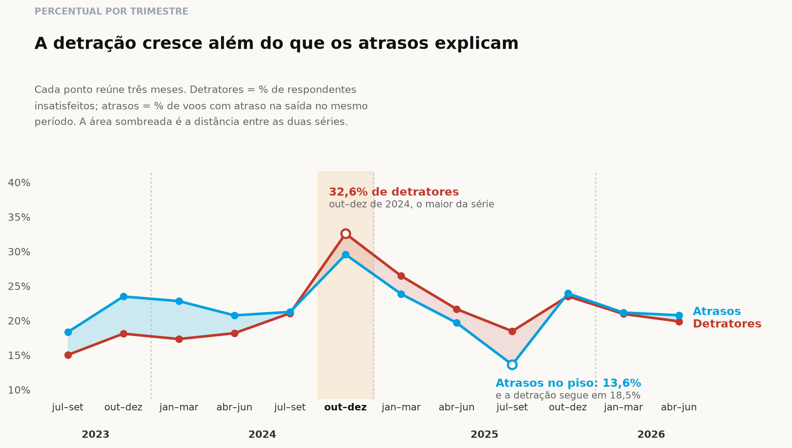

<div align="center"><sup>Fonte: Autoria própria.</sup></div>

*Figura de apoio ao efeito de período descrito acima, fora da sequência numerada "Gráfico N" que segue nesta seção: ela ilustra um achado pontual da exploração de dados, e não uma das evidências centrais listadas adiante. Por isso o arquivo usa o prefixo `g0`, antes de `g1`.*

A análise condicional mostra que o fenômeno **não é explicado pela composição operacional**. A detração subiu dentro de todas as faixas de atraso, inclusive entre voos pontuais, que passaram de 16,6% em 2024Q3 para 25,4% em 2024Q4. O período coincide com o contexto que antecedeu a reestruturação financeira concluída pela companhia em 2026, sugerindo componente reputacional externo à operação do voo.

Os registros do período foram **mantidos e documentados como efeito de período**, com duas implicações. Primeiro, a validação do modelo deverá adotar partição temporal, de modo a não vazar informação de conjuntura entre treino e teste. Segundo, a variável temporal deve ser tratada como covariável de contexto, e não como preditor estável.

**Piso irredutível de detração.** Isolando o cenário operacionalmente ideal, composto por voo direto, sem cancelamento e com partida e chegada pontuais, restam 263.134 registros, equivalentes a 54,3% da base, com NPS médio de **62,3** e taxa de detratores de **12,0%**. Ou seja, mesmo na ausência completa de falha operacional, aproximadamente um em cada oito Clientes avalia a experiência entre 0 e 6.

O achado delimita o teto de desempenho realista do projeto. Nem toda detração é operacionalmente evitável, e a segmentação por tier reforça a leitura: 17,6% de detratores Diamante contra 9,6% de Clientes sem cadastro na mesma condição ideal. Para a modelagem, isso indica que preditores puramente operacionais terão limite de poder discriminativo.

---

##### f) Variáveis derivadas construídas na exploração

| Variável | Origem | Justificativa |
|---|---|---|
| `N_TRECHOS` | Contagem de separadores em `BASE_AIRPORTLEG` | Complexidade do itinerário |
| `AEROPORTO_ORIGEM` e `AEROPORTO_DESTINO` | Decomposição de `BASE_AIRPORTLEG` | Reduz a cardinalidade de 17.167 para 156 categorias |
| `FAIXA_ATRASO` | Discretização de `ESTATISTICA_ATRASOSAIDA` | Compatibiliza com a taxonomia usada pela Azul |
| `MES_ANO` | Extração de `DATA_STD` | Captura o efeito sazonal documentado no item (g) |
| `PESO_POP` | Pós-estratificação | Correção do viés amostral |

A decomposição de `BASE_AIRPORTLEG` produziu `N_TRECHOS`, cuja relação com o alvo é monotônica: a taxa de detratores cresce de 17,81% em itinerários de trecho único para 25,83% em dois trechos, 30,16% em três e 47,53% em quatro ou mais, patamar que reúne os 768 itinerários de quatro a seis trechos. **A complexidade do itinerário é, isoladamente, um fator de risco relevante**, e a variável está disponível no momento da predição, sem risco de vazamento.

Cabe registrar uma **tentativa de derivação descartada**. O campo `ASSENTOS` foi inicialmente interpretado como indicador do tamanho do grupo viajante, hipótese que a verificação cruzada refutou. A tabulação entre a contagem de assentos e a contagem de trechos revela correspondência quase perfeita, com correlação de Spearman de 0,984: o registro `20A/17A/28A`, associado ao itinerário `FOR/UDI/CNF/POA`, corresponde a três assentos do **mesmo passageiro em três trechos consecutivos**, e não a três passageiros. A variável foi mantida apenas como campo de auditoria e **excluída do conjunto de preditores por redundância** com `N_TRECHOS`. Nenhum campo da base permite, portanto, identificar viagens em grupo, limitação que fica registrada como pedido de dado adicional ao parceiro.

---

##### g) Análise das relações entre variáveis

> **Nota sobre a natureza das relações.** Esta é uma análise observacional sobre dados de pesquisa autosselecionada. Nenhuma das relações descritas a seguir foi obtida por desenho experimental ou quase-experimental, e portanto **nenhuma delas estabelece causalidade**. A redação adota deliberadamente a forma "está associada a" em vez de "produz" ou "causa". Onde há recomendação operacional, ela é apresentada como **hipótese de trabalho a validar**, e não como efeito estimado.
>
> Duas limitações estruturais sustentam essa cautela. A primeira é a autosseleção documentada no item (e): quem responde à pesquisa não é uma amostra aleatória de quem voa. A segunda é a ausência, na base, de variáveis que plausivelmente confundem as relações observadas, com destaque para a **causa do cancelamento e a causa do atraso**, ambas registradas como pedido de dado adicional ao parceiro.

**Gráfico 1. Atraso na saída: relação com a detração e com o viés de resposta**

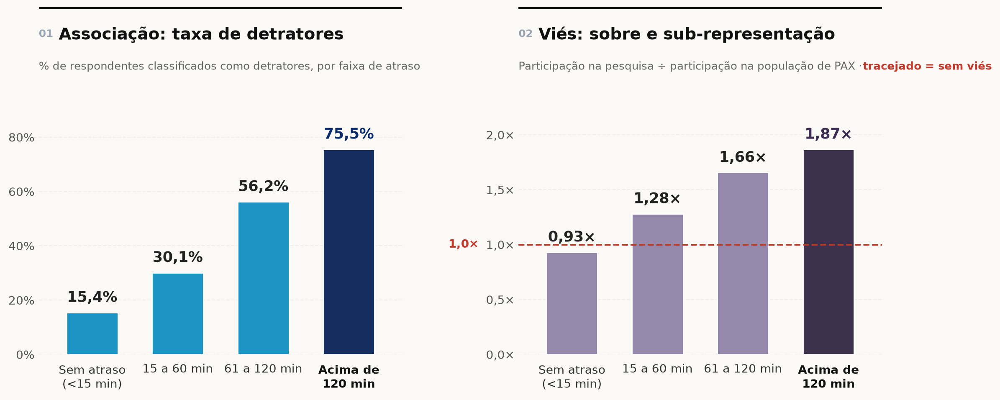

<div align="center"><sup>Fonte: Autoria própria.</sup></div>

*Tipo:* dois painéis de barras lado a lado. *Variáveis:* `FAIXA_ATRASO` (categórica derivada), taxa de detratores (numérica) e razão de representatividade (numérica).

A figura separa deliberadamente dois fenômenos que a literatura de pesquisa costuma tratar em conjunto, um por painel. O painel 01 evidencia um **gradiente monotônico** de magnitude expressiva: a taxa de detratores observada multiplica-se por 4,9 entre voos pontuais e voos com mais de 120 minutos de atraso. O padrão é compatível com uma relação dose-resposta, mas o desenho observacional não permite afirmá-la. O painel 02 revela que essas mesmas faixas são as mais sobre-representadas na pesquisa.

A leitura conjunta é o principal insight desta exploração. O atraso é simultaneamente o maior driver de insatisfação e o maior fator de distorção amostral. Qualquer modelo treinado sobre a amostra bruta herdará essa distorção, e qualquer indicador de detração calculado sem ponderação estará inflado.

**Gráfico 2. Limiar de atraso: curva de risco e impacto marginal**

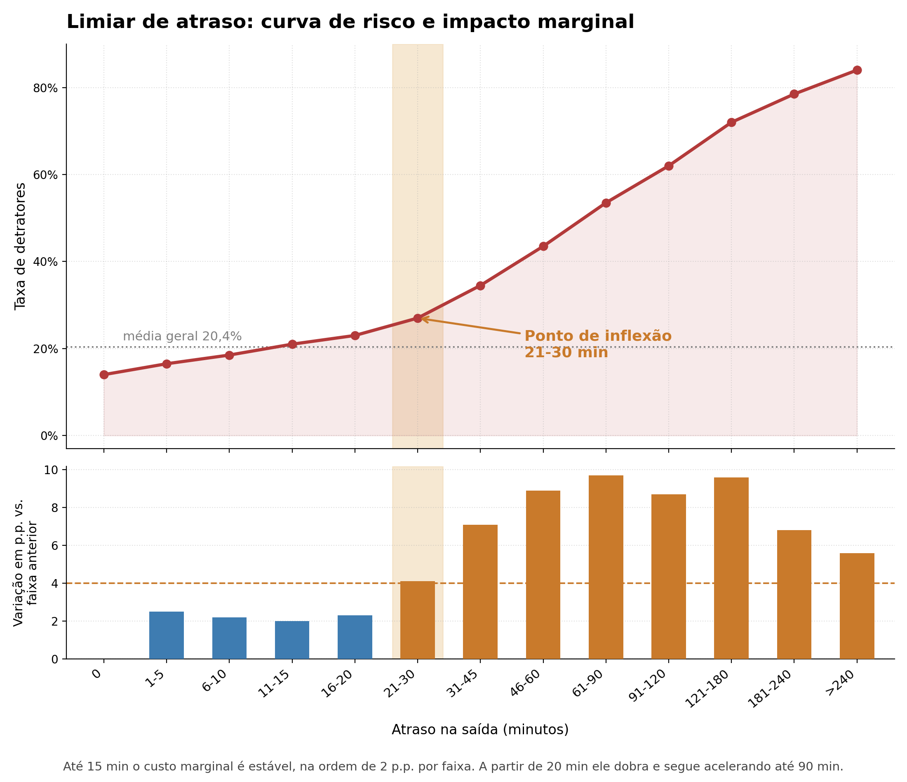

<div align="center"><sup>Fonte: Autoria própria.</sup></div>

*Tipo:* série de linha com painel de variação marginal. *Variáveis:* `ESTATISTICA_ATRASOSAIDA` discretizada em treze faixas (numérica) e taxa de detratores (numérica).

Esta análise responde diretamente à pergunta 5 do escopo definido pela Azul: existe um limiar de atraso a partir do qual o risco de detração aumenta significativamente?

A resposta é afirmativa e localizável. O painel inferior, que apresenta a variação em pontos percentuais entre faixas consecutivas, mostra que **até 15 minutos o custo marginal do atraso é estável, na ordem de 2 p.p. por faixa**. A partir de 20 minutos esse custo dobra, chegando a 4,1 p.p., e segue acelerando: 7,1 p.p. na faixa de 31 a 45 minutos, 8,9 p.p. na de 46 a 60 e 9,8 p.p. na de 61 a 90, quando atinge o máximo. Acima de 180 minutos o incremento desacelera, por efeito de saturação, já que a taxa se aproxima de 80%.

A leitura operacional é que **a janela de 20 a 30 minutos é o ponto de maior retorno para a atuação preventiva**. É onde a curva muda de regime e onde a intervenção ainda alcança um contingente grande de Clientes. Recomenda-se que este intervalo seja considerado na definição do *threshold* de acionamento do modelo.

**Gráfico 3. Cancelamento: efeito da antecedência do aviso**


<div align="center"><sup>Fonte: Autoria própria.</sup></div>

*Tipo:* barras com eixo secundário. *Variáveis:* `ANTECEDENCIA_CANCELAMENTO` discretizada (numérica), taxa de detratores (numérica) e NPS médio (numérica). Recorte: 43.160 voos cancelados.

É a associação de maior magnitude identificada na exploração. Mantido constante o evento negativo, que é o cancelamento do voo, a antecedência do aviso **está associada a** uma variação de 69,20% a 24,58% na taxa de detratores e de -48,8 a +35,4 no NPS médio.

| Antecedência do aviso | n | Taxa de detratores | IC 95% | NPS médio |
|---|---:|---:|:---:|---:|
| Mesmo dia | 12.196 | 69,20% | [68,38; 70,02] | -48,8 |
| 1 dia | 624 | 63,30% | [59,45; 66,99] | -38,8 |
| 2 a 3 dias | 2.686 | 55,10% | [53,21; 56,97] | -23,1 |
| 4 a 7 dias | 4.666 | 47,00% | [45,57; 48,43] | -8,6 |
| 8 a 15 dias | 3.099 | 36,01% | [34,34; 37,72] | 13,2 |
| 16 a 30 dias | 5.051 | 27,97% | [26,75; 29,23] | 29,3 |
| 31 a 60 dias | 9.737 | 25,17% | [24,32; 26,04] | 34,4 |
| Mais de 60 dias | 5.101 | 24,58% | [23,42; 25,78] | 35,4 |

O gradiente é monotônico e os intervalos de faixas adjacentes praticamente não se sobrepõem, exceto entre as três faixas mais longas, onde a curva já estabilizou. A faixa de 1 dia é a de menor suporte amostral, com 624 observações e intervalo de 7,5 pontos de amplitude, e por isso não sustenta leitura isolada.

Note que a estabilização **não** leva a taxa ao patamar geral da base: com mais de 60 dias de aviso, a taxa observada é de 24,58%, com intervalo de 23,42 a 25,78, inteiramente acima da média geral de 20,44%. A leitura correta é que o cancelamento avisado com antecedência **continua associado a detração acima da média**, ainda que muito abaixo do aviso de última hora.

**Análise de sensibilidade.** A ressalva central é que a antecedência não é aleatória: cancelamentos de mesmo dia decorrem tipicamente de causas operacionais agudas, que carregam transtorno adicional além da falta de aviso. Para medir quanto da diferença entre os extremos decorre de composição observável, a diferença de 44,62 pontos percentuais entre "mesmo dia" e "mais de 60 dias" foi recalculada dentro de cada nível de cinco variáveis de controle e ponderada pelo tamanho do estrato:

| Controle | Estratos | n coberto | Diferença |
|---|---:|---:|---:|
| Nenhum, diferença bruta | 1 | 17.297 | 44,62 p.p. |
| `TIER_VIAGEM` | 5 | 17.267 | 44,58 p.p. |
| `TRIMESTRE` | 12 | 17.297 | 44,50 p.p. |
| `AEROPORTO_ORIGEM` | 62 | 16.772 | 44,99 p.p. |
| `VOO_TIPO` | 3 | 17.297 | 44,83 p.p. |
| `CANAL_COMPRA` | 4 | 17.176 | 44,75 p.p. |

A diferença permanece entre 44,50 e 44,99 pontos percentuais sob todos os controles disponíveis. **Nenhuma das variáveis observáveis explica a associação por composição.** Isso a torna robusta ao que se pode medir, mas não a converte em efeito causal: o fator de confusão mais provável, que é a causa do cancelamento, não existe na base e portanto não pôde ser controlado.

**Hipótese operacional derivada.** A comunicação antecipada do cancelamento é candidata a alavanca de mitigação de alto retorno, e o achado é consistente com a observação da equipe da Azul de que a comunicação proativa eleva o NPS. A magnitude aqui observada é substancialmente superior à estimada internamente. Sustentar essa recomendação como efeito exigiria controle pela causa e pelo tipo do cancelamento, e idealmente um desenho quase-experimental que comparasse Clientes avisados com antecedências distintas para cancelamentos de causa equivalente. **Fica registrada como hipótese prioritária de validação com o parceiro.**

**Gráfico 4. Taxa de detratores por tier de fidelidade e faixa de atraso**

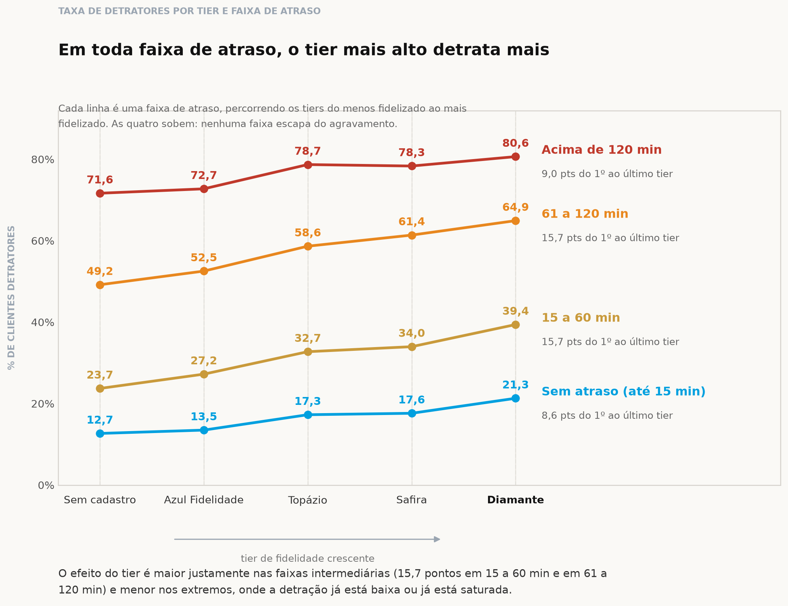

<div align="center"><sup>Fonte: Autoria própria.</sup></div>

*Tipo:* gráfico de linhas múltiplas. *Variáveis:* `TIER_VIAGEM` (categórica), `FAIXA_ATRASO` (categórica) e taxa de detratores (numérica).

O gráfico revela uma **interação entre fidelização e falha operacional** que não seria visível em análises marginais. Em voos pontuais, o Cliente Diamante detrata a 21,3% contra 12,7% do Cliente sem cadastro, uma diferença de 8,6 pontos. Em voos com mais de 120 minutos de atraso, ambos convergem para o patamar de 71% a 81%. O efeito do tier não é uniforme entre as faixas: ele é maior nas duas intermediárias (15,7 pontos em 15–60 min e em 61–120 min) e menor nos extremos, onde a detração já está baixa ou já está saturada.

O padrão é consistente com o princípio de que a expectativa de serviço cresce com o nível de relacionamento, hipótese que a exploração não testa: **o Cliente mais fidelizado aparece como o menos tolerante à falha, e também como o que mais reconhece a operação quando ela funciona**. Para a modelagem, isso indica que `TIER_VIAGEM` e `FAIXA_ATRASO` não devem ser tratadas apenas como efeitos aditivos. Modelos baseados em árvores capturam essa interação naturalmente, enquanto uma regressão logística exigiria termo de interação explícito.

**Gráfico 5. Sazonalidade da detração, controlada por faixa de atraso**

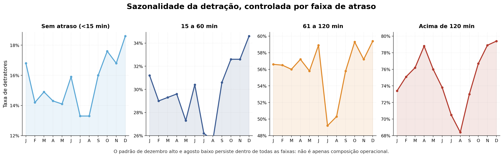

<div align="center"><sup>Fonte: Autoria própria.</sup></div>

*Tipo:* pequenos múltiplos, com séries de linha paralelas. *Variáveis:* mês do ano (temporal), `FAIXA_ATRASO` (categórica) e taxa de detratores (numérica).

A detração agregada varia de 16,9% em agosto a 26,3% em dezembro. A questão metodológica é se a diferença decorre apenas da operação, já que dezembro registra atraso médio de 18,5 minutos contra 10,5 em agosto, ou se há componente sazonal próprio.

Os pequenos múltiplos respondem à questão ao decompor a série por faixa de atraso. **O padrão de dezembro alto e agosto baixo persiste dentro de todas as quatro faixas.** Entre voos sem atraso algum, dezembro apresenta 18,7% de detratores contra 13,3% em agosto, diferença de 5,4 p.p. que não pode ser atribuída à pontualidade.

A hipótese explicativa combina composição de passageiro, com alta concentração de viajantes de lazer e de primeira viagem no período de férias e menor familiaridade com o processo aeroportuário, e congestionamento de infraestrutura, que afeta a experiência sem se traduzir em atraso registrado. A sazonalidade deve, portanto, ser incorporada como covariável e não tratada como ruído.

**Gráfico 6. Correlação entre variáveis operacionais e a detração**


<div align="center"><sup>Fonte: Autoria própria.</sup></div>

*Tipo:* dois painéis — barras horizontais e matriz de correlação de Spearman triangular inferior. *Variáveis:* oito variáveis numéricas, incluindo o alvo binarizado.

O painel (a) mostra que **nenhuma variável operacional isolada apresenta correlação forte com a detração**. A maior é `ATRASO_CHEGADA`, com 0,296, seguida de `ESTATISTICA_ATRASOSAIDA`, com 0,229. Combinado com os valores de V de Cramér apresentados no item (c), o resultado sustenta que a detração é fenômeno multivariado e que a escolha de um classificador não linear se justifica pela ausência de preditor dominante.

O fato de o atraso na chegada superar o atraso na saída como preditor é coerente com a experiência do Cliente, já que o custo percebido do atraso se materializa no destino e não no portão de embarque. A observação, contudo, deve ser lida com a ressalva do item (d): a regra de cálculo de `ATRASO_CHEGADA` ainda aguarda validação do parceiro, e parte da associação pode decorrer da inclusão de tempo de reacomodação em voos cancelados.

O painel (b) isola a redundância entre as explicativas, separada da correlação com o alvo para não misturar as duas perguntas numa matriz só. Destacam-se dois blocos de colinearidade: a correlação de 0,664 entre os campos de atraso, discutida no item (d), e o bloco mais severo entre `QTDE_VIAGENS_12M`, `_24M` e `_36M`, com correlações entre 0,790 e 0,924, o que exigirá seleção de apenas uma das janelas ou construção de razão entre elas. Há ainda associação de 0,788 entre `TEMPO_VOO` e `N_TRECHOS`, esperada por construção, já que itinerários com mais conexões são necessariamente mais longos.

---

##### h) Hipóteses de negócio testadas e não confirmadas

O registro de resultados negativos integra o rigor metodológico do CRISP-DM (CHAPMAN et al., 2000) e evita que hipóteses não verificadas sejam transportadas para a fase de modelagem como pressupostos.

**Rota de Manaus.** A equipe da Azul indicou, em reunião de alinhamento, que a rota de Manaus apresentaria NPS estruturalmente inferior em razão da duração do voo, das limitações do serviço de bordo e da indisponibilidade de sinal para o sistema de entretenimento. A hipótese **não se replicou no nível de aeroporto de origem**. MAO registra 20,5% de detratores em 9.275 respostas, praticamente idêntico à média geral de 20,44%.

Entre os aeroportos com ao menos 3.000 respostas, os de maior detração são UDI, com 26,1%, VIX, com 24,1%, e CGR, com 24,0%. O corte de volume é necessário para evitar que praças de baixo movimento, sujeitas a grande variância amostral, dominem o ranking. Cabe registrar que a divergência pode decorrer do nível de agregação adotado. A percepção da companhia pode referir-se a pares origem-destino específicos ou a indicadores de etapa da jornada, e não ao NPS principal por aeroporto de origem. **Sugere-se aprofundamento no nível de par OD junto ao ponto focal.**

**Canal de compra como preditor.** Embora o canal seja o segundo maior eixo de viés amostral, sua associação com o alvo é a mais fraca entre as variáveis categóricas, com V de Cramér de 0,027. O canal explica **quem responde**, e não **quem detrata**. A distinção é relevante, pois indica que a variável é necessária para a correção de viés, mas dispensável como preditor.

---

##### i) Síntese e implicações para as próximas fases

1. **A base é de alta qualidade estrutural.** Junção 1:1 completa entre as três tabelas transacionais, ausência de duplicidades e cobertura temporal de 36 meses.
2. **A amostra não é representativa da população de passageiros.** O viés está correlacionado com o alvo, e a pós-estratificação com a tabela fornecida pela Azul reconcilia o NPS da amostra com a métrica oficial da companhia.
3. **A operação explica a maior parte da detração, mas não toda.** O piso irredutível de 12,0% em condições operacionais ideais delimita o teto de desempenho realista de um modelo baseado em variáveis de operação.
4. **Duas hipóteses operacionais de alto retorno seguem para validação:** o limiar de 20 a 30 minutos como janela de intervenção preventiva, e a antecedência do aviso de cancelamento como alavanca de mitigação. Ambas são associações observacionais robustas aos controles disponíveis, e nenhuma delas foi estabelecida como efeito causal.
5. **Quatro restrições metodológicas ficam registradas para a fase de modelagem:** partição agrupada por `ID_GOLDENRECORD`; validação com partição temporal em razão do efeito de período de 2024Q4; uso de apenas uma das três janelas de `QTDE_VIAGENS` por colinearidade, que chega a 0,924; e substituição de `SUB_FIL_FREQUENCIAAZUL` por `QTDE_VIAGENS_12M`.
6. **Uma pendência técnica permanece aberta com o parceiro:** a validação da regra de cálculo de `ATRASO_CHEGADA`.
7. **A separação entre variáveis operacionais e variáveis oriundas da pesquisa**, estabelecida na seção 4.1.3, é reafirmada por esta exploração. Os campos `NPS_*` de etapa da jornada apresentam correlações elevadas com o alvo, chegando a 0,642 no caso de `NPS_EMBARQUE`, mas são coletados no mesmo instrumento que origina a variável resposta e, portanto, indisponíveis no momento da predição. Seu uso como preditor configuraria vazamento de dados.

---

##### Ferramentas e bibliotecas utilizadas

A exploração foi conduzida em Python, com `pandas` para manipulação e agregação (MCKINNEY, 2010), `numpy` para cálculo dos pesos de pós-estratificação e `scipy` para os testes de associação pelo V de Cramér.

As visualizações combinam `seaborn` e `matplotlib`, em divisão de responsabilidades deliberada. O `seaborn` fixa o tema visual e a paleta institucional em todas as figuras por meio de `set_theme` e responde pela camada de dados de todas elas: `barplot` no gráfico 1, `barplot` e `lineplot` nos gráficos 2 e 3, `lineplot` no gráfico 4 e na série trimestral do item (b), `relplot` nos pequenos múltiplos do gráfico 5, e `barplot` e `heatmap` nos dois painéis do gráfico 6. O `matplotlib` responde pelo que o `seaborn` não abstrai, e que aqui carrega o desenho editorial: cabeçalho com antetítulo, painéis numerados lado a lado — incluindo a composição de dois painéis no gráfico 1 —, rótulos posicionados ao fim de cada linha no lugar da legenda, eixo secundário no gráfico 3, anotações posicionais, formatação percentual dos eixos, barra de cor horizontal do gráfico 6 e composição de subplots com proporções assimétricas nos gráficos 2 e 6. A escolha reflete a arquitetura das bibliotecas, já que o `seaborn` (WASKOM, 2021) é construído sobre o `matplotlib` (HUNTER, 2007) e o uso conjunto é o padrão recomendado.

As rotinas de limpeza, cálculo estatístico e geração de gráficos estão versionadas no repositório do projeto, em `src/clean.py`, `src/stats.py` e `src/graficos.py`, com registro auditável dos filtros aplicados. A execução completa e reprodutível está em [`notebooks/exploracao_dados.ipynb`](../notebooks/exploracao_dados.ipynb), onde cada figura é renderizada como saída da célula que a constrói.

---

##### Referências

CHAPMAN, P. et al. **CRISP-DM 1.0: step-by-step data mining guide**. Chicago: SPSS Inc., 2000.

CRAMÉR, H. **Mathematical methods of statistics**. Princeton: Princeton University Press, 1946.

GROVES, R. M.; PEYTCHEVA, E. The impact of nonresponse rates on nonresponse bias: a meta-analysis. **Public Opinion Quarterly**, v. 72, n. 2, p. 167-189, 2008.

HUNTER, J. D. Matplotlib: a 2D graphics environment. **Computing in Science & Engineering**, v. 9, n. 3, p. 90-95, 2007.

McKINNEY, W. Data structures for statistical computing in Python. In: **Proceedings of the 9th Python in Science Conference**, p. 56-61, 2010.

REICHHELD, F. F. The one number you need to grow. **Harvard Business Review**, v. 81, n. 12, p. 46-54, 2003.

VALLIANT, R. Post-stratification and conditional variance estimation. **Journal of the American Statistical Association**, v. 88, n. 421, p. 89-96, 1993.

WASKOM, M. L. Seaborn: statistical data visualization. **Journal of Open Source Software**, v. 6, n. 60, 3021, 2021.


#### 4.2.2. Pré-processamento dos dados

O pré-processamento foi estruturado em duas etapas: a criação de uma base analítica, na qual se preserva a informação original e se realizam apenas transformações semanticamente justificadas, e a preparação da matriz de modelagem. Essa separação evita que decisões necessárias ao algoritmo, como imputação e escalonamento, alterem a base usada nas análises exploratórias e nas hipóteses.

Inicialmente, foram integrados os arquivos transacionais de NPS, perfil do cliente e informações da viagem pela chave RESPONDENT_ID, empregando validação de cardinalidade um-para-um. A distribuição de passageiros, por ser agregada e não possuir a chave de respondente, foi excluída da integração. A rotina identificou uma única duplicidade de ID: as duas linhas eram equivalentes em todos os campos, exceto em TEMPO_VOO. Para manter uma única observação por respondente sem selecionar arbitrariamente uma das medições, o valor foi consolidado pela média aritmética e a intervenção foi registrada na variável indicadora TEMPO_VOO_CONSOLIDADO. Assim, a base integrada resultou em 484.915 registros com IDs únicos e 46 colunas; os arquivos brutos não foram modificados.

Nas variáveis categóricas, foram removidos espaços excedentes e padronizadas as grafias para letras maiúsculas. Essa operação reduz categorias artificiais produzidas por diferenças de digitação, sem preencher valores ausentes ou criar novas respostas. A validação e a conversão de DATA_STD ocorrem na leitura de cada arquivo, antes da concatenação: formatos mistos são reconhecidos com `format='mixed'` e qualquer data ausente ou inválida, convertida para `NaT` por `errors='coerce'`, interrompe a integração. A base analítica mantém DATA_STD já convertida e recebe DATA_STD_CONVERTIDA para uso explícito nas análises temporais; a partir dela é criada MES_ANO. Também foram derivadas DETRATOR, igual a 1 quando NPS_PRINCIPAL = -100 e 0 nos demais casos, e CATEGORIA_NPS, que classifica a resposta como detrator, neutro ou promotor. Essas variáveis preservam o valor original de NPS.

Quanto aos valores ausentes, não foi aplicado dropna() global, imputação pela moda ou substituição indiscriminada por zero. A ausência em diversas avaliações NPS_* e subperguntas representa, frequentemente, uma etapa da jornada que não foi vivenciada pelo passageiro; portanto, possui significado operacional. O mesmo critério foi adotado para ANTECEDENCIA_CANCELAMENTO: há 441.755 valores ausentes, correspondentes a voos não cancelados, e substituí-los por zero confundiria a inexistência de cancelamento com um cancelamento sem antecedência. Foram igualmente preservados os nulos de SUB_FIL_MOTIVOVIAGEM (2.970), SUB_FIL_FREQUENCIAAZUL (3.930), ASSENTOS (580), TEMPO_VOO (240) e das variáveis de quantidade de viagens (155 em cada horizonte). Em SUB_ENTRETENIMENTO2, os nulos são predominantemente condicionais à resposta anterior; por isso, não foram imputados. Por fim, não foram identificados valores de TEMPO_VOO menores ou iguais a zero na execução atual; caso ocorram em nova carga, a rotina os marca em TEMPO_VOO_INVALIDO e os converte para ausentes, preservando a indicação da correção.

Os valores extremos foram diagnosticados pela regra do intervalo interquartil (IQR) e pelos percentis 95 e 99, mas não foram removidos, corrigidos ou winsorizados. A Tabela 1 sintetiza os principais resultados. Em ATRASO_CHEGADA, o IQR é igual a zero, de modo que qualquer atraso positivo é classificado pela regra como extremo; esse resultado não permite concluir que o valor seja um erro. Da mesma forma, os maiores tempos de voo concentram-se em conexões (P99 de 1.405 minutos), cenário compatível com jornadas de múltiplos trechos. Portanto, os extremos foram mantidos para não eliminar eventos potencialmente relevantes à explicação da detração; os valores elevados de voos diretos e de escala permanecem sinalizados para verificação junto à área responsável pela captura dos dados de voo.

*Tabela 1 — Diagnóstico de valores extremos na base integrada*

| Variável | P95 | P99 | Máximo | Registros identificados pelo IQR | Decisão |
|---|---:|---:|---:|---:|---|
| TEMPO_VOO | 575 | 1.060 | 4.320 | 32.124 | Preservar; viagens de conexão podem incluir múltiplos trechos e espera. |
| ESTATISTICA_ATRASOSAIDA | 67 | 161 | 777 | 57.977 | Preservar; atrasos elevados podem explicar a insatisfação. |
| ATRASO_CHEGADA | 94 | 615 | 4.319 | 98.904 | Preservar; como o IQR é zero, a regra não distingue atraso legítimo de erro. |
| ANTECEDENCIA_CANCELAMENTO | 85 | 134 | 400 | 1.055 | Preservar; variável aplicável somente a voos cancelados. |
| QTDE_VIAGENS_12M | 13 | 26 | 107 | 35.627 | Preservar; alta frequência pode representar comportamento real. |
| QTDE_VIAGENS_24M | 26 | 50 | 236 | 43.117 | Preservar; alta frequência pode representar comportamento real. |
| QTDE_VIAGENS_36M | 38 | 72 | 329 | 50.314 | Preservar; alta frequência pode representar comportamento real. |

Na etapa posterior de modelagem, a divisão treino-teste é realizada antes de qualquer ajuste estatístico, prevenindo vazamento de dados. As variáveis numéricas recebem imputação pela mediana, acompanhada de um indicador de ausência, e são escalonadas com RobustScaler, escolha adequada à presença de extremos preservados. Nas variáveis categóricas, os valores ausentes são representados pela categoria `CATEGORIA_AUSENTE` somente na matriz do modelo e as categorias são codificadas por one-hot encoding, com tratamento de categorias desconhecidas. Essa categoria é genérica e não presume uma causa específica para a ausência, ressalva detalhada para `TIPO_ENTRETENIMENTO` na Seção 4.3.2.5. A codificação, a imputação e a normalização são aprendidas exclusivamente no conjunto de treinamento e, depois, aplicadas ao conjunto de teste.

**Contrato de schema e features do score pós-viagem.** A integração só é aceita com **46 colunas**, já incluída a flag `TEMPO_VOO_CONSOLIDADO`; quantidade diferente interrompe o pipeline para investigação. Antes de ler uma fonte Parquet, o pipeline valida seus metadados com `pyarrow`, bloqueando arquivo inválido ou corrompido. A validação de `DATA_STD` continua ocorrendo por arquivo, antes da concatenação: data ausente ou inválida interrompe o processo.

A matriz do modelo não é mais definida por inferência de tipo ou cardinalidade, e sim por uma allowlist explícita. Campos ausentes nessa lista são registrados; campos fora dela não entram automaticamente. Portanto ficam excluídos identificadores, datas, alvo e derivados (`NPS_PRINCIPAL`, `DETRATOR`, `CATEGORIA_NPS`), todos os campos `NPS_*` e `SUB_*`, campos técnicos como `TEMPO_VOO_CONSOLIDADO` e `TEMPO_VOO_INVALIDO`, pesos de pós-estratificação e atributos de rota/equipamento brutos, exceto pela derivação `N_TRECHOS`. A composição atual dessa allowlist, o Feature Set V1, e a justificativa de cada atributo mantido estão documentadas na Seção 4.3.2.3, após a definição da variável-alvo.


#### 4.2.3. Contrato temporal do score e prevenção de vazamento

O score é a probabilidade estimada de uma resposta tornar-se Detratora. Ele não é calculado quando a pesquisa é respondida: nesse momento a variável-alvo já existe e qualquer predição perderia utilidade operacional. A janela prevista é **após o encerramento operacional da jornada e antes do registro da resposta à pesquisa**. Para uma jornada concluída, o processo recebe os dados operacionais já consolidados, calcula uma única pontuação por passageiro/jornada e encaminha a lista priorizada para a ação de recuperação. Em uma jornada cancelada, o evento que abre a janela é o registro do cancelamento; não se deve aguardar uma chegada que não ocorrerá.

O marco que governa a inclusão de cada atributo é `t_score`, o instante exato em que a pontuação é produzida. Um atributo é elegível somente se seu valor tiver sido disponibilizado de forma confiável no sistema de origem em `t_disponibilidade <= t_score`. A ocorrência do fato antes do score não é suficiente: por exemplo, um voo pode já ter chegado, mas o atraso definitivo ainda estar sujeito a conciliação ou chegar ao repositório analítico apenas em carga posterior. A versão da feature usada pelo modelo deve refletir o valor que estava disponível em `t_score`, e não uma atualização posterior.

**Linha do tempo de referência**

```text
reserva ── partida ── chegada/encerramento ── t_score ── convite à pesquisa ── resposta NPS
                                      │              │                         │
                         dados operacionais          score                    alvo
                         consolidados                e ação                   DETRATOR
```

O treinamento deve reproduzir essa mesma linha do tempo. Para cada observação histórica, as features precisam ser reconstruídas como eram no respectivo `t_score`; usar uma extração atual, enriquecida por atualizações feitas depois, é vazamento temporal mesmo que o split entre treino e teste seja cronológico.

| Grupo de atributos | Uso no score pós-viagem | Risco temporal e condição de uso |
|---|---|---|
| Data programada, rota, tipo de voo, equipamento previsto, canal de compra, segmento e perfil cadastral | Permitido, desde que provenham de uma fotografia anterior a `t_score`. | Alterações posteriores de reserva, remarcação, categoria de fidelidade ou cadastro não podem substituir o estado conhecido no momento do score. |
| `ESTATISTICA_ATRASOSAIDA` | Permitido somente após a partida e após a estabilização do registro operacional. | É indisponível para score antes do voo; correções de atraso recebidas depois do score não podem entrar no treinamento histórico. |
| `ATRASO_CHEGADA` | Permitido apenas no modo pós-viagem, depois da chegada e da consolidação da informação. | É vazamento em um score pré-voo ou calculado antes do fim da jornada. Também é vazamento se o valor final for carregado no data warehouse depois de `t_score`. |
| `CANCELAMENTO_VOO` | Permitido quando o cancelamento já foi comunicado/registrado antes de `t_score`. | Para uma jornada não cancelada, a flag só pode ser usada se o score ocorrer depois do horário em que o estado foi encerrado. Antes disso, o modelo não pode saber que não haverá cancelamento futuro. |
| `ANTECEDENCIA_CANCELAMENTO` | Permitido somente para jornadas já canceladas e com horário do aviso registrado. | A ausência deve continuar significando “não aplicável”; imputá-la com zero mistura não cancelamento e aviso imediato. O cálculo deve usar o aviso disponível até `t_score`, nunca uma correção posterior. |
| Duração real, número de trechos efetivamente realizados e aeroporto final efetivamente percorrido | Permitidos no modo pós-viagem se consolidados antes de `t_score`. | São vazamento no modo pré-voo, pois refletem a execução da jornada, não apenas o planejado. |
| Quantidade de viagens em janelas de 12, 24 ou 36 meses e histórico de NPS | Permitidos apenas com corte estrito em `t_score`. | Contagens recalculadas incluindo a viagem corrente, uma viagem posterior ou uma resposta NPS futura vazam informação. Histórico de NPS deve conter somente respostas já registradas antes de `t_score`. |
| `NPS_PRINCIPAL`, `DETRATOR`, `CATEGORIA_NPS`, campos `NPS_*` e `SUB_*` | Proibidos como features do score individual. | São a própria resposta ou dados coletados junto dela; usá-los permite inferir o alvo com informação indisponível no momento da decisão. Podem permanecer em análises descritivas separadas. |

Há dois produtos temporalmente diferentes, que não devem compartilhar indiscriminadamente as mesmas features. O produto documentado neste projeto é o **score pós-viagem**, usado antes da resposta. Se futuramente houver necessidade de atuar antes do embarque, deverá existir outro modelo, com contrato de features restrito a informações de reserva, cadastro e previsões operacionais disponíveis naquele momento. Atrasos realizados, cancelamento futuro, duração real e atributos de chegada ficam fora desse segundo modelo.

**Exemplos sintéticos de validação**

1. Uma jornada chega às 15h00 e o score é executado às 16h00. Se o atraso de chegada foi fechado no sistema operacional às 15h20, ele pode compor o score pós-viagem. Se o valor definitivo só é reconciliado às 18h00, o treinamento não pode usar esse valor para simular a execução das 16h00; deve usar a última versão disponível até esse horário ou marcar a feature como ainda indisponível.
2. Um voo é cancelado às 09h00 para partida originalmente prevista às 14h00 e o score é calculado às 09h15. A flag de cancelamento e a antecedência baseada no aviso das 09h00 são elegíveis. A hora de reacomodação definida às 11h00 não é, pois ainda não existia no instante do score.
3. Em um score pré-voo calculado às 08h00 para uma partida às 12h00, a coluna `ATRASO_CHEGADA` da extração histórica deve ser excluída, ainda que esteja preenchida hoje. O atraso ocorreu depois da decisão e faria a avaliação parecer melhor do que a operação real permitiria.
4. Para uma contagem de viagens em 12 meses calculada às 10h00, incluem-se somente viagens concluídas antes das 10h00. A própria jornada pontuada não entra na contagem, nem uma resposta NPS recebida às 12h00.

**Controles de mitigação recomendados**

- Registrar, para cada execução, `t_score`, identificador técnico da execução, versão do modelo e versão/fotografia das fontes. A saída operacional deve carregar esses metadados para auditoria, sem registrar conteúdo confidencial fora do ambiente autorizado.
- Criar um catálogo de features com nome, sistema de origem, evento de disponibilidade, atraso máximo de atualização aceito, modalidade permitida (`pré-voo` ou `pós-viagem`) e responsável pela validação. A inclusão de uma nova coluna deve depender desse catálogo, e não apenas de seu tipo de dado ou cardinalidade.
- Materializar ou consultar snapshots com corte temporal. Em particular, manter a data/hora de atualização de atrasos, cancelamentos, reacomodações e perfil cadastral; sem essa informação não é possível comprovar que a reconstrução histórica respeita `t_score`.
- Manter a allowlist explícita por modalidade no código de modelagem. A inclusão de uma nova coluna exige decisão documentada sobre sua disponibilidade temporal; tipo de dado e cardinalidade não são critérios suficientes.
- Testar o contrato com dados sintéticos: uma feature atualizada depois de `t_score` deve ser rejeitada; uma contagem histórica deve permanecer inalterada quando se acrescenta uma viagem futura; e nenhum campo de pesquisa pode aparecer na matriz de features. Esses testes devem rodar antes de cada alteração do pipeline.
- Manter a avaliação fora do período de treino, como já faz a divisão temporal por cliente, e ajustar imputação, codificação e escala exclusivamente no treino. Essa proteção evita vazamento estatístico entre conjuntos, mas é complementar — não substitui o corte de disponibilidade por feature.

Na implementação atual, `criar_preprocessador_modelagem` separa treino e teste temporalmente, aplica a allowlist pós-viagem e exclui o alvo, a resposta NPS, subperguntas, identificadores e campos técnicos antes de ajustar o pré-processador. A allowlist reduz a inclusão acidental de variáveis, mas não substitui a obrigação operacional de usar snapshots comprovadamente disponíveis antes de `t_score`, especialmente para `ESTATISTICA_ATRASOSAIDA`, `ATRASO_CHEGADA`, `CANCELAMENTO_VOO` e `ANTECEDENCIA_CANCELAMENTO`.

#### 4.2.4. Hipóteses

As seis hipóteses a seguir foram testadas em `notebooks/hipoteses_nps.ipynb`, sobre a base analítica que integra os registros de NPS, o perfil do Cliente e a informação de viagem (`data/processed/base_analitica.parquet`, 484.915 registros). Uma versão anterior deste notebook havia rodado contra uma base diferente, sem as colunas derivadas no pré-processamento, e por isso os números publicados a seguir substituem integralmente os de versões anteriores deste documento.

**Hipótese 1: Uma tripulação mal avaliada pode pesar tanto quanto um atraso grave**

A primeira hipótese levantada é que a avaliação da tripulação, comissários e pilotos, tem um peso na detração de NPS comparável ao de uma falha operacional severa, como um atraso muito longo.

Para testar essa hipótese, foram isolados na base apenas os voos pontuais e sem cancelamento (238.104 de 484.915 registros), retirando da análise qualquer influência de problemas operacionais. Dentro desse grupo, quando o passageiro avalia negativamente os comissários de bordo, 46,6% se tornam detratores (n = 25.355). Quando a avaliação negativa é sobre os pilotos, esse número sobe para 48,4% (n = 16.281). Em contraste, quando a avaliação da tripulação é positiva, a taxa de detratores cai para 7,5% no caso dos comissários (n = 160.765) e 9,4% no caso dos pilotos (n = 165.778).

O ponto de comparação é o pior cenário puramente operacional presente na base: voos com atraso na chegada superior a 120 minutos, que reúnem 20.099 registros e apresentam 75,7% de detratores. Uma tripulação mal avaliada não chega a igualar esse patamar, mas se aproxima dele de forma expressiva: partindo de uma base de 7,5% a 9,4% de detratores num voo perfeitamente pontual, a avaliação negativa da tripulação sozinha eleva essa taxa para a faixa de 46,6% a 48,4%, entre 62% e 64% da taxa observada no pior atraso da malha.

Essa hipótese é relevante porque mostra que fatores humanos e subjetivos, difíceis de medir e de padronizar, podem ter um impacto tão grande quanto fatores operacionais objetivos, que normalmente recebem mais atenção nos indicadores de desempenho da companhia. As notas de comissários e pilotos servem, portanto, como diagnóstico de fatores da experiência e como referência para ações de melhoria, mas não entram no modelo preditivo individual: são coletadas na mesma pesquisa que registra a variável-alvo.

**Hipótese 2: O canal de compra revela um perfil de cliente com sensibilidades diferentes**

A segunda hipótese levantada é que o canal usado para comprar a passagem não é apenas um detalhe da reserva, mas também um indicador do perfil do Cliente, refletindo sensibilidades diferentes diante dos mesmos problemas durante a viagem.

Assim como na primeira hipótese, a análise foi feita isolando voos pontuais e sem cancelamento, para garantir que a diferença encontrada não fosse simplesmente reflexo de uma operação pior em um canal específico. Dentro desse grupo, os clientes que compraram pelo site (`WEB`) apresentam a menor taxa de detração, 11,6%, seguidos por agência de viagens (`AGENCY`, 12,7%), aplicativo (`MOBILE`, 13,0%) e central de atendimento (`CALLCENTER`, 14,1%). O balcão do aeroporto (`AEROPORTO`, 18,7%) e os demais canais agrupados (`OTHER`, 22,7%) apresentam as taxas mais altas. Isso mostra que, mesmo com o voo saindo e chegando no horário previsto, o canal de compra já separa grupos de Clientes com níveis de satisfação diferentes.

Além dessa diferença de base, o canal de compra também muda a forma como o Cliente reage a problemas específicos durante a viagem. A sensibilidade ao wifi é a que mais varia por canal: uma avaliação negativa eleva a detração em 14,6 pontos percentuais entre os clientes de aplicativo e em apenas 3,3 pontos entre os do balcão do aeroporto, o canal menos digital da base. Já a sensibilidade à tripulação e ao embarque segue o padrão oposto e é mais consistente: o balcão do aeroporto é o canal mais afetado por uma avaliação negativa de comissários (+53,8 pontos) e de embarque (+60,8 pontos), acima de todos os canais digitais. A central de atendimento fica numa posição intermediária nos quatro recursos, sem se destacar como a mais nem a menos sensível em nenhum deles.

Esse padrão sugere que o Cliente que compra por canais menos digitais, como o balcão do aeroporto, valoriza mais o atendimento humano e a parte prática da viagem do que os recursos de conectividade a bordo, enquanto o Cliente de canais digitais é mais sensível a falhas de wifi. A sensibilidade à qualidade do entretenimento, porém, não segue essa mesma separação de forma clara e varia menos entre os canais do que wifi, tripulação e embarque. Para o modelo preditivo, isso indica que o canal de compra pode funcionar como uma variável de segmentação útil, mais fortemente associada a wifi, tripulação e embarque do que a entretenimento.

**Hipótese 3: Cancelamentos repentinos geram mais detratores**

A terceira hipótese levantada é que, entre os voos cancelados, quanto menor o tempo de antecedência com que o Cliente é avisado, maior a incidência de detratores, ou seja, que um cancelamento repentino é pior do que um cancelamento comunicado com antecedência.

Essa hipótese foi testada isolando os 43.160 voos cancelados da base e segmentando-os pela antecedência do aviso, registrada em dias pelo campo `ANTECEDENCIA_CANCELAMENTO` (seção 4.1.3). Quando o aviso ocorre no mesmo dia da partida prevista, 69,2% dos passageiros se tornam detratores (n = 12.196). A taxa cai para 52,3% quando há de um a seis dias de antecedência (n = 6.816), para 34,3% entre sete e vinte e quatro dias (n = 7.122), para 25,9% entre vinte e cinco e quarenta e oito dias (n = 8.515) e para 24,6% acima de quarenta e oito dias (n = 8.511). A associação entre a faixa de antecedência e a detração é estatisticamente significativa (qui-quadrado = 6.063,0; gl = 4; p < 0,001).

O ponto que sustenta a hipótese é que a queda é monotônica e gradual, e não um salto associado apenas à existência ou não do cancelamento: quanto antes o Cliente é avisado, mais tempo ele tem para reorganizar a viagem, e mais a taxa de detração se aproxima da taxa observada nos voos que nunca foram cancelados, 18,2%. A antecedência, e não o cancelamento em si, é o que melhor explica a reação do passageiro.

Essa hipótese é relevante porque mostra que nem todo cancelamento deve ser tratado como um evento igualmente ruim. O problema central é a falta de tempo de reação do passageiro, e não o cancelamento em si, o que abre espaço para investimentos em antecipação e comunicação do aviso, sem depender da eliminação completa dos cancelamentos, o que na prática é inviável. Para o modelo preditivo, isso indica que `ANTECEDENCIA_CANCELAMENTO` deve entrar como variável contínua ou discretizada, e não apenas como a indicação booleana de que houve cancelamento.

**Hipótese 4: O detrator crônico**

A quarta hipótese levantada é que existe um traço individual de propensão à detração: o Cliente que detratou uma vez tende a detratar de novo, mesmo quando o voo seguinte não apresenta nenhuma falha operacional.

A evidência vem de três testes que se reforçam, resumidos no quadro a seguir e detalhados na sequência. Os valores foram produzidos pela seção da Hipótese 4 no notebook `notebooks/hipoteses_nps.ipynb`, que consome a base analítica oficial (`data/processed/base_analitica.parquet`, 484.915 registros). O notebook é versionado sem as saídas de execução, de modo que reproduzir os valores exige executá-lo sobre a base local, que não é versionada por compromisso entre o Inteli e o parceiro.

| Teste | Resultado | O que sustenta |
|---|---|---|
| Concentração | Entre os 37.101 clientes com exatamente duas respostas, a combinação "detratou nas duas" aparece 3.288 vezes, contra 1.572 esperadas sob independência (qui-quadrado = 2.972,4; gl = 1; p < 0,001) | A repetição não é produto do acaso |
| Predição | 42,9% de quem já havia detratado volta a detratar, contra 14,3% de quem não havia | O histórico separa dois grupos com risco distinto |
| Resistência ao controle | A razão entre os dois grupos sobe de 3,0 para 4,2 vezes conforme as causas operacionais são removidas da análise | O que explica a repetição é a pessoa, não o voo |

&emsp;O primeiro teste mede concentração. Se detratar fosse um evento independente a cada viagem, a combinação "detratou nas duas" deveria aparecer cerca de 1.572 vezes entre os 37.101 clientes com exatamente duas respostas; ela aparece 3.288 vezes, mais que o dobro do esperado. O qui-quadrado de 2.972,4 com um grau de liberdade corresponde a um valor de p inferior a 0,001, ou seja, uma diferença que praticamente não poderia ocorrer por acaso.

&emsp;O segundo teste mede predição. Tomando as 77.673 respostas de clientes que já haviam respondido antes (16,0% da base), quem detratou na resposta anterior volta a detratar em 42,9% dos casos (n = 15.771), contra 14,3% entre os que não haviam detratado (n = 61.902). O histórico, sozinho, separa a base em dois grupos com risco três vezes diferente.

&emsp;O terceiro teste é o decisivo, porque submete essa diferença a controles progressivos. Considerando todas as respostas com histórico (n = 77.673), a razão entre os dois grupos é de 3,0 vezes (14,3% contra 42,9%). Restringindo a análise a voos com o voo atual sem atraso na saída, sem atraso na chegada e sem cancelamento (n = 39.029), ela sobe para 3,9 vezes (8,0% contra 31,4%). Restringindo ainda mais, exigindo também que o voo anterior tenha chegado sem atraso (n = 31.469), chega a 4,2 vezes (8,2% contra 34,3%).

&emsp;Esse padrão é o oposto do que se esperaria caso o efeito fosse apenas consequência de piores condições de voo: à medida que as causas operacionais são removidas, a razão aumenta em vez de encolher. O que explica a repetição é a pessoa, e não o voo. O mesmo resultado aparece no modelo ajustado. Uma regressão logística estimada sobre as 77.673 respostas de clientes com histórico indica que a chance de detratar entre quem já havia detratado é 4,61 vezes a chance entre quem não havia, com intervalo de confiança de 95% entre 4,43 e 4,79 e valor de p inferior a 0,001. O modelo inclui como controles o atraso na chegada e o cancelamento do voo, de modo que esse efeito já está descontado das duas principais falhas operacionais registradas na base.

Para o modelo preditivo, isso significa duas coisas ao mesmo tempo. É um preditor forte e legítimo, já que a resposta anterior existe antes do voo novo e portanto não gera vazamento de informação. E é também um alerta de viés, porque parte do que hoje se atribui ao atraso pode ser o mesmo Cliente insatisfeito aparecendo repetidas vezes. A ressalva é que o histórico existe para apenas 16,0% da base, o que torna a variável um preditor complementar e nunca principal. Além disso, os dados não permitem separar insatisfação crônica de estilo de resposta, ou seja, a tendência de certas pessoas a usarem sempre o extremo baixo da escala. Por isso, o padrão aqui documentado é tratado como indício consistente de um traço de detrator crônico, e não como confirmação definitiva de sua existência.

**Hipótese 5: O Cliente mais fidelizado é o menos tolerante à falha operacional**

A quinta hipótese levantada é que o efeito do atraso sobre a taxa de detração não é o mesmo para todos os tiers de fidelidade, e que os Clientes mais fidelizados, por terem uma expectativa de serviço mais alta, reagem de forma mais dura ao atraso do que os Clientes sem cadastro no programa.

A base foi segmentada por `TIER_VIAGEM` e por uma faixa de atraso na partida (sem atraso, 15 a 60 minutos, 61 a 120 minutos e mais de 120 minutos, a mesma discretização da seção 4.2.1). A taxa de detratores cresce com o atraso em todos os tiers, mas parte de patamares diferentes: sem atraso, vai de 12,7% entre os Clientes sem cadastro a 21,3% entre os Diamante; com mais de 120 minutos de atraso, os tiers convergem para a faixa de 71,6% a 80,6%. O padrão bruto é consistente com a hipótese: os tiers mais altos partem de uma base de insatisfação maior mesmo sem falha operacional.

O primeiro teste formal aplicado foi um teste de razão de verossimilhanças entre um modelo logístico aditivo (tier mais faixa de atraso) e um modelo com termo de interação explícito entre os sete tiers e as quatro faixas (tier vezes faixa de atraso). Esse teste resultou em estatística de 28,76 com 18 graus de liberdade e p = 0,0514, no limiar do alfa de 0,05 adotado, mas sem ultrapassá-lo. Uma verificação de robustez excluindo o tier `AZUL ONE`, que reúne apenas 189 respostas e tem uma célula com somente 2 registros, resultou em p = 0,0991, confirmando a mesma decisão sem depender do tier de menor volume.

Esse resultado, porém, testa uma pergunta mais ampla do que a hipótese propõe: com 18 graus de liberdade, o teste também absorve contrastes que a hipótese não afirma, como saber se `TOPÁZIO` reage de forma diferente de `SAFIRA`, o que dilui sua potência. A hipótese é especificamente sobre os extremos de fidelização, o Cliente mais fidelizado contra o Cliente sem cadastro, uma comparação de dois grupos, não de sete. Reformulando o teste para essa comparação específica, a interação passa a ser estatisticamente significativa nas três variações aplicadas: com atraso contínuo em vez de discretizado e todos os tiers (18 para 6 graus de liberdade, estatística = 19,06, p = 0,0041), com a comparação direta entre `SEM CADASTRO` e `DIAMANTE` usando a faixa de atraso discretizada (estatística = 12,94, gl = 3, p = 0,0048) e com a mesma comparação usando atraso contínuo (estatística = 15,15, gl = 1, p < 0,0001). A direção do efeito é consistente com a hipótese: em relação ao tier de referência `AZUL FIDELIDADE`, os tiers `DIAMANTE`, `SAFIRA` e `AZUL ONE` têm inclinação positiva (a detração cresce mais rápido por minuto de atraso), enquanto `SEM CADASTRO` tem inclinação negativa (a detração cresce mais devagar).

Essa hipótese é relevante porque ilustra um cuidado metodológico tão importante quanto o resultado em si: um teste omnibus com muitos graus de liberdade pode não rejeitar H0 mesmo quando o efeito específico que a hipótese descreve é real e estatisticamente robusto, se o teste responder a uma pergunta mais ampla do que a hipótese propõe. A hipótese é considerada confirmada, com a ressalva de que a evidência é mais forte na comparação entre os tiers nomeados nela do que no conjunto completo de sete tiers. Para o modelo preditivo, isso indica que `TIER_VIAGEM` deve entrar em interação com a faixa de atraso, e não apenas como efeito aditivo, e que a segmentação de risco por tier de fidelidade é uma variável útil para priorizar a atuação preventiva nos tiers mais altos quando o atraso ultrapassa as faixas de maior risco.

**Hipótese 6: A fragmentação da jornada eleva a detração por exposição, não por desgaste**

A sexta hipótese levantada é que jornadas com mais trechos detratam mais não porque o trecho adicional cansa o passageiro, mas porque cada trecho é mais uma chance de algo dar errado na operação. Controladas as falhas operacionais e a duração da viagem, o número de trechos deixaria de ter efeito próprio sobre a taxa de detração.

O número de trechos foi derivado da contagem de aeroportos na sequência da jornada (`BASE_AIRPORTLEG`). O gradiente bruto entre número de trechos e taxa de detração é forte e cresce de forma monotônica: 17,8% nos voos diretos (n = 340.584), 25,8% nos voos com dois trechos (n = 119.439) e 30,7% nos voos com três trechos ou mais (n = 24.892), associação estatisticamente significativa (qui-quadrado = 5.189,4; gl = 2; p < 0,001). Há, porém, um problema de identificação: número de trechos e duração da viagem são quase inseparáveis, já que a mediana de duração é de 95 minutos para voos diretos, 340 minutos para dois trechos e 575 minutos para três trechos ou mais. Comparar jornadas de um e dois trechos é, na prática, comparar viagem curta com viagem longa, de modo que o teste precisa ser restrito à faixa de duração em que os dois grupos coexistem, viagens de três a seis horas.

| Recorte (3h a 6h, duração controlada) | 1 trecho | 2 trechos | Resultado |
|---|---|---|---|
| Todos os voos (n = 111.696) | 18,5% | 22,7% | Diferença significativa (qui-quadrado = 293,1; gl = 1; p < 0,001) |
| Apenas voos perfeitos (n = 47.400) | 14,6% | 14,8% | Diferença não significativa (qui-quadrado = 0,66; gl = 1; p = 0,416) |

Quando nada dá errado na operação e a duração é equivalente, a conexão não acrescenta diferença estatisticamente detectável na taxa de detração, 14,6% contra 14,8%. O padrão é compatível com a hipótese de que parte relevante da associação bruta reflete maior exposição a falhas operacionais, mas não demonstra mediação causal nem exclui outros mecanismos não observados.

Essa hipótese separa duas explicações que precisam ser investigadas de modo distinto. O resultado ajustado e a análise de sensibilidade informam se o padrão é consistente com confiabilidade operacional; não autorizam concluir que reduzir conexões não teria efeito sobre a experiência.

A ressalva é que a colinearidade entre número de trechos e duração obriga o recorte à faixa de três a seis horas, o que reduz o alcance da conclusão fora dessa janela. Além disso, a base não registra o tempo de conexão entre trechos, que é o mecanismo mais provável de qualquer efeito próprio que a conexão de fato tenha. Para o modelo preditivo, isso indica que o número de trechos por si só é um preditor fraco: o sinal relevante está nas variáveis de atraso e cancelamento, e usar a fragmentação da jornada como preditor direto correria o risco de capturar, de forma indireta e menos precisa, um efeito que essas variáveis operacionais já explicam melhor.

### 4.3. Preparação dos Dados e Modelagem

##### a) Organização dos dados

&emsp;A divisão em treino, validação e teste é temporal, e não aleatória, por duas razões já registradas na exploração dos dados. A primeira é o efeito de período de 2024Q4: a taxa de detratores saltou para 32,58% nesse trimestre, contra 20,44% na base completa, e o aumento ocorreu dentro de todas as faixas de atraso — inclusive entre voos pontuais, que passaram de 16,6% para 25,4% —, o que descarta explicação puramente operacional e aponta para um componente de conjuntura, coincidente com a reestruturação financeira da companhia. Uma divisão aleatória espalharia esse choque pelos três conjuntos e o modelo aprenderia a prever o passado conhecendo o futuro. A segunda razão é o contrato temporal do score (seção 4.2.3): o modelo pontua uma jornada entre o encerramento operacional e a resposta à pesquisa, então a métrica de teste só é honesta se o teste também representar esse mesmo tipo de janela, no futuro do treino.

&emsp;A divisão é também agrupada por `ID_GOLDENRECORD`, para que o mesmo Cliente nunca apareça em mais de um conjunto. Essa restrição vem diretamente da Hipótese 4 (seção 4.2.4): quem já detratou tem chance 4,61 vezes maior de detratar de novo, mesmo controlando atraso e cancelamento do voo atual. Sem o agrupamento, o modelo teria a chance de reconhecer a pessoa em vez de aprender o padrão, e a métrica de teste mediria memorização, não generalização. Quando o mesmo Cliente aparece em mais de um período, suas linhas mais antigas são descartadas e ele permanece apenas no conjunto mais recente em que ocorre — o que concentra a perda no treino, o conjunto mais abundante, e mantém validação e teste intactos.

&emsp;As datas de corte, `2025-07-01` para o início da validação e `2026-01-01` para o início do teste, são parâmetro de `preparar_matriz` (`src/matriz.py`), e não constante repetida no texto, para não criar uma segunda fonte de verdade em relação ao registro de decisão do particionamento (#127). A tabela e a figura a seguir mostram a composição resultante, geradas por `notebooks/modelagem.ipynb` a partir da base analítica real e reproduzidas de `documents/extras/composicao-dos-conjuntos.md`:

| Conjunto | n | Período | Taxa de detração | % do total |
|---|---|---|---|---|
| Treino | 341.962 | 2023-07-01 a 2025-06-30 | 20,43% | 70,5% |
| Validação | 48.301 | 2025-07-01 a 2025-12-31 | 21,60% | 10,0% |
| Teste | 53.486 | 2026-01-01 a 2026-06-30 | 20,41% | 11,0% |

<div align="center">
  <sub>Figura 10 – Linha do tempo do particionamento temporal</sub><br>
  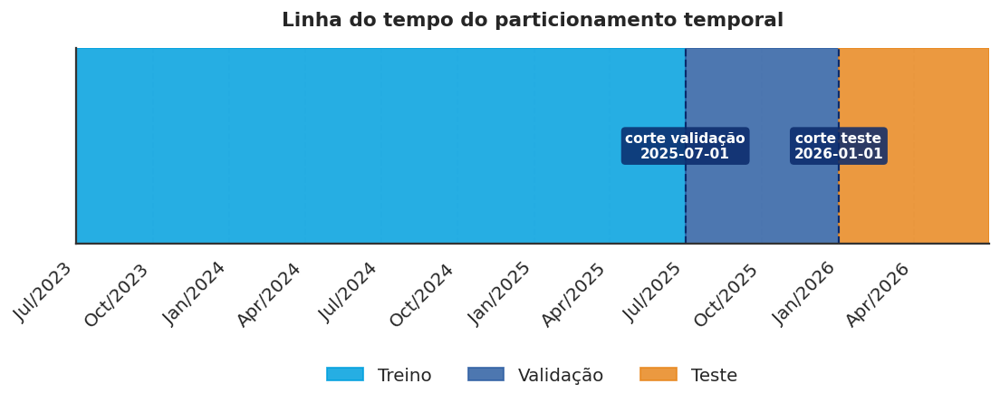<br>
  <sup>Fonte: Autoria própria.</sup>
</div>

&emsp;Os três conjuntos somam 443.749 das 484.915 linhas da base (91,5%). Os 41.166 restantes (8,5%) ficam de fora por dois motivos, não por linha sem data — a base atual não tem nenhuma: 41.063 linhas de Cliente recorrente, removidas pela regra de desempate que mantém cada `ID_GOLDENRECORD` apenas no conjunto mais recente em que ocorre, e 103 linhas sem `ID_GOLDENRECORD`, excluídas porque a divisão por grupo não pode confirmar se pertencem à mesma pessoa. A política para linhas sem data continua ativa como salvaguarda — `verificar_anterioridade_sem_data` (`src/split.py`) provaria, pelo identificador sequencial de resposta, que um bloco futuro sem data precede o período datado antes de aceitá-lo no treino —, mas não se aplica à base atual.

&emsp;A auditoria de representatividade dos três conjuntos, disponível na seção 1.6 de `notebooks/modelagem.ipynb`, confirma que a divisão é aceitável: a taxa de detração não desvia mais de 1,16 ponto percentual entre treino, validação, teste e a base completa. A composição das variáveis-chave tem onze ocorrências acima do limiar de 2 pontos percentuais adotado na auditoria, que colapsam em oito desvios distintos: `VOO_TIPO=DIRETO` espelha `VOO_TIPO=CONEXÃO` em cada partição (mesma magnitude, sinal oposto), então as duas contam como um único desvio de composição. Os cinco que não envolvem `VOO_TIPO` são moderados, todos abaixo de 2,7 pontos percentuais e sem padrão monotônico ao longo do tempo: `TIER_VIAGEM=AZUL FIDELIDADE` (+2,70 p.p.) e `TIER_VIAGEM=DIAMANTE` (-2,67 p.p.) no treino; `FAIXA_ATRASO=Sem Atraso` (+2,27 p.p.) e `FAIXA_ATRASO=15m a 60m` (-2,65 p.p.) na validação; `TIER_VIAGEM=TOPAZIO` (-2,37 p.p.) no teste.

&emsp;Duas exceções ficam registradas, e não escondidas. A primeira é `VOO_TIPO`, e não só no teste: a proporção de voos com conexão cai de forma monotônica ao longo das três partições — +2,59 p.p. no treino (32,08% contra 29,49% na base completa), -4,28 p.p. na validação (25,21%) e -8,14 p.p. no teste (21,35%) —, uma deriva real de composição entre períodos, não ruído de amostragem. A segunda é a falta de suporte no treino para duas categorias de `TIER_VIAGEM`: `AZUL ONE` (189 linhas, 0,35% do teste) e `DIAMANTE UNIQUE` (1.164 linhas, 2,18% do teste) não aparecem nem no treino nem na validação, só no teste. Em pontos percentuais o desvio fica abaixo do limiar, mas o problema não é de proporção — é ausência de suporte: o `OneHotEncoder` (`handle_unknown="ignore"`, `src/matriz.py`) não interrompe a execução, mas transforma essas 1.353 linhas (2,5% do teste) em vetor zero para a dimensão de tier, e o modelo fica sem essa informação justamente nas linhas mais recentes da base.

&emsp;Como a variável mais próxima do alvo, a taxa de detração, permanece estável, a divisão segue válida; a deriva em `VOO_TIPO` e a ausência de suporte para `AZUL ONE` e `DIAMANTE UNIQUE` são limitações a acompanhar na avaliação do modelo, não defeitos que a invalidem.

##### b) Modelagem do problema e proposta de features

&emsp;O problema é de classificação binária: prever se uma resposta será Detratora (classe positiva, 20,44% da base) ou não-Detratora, conforme a binarização definida na Seção 4.1.3. A matriz de features é montada em `src/matriz.py`, que encadeia três etapas nesta ordem: particionar por data e por Cliente, selecionar a allowlist de features disponíveis no momento da predição e, só então, ajustar o pré-processador — imputação pela mediana com indicador de ausência, escalonamento robusto e codificação one-hot — exclusivamente sobre o treino. Inverter a ordem das duas últimas seria inofensivo; ajustar o pré-processador antes de particionar não, porque a mediana do treino passaria a carregar informação de 2026 e a métrica de teste mediria um modelo que já viu o período que deveria prever.

&emsp;A classificação das variáveis (item (c) da seção 4.2.1) já registra que nenhuma variável categórica isolada tem associação forte com a detração — o maior V de Cramér individual é 0,293, da faixa de atraso — e conclui que o fenômeno é multivariado, o que justifica um conjunto de features mais amplo do que apenas as duas ou três variáveis de maior associação isolada, combinado a um algoritmo capaz de capturar interações entre elas (Seção 4.4). É esse raciocínio que sustenta a inclusão de variáveis com associação individual fraca, como `CANAL_COMPRA` e `SEGMENTO`, na proposta de features abaixo.

&emsp;As onze features do score pós-viagem, declaradas em `FEATURES_SCORE_POS_VIAGEM` (`scripts/preprocessamento_nps.py`) e reaproveitadas por `matriz.py`, são:

- **`TIER_VIAGEM`.** A Hipótese 5 (seção 4.2.4) confirmou que o efeito do atraso sobre a detração varia por tier de fidelidade: os tiers mais altos partem de uma base de insatisfação maior mesmo sem atraso e reagem de forma mais íngreme a ele, uma interação estatisticamente significativa na comparação entre os extremos de fidelização. A variável tem sete níveis, nenhum nulo, e é conhecida antes do voo.
- **`VOO_TIPO`.** Direto ou com conexão, com V de Cramér de 0,100. A Hipótese 6 mostrou que boa parte do efeito bruto da fragmentação da jornada reflete maior exposição a falhas operacionais, e não desgaste do passageiro pela conexão em si — mas o modelo não busca isolar causalidade, busca risco, e a associação observada continua sendo sinal útil de exposição.
- **`TIPO_ENTRETENIMENTO`.** Configuração de entretenimento de bordo, com V de Cramér de 0,105, a quarta mais forte entre as dez variáveis categóricas da tabela de associação (item (c) da seção 4.2.1). É definida pela escala designada ao voo, portanto conhecida antes da viagem.
- **`CANAL_COMPRA`.** É a variável de associação individual mais fraca do conjunto, com V de Cramér de 0,027, e o item (h) da seção 4.2.1 havia recomendado tratá-la como dispensável como preditor, reservada à correção de viés amostral. A decisão muda aqui: a Hipótese 2 mostrou que o canal modula a sensibilidade do Cliente a outros problemas — a reação a uma falha de wifi varia de 3,3 a 14,6 pontos percentuais conforme o canal, e a reação à tripulação e ao embarque segue um padrão oposto e mais consistente —, um papel de moderador que um efeito principal fraco não captura, mas que um algoritmo capaz de interação pode explorar. A inclusão é registrada aqui como mudança de decisão em relação à síntese anterior, não como omissão dela.
- **`SEGMENTO`.** Corporativo, lazer ou Azul Viagens, com V de Cramér de 0,037. Perfil comercial da reserva, disponível antes da viagem.
- **`ESTATISTICA_ATRASOSAIDA`.** Atraso na saída em minutos, na forma contínua. Sua versão discretizada, `FAIXA_ATRASO`, é a variável de maior associação individual da base (V de Cramér de 0,293) e sustenta a Hipótese 5; a forma contínua entra no modelo para não perder granularidade que a discretização descarta. Elegível no modo pós-viagem, após a estabilização do registro operacional (seção 4.2.3).
- **`ATRASO_CHEGADA`.** Atraso na chegada em minutos. Foi o ponto de comparação da Hipótese 1: voos com mais de 120 minutos de atraso na chegada chegam a 75,7% de detratores, o pior patamar puramente operacional da base, quase alcançado por uma tripulação mal avaliada mesmo sem atraso algum. Tem correlação de 0,664 com `ESTATISTICA_ATRASOSAIDA` (item (g) da seção 4.2.1), mantida como feature própria por descrever um momento distinto da jornada, o que o atraso na saída sozinho não captura.
- **`CANCELAMENTO_VOO`.** Indicador booleano de cancelamento, com V de Cramér de 0,178. Elegível apenas quando o cancelamento já foi registrado antes de `t_score` (seção 4.2.3).
- **`ANTECEDENCIA_CANCELAMENTO`.** A Hipótese 3 mostrou queda monotônica e gradual na taxa de detração conforme cresce a antecedência do aviso de cancelamento, de 69,2% no mesmo dia a 24,6% acima de 48 dias — a antecedência, e não o cancelamento em si, é o que melhor explica a reação do passageiro, e por isso entra como variável contínua, e não apenas como a indicação de que houve cancelamento.
- **`TEMPO_VOO`.** Duração da jornada. Correlaciona-se com o número de trechos (0,788, item (g) da seção 4.2.1) pela mesma razão identificada na Hipótese 6, mas é mantida como medida direta de exposição à operação.
- **`QTDE_VIAGENS_12M`.** Escolhida entre as três janelas de frequência de viagem (12, 24 e 36 meses) por colinearidade entre elas, de até 0,924 (item (i) da seção 4.2.1), e substitui `SUB_FIL_FREQUENCIAAZUL` como proxy de frequência do Cliente.

&emsp;A elas somam-se três features de histórico de Cliente, calculadas por `features.adicionar_historico` (`src/features.py`) com corte estrito em `t_score`, entregues pelo #141: `HIST_RESPOSTAS_ANTERIORES`, `HIST_DETRATOU_ANTES` e `HIST_TAXA_DETRACAO_ANTERIOR`. São a aplicação direta da Hipótese 4: o histórico de detração do próprio Cliente é, sozinho, o preditor mais forte encontrado na exploração, com razão de chances de 4,61 entre quem já detratou e quem não detratou, controlado o atraso e o cancelamento do voo atual. A ressalva registrada na própria hipótese vale aqui: o histórico existe para apenas 16,0% da base, o que torna essas três features complementares, e nunca o único preditor do modelo.

&emsp;Ficam fora do conjunto de features as colunas `NPS_*` e `SUB_*`, incluindo a própria resposta original de NPS: são coletadas no mesmo instrumento e no mesmo momento que originam o alvo, e seu uso configuraria vazamento de dados (seção 4.2.3 e item (i) da seção 4.2.1) — inclusive as notas de comissários e pilotos, cuja associação com a detração a Hipótese 1 mediu como comparável à de um atraso severo, mas que por essa mesma razão não podem virar preditor individual. Também ficam fora os identificadores `ID_GOLDENRECORD` e `RESPONDENT_ID`, sem poder preditivo e com risco de memorização; as colunas de data textual, que vazariam ao modelo de que lado do corte temporal a linha está; `VOO_NUMERO`, por identificar operações específicas em vez de um padrão generalizável; e os campos de cardinalidade muito elevada sem decomposição própria, como `BASE_AIRPORTLEG` e `ASSENTOS` (item (c) da seção 4.2.1).

#### Métricas relacionadas ao modelo

&emsp;As métricas escolhidas para medir a performance do modelo são frutos da Matriz de Confusão. Ela é composta por quatro categorias: Verdadeiro Positivo, Verdadeiro Negativo, Falso Positivo e Falso Negativo, sendo todas utilizadas no cálculo de diversas métricas. Para o nosso modelo, foram escolhidas as métricas Sensibilidade, Precisão Média e ROC-AUC.

- **Métrica 1: Sensibilidade (Recall)**

&emsp;A primeira métrica escolhida para ser utilizada no modelo é a Sensibilidade, também chamada de *Recall*. A sensibilidade consiste em medir a proporção de valores positivos verdadeiros que o modelo conseguiu identificar corretamente dentre todos os casos que são positivos de fato.

&emsp;A Sensibilidade pode ser calculada utilizando a fórmula:

$$
\frac{TP}{TP+FN}
$$

Onde:
* **TP**: Positivo Verdadeiro (*True Positive*)
* **FN**: Falso Negativo (*False Negative*)

&emsp;A razão por trás da escolha desta métrica é que ela mede diretamente a capacidade do modelo de captar os usuários que realmente se tornariam detratores, que é o objetivo central do projeto. Um falso negativo, nesse contexto, é o erro mais custoso para o parceiro: significa que um usuário que de fato se tornaria detrator não foi identificado, perdendo-se a janela de ação preventiva antes que a experiência negativa se concretize. Por essa razão, foi definida como meta de negócio uma Sensibilidade de no mínimo 0,70 na classe Detrator no conjunto de teste, garantindo que a maior parte dos usuários que efetivamente se tornariam detratores seja capturada pelo modelo.

- **Métrica 2: Precisão Média (Average Precision)**

&emsp;A segunda métrica escolhida para ser utilizada no modelo é a Precisão Média, também chamada de *Average Precision (AP)*. Diferentemente da Precisão pontual, calculada em um único ponto de corte, a Precisão Média resume o comportamento da curva Precisão-Recall ao longo de todos os possíveis pontos de corte, sendo esta a métrica de fato utilizada no notebook (`average_precision_score`) para orientar a seleção do modelo.

&emsp;A Precisão Média pode ser calculada utilizando a fórmula:

$$
AP = \sum_n (R_n - R_{n-1}) \times P_n
$$

Onde:
* **$P_n$**: Precisão no n-ésimo ponto de corte (threshold)
* **$R_n$**: Sensibilidade (Recall) no n-ésimo ponto de corte
* **$R_{n-1}$**: Sensibilidade (Recall) no ponto de corte anterior

&emsp;A razão por trás da escolha desta métrica é que ela evita que a Sensibilidade seja otimizada de forma artificial: um modelo que classificasse todos os usuários como detratores atingiria Sensibilidade máxima, mas seria inútil na prática. Além disso, por resumir a curva Precisão-Recall como um todo, a Precisão Média não depende de um único ponto de corte arbitrário, tornando-a mais robusta do que a Precisão pontual para guiar a seleção do modelo. Foi definida como meta de negócio uma Precisão Média de no mínimo 0,40 na classe Detrator, o que representa aproximadamente o dobro da taxa de prevalência observada na base (20,44%) — valor que corresponde à Precisão Média esperada de um modelo aleatório, sem poder preditivo — assegurando que a lista priorizada tenha densidade de risco suficiente para justificar a ação do parceiro.

- **Métrica 3: ROC-AUC**

&emsp;A terceira métrica escolhida para ser utilizada no modelo é a ROC-AUC. A ROC-AUC mede a capacidade do modelo de distinguir corretamente entre as classes positiva e negativa, considerando todos os possíveis pontos de corte (thresholds) de decisão, e não apenas um único limiar fixo.

&emsp;A ROC-AUC pode ser calculada, em sua interpretação probabilística, utilizando a fórmula:

$$
AUC = P(S_{positivo} > S_{negativo}) + 0{,}5 \times P(S_{positivo} = S_{negativo})
$$

Onde:
* **$S_{positivo}$**: probabilidade predita pelo modelo para uma instância escolhida aleatoriamente da classe positiva (Detrator)
* **$S_{negativo}$**: probabilidade predita pelo modelo para uma instância escolhida aleatoriamente da classe negativa (não Detrator)
* O termo $0{,}5 \times P(S_{positivo} = S_{negativo})$ atribui meio ponto aos casos de empate entre as probabilidades preditas, garantindo que a métrica permaneça bem definida quando o modelo atribui o mesmo score a instâncias de classes diferentes.

&emsp;A razão por trás da escolha desta métrica é que ela avalia o poder discriminativo do modelo de forma independente do ponto de corte escolhido, o que é especialmente relevante em uma base desbalanceada como a utilizada neste projeto. Foi definida como meta de negócio uma ROC-AUC de no mínimo 0,75, valor que demonstra capacidade de ordenação de risco superior à referência aleatória (AUC de 0,50), reforçando que o modelo é capaz de ranquear corretamente os usuários por nível de risco de se tornarem detratores.

&emsp;As métricas escolhidas serão cruciais para medir a efetividade do modelo, ajudando o time a identificar pontos específicos de melhoria para que o modelo possa ser aprimorado de forma contínua.

&emsp;Como métricas de apoio, são reportados o F1-score, a matriz de confusão e a curva Precision-Recall: o F1-score e a matriz de confusão no ponto operacional escolhido (seção 7 do notebook de modelagem), e a curva Precision-Recall junto com a ROC, na seção 8.

#### Resultados do modelo candidato no conjunto de teste

&emsp;As três métricas definidas acima foram medidas sobre o conjunto de teste (2026-01-01 a 2026-06-30, 53.486 respostas), em `notebooks/modelagem.ipynb`, seções 6 e 7:

| Métrica | Meta (Seção 4.1.3) | Valor obtido |
|---|---|---|
| Precisão Média (Average Precision) | ≥ 0,40 | **0,5212** |
| ROC-AUC | ≥ 0,75 | **0,7492** |
| Sensibilidade (Recall) na classe Detrator | ≥ 0,70 | **0,4464** |

&emsp;O valor de Sensibilidade depende do ponto de corte escolhido para transformar a probabilidade em ação. O valor acima corresponde ao limiar operacional da Seção 7 (0,2934), derivado da capacidade de contato da equipe de Experiência do Cliente (50 contatos por dia) — e não de uma escolha que maximiza a própria Sensibilidade.

&emsp;O candidato supera a meta de Precisão Média (0,5212 contra 0,40 exigidos). A meta de ROC-AUC fica muito próxima, mas não é atingida: 0,7492 contra 0,75 exigidos, uma diferença de 0,0008. A meta de Sensibilidade tampouco é atingida no ponto operacional escolhido, e para nenhuma das duas a razão é um defeito do modelo: é que as metas de negócio da Seção 4.1.3 para Sensibilidade e Precisão não são simultaneamente atingíveis por ele — o caso do ROC-AUC é uma diferença pequena o suficiente para não sustentar essa mesma leitura, e fica registrado como está: abaixo da meta, e próximo dela. A varredura de todos os tamanhos de fila possíveis mostra que uma Sensibilidade de 0,70 exige contatar 22.141 respostas no semestre (122 por dia), ponto em que a Precisão cai para 0,3452, abaixo da meta; e que a Precisão só se mantém acima de 0,40 até uma fila de 16.921 respostas (93 por dia), ponto em que a Sensibilidade é de 0,6198. **Não existe tamanho de fila que satisfaça as duas metas ao mesmo tempo.** Isso não invalida o modelo: significa que o par de metas foi definido antes de existir qualquer medição, e que uma das duas precisa ser renegociada com a Azul, ou o modelo precisa de features adicionais ainda não disponíveis. A decisão fica registrada como pendência para a Seção 4.4.

&emsp;**Leitura da matriz de confusão**, no limiar de 0,2934 e na premissa operacional de 50 contatos por dia (fila de 9.050 respostas no semestre):

| | Fora da fila | Na fila de contato |
|---|---:|---:|
| **Não Detrator** | 38.391 | 4.176 |
| **Detrator** | 6.045 | 4.874 |

&emsp;Os 4.874 verdadeiros positivos são os contatos que justificam o modelo: Clientes que de fato se tornariam Detratores e que a equipe alcança antes de o relacionamento se deteriorar. Os 4.176 falsos positivos custam apenas um contato de pós-viagem a alguém que já estava satisfeito. Os 6.045 falsos negativos são o erro caro que a Seção 4.1.3 já identifica como assimétrico: Clientes que detratam sem que a Azul tenha tido a chance de agir. Ampliar a fila reduziria esse número, mas isso está limitado pela capacidade de contato da operação, não pelo modelo — a Seção 7.2 do notebook tabula esse compromisso para várias capacidades diferentes, pronta para a Azul confirmar o número real de contatos diários.

&emsp;**Leitura da curva Precisão-Recall.** A Seção 7.2 do notebook varre o tamanho da fila de 25 a 250 contatos por dia e mostra a forma dessa curva de forma discreta: a Precisão cai de 0,7052 (25 contatos/dia) para 0,2267 (250 contatos/dia) à medida que a Sensibilidade sobe de 0,2922 para 0,9406 — o comportamento esperado de uma curva Precisão-Recall, em que ampliar a cobertura sempre custa precisão. A versão gráfica dessa curva, ao lado da curva ROC, é entregue pela Seção 8 do notebook (#107), ainda em desenvolvimento; a leitura acima já sustenta a decisão de negócio registrada nesta seção.

#### 4.3.2. Modelagem

##### 4.3.2.1. Definição do problema de negócio e tradução para Machine Learning

A Azul busca identificar, de forma antecipada, passageiros com maior probabilidade de registrar uma avaliação detratora no NPS. O objetivo é apoiar a priorização da equipe de Customer Experience para ações de recuperação antes do registro da resposta, direcionando o atendimento aos casos com maior risco estimado.

O produto documentado neste projeto é um *score* pós-viagem: a pontuação é gerada após o encerramento operacional da jornada e antes da resposta à pesquisa de NPS, conforme o contrato temporal definido na Seção 4.2.3. Esse momento permite utilizar apenas informações operacionais que já estejam disponíveis em `t_score`, sem recorrer à resposta da pesquisa ou a qualquer informação atualizada posteriormente. A definição do instante de inferência é essencial, pois determina quais atributos são elegíveis e evita vazamento temporal.

Do ponto de vista de Machine Learning, o problema é de aprendizado supervisionado: o modelo será treinado com observações históricas nas quais o desfecho de NPS já é conhecido. A tarefa é uma classificação binária, apropriada para estimar a probabilidade de pertencimento à classe de interesse a partir das características disponíveis (JAMES et al., 2021). A definição e a validação da variável-alvo estão registradas na Seção 4.3.2.2.

Para cada passageiro e jornada, o modelo deverá produzir a probabilidade `P(DETRATOR = 1 | X)`, em que `X` representa exclusivamente os atributos permitidos no momento da pontuação. Essa probabilidade poderá ser convertida em faixas de risco e usada para ordenar os casos que receberão atenção prioritária, sem substituir a decisão da equipe responsável pelo atendimento.

Assim, a pergunta preditiva da primeira versão é: **“Com base nas informações operacionais disponíveis após o encerramento da jornada e antes da resposta à pesquisa, qual é a probabilidade de o passageiro se tornar um detrator do NPS?”**

Uma eventual aplicação antes do embarque constitui um segundo produto, distinto do *score* pós-viagem. Nesse cenário, o modelo deverá ser treinado e validado com um contrato de atributos próprio, limitado a dados de reserva, cadastro e previsões operacionais disponíveis antes do voo; atrasos realizados, cancelamentos futuros e dados de chegada não poderão ser utilizados.

##### 4.3.2.2. Definição e validação da variável-alvo

A coluna que representa o resultado da pergunta principal de recomendação é `NPS_PRINCIPAL`, do tipo `int64` e sem valores ausentes na base analítica. Nesta entrega, ela não contém a nota bruta de 0 a 10: a classificação já é fornecida codificada como `-100` para Detrator, `0` para Neutro e `100` para Promotor. A definição tradicional de NPS (0–6, 7–8 e 9–10) não pode ser verificada diretamente sem a nota original; a codificação recebida, porém, é compatível com as três categorias tradicionais.

| `NPS_PRINCIPAL` | Classificação | Registros |
|---:|---|---:|
| -100 | Detrator | 99.140 |
| 0 | Neutro | 70.656 |
| 100 | Promotor | 315.119 |

A base já contém as colunas `DETRATOR` (`int8`) e `CATEGORIA_NPS` (`string`). A validação por tabulação cruzada confirmou que ambas são consistentes com `NPS_PRINCIPAL`: há 99.140 Detratores, 70.656 Neutros e 315.119 Promotores, sem divergências nem valores fora da escala `{-100, 0, 100}`.

O alvo binário formal da modelagem é `DETRATOR`. A classe positiva reúne somente os Clientes classificados como Detratores, enquanto Neutros e Promotores compõem a classe negativa:

```python
df["DETRATOR"] = (df["NPS_PRINCIPAL"] == -100).astype("int8")
```

| Target `DETRATOR` | Significado | Registros | Percentual |
|---:|---|---:|---:|
| 0 | Não detrator (Neutro ou Promotor) | 385.775 | 79,56% |
| 1 | Detrator | 99.140 | 20,44% |

O target não possui valores ausentes. A participação de 20,44% na classe positiva indica desbalanceamento moderado e relevante para a etapa posterior de avaliação; nenhuma técnica de reamostragem foi aplicada nesta etapa.

Como a pontuação ocorre depois do encerramento operacional da jornada e antes da resposta à pesquisa, `NPS_PRINCIPAL`, `DETRATOR` e `CATEGORIA_NPS` não podem integrar `X`. Também são candidatas a *leakage* todas as avaliações respondidas na pesquisa (`NPS_ATRASO`, `NPS_BAGAGEM`, `NPS_BAGMAO`, `NPS_CANCELAMENTO24H`, `NPS_CKBALCAO`, `NPS_CKMOBILE`, `NPS_CKTOTEM`, `NPS_CKWEB`, `NPS_COMISSARIOS`, `NPS_CONFORTO`, `NPS_EMBARQUE`, `NPS_ENTRETENIMENTO`, `NPS_LIMPEZA`, `NPS_PILOTOS`, `NPS_RESAGENCIA`, `NPS_RESWEB`, `NPS_SNACKS`, `NPS_AZULFID` e `NPS_WIFI`) e as subperguntas `SUB_ENTRETENIMENTO1`, `SUB_ENTRETENIMENTO2`, `SUB_FIL_MOTIVOVIAGEM` e `SUB_FIL_FREQUENCIAAZUL`. Embora as duas últimas possam descrever características estáveis, nesta fonte são coletadas na própria resposta NPS e, portanto, não estão disponíveis em `t_score`.

A granularidade da predição foi decidida antes da modelagem, no notebook `notebooks/definicao_predicao.ipynb`, que responde a duas perguntas sobre a base analítica. A primeira é se a unidade de predição deve ser o Cliente ou a resposta. Agrupando `RESPONDENT_ID` por `ID_GOLDENRECORD`, os 407.139 Clientes identificados têm em média 1,19 resposta, com mediana de 1 e máximo de 13. Como a maior parte responde uma única vez e o alvo é a nota de uma pesquisa específica, a unidade de predição é a resposta. A recorrência não é descartada: é ela que obriga a divisão por Cliente descrita no item a), para que as respostas de um mesmo Cliente não fiquem ao mesmo tempo no treino e no teste. A segunda pergunta é se a jornada deve ser desmembrada por trecho. A contagem de aeroportos em `BASE_AIRPORTLEG` mostra 340.584 itinerários com dois aeroportos (trecho único), 119.439 com três, 24.124 com quatro e 768 com cinco a sete. A jornada inteira permanece uma linha, e a complexidade do itinerário entra no modelo como a feature `N_TRECHOS`, descrita na Seção 4.3.2.3.

O notebook `notebooks/modelagem.ipynb` reproduz essas verificações sem alterar a granularidade: cada linha permanece uma resposta identificada por `RESPONDENT_ID`; jornadas com conexão não são desmembradas.


##### 4.3.2.3. Composição e justificativa do Feature Set V1

A Seção 4.3.2.2 definiu o alvo `DETRATOR`; esta seção define e justifica `X`. A seleção segue o mesmo princípio de disciplina temporal estabelecido na Seção 4.2.3: nenhuma coluna entra em `X` por inferência de tipo ou cardinalidade, apenas por decisão explícita e documentada sobre sua disponibilidade em `t_score`. Essa decisão está implementada como `FEATURE_SET_V1` em `scripts/preprocessamento_nps.py`, validada em tempo de importação por `_validar_contrato_feature_set_v1` — que bloqueia duplicidade, leakage e ausência de tipagem — e coberta por `tests/test_travas.py`, que fixa a composição exata da lista como contrato testável. **O Feature Set V1 é composto por 11 atributos** e substitui, como referência principal do projeto, a allowlist apresentada na Seção 4.2.2, que documentava uma etapa anterior da implementação.

| Feature | Grupo | Tipo | Papel de negócio | Evidência de associação (Seção 4.2.1) |
|---|---|---|---|---|
| `TIER_VIAGEM` | Perfil do Cliente | Categórica | Nível de fidelização associado à viagem | V de Cramér = 0,093; interage com atraso (Gráfico 4) |
| `VOO_TIPO` | Operação planejada | Categórica | Natureza da operação (Direto/Conexão/Escala) | V de Cramér = 0,100 |
| `TIPO_ENTRETENIMENTO` | Operação planejada | Categórica | Sistema de bordo disponível | V de Cramér = 0,105 |
| `CANAL_COMPRA` | Operação planejada | Categórica | Canal de aquisição da passagem | V de Cramér = 0,027; maior peso no viés amostral (item e) |
| `SEGMENTO` | Operação planejada | Categórica | Segmento comercial do Cliente | V de Cramér = 0,037 |
| `ESTATISTICA_ATRASOSAIDA` | Falha operacional | Numérica | Atraso registrado na partida (min) | Correlação com o alvo = 0,229; base de `FAIXA_ATRASO` (V = 0,293) |
| `ATRASO_CHEGADA` | Falha operacional | Numérica | Atraso registrado na chegada (min) | Maior correlação isolada com o alvo (0,296) |
| `CANCELAMENTO_VOO` | Falha operacional | Categórica (booleana) | Ocorrência de cancelamento | V de Cramér = 0,178 |
| `ANTECEDENCIA_CANCELAMENTO` | Falha operacional | Numérica | Antecedência do aviso de cancelamento | Maior gradiente descritivo da EDA: 69,20% a 24,58% de detratores (Gráfico 3) |
| `TEMPO_VOO` | Duração e complexidade | Numérica | Duração total do deslocamento (min) | Correlação de 0,788 com `N_TRECHOS`, por construção |
| `N_TRECHOS` | Duração e complexidade | Numérica (derivada) | Complexidade do itinerário | Relação monotônica: 17,81% a 47,53% de detratores conforme o número de trechos |

**Perfil e canal: `TIER_VIAGEM` e `CANAL_COMPRA`.** `TIER_VIAGEM` representa o nível de relacionamento do Cliente com a companhia e é a variável que, na Seção 4.2.1(g), revela a interação mais relevante da exploração: o Cliente mais fidelizado é o menos tolerante à falha operacional e o que mais reconhece a operação quando ela funciona. A variável substitui `PERFIL_TUDOAZUL`, citada no dicionário de dados da Seção 4.1.3: as duas descrevem fidelidade, mas `TIER_VIAGEM` pertence ao perfil associado à própria viagem, o que evita carregar duas versões redundantes do mesmo atributo. `CANAL_COMPRA` tem a menor associação individual com o alvo (V = 0,027), mas é mantido por dois motivos que não dependem de poder preditivo isolado: é o atributo mais associado ao viés de resposta identificado na Seção 4.2.1(e) — agência responde a 42,78% da amostra contra 56,99% da população real —, o que o torna candidato natural a covariável de controle na modelagem, e é informação de reserva disponível em qualquer fotografia anterior a `t_score`, conforme a Seção 4.2.3.

**Operação planejada: `VOO_TIPO`, `TIPO_ENTRETENIMENTO` e `SEGMENTO`.** As três descrevem a configuração da viagem tal como conhecida antes do embarque e, portanto, disponível já numa fotografia de reserva. `VOO_TIPO` distingue voo Direto de Conexão e Escala, distinção que a Seção 4.2.1(f) mostra correlacionada à própria duração do voo. `TIPO_ENTRETENIMENTO` tem 29,49% de nulos, mas a Seção 4.2.1(d) já demonstrou que essa ausência é estrutural — corresponde exatamente às conexões, que não têm uma única aeronave associada — e não motivo de exclusão. `SEGMENTO` diferencia Corporativo, Azul Viagens e Demais Clientes, uma distinção de negócio citada como oportunidade de personalização na Matriz de Riscos (R12).

**Falha operacional: `ESTATISTICA_ATRASOSAIDA`, `ATRASO_CHEGADA`, `CANCELAMENTO_VOO` e `ANTECEDENCIA_CANCELAMENTO`.** Este é o grupo com maior poder discriminativo isolado identificado na exploração e o que exige o controle temporal mais rigoroso: a Seção 4.2.3 só libera cada um deles após a estabilização do respectivo evento operacional, nunca antes do voo. `ESTATISTICA_ATRASOSAIDA` e `ATRASO_CHEGADA` são mantidas simultaneamente apesar de medirem, em princípio, o mesmo fenômeno, porque a correlação entre elas é de apenas 0,664 — abaixo do esperado para duas medidas do mesmo evento —, o que a Seção 4.2.1(d) atribui à hipótese de que `ATRASO_CHEGADA` mistura chegada antecipada com tempo de reacomodação em cancelamentos; a validação da regra de cálculo desse campo segue como pendência aberta com o parceiro, registrada na mesma seção, e deve ser lida como ressalva ao usar essa feature. `CANCELAMENTO_VOO` e `ANTECEDENCIA_CANCELAMENTO` formam um par condicional: a segunda só existe quando a primeira é verdadeira, e juntas produzem o gradiente de maior magnitude de toda a exploração (Seção 4.2.1g, Gráfico 3), o que justifica a inclusão de ambas mesmo com 91,10% de nulos estruturais na segunda — nulo aqui significa "não cancelado", não ausência de informação.

**Duração e complexidade do itinerário: `TEMPO_VOO` e `N_TRECHOS`.** `N_TRECHOS` é derivada de `BASE_AIRPORTLEG` por `derivar_n_trechos` e é, conforme decisão registrada no código-fonte, a única derivação de rota admitida na V1, por ter baixa cardinalidade e regra de negócio já validada na exploração — inclusive tendo descartado `ASSENTOS` como alternativa, por redundância quase perfeita (correlação de Spearman de 0,984) sem trazer informação adicional. `TEMPO_VOO` e `N_TRECHOS` apresentam correlação de 0,788, redundância parcial esperada por construção, já que itinerários com mais conexões são necessariamente mais longos. Ainda assim, nenhuma das duas foi descartada nesta etapa: a redundância parcial não elimina automaticamente uma variável quando cada uma captura uma dimensão de negócio distinta — duração da espera versus complexidade do itinerário —, e a decisão de manter as duas será revisitada por ablação durante a modelagem, e não descartada por correlação isolada na etapa de seleção. A Hipótese 6 da Seção 4.2.4 já indica, sob duração controlada, que o efeito bruto de `N_TRECHOS` pode ser em boa parte explicado pela exposição a falhas operacionais capturadas por `ESTATISTICA_ATRASOSAIDA`, `ATRASO_CHEGADA` e `CANCELAMENTO_VOO`; o próprio teste, porém, não demonstra mediação causal nem exclui outros mecanismos, o que reforça a ablação, e não a correlação isolada, como critério apropriado para decidir sua permanência.

**Exclusão temporária de `QTDE_VIAGENS_12M`.** A variável mede o histórico de relacionamento do Cliente e, nas versões de 24 e 36 meses, apresentou colinearidade de até 0,924 entre si (Seção 4.2.1g), mas nenhuma dessas janelas compõe o Feature Set V1. A contagem disponível na fonte atual é referenciada ao momento da resposta à pesquisa, e não existe hoje garantia de que ela possa ser reconstruída com corte estrito em `t_score` sem incluir a própria viagem pontuada ou uma viagem futura — exatamente o risco de vazamento descrito na Seção 4.2.3 para esse grupo de atributos. Por isso, a variável fica **suspensa, e não descartada**: ela poderá retornar ao Feature Set V1 quando existir uma forma auditável de recalcular o histórico respeitando o corte temporal, o que também resolveria a colinearidade entre as três janelas hoje registrada como restrição metodológica pendente.

**Exclusões permanentes.** Ficam fora de `X`, sem prazo de reavaliação: o próprio alvo e seus derivados (`NPS_PRINCIPAL`, `DETRATOR`, `CATEGORIA_NPS`, `CLASSE_NPS`); todos os campos `NPS_*` e as subperguntas `SUB_*`, por serem coletados no mesmo instrumento que gera o alvo, conforme já estabelecido na Seção 4.3.2.2; e os identificadores (`RESPONDENT_ID`, `ID_GOLDENRECORD`, `CLIENTE_RECORDLOCATOR`, `VOO_NUMERO`), que não carregam significado de negócio generalizável e serviriam apenas para o modelo memorizar casos individuais.

##### 4.3.2.4. Variáveis avaliadas e não incluídas no Feature Set V1

A Seção 4.3.2.3 justificou os 11 atributos mantidos. Esta seção complementa a anterior ao catalogar, por grupo e com o motivo específico, cada coluna relevante da base integrada que foi avaliada e não entrou em `X`, tornando a exclusão auditável por coluna em vez de implícita pela ausência na lista.

**Target e informações da pesquisa.** `NPS_PRINCIPAL`, `DETRATOR`, `CATEGORIA_NPS`, `CLASSE_NPS`, os demais campos `NPS_*` e os campos `SUB_*` não entram em `X`, pela razão já registrada na Seção 4.3.2.2: são o próprio desfecho, derivados dele, ou coletados no mesmo instrumento que gera o alvo, portanto indisponíveis em `t_score`.

**Identificadores.** `RESPONDENT_ID`, `ID_GOLDENRECORD`, `CLIENTE_RECORDLOCATOR`, `RECORD_LOCATOR` e `VOO_NUMERO` não entram como atributos preditivos, por apresentarem risco de memorização e nenhuma capacidade de generalização para uma jornada futura. Isso não significa que sejam descartados do pipeline, apenas que não compõem `X`: `RESPONDENT_ID` continua sendo a chave de integração e auditoria descrita na Seção 4.2.2, e `ID_GOLDENRECORD` sustenta o agrupamento por Cliente na partição treino-teste, exigido pela Seção 4.2.1(a) para impedir que o mesmo Cliente apareça nos dois conjuntos simultaneamente. `VOO_NUMERO`, além de se comportar como identificador, tem cardinalidade de 58.039 categorias (Seção 4.2.1c), incompatível com codificação categórica direta.

**Histórico de viagens.** `QTDE_VIAGENS_24M` e `QTDE_VIAGENS_36M` são excluídas por redundância com as demais janelas: a Seção 4.2.1(g) documenta correlação entre 0,790 e 0,924 entre as três. `QTDE_VIAGENS_12M` seria a janela preferencial, mas permanece suspensa pelo motivo já registrado na Seção 4.3.2.3: a contagem disponível hoje é referenciada ao momento da resposta, não a `t_score`. Na prática, nenhuma das três janelas integra a V1 enquanto essa reconstrução temporal não existir; quando existir, a Seção 4.2.1(g) já registra que apenas uma delas deverá ser selecionada, por colinearidade.

**Perfil de fidelidade.** `PERFIL_TUDOAZUL` não entra por ser semanticamente redundante com `TIER_VIAGEM`, conforme já justificado na Seção 4.3.2.3.

**Assentos e itinerário.** `ASSENTOS` não entra pelo mesmo motivo já registrado na Seção 4.3.2.3: repete, por trecho, a informação que `N_TRECHOS` já representa.

**Internacionalidade do voo.** `VOO_INTERNACIONAL` não chega a ser candidata a `X`: foi removida ainda da base analítica na Seção 4.2.1(b), por assumir o valor `Domestic` em 100% dos registros da amostra recebida e não possuir poder discriminativo algum. A decisão pode ser revista caso cargas futuras passem a incluir voos internacionais, hipótese já registrada na Seção 4.1.3.

**Faixa de atraso.** `FAIXA_ATRASO`, derivada de `ESTATISTICA_ATRASOSAIDA` na Seção 4.2.1(f), não entra em `X`. A V1 mantém o atraso na forma numérica original; incluir também sua discretização representaria duas vezes a mesma informação sem ganho para o modelo.

**Datas, pesos e colunas técnicas.** Datas de referência, `PESO_POP`, `TEMPO_VOO_CONSOLIDADO`, `TEMPO_VOO_INVALIDO` e demais colunas de auditoria ou processamento continuam disponíveis para o pipeline, mas não integram `X`: existem para rastrear o processamento da base, não para descrever a jornada do Cliente. Da mesma forma, atributos brutos de rota e equipamento ficam fora; a única derivação de rota aprovada na V1 é `N_TRECHOS`, conforme a Seção 4.3.2.3.

**Nenhuma exclusão é definitiva.** As janelas de histórico de viagens podem retornar após a reconstrução temporal descrita acima. `SUB_FIL_MOTIVOVIAGEM` e `SUB_FIL_FREQUENCIAAZUL`, hoje excluídos por leakage, podem ser reconsiderados se a Azul vier a fornecê-los a partir de um registro operacional disponível antes de `t_score`, conforme já registrado na Seção 4.1.3. E `VOO_INTERNACIONAL` pode ser reavaliada caso o escopo do projeto passe a incluir voos internacionais.

##### 4.3.2.5. Premissas e limitações do pipeline de modelagem

O score é pós-viagem, calculado entre o encerramento operacional da jornada e a resposta à pesquisa. A premissa central, já estabelecida na Seção 4.2.3, é que uma feature só é válida se representar o estado conhecido em `t_score`. Esta seção reúne as decorrências operacionais dessa regra e as limitações registradas após a revisão técnica do pipeline.

**Snapshots de perfil e operação planejada.** `TIER_VIAGEM`, `SEGMENTO`, `VOO_TIPO`, `TIPO_ENTRETENIMENTO` e `CANAL_COMPRA` precisam vir de uma fotografia anterior a `t_score`, não do estado mais recente do cadastro, conforme já estabelecido na Seção 4.2.3.

**Consolidação de dados operacionais.** `ESTATISTICA_ATRASOSAIDA` e `ATRASO_CHEGADA` só podem ser usadas depois de o respectivo evento estar consolidado na origem, e não a partir de uma leitura provisória sujeita a correção posterior — também detalhado na Seção 4.2.3.

**Interrupção do pipeline por contrato quebrado.** Ausência de qualquer feature obrigatória do Feature Set V1 ou alteração inesperada de dtype agora interrompe o pipeline em vez de seguir silenciosamente. `validar_schema_features_v1` falha explicitamente para coluna ausente, dtype incompatível com o contrato (por exemplo, `CANCELAMENTO_VOO` não booleano), nulo em `CANCELAMENTO_VOO` e valor infinito em qualquer feature numérica.

**Cancelamento e variáveis condicionais.** Para uma jornada cancelada, o score parte do registro do cancelamento (Seção 4.2.3), instante em que `ESTATISTICA_ATRASOSAIDA`, `ATRASO_CHEGADA`, `TEMPO_VOO` e `N_TRECHOS` ainda não existem, por dependerem da execução ou do encerramento da jornada. `aplicar_contrato_temporal_score_pos_viagem` força essas quatro colunas para ausente em todo registro cancelado, em vez de manter um valor residual da fonte que poderia ser lido como "sem atraso" ou "um trecho". Do mesmo modo, `ANTECEDENCIA_CANCELAMENTO` permanece ausente exatamente quando não há cancelamento; essa ausência não deve ser preenchida com zero, o que confundiria "não cancelado" com "cancelado e avisado no mesmo instante".

**Categoria ausente de `TIPO_ENTRETENIMENTO`.** A Seção 4.2.1(d) mostrou que, na amostra atual, os nulos de `TIPO_ENTRETENIMENTO` correspondem exatamente aos voos de Conexão. Essa correspondência é uma observação sobre a amostra recebida, não uma regra confirmada pela fonte de dados. Por isso, o pré-processador de modelagem não presume a semântica "não aplicável (conexão)": todo nulo categórico, incluindo o de `TIPO_ENTRETENIMENTO`, recebe a categoria genérica `CATEGORIA_AUSENTE`, sem assumir uma causa ainda não validada com o parceiro.

**O que o score efetivamente mede.** Como já registrado na Seção 4.1.4, o modelo estima a probabilidade de o passageiro responder à pesquisa como Detrator, não a probabilidade de ter vivido uma experiência negativa; passageiros insatisfeitos que não respondem à pesquisa não são capturados por essa métrica.

##### 4.3.2.6. O primeiro modelo candidato

As subseções anteriores fixaram o problema, o alvo e o conjunto de atributos. Esta apresenta o modelo que consome tudo isso: qual algoritmo foi escolhido, com que configuração, sobre quais features e com base em que evidência. A leitura dos resultados que ele produz fica na subseção seguinte, para que a escolha possa ser julgada pelo raciocínio que a sustenta antes de ser julgada pelo número que ela entrega.

**O algoritmo.** O primeiro modelo candidato é um *gradient boosting* sobre árvores de decisão, na implementação `HistGradientBoostingClassifier` do scikit-learn. O modelo estima `P(DETRATOR = 1 | X)` por soma de árvores rasas ajustadas em sequência, cada uma corrigindo o erro residual das anteriores.

**Por que árvores em boosting, e não um modelo aditivo.** A escolha não vem de uma preferência geral pelo método, e sim de três achados da Seção 4.2 que descrevem o formato do fenômeno nesta base.

O primeiro é a ausência de preditor dominante. A classificação das variáveis no item (c) da Seção 4.2.1 mostra que nenhuma variável categórica isolada tem associação forte com a detração: o maior V de Cramér individual é 0,293, da faixa de atraso, e o canal de compra fica em 0,027. Um fenômeno sem variável dominante é um fenômeno que se explica por combinação, e não por uma ou duas colunas.

O segundo é a existência de interação medida, e não suposta. A Hipótese 5 (Seção 4.2.4) registra que o efeito do atraso sobre a detração varia conforme o tier de fidelidade: os tiers mais altos partem de uma base de insatisfação maior mesmo sem atraso e reagem de forma mais acentuada a ele. Um modelo puramente aditivo, como a regressão logística usada aqui como piso, atribui um peso fixo a cada variável e não representa esse tipo de dependência sem que ela seja declarada à mão, uma a uma. Árvores em boosting representam interação por construção, o que é a razão técnica da escolha.

O terceiro é a presença de variáveis que agem como moderadoras com efeito principal fraco. A Hipótese 2 mostra que o canal de compra se associa a sensibilidades diferentes a outros problemas, ainda que sozinho quase não discrimine o alvo. É um padrão que um modelo de efeitos principais descarta como ruído e que um modelo capaz de interação pode aproveitar.

Nenhuma dessas três leituras afirma relação causal. A Seção 4.2 mede associação sobre dados observacionais, e o modelo é construído para estimar risco, não para isolar efeito.

**A configuração declarada.** Os hiperparâmetros ficam declarados em `HIPERPARAMETROS_CANDIDATO` (`src/modelo.py`), e não espalhados pelo notebook, para que a configuração do modelo tenha uma única fonte:

| Hiperparâmetro | Valor | Razão da escolha |
|---|---:|---|
| `learning_rate` | 0,05 | Metade do padrão da biblioteca. Cada árvore corrige menos, reduzindo o excesso de confiança em uma única partição do espaço. |
| `max_iter` | 300 | Três vezes o padrão, para compensar o passo curto. Sem parada antecipada, é o único limite do ensemble. |
| `max_leaf_nodes` | 31 | Padrão da biblioteca, mantido e declarado. Com 31 folhas cada árvore já representa interação de várias ordens. |
| `max_depth` | sem limite | Quem limita o tamanho da árvore aqui é `max_leaf_nodes`; fixar os dois esconderia qual está agindo. |
| `min_samples_leaf` | 100 | Cinco vezes o padrão. Com 341.962 linhas de treino, uma folha de 20 observações descreve o ruído de um punhado de respostas. |
| `l2_regularization` | 1,0 | Regularização ligada, contra o padrão desligado, pela mesma razão. |
| `early_stopping` | desligado | Ver o parágrafo abaixo. |
| `class_weight` | sem reponderação | Escolha por motivo probabilístico: a reponderação afasta a probabilidade predita da frequência observada, o que degradaria o escore de Brier e o limiar por capacidade. O efeito dela sobre a ordenação deste candidato não foi medido. |

**A decisão que não é ajuste fino.** Desligar a parada antecipada é a única escolha da tabela acima que afeta a validade da medição, e não apenas o desempenho. No padrão `"auto"`, a biblioteca liga a parada antecipada sozinha acima de dez mil linhas e separa uma fatia aleatória do próprio ajuste para medir quando parar. Essa fatia não respeita `ID_GOLDENRECORD`, de modo que respostas do mesmo Cliente cairiam ao mesmo tempo no ajuste e na medição interna, que é exatamente o vazamento que o agrupamento por Cliente existe para impedir. A validação deste projeto são os folds agrupados descritos adiante, e não um mecanismo interno da biblioteca.

**A configuração foi confirmada, e não apenas adotada.** Uma busca fatorial de doze combinações sobre `learning_rate`, `max_leaf_nodes` e `max_iter` mediu cada célula nos mesmos folds de validação. A configuração acima permanece porque nenhuma alternativa a superou por margem maior do que a variação entre folds, e trocá-la para perseguir uma diferença menor que o próprio ruído de medição seria escolher ruído. A tabela completa da busca está registrada em `assets/hiperparametros_candidato.json`, com os valores sem arredondamento.

**O conjunto de features.** O modelo consome os onze atributos do Feature Set V1 definidos na Seção 4.3.2.3, acrescidos de três atributos de histórico do Cliente:

| Grupo | Atributos |
|---|---|
| Perfil e reserva | `TIER_VIAGEM`, `SEGMENTO`, `CANAL_COMPRA` |
| Configuração da jornada | `VOO_TIPO`, `TIPO_ENTRETENIMENTO`, `TEMPO_VOO`, `N_TRECHOS` |
| Operação realizada | `ESTATISTICA_ATRASOSAIDA`, `ATRASO_CHEGADA`, `CANCELAMENTO_VOO`, `ANTECEDENCIA_CANCELAMENTO` |
| Histórico do Cliente | `HIST_RESPOSTAS_ANTERIORES`, `HIST_DETRATOU_ANTES`, `HIST_TAXA_DETRACAO_ANTERIOR` |

Os três atributos de histórico são a aplicação direta da Hipótese 4 e entram com a ressalva registrada nela: o histórico existe para apenas 16,0% da base, o que os torna preditores complementares e nunca o preditor principal do modelo.

São calculados por `features.adicionar_historico` (`src/features.py`), que ordena as respostas de cada Cliente por `RESPONDENT_ID` e acumula apenas as que vêm antes da linha corrente nessa ordem. O identificador é usado como proxy de cronologia porque acompanha a ordem de resposta com correlação de Spearman de 0,9999, e porque usar a data excluiria as linhas sem data, que são justamente as mais antigas e as que mais aparecem como histórico das demais.

**A garantia efetiva é de ordem de resposta, e não de corte em `t_score`.** A implementação assegura que uma linha só enxerga respostas anteriores do mesmo Cliente na ordem do identificador; ela não compara o instante em que a resposta anterior ficou disponível com o `t_score` da linha atual. Como a pesquisa é enviada um dia após o voo e permanece aberta por sete dias, duas viagens próximas do mesmo Cliente admitem o caso em que a resposta da primeira só é registrada depois do `t_score` da segunda, e ainda assim compõe o histórico dela. É uma possibilidade que a implementação não bloqueia, e não uma medição de quanto isso ocorre na base atual. Fechar essa lacuna exige comparar as duas datas dentro da própria função e verificar a regra por teste, o que não está feito nesta versão.

A lista acima é a que o pipeline executa, e a Seção 4.3.2.3 é a fonte normativa dela. Nenhum atributo entra por inferência de tipo ou cardinalidade: a composição é validada em tempo de importação e fixada por teste, de modo que uma alteração silenciosa da allowlist interrompe a execução em vez de mudar o modelo sem aviso.

**Os dois pisos de comparação.** O candidato não é apresentado sozinho. Dois modelos de referência são treinados sobre a mesma matriz e medidos na mesma partição: um classificador trivial, que responde sempre a classe majoritária e não olha nenhuma feature, e uma regressão logística com reponderação de classe, que aprende apenas efeitos aditivos. O primeiro estabelece o piso do que se obtém sem informação; o segundo, o piso do que se obtém sem interação. A diferença entre o candidato e este segundo piso é que mede se a capacidade de representar interação, que foi a razão declarada da escolha do algoritmo, de fato entregou alguma coisa.

**O protocolo de validação.** A separação é temporal, com validação a partir de 2025-07-01 e teste a partir de 2026-01-01, e agrupada por `ID_GOLDENRECORD`, de modo que o mesmo Cliente nunca apareça em mais de uma partição. Dentro do treino, o ajuste de hiperparâmetros usa folds também agrupados por Cliente.

A escolha do algoritmo e a da configuração não consultam a partição de teste: as duas saem da média dos folds de validação. O ponto de corte da operação precisa de uma distinção mais fina, e ela é registrada aqui para não ser lida a mais do que é. A **capacidade** é definida antes e fora dos dados, como premissa de operação: um número de contatos por dia multiplicado pelos dias do período. O **limiar numérico** que realiza essa capacidade é o k-ésimo maior score da própria partição de teste, calculado por `limiar_por_capacidade` (`src/modelo.py`) sobre os scores que o candidato atribui a ela. Nenhum rótulo do teste entra nesse cálculo, então não se trata de escolher o corte que maximiza uma métrica no teste; mas também não se trata de um limiar fixado independentemente dessa partição, e descrevê-lo assim seria impreciso.

**Onde o modelo é produzido.** O candidato é construído em `notebooks/modelagem.ipynb`, seção 4, a partir das funções de `src/modelo.py`; a matriz de entrada vem de `src/matriz.py` e as features de histórico de `src/features.py`. O notebook lê a base analítica por caminho relativo e não carrega dado do parceiro para o repositório.

##### 4.3.2.7. Discussão dos resultados do modelo candidato

A subseção anterior apresentou o modelo. Esta lê o que ele entrega, na partição de teste, e o que ele não entrega. Todos os números vêm da tabela comparativa gerada na seção 9 de `notebooks/modelagem.ipynb` e reproduzida em `documents/extras/comparativo-modelos.md`.

**As três métricas de ordenação, e o que cada uma responde.**

| Modelo | Precisão média | ROC-AUC | Brier |
|---|---:|---:|---:|
| classe majoritária | 0,2041 | 0,5000 | 0,2041 |
| regressão logística | 0,5019 | 0,7442 | 0,1877 |
| **gradient boosting** | **0,5212** | **0,7492** | **0,1312** |

O piso trivial se comporta como a teoria prevê, o que serve de conferência do cálculo: precisão média idêntica à prevalência de Detrator no teste, 20,41%, e ROC-AUC de 0,5000 exato, o valor de quem não ordena nada.

**O ganho sobre o piso linear é pequeno, e dizer isso é parte do resultado.** Do piso logístico para o candidato, a precisão média sobe 0,0193 e o ROC-AUC sobe 0,0050. Em termos da operação, na mesma fila de 9.050 contatos o candidato encontra 4.874 Detratores contra 4.781 da logística, ou seja, 93 Detratores a mais em seis meses, cerca de meio por dia. É ganho real e consistente nas três métricas, e ainda assim é da ordem do que uma mudança de premissa de capacidade mudaria em uma semana de operação.

**A diferença que muda o uso está na probabilidade emitida, e não na ordenação.** O escore de Brier cai de 0,1877 para 0,1312, e o candidato é o único dos três melhor do que um preditor constante igual à prevalência, que tem Brier de 0,1625. A média do score do candidato no teste é 0,1976 contra 0,2041 de Detratores observados. Isso sustenta que ele tem o melhor erro probabilístico dos três e que acerta a média. **Não sustenta que a probabilidade possa ser lida como risco faixa a faixa:** o Brier agrega calibração e discriminação num único número, e a conferência disponível é de média global. A curva de calibração prevista na Seção 4.1.3 é o que fecharia essa afirmação e ainda não foi produzida.

**O desempenho no limiar operacional.** A premissa de capacidade da equipe de Experiência do Cliente, registrada na Seção 4.3.2.6 como premissa do grupo e não como dado do parceiro, é de 50 contatos por dia. Sobre os 181 dias do período de teste isso define uma fila de 9.050 contatos, realizada pelo limiar de 0,2934.

| Desfecho | Na fila de contato | Fora da fila |
|---|---:|---:|
| Detrator | 4.874 | 6.045 |
| não Detrator | 4.176 | 38.391 |

De cada cem ligações, 53,86 alcançam alguém que de fato responderia como Detrator, contra 20,41 de uma lista sorteada ao acaso. É um ganho de 2,64 vezes sobre o acaso, e é o número que justifica a existência da fila priorizada.

**O mesmo quadro dito pelo lado desfavorável, que é o que a operação vai sentir.** Quase metade da fila, 4.176 de 9.050 ligações, é gasta com quem não detrataria. E o modelo deixa passar 6.045 Detratores, mais do que os 4.874 que alcança: no limiar escolhido, a maior parte dos Detratores do período não é contatada. Nenhuma escolha de limiar resolve as duas coisas, porque precisão e cobertura se movem em sentidos opostos, e a Seção 4.3.2.6 registra a tabela de sensibilidade que mostra esse trade-off ao longo de toda a faixa de capacidade.

**Duas metas da Seção 4.1.3 não foram atingidas, e uma foi.** A precisão média mínima de 0,40 foi cumprida com folga, em 0,5212. A ROC-AUC mínima de 0,75 não foi atingida, por 0,0008: o valor é 0,7492. A diferença não muda conclusão prática nenhuma, mas registrá-la como cumprida seria falso. A revocação mínima de 0,70 na classe Detrator também não é atingida no limiar operacional, onde a cobertura é de 0,4464; alcançá-la exigiria uma fila de tamanho que a capacidade declarada não comporta, o que faz dela uma meta incompatível com a premissa de operação, e não um fracasso do modelo.

**Limitações que condicionam a leitura acima.**

A primeira é o efeito de período. A Seção 4.2.1 documenta que a taxa de detratores saltou para 32,58% em 2024Q4 contra 20,44% na base completa, um choque que não se explica por falha operacional. O conjunto de teste é justamente o bloco mais recente, e um choque de conjuntura dentro do período de aplicação deslocaria as métricas aqui reportadas sem que nada no modelo tivesse mudado.

A segunda é a premissa de capacidade. Os 50 contatos por dia são suposição do grupo, não número fornecido pela Azul. Toda a leitura do limiar, da precisão no topo e da cobertura depende dela, e a confirmação do número real pela companhia seleciona outra linha da tabela de sensibilidade em vez de invalidar a análise.

A terceira é a cobertura do histórico. Os três atributos de histórico de Cliente existem para apenas 16,0% da base, o que os mantém como preditores complementares, e a Seção 4.3.2.6 registra que a anterioridade deles é garantida por ordem de resposta e não por corte no instante do score.

A quarta é o que o alvo mede. Conforme a Seção 4.1.4, o modelo estima a probabilidade de o passageiro **responder** à pesquisa como Detrator, e não a de ter vivido uma experiência negativa. Passageiros insatisfeitos que não respondem não entram nesta medição.

**Figuras da discussão.**

<div align="center">
  <sub>Figura 11 – Curva ROC do modelo candidato</sub><br>
  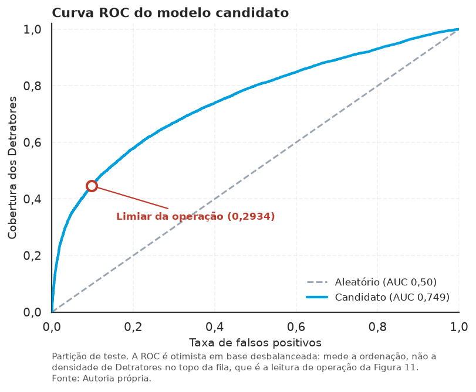<br>
  <sup>Fonte: Autoria própria.</sup>
</div>

<div align="center">
  <sub>Figura 12 – Precisão contra cobertura do modelo candidato</sub><br>
  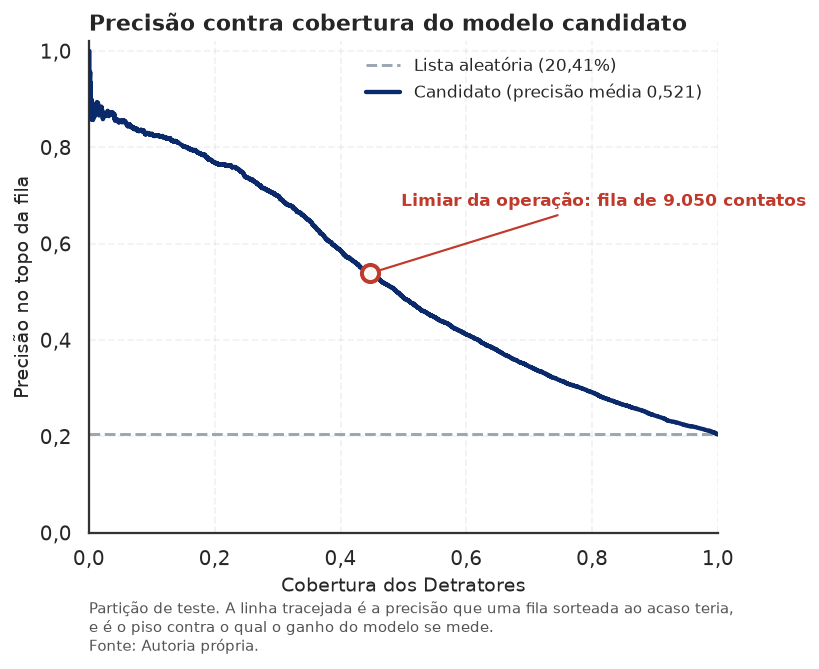<br>
  <sup>Fonte: Autoria própria.</sup>
</div>

A ROC aparece por convenção e não por peso no argumento. Numa base com 20,41% de prevalência ela é a mais otimista das duas: o eixo horizontal dela é a taxa de falsos positivos sobre os não Detratores, que são quase 80% da partição, de modo que milhares de ligações desperdiçadas deslocam pouco esse eixo. A curva de precisão contra cobertura é a que corresponde à pergunta da operação, e é nela que a queda da precisão conforme a fila cresce fica visível.

### 4.4. Comparação de Modelos

#### 4.4.1. Justificativa das métricas de comparação

&emsp;A Seção 4.1.3 definiu as três métricas de negócio usadas para ler o desempenho de qualquer candidato deste projeto (Sensibilidade na classe Detrator, Precisão Média e ROC-AUC), com metas de, respectivamente, 0,70, 0,40 e 0,75, e a Seção 4.3.2 as aplicou ao primeiro candidato, registrando que o falso negativo, o Detrator que passa despercebido, é o erro mais custoso do problema: ele consome a janela de recuperação antes que a experiência negativa se concretize, enquanto um falso positivo custa apenas um contato de pós-viagem a um Cliente que já estava satisfeito. A Seção 4.3.2.7 mediu, sobre esse mesmo candidato, que nenhum tamanho de fila de contato satisfaz Sensibilidade ≥ 0,70 e Precisão ≥ 0,40 ao mesmo tempo, e deixou essa pendência explicitamente para esta seção. A Precisão, nesse caso, é a medida no limiar de corte, e não a Precisão Média, que independe de fila e já foi atingida pelo primeiro candidato (0,5212). Esta subseção não redefine nenhuma dessas três métricas nem as metas: ela decide o critério que orienta a busca de hiperparâmetros das duplas de modelagem, e retoma a pendência à luz dos candidatos tunados na Seção 4.4.6.

&emsp;`GridSearchCV` e `RandomizedSearchCV` escolhem, dentre uma grade ou uma amostra de configurações, aquela que maximiza um único valor de `scoring` (PEDREGOSA et al., 2011). Sensibilidade, Precisão Média e ROC-AUC sozinhas não servem a esse papel sem uma regra de desempate: otimizar exclusivamente por Sensibilidade tende a escolher hiperparâmetros que classificam quase toda observação como Detrator, problema que a Precisão Média foi adotada justamente para evitar; otimizar por Precisão Média ou por ROC-AUC isoladamente não prioriza recall na medida que o custo do falso negativo, já registrado na Seção 4.3.2, exige.

&emsp;Por isso o critério de busca adotado pelas duplas de modelagem é o F-beta score, com beta = 2 (F2, VAN RIJSBERGEN, 1979):

$$
F_2 = \frac{(1+2^2) \times P \times R}{(2^2 \times P) + R} = \frac{5 \times P \times R}{4P + R}
$$

&emsp;em que $P$ é a precisão e $R$ é o recall (Sensibilidade) sobre a classe Detrator. Na formulação de Van Rijsbergen (1979), beta mede quantas vezes o recall importa mais que a precisão: com beta = 2, o recall é tratado como **duas** vezes mais importante que a precisão, e o fator $\beta^2 = 4$ que aparece multiplicando $P$ no denominador é apenas a forma como esse peso entra na média harmônica. É a tradução direta, para dentro da função de busca, da assimetria de custo entre falso negativo e falso positivo que a Seção 4.3.2 já registrou. A função está implementada em `src/scorer_f2.py` (`scorer_f2`) e em `src/avaliacao.py` (`avaliar`), com o mesmo valor de beta nos dois lugares, para que a busca e a leitura de resultado nunca divirjam sobre o que F2 significa.

&emsp;O F2 avalia o rótulo que `predict()` do próprio estimador devolve, não uma probabilidade cortada por um limiar escolhido neste protocolo. Para a maioria dos classificadores probabilísticos usados neste artefato, `predict()` corresponde a `predict_proba ≥ 0,5`, mas o tratamento do empate exato em 0,5 depende de cada implementação: a Árvore de Decisão, por exemplo, atribui esse empate à primeira classe, a de não Detrator (0), não à classe positiva. O que é de fato fixo e igual entre os candidatos é a regra em si, "o que `predict()` do estimador devolver", e não um número de corte específico, e esse corte nunca é reportado como resultado nem aparece na tabela comparativa da Seção 4.4.6.

&emsp;**O F2 não substitui Sensibilidade, Precisão Média ou ROC-AUC.** Ele orienta apenas a escolha de hiperparâmetros; a leitura de negócio de cada candidato, nas subseções seguintes, e a tabela comparativa final da Seção 4.4.6 reportam as três métricas de negócio já adotadas pela Seção 4.3.2, com esses mesmos nomes. O F2 também não define o limiar operacional: ele continua sendo derivado da capacidade de contato da equipe de Experiência do Cliente, depois que os candidatos estão tunados, e não durante a busca.

&emsp;Duas duplas de modelagem tunam quatro candidatos por F2: a dupla de Modelos Interpretáveis (Regressão Logística, Seção 4.4.2, e Árvore de Decisão, Seção 4.4.3) e a dupla de Ensembles (Random Forest, Seção 4.4.4, e Gradient Boosting, Seção 4.4.5). Um quinto candidato, Extra Trees, foi incluído pela dupla de integração como comparação exploratória (issue #259), sem passar por busca de hiperparâmetro nem pelo protocolo de F2 deste artefato; ele não integra a tabela comparativa oficial da Seção 4.4.6 por esse motivo.

&emsp;Acurácia permanece fora tanto do critério de busca quanto da tabela comparativa, pelo mesmo motivo que já levou a Seção 4.3.2 a preferir Precisão Média e ROC-AUC a uma métrica sensível à proporção das classes: a base tem 20,44% de respostas Detratoras (Seção 4.2.1), e um classificador que sempre prevê "não Detrator" atinge acurácia alta sem identificar nenhum caso de interesse.

#### 4.4.2. Regressão Logística

&emsp;A Regressão Logística entra na comparação como o candidato **interpretável**: ela modela o logito da probabilidade de detração como uma combinação linear das features do contrato, e cada coeficiente se converte em odds ratio por exponenciação, o que permite ler o modelo sem nenhuma técnica auxiliar (JAMES et al., 2021). É por essa via que a entrega atende à exigência de explicabilidade do ART.7, e a segunda via interpretável é a Árvore de Decisão, apresentada na subseção seguinte.

&emsp;Toda a implementação está em [`notebooks/regressao_logistica.ipynb`](../notebooks/regressao_logistica.ipynb), que contém o custo de ajuste e a convergência (Seção 1), o espaço de busca (Seção 2), o pipeline sobre o contrato (Seção 3), a busca em grade (Seção 4), os hiperparâmetros vencedores (Seção 5) e os odds ratio com a leitura operacional (Seções 6 e 7).

##### Configuração final e método de otimização

&emsp;Os hiperparâmetros **não foram escolhidos manualmente**: eles vieram de uma busca exaustiva com `GridSearchCV` (PEDREGOSA et al., 2011) sobre o espaço declarado previamente, com validação cruzada agrupada por Cliente. A configuração vencedora está versionada em `assets/hiperparametros_logistica.json`, de onde o modelo é reconstruído sem repetir a busca.

| Hiperparâmetro | Valor vencedor |
|---|---|
| `C` (inverso da regularização) | 1,0 |
| `class_weight` | `balanced` |
| Penalidade | L1 (`l1_ratio` = 1,0), solver `liblinear` |
| `max_iter` | 1600 |

<div align="center"><sup>Fonte: Autoria própria.</sup></div>

&emsp;A busca percorreu **8 combinações em 5 folds**, num total de 40 ajustes mais o reajuste final, em 9,6 minutos. Os folds são `GroupKFold` por `ID_GOLDENRECORD`, e não uma divisão por linha: como o mesmo Cliente responde várias vezes, uma divisão ingênua colocaria o mesmo Cliente nos dois lados do fold, e a métrica de validação subiria por vazamento. O conjunto de teste não foi usado em nenhuma etapa da busca.

&emsp;O espaço original previa 16 combinações. Ele foi reduzido pela metade no eixo `C`, de quatro valores para dois, porque a grade completa foi **estimada** em 58 minutos de ajuste em série, conforme a Seção 2.3 do notebook. O corte preservou a penalidade (L1 e L2), que é o eixo lido na explicabilidade, e o `class_weight`, mantido por ser a decisão que mais afeta a Sensibilidade. O registro da redução está na Seção 4.1 do notebook.

&emsp;O critério de busca foi o **F2**, conforme o protocolo de avaliação do grupo. Uma busca em grade precisa de um único número para ordenar as combinações, e o protocolo registra que nenhuma das três métricas de negócio cumpre esse papel sozinha sem uma regra de desempate. O F2 **não** substitui as três na comparação entre modelos: ele ordena hiperparâmetros e não é reportado como desempenho. A combinação vencedora obteve F2 médio de 0,5189 na validação cruzada, com desvio de 0,0035 entre os folds.

&emsp;Esse desvio relativiza o resultado: a distância entre a primeira e a quarta colocada é de 0,0003, cerca de dez vezes menor que a variação entre folds da própria vencedora. **O `class_weight` é o único eixo que move a métrica**, separando 0,519 com `balanced` de 0,275 com `None`; `C` e a penalidade são indiferentes nesta base.

##### Métricas na validação

&emsp;As três métricas de negócio da Seção 4.3.2, medidas na partição de **validação** (2025-07-01 a 2025-12-31, 48.301 respostas) com a função `avaliar()` do card 05A.1, na Seção 9 do notebook. A coluna de partida é o mesmo pipeline com os hiperparâmetros no padrão da biblioteca, antes da busca:

| Métrica | Meta (Seção 4.1.3) | Partida | Otimizado |
|---|---|---|---|
| Precisão Média (Average Precision) | ≥ 0,40 | 0,4996 | **0,5011** |
| ROC-AUC | ≥ 0,75 | 0,7257 | **0,7273** |
| Sensibilidade (Recall) na classe Detrator | ≥ 0,70 | 0,1976 | **0,4861** |

<div align="center"><sup>Fonte: Autoria própria.</sup></div>

&emsp;**A Sensibilidade acima vale no limiar padrão de 0,5**, e o limiar precisa acompanhar o número, porque sem ele a Sensibilidade não tem definição. O limiar operacional de 0,2934 declarado na Seção 4.3.2.7 foi derivado para o primeiro candidato, sobre o conjunto de teste, a partir de uma fila de 9.050 respostas; aplicado a este modelo na validação, ele produziria uma fila de 38.849 respostas, cerca de quatro vezes a capacidade de 50 contatos por dia. Redefinir o limiar por capacidade para cada candidato é etapa própria da comparação, e é ela que torna as Sensibilidades comparáveis entre modelos.

&emsp;**O ganho da otimização está inteiro nas métricas que dependem do limiar.** A Sensibilidade mais que dobra, de 0,1976 para 0,4861, enquanto Precisão Média e ROC-AUC sobem 0,0015 e 0,0016. É consequência direta de a busca ter escolhido `class_weight` igual a `balanced`: reponderar a classe desloca o ponto de corte, e não a capacidade de ordenar, que é o que Precisão Média e ROC-AUC medem.

&emsp;O modelo supera a meta de Precisão Média e fica abaixo das outras duas, por motivos diferentes. **A Sensibilidade** é a pendência já registrada na Seção 4.3.2.7: ela depende do limiar, e as metas de Sensibilidade e Precisão foram definidas antes de existir medição e não são simultaneamente atingíveis por nenhum modelo avaliado até aqui. **O ROC-AUC não depende de limiar**, então esse argumento não se aplica a ele: os 0,7273 ficam 0,0227 abaixo da meta, uma distância bem maior que os 0,0008 do primeiro candidato, e ela indica que a capacidade de ordenar deste modelo é menor, e não que a meta seja inatingível.

&emsp;**Estes valores não são diretamente comparáveis aos da Seção 4.3.2.7**, que reporta o primeiro candidato sobre o conjunto de **teste**. Partições diferentes medem populações diferentes, e o conjunto de teste permanece reservado. A comparação entre candidatos precisa ser feita sobre uma única partição, e é a tabela consolidada desta seção que a entrega.

##### Explicabilidade por odds ratio

&emsp;A explicabilidade da Regressão Logística é **intrínseca**: ela não depende de técnica aplicada sobre o modelo depois de treinado, porque o próprio parâmetro estimado é a explicação. Cada coeficiente, exponenciado, é o odds ratio associado a uma unidade da coluna que entra no modelo (HOSMER; LEMESHOW, 2000). Essa unidade só coincide com a da variável original quando não houve escalonamento: `ESTATISTICA_ATRASOSAIDA` e `TEMPO_VOO` são divididas pelo intervalo interquartil do treino, e nelas a conversão para unidade natural é um passo à parte, registrado na Seção 6.1 do notebook. As Seções 6 e 7 trazem os 38 coeficientes mapeados de volta para as 14 features originais do contrato, com o nível e a categoria de referência declarados.

&emsp;Três cuidados foram necessários para que essa leitura não induza a erro, e todos estão documentados no notebook. Primeiro, o ranking é ordenado pelo **efeito comparável**, o percurso entre o percentil 10 e o percentil 90 de cada variável no treino, e não pelo odds ratio bruto: este último mistura efeito por minuto, por dia e por nível, e comparar valores em unidades diferentes não ordena efeito. Segundo, o cancelamento está representado em **sete colunas colineares**, porque o contrato de dados suprime as informações de voo quando há cancelamento, de modo que nenhuma delas se interpreta isoladamente. Terceiro, odds ratio descreve **associação que o modelo usa para ordenar**, e não efeito de intervenção.

&emsp;Com essas ressalvas, os resultados mais relevantes para a operação são:

| Fator | Odds ratio | Comparado contra | Leitura |
|---|---|---|---|
| Cancelamento, aviso no mesmo dia | 7,73 | voo não cancelado | Maior efeito do modelo, medido sobre o bloco de sete colunas |
| Cancelamento, aviso com 48 dias | 2,99 | voo não cancelado | A antecedência do aviso é o que mais separa dentro do cancelamento |
| Histórico de detração do Cliente | 4,245 | percurso de p10 a p90 no treino | Segundo maior efeito, sustentado por 10% das linhas do treino |
| Atraso na saída | 1,986 | percurso de p10 a p90, 35 minutos | Separa mais que o atraso na chegada, que dá 1,085 em 29 minutos |
| Tier `DIAMANTE` | 1,86 | tier `AZUL FIDELIDADE` | A associação cresce de forma monótona com o tier |

<div align="center"><sup>Fonte: Autoria própria.</sup></div>

&emsp;O achado sobre a antecedência do aviso concorda com a Hipótese 3 da exploração, que mediu 69,2% de detratores quando o aviso ocorre no mesmo dia da partida, contra 24,6% quando ele ocorre com mais de quarenta e oito dias de antecedência. Ele serve para **priorizar quem contatar** entre Clientes com voo cancelado, e não sustenta a afirmação de que antecipar o aviso reduziria a detração, que seria uma leitura de intervenção.

&emsp;A principal limitação do modelo é estrutural: sendo aditivo no logito, ele **não representa interação** entre variáveis. A Hipótese 5 confirmou estatisticamente que o efeito do atraso sobre a detração depende do tier de fidelidade, e esse é precisamente o tipo de estrutura que a Regressão Logística não captura sem um termo explícito. Quantificar o ganho dos modelos baseados em árvore sobre esse ponto é um dos objetivos da comparação desta seção.

&emsp;Três ressalvas acompanham a leitura acima. **Os tiers `AZUL ONE` e `DIAMANTE UNIQUE` não existem no conjunto de treino**, porque só aparecem a partir de 2025-10-24, depois do corte de validação: a leitura monótona de fidelidade vale para os cinco níveis que o modelo viu e não se estende aos dois de topo. **Nenhum odds ratio apresentado tem intervalo de confiança**, porque todos saem de um único ajuste sobre o treino, sem reamostragem; a coluna de suporte do notebook é o substituto disponível, e ela mostra que alguns valores repousam sobre poucas linhas. E **o efeito é linear no logito**, o que significa que extrapolar as variáveis contínuas para fora da faixa observada produz números que a suposição gera e o dado não sustenta.

#### 4.4.3. Árvore de Decisão

&emsp;A Árvore de Decisão é a segunda via **interpretável** da comparação, ao lado da Regressão Logística da Seção 4.4.2. As duas leem o modelo sem técnica auxiliar, mas por caminhos diferentes. A Regressão Logística soma efeitos independentes no logito. A árvore divide a base em sequência, e cada divisão fica condicionada às anteriores, de modo que cada folha é uma regra do tipo "se atraso acima de X **e** histórico acima de Y, então a taxa de detração é Z" (BREIMAN et al., 1984). É esse formato que lhe permite representar a interação entre atraso e fidelidade confirmada pela Hipótese 5, que a Regressão Logística não captura sem um termo explícito (JAMES et al., 2021).

&emsp;Toda a implementação está em [`notebooks/arvore_decisao.ipynb`](../notebooks/arvore_decisao.ipynb). O notebook traz a carga sobre o contrato de dados (Seção 1), o espaço de busca e o custo de ajuste (Seção 2), o pipeline (Seção 3), a busca em grade (Seção 4), os hiperparâmetros vencedores (Seção 5) e a árvore visual com as regras (Seção 6). O código correspondente está em `src/espaco_busca_arvore.py` e `src/pipeline_arvore.py`, e os resultados versionados estão em `src/hiperparametros_arvore.json` e em `documents/extras/`.

##### Configuração final e método de otimização

&emsp;Os hiperparâmetros **não foram escolhidos manualmente**. Eles vieram de uma busca exaustiva com `GridSearchCV` (PEDREGOSA et al., 2011) sobre a grade `GRADE_ARVORE`, declarada em `src/espaco_busca_arvore.py` antes de qualquer execução. A configuração vencedora está em `src/hiperparametros_arvore.json`, de onde o modelo é reconstruído sem repetir a busca.

| Hiperparâmetro | Grade de busca | Valor vencedor |
|---|---|---|
| `criterion` | `gini`, `entropy` | `entropy` |
| `max_depth` | 3, 4, 5 e 6 | 5 |
| `min_samples_leaf` | 50, 100 e 200 | 50 |
| `class_weight` | `None`, `balanced` | `balanced` |

<div align="center"><sup>Fonte: Autoria própria.</sup></div>

&emsp;**A grade é limitada de propósito, e o limite faz parte da explicabilidade.** Uma árvore sem teto de profundidade continua ajustando bem, mas deixa de caber num conjunto de regras que alguém consiga ler, e aí perde a única vantagem que tem sobre a Regressão Logística. Por isso `max_depth` para em 6, o que dá no máximo 64 folhas, e não inclui `None`. Pelo mesmo motivo, `min_samples_leaf` começa em 50 e não no padrão de 1 da biblioteca. A folha é a unidade de leitura da explicabilidade, e uma folha com poucas respostas descreve o ruído de um punhado de Clientes, não um padrão operacional. `min_samples_split` ficou fora da grade porque, numa árvore binária, é quase redundante com `min_samples_leaf`.

&emsp;A busca percorreu **48 combinações em 5 folds**, num total de 240 ajustes mais o reajuste final, em cerca de 25 minutos (1.526 segundos). Os folds são `GroupKFold` por `ID_GOLDENRECORD`, gerados por `validacao.criar_folds`, pelo mesmo motivo da Seção 4.4.2: o mesmo Cliente responde por mais de um voo, e uma divisão por linha premiaria a árvore por reconhecer a pessoa, sobretudo pelo histórico de detração. O pipeline clona o `ColumnTransformer` do contrato, e por isso imputação, escala e codificação são reajustadas dentro de cada fold. O conjunto de teste não foi usado em nenhuma etapa da busca.

&emsp;O critério de busca foi o **F2** (`scorer_f2`), conforme a Seção 4.4.1. A combinação vencedora obteve F2 médio de **0,5078** na validação cruzada. Como na Regressão Logística, o F2 ordena hiperparâmetros e não é reportado como desempenho.

##### Métricas na validação

&emsp;As três métricas de negócio da Seção 4.1.3 foram medidas na partição de **validação** (2025-07-01 a 2025-12-31, 48.301 respostas), a mesma usada na Seção 4.4.2. A tabela mostra o vencedor ao lado das duas profundidades menores registradas no card #232. Ela serve para ler quanto a profundidade, que é o eixo que controla o tamanho do conjunto de regras, custa ou rende em métrica:

| Métrica | Meta (Seção 4.1.3) | Profundidade 3 (8 folhas) | Profundidade 4 (16 folhas) | **Profundidade 5 (32 folhas, vencedora)** |
|---|---|---|---|---|
| Precisão Média (Average Precision) | ≥ 0,40 | 0,3955 | 0,4162 | **0,4415** |
| ROC-AUC | ≥ 0,75 | 0,6460 | 0,6597 | **0,6800** |
| Sensibilidade (Recall) na classe Detrator | ≥ 0,70 | 0,3845 | 0,4310 | **0,4759** |

<div align="center"><sup>Fonte: Autoria própria.</sup></div>

&emsp;**Nesta árvore não houve troca entre desempenho e interpretabilidade.** A profundidade 5, vencedora pelo F2, também é a melhor nas três métricas de negócio. Já a profundidade 3, que daria o conjunto de regras mais curto, fica abaixo da meta de Precisão Média (0,3955 contra 0,40). Entre as três, a árvore mais legível que atende à meta mínima de Precisão Média é, portanto, a de 16 folhas, e a de 32 folhas é a que o critério do grupo escolhe.

&emsp;**A Sensibilidade acima vale no limiar de `predict()`** da árvore, que é o voto da folha ponderado por `class_weight="balanced"`, conforme a Seção 4.4.1. Ela não é a Sensibilidade no limiar operacional por capacidade de contato. Redefinir esse limiar para cada candidato é etapa própria da comparação da Seção 4.4.6, e é ela que torna as Sensibilidades comparáveis entre modelos.

&emsp;O modelo supera a meta de Precisão Média e fica abaixo das outras duas. A Sensibilidade é a pendência já registrada na Seção 4.3.2.7. **O ROC-AUC de 0,6800 fica 0,0700 abaixo da meta** e é o menor entre os dois modelos interpretáveis na mesma partição (0,7273 na Regressão Logística). A causa é estrutural: com 32 folhas, a árvore atribui no máximo 32 valores distintos de probabilidade, e todas as respostas de uma mesma folha empatam no score. Uma ordenação feita em degraus perde resolução justamente onde a ROC-AUC e a Precisão Média medem, que é a capacidade de ordenar dentro de cada grupo de risco. A Regressão Logística, com score contínuo, não tem essa limitação.

&emsp;**Estes valores não são diretamente comparáveis aos da Seção 4.3.2.7**, que reporta o primeiro candidato sobre o conjunto de **teste**. A comparação entre candidatos sobre uma única partição é a da Seção 4.4.6.

##### Explicabilidade por árvore visual e regras

&emsp;A explicabilidade da Árvore de Decisão também é **intrínseca**: o próprio modelo é a explicação, e não há técnica aplicada sobre ele depois do treino. Ela atende à exigência de explicabilidade do ART.7 por dois artefatos versionados, gerados na Seção 6 do notebook:

- a **árvore visual** completa, em [`assets/arvore_decisao.png`](../assets/arvore_decisao.png), com cada divisão, a impureza e a contagem de cada nó;
- as **regras** em texto, extraídas com `export_text` (PEDREGOSA et al., 2011), em `documents/extras/regras_arvore_decisao.txt`, acompanhadas da taxa de detração observada em cada uma das 32 folhas, em `documents/extras/folhas_arvore_decisao.md`.

&emsp;Dois cuidados foram necessários para que essa leitura não induza a erro. Primeiro, o rótulo `class: 0/1` impresso pelo `export_text` reflete o voto ponderado por `class_weight="balanced"`, e não a maioria observada na folha, e por isso toda taxa citada abaixo vem da contagem real de Detratores por folha no treino. Segundo, os cortes numéricos das regras estão na escala do `RobustScaler` do contrato e foram convertidos de volta para minutos e dias antes da leitura. Com 32 folhas, a leitura resume os **padrões que se repetem** em várias folhas em vez de descrever cada uma. A interpretação completa está em `documents/extras/interpretacao_arvore_decisao.md`.

| Padrão | Regra na árvore | Taxa de Detrator observada | Leitura para a operação |
|---|---|---|---|
| Atraso na chegada | Primeiro corte da árvore, em 43,5 minutos, seguido de cortes em 61,5, 99,5 e 151,5 minutos | De 14,6% (até 43,5 min) a 76,5% (acima de 151,5 min), em média por faixa | O risco cresce de forma consistente com o atraso. Acima de duas horas e meia, fica em torno de 3,7 vezes a prevalência do treino (20,43%) |
| Histórico de detração do Cliente | `HIST_TAXA_DETRACAO_ANTERIOR` alto, combinado com atraso relevante | 85,7% a 95,8% nas cinco folhas de maior risco | Cliente que já detratou e enfrenta um novo problema operacional é o segmento de maior risco, candidato a contato preventivo |
| Cancelamento com pouca antecedência | `ANTECEDENCIA_CANCELAMENTO` até 9,5 dias | 51,1% a 87,1% dentro do ramo | Sinal forte mesmo sem atraso, e mais forte ainda quando combinado com tier Diamante ou histórico de detração |
| Fidelidade | `TIER_VIAGEM_DIAMANTE` dentro do mesmo contexto de atraso ou cancelamento | +13,4 pp com cancelamento de 1,5 a 5,5 dias; +12,0 pp com atraso de 99,5 a 151,5 min | O Cliente Diamante detrata mais, e não menos, quando a viagem tem problema |

<div align="center"><sup>Fonte: Autoria própria.</sup></div>

&emsp;O piso de risco é a folha sem nenhum dos fatores acima: atraso até 43,5 minutos, sem cancelamento recente e sem histórico de detração. Ela concentra **72,6% da base de treino** (248.202 respostas), com taxa de 12,66%. É essa folha que explica por que a fila priorizada funciona: a maior parte dos Clientes está num grupo de risco baixo e homogêneo, e os Detratores se concentram em poucas combinações de fatores que a árvore separa explicitamente.

&emsp;As duas vias interpretáveis concordam nos fatores que importam e se complementam na forma. A Regressão Logística ordena os mesmos fatores (cancelamento, histórico, atraso e tier Diamante) por odds ratio, um efeito médio sobre toda a base. A árvore mostra **em que combinação** eles aparecem juntos. O achado de fidelidade é o exemplo mais claro: a Regressão Logística mede o tier Diamante com odds ratio de 1,86 em média, e a árvore mostra que o efeito aparece nos ramos de atraso e de cancelamento, que é a interação da Hipótese 5.

&emsp;Três ressalvas acompanham a leitura acima. **As regras descrevem associação e não causa**: elas servem para priorizar quem contatar, e não sustentam a afirmação de que reduzir um fator reduziria a detração. **`ANTECEDENCIA_CANCELAMENTO` é condicional a `CANCELAMENTO_VOO`**: nos 83,7% de respostas sem cancelamento ela é nula e recebe a mediana de 10 dias, de modo que o corte em 9,5 dias separa, na prática, o cancelamento recente do restante da base. E **a árvore é instável**: pequenas mudanças nos dados de treino podem alterar os primeiros cortes e, com eles, todas as regras abaixo (JAMES et al., 2021). As regras lidas aqui valem para esta árvore e não para qualquer árvore treinada sobre a mesma base, e é essa instabilidade que os ensembles da Seção 4.4.4 corrigem ao agregar muitas árvores.

#### 4.4.4. Random Forest

&emsp;O Random Forest entra na comparação como o primeiro dos dois modelos de ensemble. A motivação vem da própria exploração: a Hipótese 5 confirmou que a associação entre atraso e detração varia com o tier de fidelidade, e a Regressão Logística, aditiva no logito, não representa essa interação sem um termo explícito (Seção 4.4.2). Uma floresta de árvores de decisão aprende interações por construção, porque cada divisão de uma árvore é condicionada às divisões acima dela, e reduz a variância de uma árvore isolada ao agregar muitas árvores treinadas sobre amostras e subconjuntos de colunas diferentes (BREIMAN, 2001). O custo dessa troca é a interpretabilidade, que deixa de ser intrínseca e passa a depender de uma técnica aplicada sobre o modelo treinado, a permutation importance, apresentada adiante.

&emsp;Toda a implementação está em [`notebooks/ensembles.ipynb`](../notebooks/ensembles.ipynb): o espaço de busca na Seção 6.1, o pipeline e a linha de base na Seção 7, a busca aleatória na Seção 8 e a permutation importance na Seção 9. O código correspondente está em `src/ensembles.py`, `src/busca_random_forest.py` e `src/explicabilidade.py`.

##### Pipeline

&emsp;O modelo não é ajustado sobre uma matriz pronta. `ensembles.criar_pipeline_random_forest` encadeia num único `Pipeline` o `ColumnTransformer` do contrato de dados (passo `preparo`) e um `RandomForestClassifier` (passo `modelo`), os mesmos nomes de passo usados pela Regressão Logística. O pré-processador entra clonado, sem o ajuste que `preparar_matriz` já fez no treino inteiro: assim, dentro de cada fold da busca, imputação, escala e codificação são reajustadas só sobre as linhas de ajuste daquele fold, e as medianas nunca chegam a ver as linhas de validação.

&emsp;Cada floresta roda com `n_jobs=1`. Com várias threads, a soma dos votos das árvores muda de ordem e o último bit de `predict_proba` pode variar, o que num empate em 0,5 muda o rótulo previsto. O paralelismo fica na busca, que distribui ajustes inteiros (uma combinação num fold) entre os núcleos, e a ordem em que eles terminam não altera nenhum número.

##### Método de otimização

&emsp;Os hiperparâmetros **não foram escolhidos manualmente**. Eles saem de uma `RandomizedSearchCV` (PEDREGOSA et al., 2011) com **`n_iter = 40`** e **`random_state = 42`**. Quarenta é o mínimo definido para os dois ensembles, e `busca_random_forest.criar_busca_random_forest` recusa qualquer valor menor: com cinco eixos no espaço, uma busca menor cobriria tão pouco dele que o vencedor diria mais sobre a semente do sorteio do que sobre o modelo. A mesma semente fixa o sorteio das 40 combinações e a semente de cada floresta, de modo que duas execuções sorteiam as mesmas combinações e elegem o mesmo vencedor.

&emsp;A busca aleatória foi preferida à busca em grade usada na Regressão Logística por uma questão de dimensão. O espaço do Random Forest tem quatro eixos numéricos com dezenas ou centenas de valores possíveis cada; uma grade que os cobrisse com resolução útil teria milhares de combinações, e com o mesmo orçamento de ajustes o sorteio explora mais valores distintos de cada eixo do que uma grade grossa (BERGSTRA; BENGIO, 2012).

&emsp;A validação é **cruzada e agrupada por Cliente**: cinco folds de `GroupKFold` dentro do treino, com `groups` igual a `ID_GOLDENRECORD`, gerados por `validacao.criar_folds` e conferidos por `validacao.conferir_folds` antes de qualquer ajuste. O motivo é a estrutura da base, que tem 407.139 valores distintos de `ID_GOLDENRECORD` em 484.915 respostas, ou seja, o mesmo Cliente responde por mais de um voo. Uma validação cruzada aleatória por linha colocaria respostas do mesmo Cliente no ajuste e na validação do mesmo fold. Como o histórico de detração do Cliente é o preditor mais forte da exploração (Hipótese 4), a floresta seria premiada por reconhecer a pessoa, e não por aprender o fenômeno: a métrica de validação subiria por vazamento e o vencedor da busca seria justamente a combinação que mais memoriza Clientes, em geral a de árvores mais profundas e folhas menores. Por isso `criar_busca_random_forest` recusa `cv` passado como inteiro: num classificador, o scikit-learn converteria esse inteiro num particionador estratificado que ignora `groups`. A partição de teste não participa da busca em nenhuma etapa.

&emsp;O critério da busca é o **F2** (`scorer_f2`, com `beta = 2` e Detrator como classe positiva), o mesmo escalar de tuning adotado pelo protocolo de avaliação do grupo para todos os candidatos. Como na Regressão Logística, o F2 orienta a escolha dos hiperparâmetros e não substitui as métricas de negócio na comparação.

##### Espaço de busca

&emsp;O espaço é o `ESPACO_RANDOM_FOREST`, declarado em `src/ensembles.py` antes de qualquer busca e documentado na Seção 6.1 do notebook:

| Hiperparâmetro | Distribuição | Intervalo | Justificativa |
|---|---|---|---|
| `n_estimators` | inteiro uniforme | 200 a 600 | Acima de algumas centenas de árvores o ganho de agregar mais fica marginal, e o custo cresce linearmente com o número delas |
| `max_depth` | inteiro uniforme | 3 a 20 | O teto fica perto de log₂(341.962) ≈ 18,4; profundidade ilimitada arriscaria árvores memorizando Cliente |
| `min_samples_leaf` | inteiro uniforme | 1 a 100 | 100 é o valor escolhido para o primeiro candidato nesta base; o piso em 1 mantém a ponta sem regularização disponível para comparação |
| `max_features` | fração uniforme | 0,3 a 1,0 | Com as features do contrato, `sqrt` ou `log2` sorteariam poucas colunas por divisão e descartariam a maior parte do sinal |
| `class_weight` | lista | `balanced`, `balanced_subsample` ou `None` | A detração é um desbalanceamento moderado, e a busca decide se reponderar compensa |

<div align="center"><sup>Fonte: Autoria própria.</sup></div>

&emsp;São 40 combinações em 5 folds, **201 ajustes** ao todo contando o reajuste do vencedor no treino inteiro. Antes da busca, a Seção 7 do notebook monta a **linha de base**: o mesmo pipeline com os hiperparâmetros padrão do scikit-learn (100 árvores, profundidade livre, `max_features = "sqrt"`, sem `class_weight`) e `random_state = 42`. É contra ela que o ganho da busca é lido; sem essa referência, qualquer número produzido pela busca pareceria bom por si só.

##### Resultados

&emsp;**A busca aleatória está implementada e testada, mas não foi executada sobre a base real até esta entrega.** O código da busca (`src/busca_random_forest.py`), a reconstrução do vencedor pelo JSON e as Seções 8.1 e 8.2 do notebook estão prontos e cobertos por `tests/test_busca_random_forest.py`. A execução completa sobre as 341.962 linhas do treino, com 201 ajustes de 200 a 600 árvores cada, é a mais cara da comparação e não coube no prazo desta entrega. Por isso esta subseção não apresenta hiperparâmetros vencedores nem métricas de um Random Forest otimizado, e o Random Forest não integra a tabela comparativa da Seção 4.4.6. Quando executada, a busca grava os vencedores em `assets/hiperparametros_random_forest.json`, e o modelo é remontado a partir desse arquivo por `busca_random_forest.reconstruir_pipeline`.

&emsp;A **linha de base**, com os hiperparâmetros padrão do scikit-learn (100 árvores, profundidade livre, `max_features = "sqrt"`, sem `class_weight`) e `random_state = 42`, foi medida na Seção 6 de [`notebooks/comparacao_modelos.ipynb`](../notebooks/comparacao_modelos.ipynb), sobre a mesma partição de validação dos demais candidatos (2025-07-01 a 2025-12-31, 48.301 respostas):

| Métrica | Meta (Seção 4.1.3) | Linha de base (padrão da biblioteca) |
|---|---|---|
| Precisão Média (Average Precision) | ≥ 0,40 | 0,4271 |
| ROC-AUC | ≥ 0,75 | 0,6716 |

<div align="center"><sup>Fonte: Autoria própria.</sup></div>

&emsp;A linha de base supera a meta de Precisão Média e fica 0,0784 abaixo da meta de ROC-AUC. Os dois valores são os menores entre os modelos de árvore da Seção 6 do notebook, o que é esperado de uma floresta sem busca: com profundidade livre e folhas de uma resposta, cada árvore tende a memorizar o treino. É esse o espaço que a busca foi desenhada para explorar, com profundidade limitada, folhas maiores e reponderação da classe Detrator.

&emsp;Quando a busca for executada, duas leituras se aplicam ao resultado. Se um vencedor cair na borda do intervalo, em especial `max_depth` igual a 20, a busca queria ir além do espaço, e isso precisa ser registrado ao lado da tabela em vez de tratado como ótimo. E uma diferença de F2 entre duas combinações menor do que o desvio entre folds não separa as duas, de modo que o vencedor deve ser lido junto com as combinações seguintes do resumo da busca.

##### Explicabilidade por permutation importance

&emsp;Diferente da Regressão Logística, o Random Forest não tem um parâmetro que se leia como explicação: a previsão é a média de centenas de árvores, cada uma com suas próprias divisões. A explicabilidade vem de uma técnica aplicada sobre o modelo treinado, a **permutation importance** (BREIMAN, 2001). Para cada feature, os valores dela são embaralhados na partição de avaliação, o que desfaz a relação com o alvo e mantém todo o resto intacto, e mede-se quanto a métrica cai. Uma queda grande diz que o modelo depende daquela feature para acertar; uma queda nula diz que ele passaria bem sem ela. O grupo decidiu não usar SHAP, e a permutation importance tem duas vantagens para este uso: não depende do tipo de modelo, o que vale igualmente para os dois ensembles, e é expressa na mesma métrica que escolheu o modelo.

&emsp;A importância é calculada sobre o **melhor ensemble**, o de maior F2 de `avaliar` na validação entre o Random Forest e o Gradient Boosting (Seção 9.1 do notebook), e a configuração é fixa em `src/explicabilidade.py`:

| Parâmetro | Valor | Motivo |
|---|---|---|
| Métrica (`scoring`) | `scorer_f2` | A mesma que a busca otimizou; explicar o modelo por outra métrica misturaria duas perguntas |
| Partição | validação | A mesma em que o número oficial foi medido; no treino, um modelo que memorizou uma feature pareceria depender dela, e o teste fica reservado para a comparação final |
| Repetições (`n_repeats`) | 10 | Com menos, o desvio da queda fica instável demais para separar a terceira da quarta feature |
| `random_state` | 42 | A semente do projeto; sem ela, dois embaralhamentos dariam rankings diferentes |
| Unidade do ranking | as 14 features originais do contrato | O embaralhamento acontece antes do `ColumnTransformer`, então `TIER_VIAGEM` aparece uma vez só, e não como uma coluna one-hot por tier |

<div align="center"><sup>Fonte: Autoria própria.</sup></div>

&emsp;O custo é de uma previsão da partição inteira por feature e por repetição: 14 features vezes 10 repetições, 140 previsões da validação, mais a de referência. A célula da Seção 9.2 roda o cálculo duas vezes e exige que as duas tabelas sejam idênticas, o que confirma a reprodutibilidade no próprio notebook.

&emsp;**O ranking ainda não foi calculado.** A escolha do melhor ensemble compara o Random Forest otimizado com o Gradient Boosting sobre a mesma matriz, e depende, portanto, da busca do Random Forest, que não foi executada até esta entrega. A explicabilidade exigida pela entrega é atendida pelos dois modelos interpretáveis, a Regressão Logística (Seção 4.4.2) e a Árvore de Decisão (Seção 4.4.3); a permutation importance acrescenta a leitura do modelo de ensemble assim que a busca for executada.

&emsp;**Comparação com a EDA, prevista para quando o ranking existir.** A exploração apontou o atraso como o fator operacional de maior associação individual com a detração: `FAIXA_ATRASO` tem o maior V de Cramér da base, 0,293, e voos com mais de 120 minutos de atraso na chegada chegam a 75,7% de Detratores (Seção 4.2.1). `FAIXA_ATRASO` não está no contrato; ela é a discretização de `ESTATISTICA_ATRASOSAIDA`, e o modelo recebe a forma contínua. Por isso a comparação procura `FAIXA_ATRASO` pelo nome que ela tem no contrato: compará-la pelo nome original faria o ranking dizer que ela sumiu, quando o modelo só a recebe sem discretizar. A Seção 9.4 do notebook registra a posição de cada uma das três features da EDA. Duas leituras são possíveis e nenhuma, por si, é um problema: se o ranking confirmar a EDA, o modelo apoia sua previsão nos fatores que a exploração já isolava; se não confirmar, a diferença tem de ser explicada, e a explicação mais provável é o histórico de detração do Cliente, que a Hipótese 4 mostrou ser o preditor mais forte da base e que a análise univariada da EDA não enxergava.

##### Limitações

&emsp;**Leitura não causal.** A permutation importance mede o quanto o modelo **usa** uma feature para ordenar os Clientes, não o quanto ela **causa** detração. Uma feature no topo do ranking justifica priorizar quem contatar, e não sustenta a afirmação de que agir sobre ela reduziria a detração. Além disso, com features correlacionadas, como `ATRASO_CHEGADA` e `ESTATISTICA_ATRASOSAIDA` (correlação de 0,664), embaralhar uma delas deixa a informação disponível pela outra, e a importância de cada uma sai subestimada; o ranking deve ser lido por blocos de features relacionadas, e não posição a posição.

&emsp;**Custo computacional.** O Random Forest é o candidato mais caro de ajustar: cada uma das 201 execuções treina de 200 a 600 árvores com `n_jobs=1`, sobre o treino inteiro de cada fold. O tempo total da busca ainda não foi medido, e é o principal risco para a execução numa sessão gratuita do Colab. Por isso a busca paraleliza entre processos, com `n_jobs=-1`, e grava os vencedores em JSON: uma vez executada, a busca não precisa ser repetida para remontar o modelo.

##### Rastreabilidade dos números

&emsp;Cada número desta subseção aponta para a célula de [`notebooks/ensembles.ipynb`](../notebooks/ensembles.ipynb) que o produz ou para a seção da documentação de onde ele vem.

| Número citado | Onde conferir |
|---|---|
| `n_iter = 40`, `random_state = 42`, 5 folds e 201 ajustes | Seção 8 do notebook, output da célula que monta a busca (`n_iter=40, random_state=42, folds=5` e `ajustes previstos: 40 x 5 + refit = 201`) |
| Folds agrupados por `ID_GOLDENRECORD` e conferidos | Seção 8 do notebook, primeira linha do mesmo output (`folds do contrato: 5, conferidos contra o Cliente`) |
| 407.139 Clientes em 484.915 respostas | Seção 8 do notebook, texto que abre a seção; origem na Seção 4.2.1 |
| Distribuição e intervalo de cada eixo do espaço | Seção 6.1.1 do notebook, output da célula que lista `ESPACO_RANDOM_FOREST`; justificativas na tabela da Seção 6.3 |
| 341.962 linhas no teto de `max_depth` | Seção 6.3 do notebook, linha de `max_depth` |
| Hiperparâmetros da linha de base (100 árvores, profundidade livre, `sqrt`, sem `class_weight`, semente 42) | Seção 7 do notebook, output da célula que monta o pipeline |
| Precisão Média de 0,4271 e ROC-AUC de 0,6716 da linha de base | Seção 6 de `notebooks/comparacao_modelos.ipynb`, linha `Random Forest` da tabela de resultados |
| `scorer_f2`, `n_repeats = 10`, `random_state = 42`, partição de validação | `src/explicabilidade.py` e texto da Seção 9.2 do notebook |
| 14 features e 140 previsões | Seção 9.2 do notebook, texto antes da célula de cálculo |
| V de Cramér de 0,293, 75,7% de Detratores e correlação de 0,664 | Seção 4.2.1 e Seção 4.3 desta documentação |

<div align="center"><sup>Fonte: Autoria própria.</sup></div>

&emsp;No notebook, todo bloco de código das Seções 6.1, 7, 8 e 9 tem markdown antes, dizendo o que a célula faz, e depois, dizendo como ler o output. As células de registro das Seções 8.3 e 9.5 apontam de volta para esta subseção.

#### 4.4.5. Gradient Boosting

&emsp;O Gradient Boosting é o segundo modelo de ensemble da comparação. Em vez de agregar árvores independentes, como o Random Forest da Seção 4.4.4, ele ajusta árvores em sequência, e cada árvore nova é treinada para corrigir o erro acumulado pelas anteriores (FRIEDMAN, 2001). Como cada árvore divide a base numa sequência de condições, o modelo representa a interação entre atraso e tier de fidelidade que a Hipótese 5 confirmou, e que a Regressão Logística não captura sem um termo explícito. A implementação é o `HistGradientBoostingClassifier` do scikit-learn (PEDREGOSA et al., 2011), escolhido pelo grupo em vez do `XGBClassifier` por não acrescentar dependência ao projeto nem instalação à sessão do Colab.

&emsp;Toda a implementação está em [`notebooks/ensembles.ipynb`](../notebooks/ensembles.ipynb): o espaço de busca na Seção 6.2.1, o pipeline e a linha de base na Seção 10 e a busca aleatória na Seção 11. O código correspondente está em `src/ensembles.py` e `src/busca_gradient_boosting.py`.

##### Pipeline

&emsp;O pipeline segue a mesma construção da Seção 4.4.4: `ensembles.criar_pipeline_gradient_boosting` encadeia o `ColumnTransformer` do contrato (passo `preparo`), clonado sem o ajuste feito no treino inteiro, e o `HistGradientBoostingClassifier` (passo `modelo`). A única troca fixa em relação ao padrão da biblioteca é **`early_stopping=False`**. No padrão `"auto"`, a biblioteca separa sozinha uma fatia aleatória do treino para decidir quando parar, e essa fatia ignora o agrupamento por `ID_GOLDENRECORD`: respostas do mesmo Cliente cairiam dos dois lados, o mesmo vazamento que a validação agrupada da Seção 4.4.4 evita. Por isso o valor é fixado na função, e não deixado para a busca.

##### Método de otimização e espaço de busca

&emsp;Os hiperparâmetros **não foram escolhidos manualmente**. Eles saem de uma `RandomizedSearchCV` (PEDREGOSA et al., 2011) com **`n_iter = 40`** e **`random_state = 42`**, sobre os mesmos cinco folds de `GroupKFold` agrupados por Cliente e com o mesmo critério **F2** (`scorer_f2`) do Random Forest, pelos motivos já registrados na Seção 4.4.4. A busca aleatória foi preferida à busca em grade pela mesma razão de dimensão: são cinco eixos, dois deles contínuos (BERGSTRA; BENGIO, 2012). São 40 combinações em 5 folds, **201 ajustes** contando o reajuste do vencedor no treino inteiro.

| Hiperparâmetro | Distribuição | Intervalo | Justificativa |
|---|---|---|---|
| `learning_rate` | log-uniforme | 0,01 a 0,3 | O efeito do passo sobre o número de árvores necessário é multiplicativo, e a escala log sorteia tanto passos pequenos quanto grandes |
| `max_iter` | inteiro uniforme | 100 a 600 | Número de árvores somadas; com passo pequeno, mais árvores são necessárias |
| `max_leaf_nodes` | inteiro uniforme | 15 a 127 | Tamanho de cada árvore, que controla a ordem das interações representadas |
| `min_samples_leaf` | inteiro uniforme | 20 a 200 | Piso de respostas por folha, que evita folhas descrevendo poucos Clientes |
| `l2_regularization` | uniforme | 0,0 a 2,0 | Encolhe o valor das folhas e reduz o sobreajuste |
| `class_weight` | lista | `None` ou `balanced` | A busca decide se reponderar a classe Detrator compensa |

<div align="center"><sup>Fonte: Autoria própria.</sup></div>

&emsp;Antes da busca, a Seção 10 do notebook mede a **linha de base**: o mesmo pipeline com os hiperparâmetros padrão da biblioteca e `random_state = 42`. É contra ela que o ganho da busca é lido.

##### Hiperparâmetros vencedores e métricas

&emsp;A busca grava os vencedores em `assets/hiperparametros_gradient_boosting.json` e o resumo das 40 combinações em `assets/cv_resultados_gradient_boosting.json`. O modelo é remontado a partir do JSON por `ensembles.melhor_gradient_boosting`, e a Seção 11.3 do notebook exige que o modelo remontado e o `best_estimator_` da busca produzam exatamente as mesmas métricas.

| Hiperparâmetro | Intervalo | Vencedor | No limite do intervalo? |
|---|---|---|---|
| `learning_rate` | 0,01 a 0,3 | 0,0498 | não |
| `max_iter` | 100 a 600 | 200 | não |
| `max_leaf_nodes` | 15 a 127 | 61 | não |
| `min_samples_leaf` | 20 a 200 | 150 | não |
| `l2_regularization` | 0,0 a 2,0 | 1,7744 | não |
| `class_weight` | `None` ou `balanced` | `balanced` | não se aplica |

<div align="center"><sup>Fonte: Autoria própria.</sup></div>

&emsp;O critério da busca, o F2 médio na validação cruzada (5 folds) da combinação vencedora, foi de **0,5318**, com desvio de **0,0035** entre os folds. Como nos demais candidatos, ele ordena hiperparâmetros e não é reportado como desempenho.

&emsp;O número oficial é o de `avaliar` (`src/avaliacao.py`), aplicado ao modelo remontado pelo JSON e medido na partição de **validação** (2025-07-01 a 2025-12-31, 48.301 respostas), a mesma dos demais candidatos. A tabela traz as três métricas de negócio da Seção 4.1.3:

| Métrica | Meta (Seção 4.1.3) | Linha de base (padrão da biblioteca) | Vencedor da busca |
|---|---|---|---|
| Sensibilidade (Recall) na classe Detrator | ≥ 0,70 | 0,2556 | **0,5068** |
| Precisão Média (Average Precision) | ≥ 0,40 | 0,5176 | **0,5174** |
| ROC-AUC | ≥ 0,75 | 0,7340 | **0,7330** |

<div align="center"><sup>Fonte: Autoria própria.</sup></div>

&emsp;A Sensibilidade da tabela vale no limiar de `predict()` do estimador (Seção 4.4.1), e não no limiar operacional por capacidade de contato.

&emsp;**O ganho da busca está inteiro na Sensibilidade, e vem de um eixo só.** As 21 combinações com `class_weight` igual a `balanced` ficaram entre 0,512 e 0,532 de F2 médio na validação cruzada, e as 19 sem reponderação ficaram entre 0,311 e 0,330, sem nenhuma sobreposição. Reponderar a classe desloca a probabilidade predita para cima, e o limiar de `predict()` passa a apontar mais Detratores: a Sensibilidade praticamente dobra, de 0,2556 para 0,5068. Precisão Média e ROC-AUC, que só dependem da ordenação dos Clientes pelo score, ficam onde estavam. A busca, portanto, não produziu um modelo que **ordena** melhor, e sim um que **corta** num ponto mais favorável ao recall. Entre as combinações balanceadas, as 13 melhores estão a menos de um desvio entre folds do vencedor, e nenhum vencedor caiu na borda do intervalo: os eixos numéricos quase não separam candidatos, e o espaço não precisa ser ampliado.

&emsp;O modelo supera a meta de Precisão Média e fica abaixo das outras duas. A Sensibilidade é a pendência da Seção 4.3.2.7, que depende do limiar. O ROC-AUC de 0,7330 fica 0,0170 abaixo da meta e, entre os candidatos otimizados, é o mais próximo dela na mesma partição (0,7273 na Regressão Logística e 0,6800 na Árvore de Decisão).

##### Explicabilidade

&emsp;Como o Random Forest, o Gradient Boosting não tem explicabilidade intrínseca: a previsão é a soma de 200 árvores. A leitura do modelo vem da permutation importance calculada sobre o melhor ensemble, com a configuração descrita na Seção 4.4.4, e a explicabilidade de negócio da comparação é entregue pelos dois modelos interpretáveis, a Regressão Logística (Seção 4.4.2) e a Árvore de Decisão (Seção 4.4.3).

##### Limitações

&emsp;**A probabilidade não é calibrada.** Com `class_weight` igual a `balanced`, a probabilidade predita deixa de refletir a frequência observada de 20,44% de Detratores e não pode ser lida diretamente como risco. Isso não afeta a ordem da fila, que é o que Precisão Média e ROC-AUC medem, mas impede usar o score como probabilidade sem uma calibração posterior. **Leitura não causal**: como nos demais candidatos, o modelo ordena Clientes por associação, e não sustenta afirmação sobre o efeito de agir sobre uma variável.

##### Rastreabilidade dos números

| Número citado | Onde conferir |
|---|---|
| Espaço de busca | Seção 6.2.1 do notebook, output da célula que lista `ESPACO_GRADIENT_BOOSTING_HISTGB` |
| Métricas da linha de base | Seção 10.4 do notebook, tabela de registro |
| `n_iter = 40`, `random_state = 42`, 5 folds e 201 ajustes | Seção 11.1 do notebook, output da célula que monta a busca |
| Hiperparâmetros vencedores, F2 de 0,5318 e desvio de 0,0035 | Seção 11.2 do notebook e `assets/hiperparametros_gradient_boosting.json` |
| Métricas de `avaliar` do vencedor | Seção 11.3 do notebook, output da célula que reconstrói o pipeline pelo JSON |
| 21 e 19 combinações, faixas de F2 e as 13 combinações a menos de um desvio | Seção 11.4 do notebook e `assets/cv_resultados_gradient_boosting.json` |

<div align="center"><sup>Fonte: Autoria própria.</sup></div>

#### 4.4.6. Comparação entre os candidatos

&emsp;A tabela reúne os três candidatos otimizados, com os hiperparâmetros escolhidos pela busca de cada um e as três métricas de negócio da Seção 4.1.3, todas medidas na mesma partição de **validação** (2025-07-01 a 2025-12-31, 48.301 respostas). A partição de teste continua reservada para a medição final do modelo escolhido.

| Candidato | Otimização | F2 médio na validação cruzada (5 folds) | Sensibilidade (Recall) na classe Detrator | Precisão Média (Average Precision) | ROC-AUC |
|---|---|---|---|---|---|
| Meta (Seção 4.1.3) | | | ≥ 0,70 | ≥ 0,40 | ≥ 0,75 |
| Regressão Logística (Seção 4.4.2) | `GridSearchCV`, 8 combinações | 0,5189 | 0,4861 | 0,5011 | 0,7273 |
| Árvore de Decisão (Seção 4.4.3) | `GridSearchCV`, 48 combinações | 0,5078 | 0,4759 | 0,4415 | 0,6800 |
| **Gradient Boosting (Seção 4.4.5)** | `RandomizedSearchCV`, 40 combinações | **0,5318** | **0,5068** | **0,5174** | **0,7330** |

<div align="center"><sup>Fonte: Autoria própria.</sup></div>

&emsp;A Sensibilidade vale no limiar de `predict()` de cada estimador (Seção 4.4.1). O F2 médio na validação cruzada é o critério de cada busca e aparece só para mostrar que os três foram escolhidos pelo mesmo critério; ele não é medida de desempenho comparável entre modelos.

&emsp;**O Random Forest (Seção 4.4.4) não integra a tabela.** A busca aleatória dele está implementada e testada, mas não foi executada sobre a base real até esta entrega: com 201 ajustes de 200 a 600 árvores, ela é a mais cara da comparação. Colocar a linha de base, sem busca, ao lado de três modelos otimizados compararia uma configuração padrão com configurações escolhidas, e a diferença não seria do algoritmo.

&emsp;**Leitura.** Os três candidatos superam a meta de Precisão Média, e nenhum atinge as metas de Sensibilidade e de ROC-AUC. A Sensibilidade depende do limiar e é a pendência já registrada na Seção 4.3.2.7: ela será redefinida pela capacidade de contato da equipe de Experiência do Cliente, e não pelo corte padrão do estimador. O ROC-AUC não depende de limiar, e nele o Gradient Boosting fica 0,0170 abaixo da meta, a menor distância entre os três.

&emsp;O **Gradient Boosting é o melhor nas três métricas de negócio**, mas a vantagem sobre a Regressão Logística é pequena em Precisão Média (0,0163) e em ROC-AUC (0,0057), e grande sobre a Árvore de Decisão. Como as duas métricas de ordenação quase não mudaram com a busca em nenhum dos modelos (Seções 4.4.2 e 4.4.5), a diferença entre eles está na capacidade de ordenar os Clientes por risco, que é o que a fila de contato usa.

&emsp;**Recomendação.** O grupo recomenda o **Gradient Boosting para ordenar a fila de contato**, por ser o candidato que melhor ordena os Clientes, e a **Regressão Logística para explicar à Azul os fatores de risco**, por odds ratio, com a Árvore de Decisão como leitura complementar em regras. A explicabilidade exigida fica, assim, com os dois modelos interpretáveis, e a ordenação com o modelo de maior desempenho. Os próximos passos são definir o limiar operacional do Gradient Boosting pela capacidade de contato, tratar a distância de 0,0170 para a meta de ROC-AUC e medir o modelo escolhido na partição de teste.

### 4.5. Avaliação
```
- Descreva a solução final de modelo preditivo e justifique a escolha. Alinhe sua justificativa com a Seção 4.1, resgatando o entendimento 
  do negócio e das personas, explicando de que formas seu modelo atende os requisitos e definições. 
- Descreva também um plano de contingência para os casos em que o modelo falhar em suas predições.
- Além disso, discuta sobre a explicabilidade do modelo (se aplicável) e realize a verificação de aceitação ou refutação das hipóteses.
- Se aplicável, utilize equações, tabelas e gráficos de visualização de dados para melhor ilustrar seus argumentos. 

Remova este bloco ao final
```

## <a name="c5"></a>5. Conclusões e Recomendações
```
Escreva, de forma resumida, sobre os principais resultados do seu projeto e faça recomendações formais ao seu parceiro de negócios em relação ao uso desse modelo. Você pode aproveitar este espaço para comentar sobre possíveis materiais extras, como um manual de usuário mais detalhado na seção “Anexos”. Não se esqueça também das pessoas que serão potencialmente afetadas pelas decisões do modelo preditivo e elabore recomendações que ajudem seu parceiro a tratá-las de maneira estratégica e ética. 

Remova este bloco ao final
```

## <a name="c6"></a>6. Referências

AGÊNCIA NACIONAL DE AVIAÇÃO CIVIL. **Como ocorre o processo de constituição de uma empresa aérea**. Brasília, DF: ANAC, 28 set. 2006. Disponível em: https://www2.anac.gov.br/empresas/constituicaoEmpresa.asp. Acesso em: 25 set. 2026.

AGÊNCIA NACIONAL DE AVIAÇÃO CIVIL. **Resolução nº 682, de 7 de junho de 2022**. Brasília, DF: ANAC, 2022. Disponível em: https://www.anac.gov.br/assuntos/legislacao/legislacao-1/resolucoes/2022/resolucao-682.

AGÊNCIA NACIONAL DE AVIAÇÃO CIVIL. **Anuário do transporte aéreo 2025**. Brasília, DF: ANAC, 2026. Disponível em: https://www.gov.br/anac/pt-br/assuntos/dados-e-estatisticas/mercado-do-transporte-aereo/panorama-do-mercado/anuario-transporte-aereo. Acesso em: 25 set. 2026.

AMERSHI, S. et al. Guidelines for human-AI interaction. In: CONFERENCE ON HUMAN FACTORS IN COMPUTING SYSTEMS, 2019. **Proceedings** [...]. New York: Association for Computing Machinery, 2019. p. 1-13. DOI: 10.1145/3290605.3300233.

AZUL LINHAS AÉREAS BRASILEIRAS; INSTITUTO DE TECNOLOGIA E LIDERANÇA. **Projeto parceiro: modelo preditivo para identificação de clientes detratores de NPS**. [S. l.], 2026. Documento interno confidencial.

AZUL S.A. **Por que investir na Azul?** [S. l.], 13 mar. 2026. Disponível em: https://ri.voeazul.com.br/a-azul/por-que-investir-na-azul/. Acesso em: 25 set. 2026.

BERGSTRA, J.; BENGIO, Y. Random search for hyper-parameter optimization. **Journal of Machine Learning Research**, v. 13, p. 281-305, 2012.

BRASIL. **Lei nº 13.709, de 14 de agosto de 2018**. Lei Geral de Proteção de Dados Pessoais (LGPD). Brasília, DF: Presidência da República, 2018. Disponível em: https://www.planalto.gov.br/ccivil_03/_ato2015-2018/2018/lei/l13709compilado.htm. Acesso em: 25 set. 2026.

BREIMAN, L. Random forests. **Machine Learning**, v. 45, n. 1, p. 5-32, 2001. DOI: 10.1023/A:1010933404324.

BREIMAN, L.; FRIEDMAN, J. H.; OLSHEN, R. A.; STONE, C. J. **Classification and regression trees**. Belmont: Wadsworth, 1984.

CHAPMAN, P. et al. **CRISP-DM 1.0: step-by-step data mining guide**. Chicago: SPSS Inc., 2000.

CIRIUM. **Aeromexico named most on-time airline; Qatar Airways wins Platinum**. [S. l.], 2 jan. 2026. Nota à imprensa sobre o Cirium on-time performance review 2025. Disponível em: https://www.cirium.com/thoughtcloud/most-on-time-airlines-airports-2025-revealed-cirium/. Acesso em: 25 set. 2026.

CONSELHO ADMINISTRATIVO DE DEFESA ECONÔMICA. **Cade aprova aumento da participação societária minoritária da United Airlines na Azul**. Brasília, DF: CADE, 11 fev. 2026a. Disponível em: https://www.gov.br/cade/pt-br/assuntos/noticias/tribunal-do-cade-aprova-aumento-da-participacao-societaria-minoritaria-da-united-airlines-na-azul. Acesso em: 25 set. 2026.

CONSELHO ADMINISTRATIVO DE DEFESA ECONÔMICA. **CADE clears American Airlines' investment in Azul**. Brasília, DF: CADE, 5 ago. 2026b. Disponível em: https://www.gov.br/cade/en/matters/news/cade-clears-american-airlines-investment-in-azul. Acesso em: 25 set. 2026.

CRAMÉR, H. **Mathematical methods of statistics**. Princeton: Princeton University Press, 1946.

FORBES MONEY. **Azul anuncia saída de processo de recuperação judicial nos EUA**. [S. l.], 21 fev. 2026. Disponível em: https://forbes.com.br/forbes-money/2026/02/azul-anuncia-saida-de-processo-de-recuperacao-judicial-nos-eua/. Acesso em: 25 set. 2026.

FRIEDMAN, J. H. Greedy function approximation: a gradient boosting machine. **The Annals of Statistics**, v. 29, n. 5, p. 1189-1232, 2001. DOI: 10.1214/aos/1013203451.

GIBBONS, S. **Journey mapping 101**. [S. l.]: Nielsen Norman Group, 9 dez. 2018. Disponível em: https://www.nngroup.com/articles/journey-mapping-101/. Acesso em: 25 set. 2026.

GOOGLE PAIR. **People + AI guidebook**. [S. l.], 2021. Disponível em: https://pair.withgoogle.com/guidebook/. Acesso em: 25 set. 2026.

GROVES, R. M.; PEYTCHEVA, E. The impact of nonresponse rates on nonresponse bias: a meta-analysis. **Public Opinion Quarterly**, v. 72, n. 2, p. 167-189, 2008. DOI: 10.1093/poq/nfn011.

HOSMER, D. W.; LEMESHOW, S. **Applied logistic regression**. 2. ed. New York: John Wiley & Sons, 2000.

HUNTER, J. D. Matplotlib: a 2D graphics environment. **Computing in Science & Engineering**, v. 9, n. 3, p. 90-95, 2007. DOI: 10.1109/MCSE.2007.55.

INTERNATIONAL AIR TRANSPORT ASSOCIATION. **Aerospace supply chain bottlenecks continue to constrain airlines**. [S. l.]: IATA, 9 dez. 2025. Disponível em: https://www.iata.org/en/pressroom/2025-releases/2025-12-09-02/. Acesso em: 25 set. 2026.

INTERNATIONAL AIR TRANSPORT ASSOCIATION. **Strong 2025 passenger demand masks ongoing capacity constraints**. [S. l.]: IATA, 29 jan. 2026. Disponível em: https://www.iata.org/en/pressroom/2026-releases/2026-01-29-02/. Acesso em: 25 set. 2026.

JAMES, G.; WITTEN, D.; HASTIE, T.; TIBSHIRANI, R. **An introduction to statistical learning: with applications in R**. 2. ed. New York: Springer, 2021. DOI: 10.1007/978-1-0716-1418-1.

JARQUE, C. M.; BERA, A. K. A test for normality of observations and regression residuals. **International Statistical Review**, v. 55, n. 2, p. 163-172, 1987. DOI: 10.2307/1403192.

KALBACH, J. **Mapeando experiências: um guia para criar valor por meio de jornadas, blueprints e diagramas**. Rio de Janeiro: Alta Books, 2017.

MAGALHÃES, L. N. Gol exits Chapter 11 with plans to add new routes and expand fleet. **Reuters**, [S. l.], 6 jun. 2025. Disponível em: https://www.reuters.com/world/americas/gol-exits-chapter-11-with-plans-add-new-routes-expand-fleet-2025-06-06/.

MCKINNEY, W. Data structures for statistical computing in Python. In: PYTHON IN SCIENCE CONFERENCE, 9., 2010. **Proceedings** [...]. [S. l.: s. n.], 2010. p. 56-61. DOI: 10.25080/Majora-92bf1922-00a.

PEDREGOSA, F. et al. Scikit-learn: machine learning in Python. **Journal of Machine Learning Research**, v. 12, p. 2825-2830, 2011.

REICHHELD, F. F. The one number you need to grow. **Harvard Business Review**, v. 81, n. 12, p. 46-54, 2003. Disponível em: https://hbr.org/2003/12/the-one-number-you-need-to-grow. Acesso em: 25 set. 2026.

SCHRÖER, C.; KRUSE, F.; GÓMEZ, J. M. A systematic literature review on applying CRISP-DM process model. **Procedia Computer Science**, v. 181, p. 526-534, 2021. DOI: 10.1016/j.procs.2021.01.199.

STICKDORN, M.; SCHNEIDER, J. **Isto é design thinking de serviços: fundamentos, ferramentas, casos**. Porto Alegre: Bookman, 2014.

TAMIOZZO, M. Por que faltam aviões para as companhias aéreas e como isso prejudica a sua viagem? **Melhores Destinos**, [S. l.], 12 out. 2025. Disponível em: https://www.melhoresdestinos.com.br/falta-de-avioes.html. Acesso em: 25 set. 2026.

VALLIANT, R. Poststratification and conditional variance estimation. **Journal of the American Statistical Association**, v. 88, n. 421, p. 89-96, 1993. DOI: 10.1080/01621459.1993.10594298.

VAN RIJSBERGEN, C. J. **Information retrieval**. 2. ed. London: Butterworths, 1979.

VIANNA, V. Buscas por passagens de ônibus superam em 5 vezes as de avião. **iG Turismo**, [S. l.], 1 maio 2026. Disponível em: https://turismo.ig.com.br/colunas/vitor-vianna/2026-05-01/buscas-por-passagens-de-onibus-superam-em-5-vezes-as-de-aviao.html. Acesso em: 25 set. 2026.

WASKOM, M. L. seaborn: statistical data visualization. **Journal of Open Source Software**, v. 6, n. 60, p. 3021, 2021. DOI: 10.21105/joss.03021.

WIRTH, R.; HIPP, J. CRISP-DM: towards a standard process model for data mining. In: **Proceedings of the 4th International Conference on the Practical Applications of Knowledge Discovery and Data Mining**. Manchester, UK, p. 29-39, 2000.

## <a name="attachments"></a>Anexos

### A.1. Distribuição normal e teste de hipótese

&emsp;Esta subseção documenta a análise de normalidade e o escalonamento das variáveis quantitativas da base analítica do projeto. O objetivo é caracterizar a forma da distribuição de cada variável — simetria, cauda e presença de valores concentrados ou extremos — e, a partir dessa caracterização, escolher a transformação de escala mais adequada antes de alimentar o modelo. A verificação de normalidade não é um pré-requisito estatístico dos algoritmos de modelagem, mas orienta a escolha do escalonador: variáveis com cauda longa ou concentração de valores em um único ponto, como ATRASO_CHEGADA, tendem a ser melhor tratadas por escalonadores robustos a outliers do que pela padronização clássica, que assume implicitamente uma distribuição mais simétrica. Já a escolha da escala em si é pré-requisito da seção 4.3, porque algoritmos sensíveis à magnitude das variáveis, como regressão logística regularizada e modelos baseados em distância, calculam a penalização de regularização e a distância entre observações de forma proporcional aos valores numéricos de cada coluna. Sem escalonamento, colunas com magnitudes maiores dominam essas operações e distorcem o peso relativo de cada variável no modelo — não porque o resultado fique enviesado em sentido estatístico, mas porque a otimização e a métrica de distância passam a refletir a escala numérica das colunas, e não sua relevância real para o problema.

&emsp;As estatísticas descritivas e as constantes de escalonamento apresentadas neste anexo foram calculadas sobre o conjunto completo, com 484.915 registros; o desvio padrão é o populacional, com divisor N. A exceção é o teste de normalidade da seção A.1.1, realizado sobre amostras aleatórias de 2.000 observações para evitar o poder estatístico excessivo da base completa. Os valores reproduzem a saída do notebook `notebooks/escalonamento_anexo_a1.ipynb`, que lê a base analítica produzida por `notebooks/pre-processamento.ipynb`.

&emsp;As três variáveis analisadas foram `TEMPO_VOO`, `ATRASO_CHEGADA` e `QTDE_VIAGENS_12M`. A escolha cobre três dimensões distintas do problema: a duração programada da operação, a falha operacional efetivamente sofrida pelo Cliente e o histórico de relacionamento dele com a companhia. Nenhuma das três é derivada das demais, o que evita que a análise se repita sobre a mesma informação em três formatos.

#### A.1.1. Teste de normalidade das variáveis quantitativas

&emsp;Antes de definir o tipo de escalonamento apresentado em A.1.2, foi verificado se as três variáveis quantitativas da base analítica seguem distribuição normal.

&emsp;**a) Afirmação e hipóteses.** Para cada variável, a afirmação testada é: “A variável segue uma distribuição normal na população de respostas à pesquisa de NPS.” As hipóteses são:

- **H0:** a variável provém de uma distribuição normal.
- **H1:** a variável não provém de uma distribuição normal.

&emsp;**b) Nível de significância.** Foi adotado α = 0,05. Se o p-valor for inferior a α, rejeita-se H0, pois há evidência contra a normalidade; caso contrário, não se rejeita H0.

&emsp;**c) Teste de normalidade aplicado.** Foi utilizado o teste de Jarque–Bera (Jarque & Bera, 1987), implementado manualmente com `numpy`, sem `scipy`, conforme a restrição do módulo. A estatística combina a assimetria e a curtose da amostra; sob H0, sua distribuição assintótica é qui-quadrado com dois graus de liberdade. Para dois graus de liberdade, o p-valor é calculado pela forma fechada `exp(−JB / 2)`.

```python
import numpy as np
import pandas as pd

def jarque_bera_manual(dados):
    dados = np.asarray(dados, dtype=float)
    n = len(dados)
    media = dados.mean()
    desvio = dados.std(ddof=0)
    skew = np.mean(((dados - media) / desvio) ** 3)
    kurt = np.mean(((dados - media) / desvio) ** 4)
    jb = (n / 6) * (skew**2 + ((kurt - 3)**2) / 4)
    p_valor = np.exp(-jb / 2)
    return jb, p_valor

amostra = df[variavel].dropna().sample(n=2000, random_state=42)
jb, p_valor = jarque_bera_manual(amostra)
```

&emsp;A base possui mais de 400 mil registros. Em amostras tão grandes, testes de normalidade têm poder estatístico excessivo e podem rejeitar H0 por desvios muito pequenos, sem relevância prática. Por isso, o teste foi aplicado a uma amostra aleatória de 2.000 observações de cada variável, com `random_state=42`. Ainda assim, os resultados abaixo são inequívocos; os p-valores calculados sofrem *underflow* e são apresentados como menores que 0,001.

| Variável | Tamanho da amostra | Estatística JB | p-valor | Conclusão (α = 0,05) |
|---|---:|---:|---|---|
| `TEMPO_VOO` | 2.000 | 58.037,67 | < 0,001 | Rejeita-se H0 (não normal) |
| `ATRASO_CHEGADA` | 2.000 | 2.249.569,72 | < 0,001 | Rejeita-se H0 (não normal) |
| `QTDE_VIAGENS_12M` | 2.000 | 121.081,47 | < 0,001 | Rejeita-se H0 (não normal) |

&emsp;As três variáveis rejeitam H0. Como se tratam, respectivamente, de duração, atraso e contagem de viagens, todas apresentam características que dificultam uma forma gaussiana: cauda longa ou acúmulo de observações em zero. A tabela indica a rejeição estatística; os histogramas e a comparação entre média e mediana, a seguir, permitem avaliar a relevância prática desse afastamento.

&emsp;**d) Histogramas.** As figuras mostram a distribuição de cada variável sobre a base completa, e não sobre a amostra de 2.000 observações usada no item (c). A diferença é intencional: a amostragem existe para conter o poder estatístico do teste, que é sensível ao tamanho da amostra, enquanto o histograma é descritivo e não produz valor de p, de modo que exibi-lo sobre todos os registros dá a leitura mais fiel da forma da distribuição. As duas visões são compatíveis, já que a assimetria da amostra reproduz a da base completa nas três variáveis, com 3,68 contra 3,68 em `TEMPO_VOO`, 10,77 contra 10,76 em `ATRASO_CHEGADA` e 4,74 contra 4,12 em `QTDE_VIAGENS_12M`. Três decisões de desenho são necessárias para que cada figura sustente a afirmação que a acompanha. O eixo de frequência usa escala logarítmica, porque em escala linear a barra mais alta achata todas as demais contra o eixo e as três variáveis ficam visualmente indistinguíveis. O eixo horizontal é cortado no percentil 99, com o número de registros omitidos declarado no rodapé de cada figura, para que a área do gráfico não seja tomada por valores extremos isolados. E, em `ATRASO_CHEGADA`, o valor zero recebe barra própria: com intervalos de largura uniforme ele se misturaria aos atrasos curtos, e a barra deixaria de corresponder à proporção citada no texto.

<div align="center">
  <sub>Figura 13 – Distribuição de TEMPO_VOO</sub><br>
  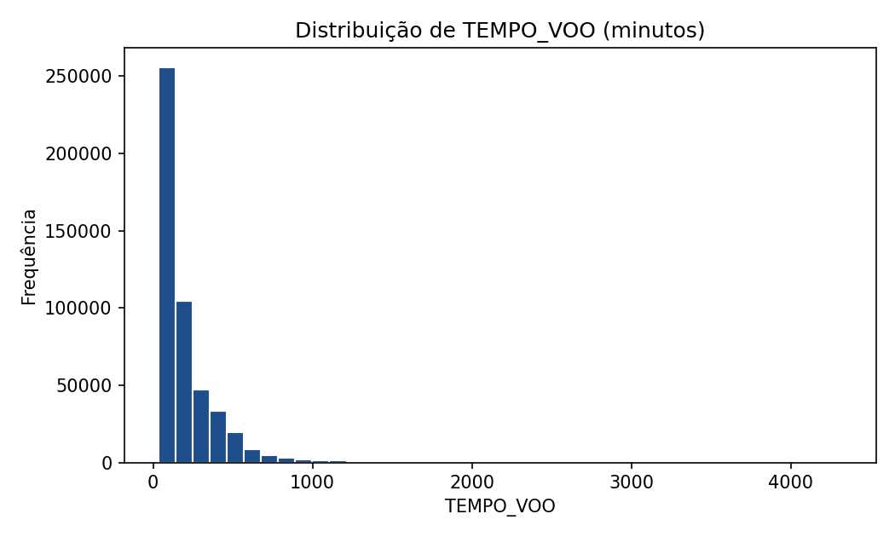<br>
  <sup>Fonte: Autoria própria.</sup>
</div>

&emsp;`TEMPO_VOO` concentra a maior parte dos registros abaixo de 250 minutos, faixa que reúne 74,3% da base, e decai a partir daí de forma assimétrica à direita, sem o pico centralizado nem a simetria de um sino. O decaimento, porém, não é monotônico: a escala logarítmica revela um patamar entre aproximadamente 300 e 370 minutos, no qual as barras deixam de cair e voltam a subir. Esse patamar não é ruído. Ele coincide com o que a seção A.1.2 documenta sobre a variável, que itinerários diretos têm mediana de 95 minutos enquanto itinerários com conexão têm mediana de 370 minutos, e corresponde portanto à população de conexões emergindo dentro da mesma distribuição. Por isso a variável não é bem descrita como unimodal: ela reúne duas populações com centros distintos, e tanto a assimetria quanto essa mistura são, cada uma por si, incompatíveis com a forma gaussiana. O histograma reforça a rejeição de H0.

<div align="center">
  <sub>Figura 14 – Distribuição de ATRASO_CHEGADA</sub><br>
  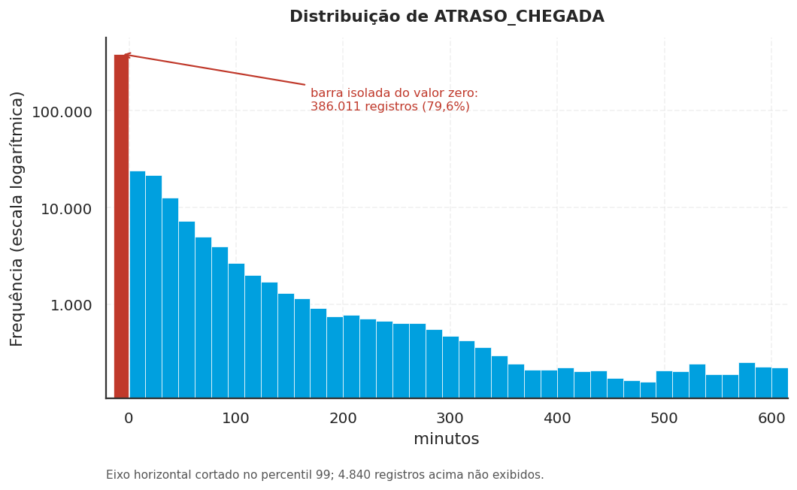<br>
  <sup>Fonte: Autoria própria.</sup>
</div>

&emsp;`ATRASO_CHEGADA` é a distribuição mais distante da normalidade entre as três. A barra isolada do zero reúne 386.011 registros, os 79,6% de voos pontuais, e fica mais de uma ordem de grandeza acima da barra seguinte, ainda que o eixo esteja em escala logarítmica. Toda a variação restante se distribui numa cauda que se estende até o percentil 99, em 615 minutos, decrescente no conjunto ainda que com oscilações nas faixas mais altas, em que cada intervalo reúne poucas centenas de registros. Uma concentração dessa magnitude em um único valor é incompatível com uma distribuição contínua e simétrica, e reforça a rejeição de H0.

<div align="center">
  <sub>Figura 15 – Distribuição de QTDE_VIAGENS_12M</sub><br>
  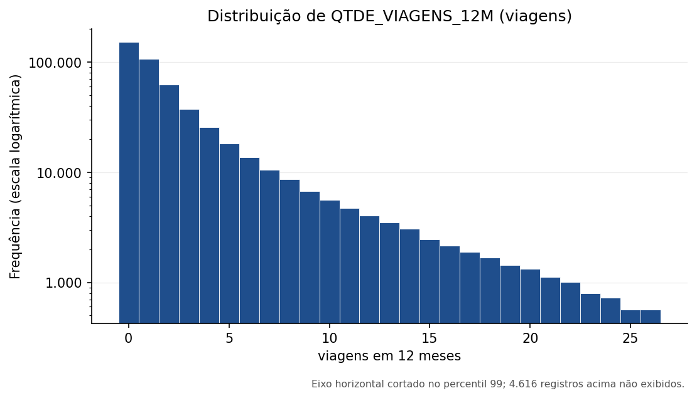<br>
  <sup>Fonte: Autoria própria.</sup>
</div>

&emsp;`QTDE_VIAGENS_12M` concentra-se nos valores baixos e decai gradualmente até os poucos Clientes de alta frequência. Por ser variável de contagem, cada intervalo do histograma corresponde a um valor inteiro, o que evita os vãos artificiais que intervalos fracionários produziriam. A cauda positiva e a natureza discreta da contagem não sustentam a forma simétrica esperada sob normalidade, reforçando a rejeição de H0.

&emsp;**e) Comparação entre média e mediana.** Em uma distribuição normal, média e mediana tendem a coincidir. A diferença absoluta entre elas foi calculada sobre os valores válidos de toda a base.

| Variável | Média | Mediana | Diferença absoluta | Interpretação |
|---|---:|---:|---:|---|
| `TEMPO_VOO` | 207,16 | 130,00 | 77,16 | A média superior à mediana reforça a assimetria positiva e a não normalidade. |
| `ATRASO_CHEGADA` | 25,66 | 0,00 | 25,66 | A mediana nula e a média positiva mostram o efeito da cauda de atrasos longos, reforçando a não normalidade. |
| `QTDE_VIAGENS_12M` | 3,17 | 1,00 | 2,17 | A média é mais de três vezes a mediana, reforçando a assimetria positiva e a não normalidade. |

&emsp;Em todos os casos, a média acima da mediana segue a mesma direção apontada pelos histogramas: poucos valores altos deslocam a média para a direita sem alterar proporcionalmente a mediana. Portanto, a comparação descritiva reforça, e não contradiz, a conclusão do teste de Jarque–Bera para as três variáveis.

#### A.1.2. Tipo de escalonamento adotado por variável

&emsp;O escalonamento tem duas formas usuais. A **padronização**, ou escore z, subtrai a média e divide pelo desvio padrão, reposicionando a distribuição em torno de zero com desvio unitário, sem limite superior ou inferior. A **normalização**, ou min-max, recoloca os valores no intervalo de 0 a 1 usando o mínimo e o máximo observados como âncoras. A diferença prática entre as duas está em como reagem a valores extremos: a padronização os preserva como escores altos, enquanto a normalização os transforma em âncora da escala, comprimindo todo o restante da distribuição contra o limite inferior.

&emsp;Como nenhuma das três variáveis apresenta evidência de normalidade, todas exibindo forte assimetria positiva e mediana bastante inferior à média, a escolha entre os dois métodos não pôde se apoiar nesse critério e passou a depender do comportamento da cauda de cada distribuição. O quadro a seguir resume a decisão:

| Variável | Assimetria | Máximo | P95 | Escalonamento adotado |
|---|---:|---:|---:|---|
| `TEMPO_VOO` | 3,68 | 4.320 | 575 | Padronização (escore z) |
| `ATRASO_CHEGADA` | 10,76 | 4.319 | 94 | Padronização (escore z) |
| `QTDE_VIAGENS_12M` | 4,12 | 107 | 13 | Normalização min-max |

&emsp;**`TEMPO_VOO` recebe padronização.** Duas características da variável desaconselham a normalização. A primeira é que ela não mede a duração de um voo, mas a duração total do deslocamento, incluindo conexões, e por isso reúne populações bastante distintas: itinerários diretos têm mediana de 95 minutos e máximo de 1.844, enquanto itinerários com conexão têm mediana de 370 minutos e máximo de 4.320. A segunda é que esse máximo de 4.320 minutos corresponde a 72 horas de deslocamento em malha doméstica, um valor pouco plausível como viagem real e sustentado por um único registro entre os 484.915 da base. Ancorar a escala nele significaria deixar que uma observação isolada, e provavelmente inconsistente, definisse o teto de toda a coluna, de modo que qualquer correção futura nesse registro alteraria o valor escalonado de todos os demais. A padronização evita essa fragilidade porque se apoia na média de 207,16 minutos e no desvio padrão populacional de 208,29 minutos, calculados sobre a distribuição inteira.

&emsp;**`ATRASO_CHEGADA` recebe padronização.** Aqui a normalização seria tecnicamente possível e substantivamente errada. A variável vai de 0 a 4.319 minutos, mas o percentil 95 é de apenas 94 minutos, o que significa que 95% dos registros cairiam abaixo de 0,022 numa escala de 0 a 1. Somando-se a isso o fato de que 79,6% dos voos da base chegam sem atraso e portanto seriam mapeados exatamente em zero, a normalização produziria uma coluna em que quase toda a variação útil se concentraria em duas casas decimais, enquanto um único voo com atraso de 4.319 minutos, pouco menos de 72 horas, definiria sozinho o topo da escala. A padronização evita esse colapso porque não usa os extremos como âncora: ela se apoia na média de 25,66 minutos e no desvio padrão populacional de 136,46 minutos, calculados sobre a distribuição inteira, preservando a distância relativa entre um atraso de 30 minutos e um de 300.

&emsp;**`QTDE_VIAGENS_12M` recebe normalização min-max.** É uma variável de contagem, com intervalo curto e inteiramente interpretável: de 0 a 107 viagens em doze meses. O valor normalizado tem leitura de negócio imediata, como a posição do Cliente entre o menos e o mais frequente da base, o que é útil tanto para o modelo quanto para a leitura da equipe de Customer Insights descrita na seção 4.1.7.

&emsp;Cabe reconhecer que essa variável também sofre compressão sob a normalização: seu percentil 95, de 13 viagens, corresponde a 0,1215 na escala de 0 a 1, valor muito próximo do que `TEMPO_VOO` apresentaria pelo mesmo método, 0,1260. A diferença que sustenta o tratamento distinto não é o grau de compressão, e sim a natureza do valor que ancora a escala. Cento e sete viagens em doze meses correspondem a cerca de duas viagens por semana, um comportamento verificável de Cliente corporativo de alta frequência, ao passo que 72 horas de deslocamento doméstico não descreve uma viagem plausível. Quando a âncora é uma observação legítima, a compressão é uma característica conhecida da escala e pode ser considerada na modelagem; quando a âncora é provavelmente um erro, a escala inteira herda esse erro.

&emsp;Registre-se que a decisão foi tomada por variável e não por bloco, e que o critério aplicado foi duplo: o grau de compressão que a normalização produziria e a plausibilidade do valor extremo que serviria de âncora. Aplicar o mesmo método às três colunas seria mais simples de documentar, mas trataria como equivalentes distribuições cujo comportamento de cauda é substancialmente diferente. O caso de `ATRASO_CHEGADA`, em que 79,6% dos registros são zero e o percentil 95 corresponde a 0,0218 na escala normalizada, mostra que essa diferença tem consequência direta sobre a qualidade da coluna entregue ao modelo.


#### A.1.3. Estatísticas do conjunto completo usadas no escalonamento

&emsp;Antes de apresentar os valores, é preciso definir sobre qual conjunto eles foram calculados. A base analítica deste projeto não é um arquivo único: ela resulta da integração das quatro fontes recebidas do parceiro. Os quatro arquivos de resposta à pesquisa, `NPS_01` a `NPS_04`, são partições de um mesmo conjunto e somam 484.916 registros quando concatenados. Essa concatenação é então integrada, pela chave `RESPONDENT_ID`, aos dados operacionais de `INFORMACAO_VIAGEM` e ao perfil comportamental de `PERFIL_CLIENTE_01` e `PERFIL_CLIENTE_02`. A integração identifica um único `RESPONDENT_ID` duplicado, com duas medições divergentes de `TEMPO_VOO`; como todas as demais colunas são equivalentes, o valor foi consolidado pela média aritmética e a intervenção registrada em `TEMPO_VOO_CONSOLIDADO`. O resultado são **484.915 registros e 46 colunas** na base analítica, cada um correspondendo a uma resposta individual à pesquisa.

&emsp;As constantes que alimentam as equações de escalonamento precisam vir desse conjunto completo, e não de uma amostra ou de um recorte de treino, porque é sobre a distribuição inteira que a escala é definida. A tabela a seguir apresenta os quatro valores exigidos por cada método: o valor mínimo e o valor máximo, que ancoram a normalização, e a média e o desvio padrão populacional, que ancoram a padronização. Os valores foram calculados sobre a base completa, excluídos de cada variável os registros sem valor válido para aquela variável, conforme a coluna de n válido da própria tabela.

&emsp;Antes da tabela, cabe situar duas das três variáveis, que não constam do dicionário de dados apresentado no item (a) da seção 4.1.3 por virem das bases de informação de viagem e de perfil do Cliente, e não da pesquisa de NPS:

| Variável | Origem | Definição |
|---|---|---|
| `ATRASO_CHEGADA` | Informação de viagem | Atraso registrado na chegada, em minutos. Distinto de `ESTATISTICA_ATRASOSAIDA`, que mede o atraso na partida. Voos pontuais recebem o valor zero, e não nulo |
| `QTDE_VIAGENS_12M` | Perfil do Cliente | Quantidade de viagens realizadas pelo Cliente na companhia nos doze meses anteriores à resposta. Existe também nas versões de 24 e 36 meses, não utilizadas aqui |

&emsp;`TEMPO_VOO` consta daquele dicionário e é descrito ali como a duração da viagem em minutos.

| Variável | n válido | Nulos | Mínimo | Máximo | Média | Desvio padrão populacional |
|---|---:|---:|---:|---:|---:|---:|
| `TEMPO_VOO` | 484.675 | 240 | 35 | 4.320 | 207,1565 | 208,2920 |
| `ATRASO_CHEGADA` | 484.915 | 0 | 0 | 4.319 | 25,6551 | 136,4553 |
| `QTDE_VIAGENS_12M` | 484.760 | 155 | 0 | 107 | 3,1690 | 5,4124 |

&emsp;Duas observações metodológicas sobre a tabela. A primeira é que o desvio padrão apresentado é o **populacional**, calculado com divisor N e não com divisor N−1, conforme pede a definição usada no escalonamento por padronização. Com 484.915 registros, a diferença entre as duas formas é desprezível, aparecendo apenas na quarta casa decimal no caso de `TEMPO_VOO`, cujo desvio amostral é 208,2922 contra o populacional de 208,2920. Ainda assim, o valor reportado é o populacional, porque é ele que entra na equação da seção seguinte.

&emsp;A segunda observação diz respeito ao critério de exclusão, que precisa ser explicitado porque o item (a) da seção 4.1.3 apresenta números diferentes dos que constam da tabela acima. A verificação direta sobre as quatro bases recebidas mostra que `TEMPO_VOO` apresenta nelas 240 células sem valor entre os 484.915 registros da base analítica, o que corresponde a 99,95% de preenchimento, e que essa variável não registra nenhum valor negativo nem zerado.

&emsp;Convém distinguir os dois casos, porque eles têm alcances diferentes. A ausência de **valores negativos** vale para todas as colunas numéricas das quatro bases, com exceção dos campos `NPS_*`, que usam o valor −100 por definição da escala. Já a ausência de **valores zerados** vale apenas para `TEMPO_VOO`, e é justamente o que se espera: nenhuma viagem dura zero minutos. Nas outras duas variáveis o zero é frequente e legítimo, correspondendo a 386.011 registros em `ATRASO_CHEGADA`, ou 79,6%, e a 152.200 em `QTDE_VIAGENS_12M`, ou 31,4%. Nesses casos o zero informa pontualidade e ausência de viagens anteriores, respectivamente, e não erro de conteúdo. As contagens de ausências, de zeros e de negativos desta subseção, assim como a consolidação da linha duplicada, estão reproduzidas na seção 2 do notebook `notebooks/escalonamento_anexo_a1.ipynb`.

&emsp;Esse resultado não contradiz o que a seção 4.1.3 registra. Aquela seção descreve a `AMOSTRA_NPS_INTELI_FINAL`, entrega inicial de 98.414 respostas, e as inconsistências de conteúdo ali apontadas, incluindo os registros de duração negativa, referem-se àquele conjunto. As quatro bases utilizadas neste anexo constituem a entrega completa posterior, com 484.916 registros antes da deduplicação. Os dois enunciados descrevem conjuntos de dados diferentes e são, portanto, compatíveis entre si.

&emsp;O critério de limpeza adotado é, portanto, a exclusão dos registros sem valor, e não a correção de valores incompatíveis, já que estes não ocorrem. As 240 ausências de `TEMPO_VOO` e as 155 de `QTDE_VIAGENS_12M` foram retiradas do cálculo das constantes de cada variável, o que explica a coluna de n válido da tabela acima. Cabe precisar o alcance dessa exclusão: ela vale para o cálculo das constantes, e não para a composição da base. Os registros continuam nos 484.915 da base analítica e apenas não entram na média, no desvio, no mínimo e no máximo da variável em que estão ausentes, porque uma estatística não é definida sobre valor inexistente. O que fazer com eles na matriz entregue ao modelo é decisão da preparação dos dados descrita na seção 4.3, e o efeito da transformação sobre eles está detalhado na seção A.1.4.

&emsp;A opção foi por excluir e não por imputar. Substituir esses registros por zero deslocaria a média para baixo e alteraria o mínimo usado como âncora, e substituí-los pela média criaria concentração artificial no centro da distribuição. Como o volume afetado é inferior a 0,1% da base, sendo 0,05% em `TEMPO_VOO` e 0,03% em `QTDE_VIAGENS_12M`, a exclusão preserva a representatividade sem exigir hipótese adicional sobre o valor correto. O mesmo critério vale para `QTDE_VIAGENS_12M`. Já `ATRASO_CHEGADA` não apresenta ausências, porque nela a pontualidade é registrada como zero, valor legítimo e não lacuna.

&emsp;Uma terceira observação, relevante porque a decisão de escalonamento da seção A.1.2 se apoia no valor máximo. Os máximos de `TEMPO_VOO` e de `ATRASO_CHEGADA` são 4.320 e 4.319 minutos, que correspondem exatamente a três dias e a três dias menos um minuto. Nenhum registro da base ultrapassa esse limite em qualquer das variáveis de tempo. A coincidência entre duas variáveis independentes indica que não se trata do maior valor efetivamente observado, e sim de um **teto de truncamento do sistema de origem**, que interrompe a contagem em 72 horas. A consequência é que o máximo dessas duas variáveis deve ser lido como limite do instrumento de medição e não como fronteira real do fenômeno, o que reforça a decisão de não usá-lo como âncora de escala e de adotar a padronização para ambas.

&emsp;O truncamento no limite superior tem contrapartida no limite inferior de `ATRASO_CHEGADA`. A variável não apresenta nenhum valor negativo, embora chegadas adiantadas sejam ocorrência comum na operação aérea. Isso significa que a antecipação foi registrada como zero, e não como atraso negativo, o que caracteriza um **piso**, simétrico ao teto descrito acima. A variável é, portanto, limitada nas duas pontas pelo instrumento de medição, e não pelo fenômeno: ela não distingue um voo que chegou no horário exato de um que chegou vinte minutos adiantado, e não registra atrasos superiores a 72 horas. Essa dupla limitação precisa ser considerada ao interpretar tanto a concentração de 79,6% em zero quanto a extensão real da cauda superior.

&emsp;Cabe verificar se o truncamento contamina as constantes de escalonamento, já que a média e o desvio padrão são calculados sobre os mesmos valores truncados. O volume envolvido é desprezível: apenas um registro está exatamente no teto em cada variável, sete registros de `TEMPO_VOO` e onze de `ATRASO_CHEGADA` atingem ou superam 4.000 minutos, e mesmo ampliando o corte para dois dias ou mais são 93 e 81 registros, sempre abaixo de 0,02% da base. O efeito sobre as constantes é da mesma ordem: excluindo de `TEMPO_VOO` os registros de 4.000 minutos ou mais, a média passa de 207,1565 para 207,0989 e o desvio padrão de 208,2920 para 207,7408, variações de 0,03% e 0,26% respectivamente. As constantes publicadas na tabela acima podem, portanto, ser consideradas livres de contaminação pelo truncamento. A contagem dos registros no teto e o recálculo das constantes sem eles estão na seção 2 do notebook `notebooks/escalonamento_anexo_a1.ipynb`.

&emsp;Vale registrar, por fim, o contraste entre a média e o desvio padrão como leitura preliminar da dispersão. Em `ATRASO_CHEGADA`, o desvio padrão de 136,46 minutos é mais de cinco vezes a média de 25,66 minutos, o que já indica uma distribuição dominada por poucos valores extremos, e é a evidência quantitativa que sustenta a escolha da padronização para essa variável na seção anterior. Em `TEMPO_VOO` a razão entre desvio padrão e média é de 1,01, e em `QTDE_VIAGENS_12M` é de 1,71, dispersões de ordem de grandeza comparável à da própria média e portanto bem menos extremas que a de `ATRASO_CHEGADA`.


#### A.1.4. Equações de escalonamento

&emsp;Com as constantes definidas na seção anterior, cada variável passa a ter uma equação própria, apresentada abaixo já com os valores substituídos. As duas formas gerais são a normalização, em que o valor escalonado é dado por `(x - mínimo) / (máximo - mínimo)`, e a padronização, em que ele é dado por `(x - média) / desvio padrão populacional`.

&emsp;**`TEMPO_VOO`, por padronização:**

```
TEMPO_VOO_esc = (TEMPO_VOO - 207,1565) / 208,2920
```

&emsp;**`ATRASO_CHEGADA`, por padronização:**

```
ATRASO_CHEGADA_esc = (ATRASO_CHEGADA - 25,6551) / 136,4553
```

&emsp;**`QTDE_VIAGENS_12M`, por normalização min-max:**

```
QTDE_VIAGENS_12M_esc = (QTDE_VIAGENS_12M - 0) / (107 - 0)
                     = QTDE_VIAGENS_12M / 107
```

&emsp;No caso de `QTDE_VIAGENS_12M` o mínimo observado é zero, o que faz a subtração desaparecer e reduz a equação a uma divisão pelo máximo. Isso não é uma simplificação arbitrária: significa que o valor escalonado dessa variável pode ser lido diretamente como a fração que o Cliente representa em relação ao viajante mais frequente da base.

&emsp;Cabe registrar o efeito dessa equação sobre o conjunto, porque ele é o mesmo que levou à rejeição da normalização nas outras duas variáveis. A média de `QTDE_VIAGENS_12M` escalonada é 0,0296 e 74,3% dos registros ficam em 0,03 ou abaixo, faixa que corresponde a três viagens ou menos, porque o máximo de 107 viagens está a 19,18 desvios padrão da média de 3,1690, os três valores calculados na seção 8 do notebook `notebooks/escalonamento_anexo_a1.ipynb`. A contagem é de registros, e não de Clientes: a base é de respostas à pesquisa, e um mesmo Cliente pode responder mais de uma vez, o que é justamente o motivo de a divisão de treino e teste ser agrupada por `ID_GOLDENRECORD`. O critério que sustenta o tratamento distinto não é o grau de compressão, e sim a plausibilidade do valor que ancora a escala, conforme discutido na seção A.1.2: cento e sete viagens em doze meses correspondem a cerca de duas viagens por semana e descrevem um Cliente corporativo de alta frequência, ao passo que os 4.320 minutos de `TEMPO_VOO` são um teto de truncamento do sistema de origem, conforme demonstrado na seção A.1.3. Quando a âncora é uma observação legítima, a compressão é característica conhecida da escala e pode ser considerada na modelagem; quando é provavelmente um erro, a escala inteira herda esse erro.

&emsp;**Registros sem valor.** As 240 ausências de `TEMPO_VOO` e as 155 de `QTDE_VIAGENS_12M`, retiradas do cálculo das constantes na seção A.1.3, permanecem na base e passam pela transformação. A equação não é definida para ausência, de modo que a coluna escalonada recebe nulo, e não um valor calculado. Atribuir zero seria incorreto nos dois métodos, porque na padronização o zero corresponde à média da distribuição e na normalização corresponde ao mínimo observado, o que converteria dado ausente em voo pontual ou em Cliente sem viagens. A seção 5 do notebook `notebooks/escalonamento_anexo_a1.ipynb` mostra os 240 e os 155 registros atravessando a transformação sem mudança de contagem. A escolha entre imputar e descartar esses registros pertence à preparação dos dados descrita na seção 4.3, e não ao escalonamento.

&emsp;**Valores fora do intervalo.** As constantes são fixas e serão aplicadas também a dados futuros, então a equação de `QTDE_VIAGENS_12M` pode devolver valor acima de 1: um Cliente com 120 viagens em doze meses resulta em 1,1215. Nenhum truncamento é aplicado. Cortar no teto faria Clientes de frequências diferentes receberem o mesmo valor, romperia a relação linear entre a variável e sua versão escalonada e esconderia justamente a informação de que o comportamento observado ultrapassou o máximo da base. A seção 7 do notebook `notebooks/escalonamento_anexo_a1.ipynb` demonstra o comportamento com valores acima do máximo observado. Modelos que exijam entrada estritamente contida em [0, 1] precisam tratar esse corte na etapa de modelagem. Pelo limite inferior não há risco equivalente, porque o mínimo da escala é zero e uma contagem de viagens não assume valor negativo.

&emsp;Cabe delimitar com precisão o que a padronização faz e o que ela não faz, para que a justificativa da seção A.1.2 não seja lida além do que sustenta. **A padronização não encurta a cauda da distribuição.** Ela recentra a escala na média e a divide pelo desvio padrão, o que reposiciona os valores sem alterar as distâncias relativas entre eles. Os extremos permanecem extremos: depois de padronizada, `ATRASO_CHEGADA` vai de −0,1880 a 31,4634, e `TEMPO_VOO` vai de −0,8265 a 19,7456. O voo com 4.319 minutos de atraso, pouco menos de 72 horas, continua sendo um ponto isolado a 31,4634 desvios padrão da média.

&emsp;O que a padronização evita é outra coisa, mais específica: ela não usa o valor extremo como **âncora** da escala. Na normalização min-max, o máximo define o teto e todo o restante da distribuição é medido em relação a ele, de modo que um único registro atípico, ou um teto de truncamento como o descrito na seção A.1.3, determina a posição de todos os demais. Na padronização, o extremo é apenas mais uma observação que participa do cálculo da média e do desvio, sem definir sozinho os limites da escala. A ressalva é que isso torna a padronização menos frágil, e não imune: o desvio padrão também não é uma estatística robusta, e em `ATRASO_CHEGADA` ele chega a 5,32 vezes a média porque a cauda o infla. A unidade da escala padronizada é, portanto, uma dispersão que os próprios valores extremos ajudaram a formar. A diferença em relação à normalização é de grau, e não de natureza: ali o extremo define o teto por construção, aqui ele entra como uma parcela entre 484.915.

&emsp;Tratar de fato a cauda exigiria transformações de outra natureza, como a aplicação de logaritmo, que reduz a assimetria de `TEMPO_VOO` de 3,68 para 0,69, ambos os valores calculados na seção 3 do notebook `notebooks/escalonamento_anexo_a1.ipynb`, ou o winsorizing dos percentis superiores, que substitui os valores extremos por um limite escolhido. Ambas foram consideradas e descartadas nesta entrega por duas razões: alteram a distribuição original, e não apenas sua escala, o que exigiria reinterpretar as variáveis; e o escopo desta subseção é comparar padronização e normalização, conforme o enunciado da atividade. Ficam registradas como alternativas a avaliar na etapa de modelagem descrita na seção 4.3.

&emsp;Para verificar a consistência entre a equação publicada e a transformação aplicada, três registros da base analítica foram conferidos manualmente. Os três foram escolhidos por apresentarem as três variáveis com valores não triviais, porque um registro em que a contagem de viagens ou o atraso valem zero exercita pouco a equação: `0 / 107` devolve zero por construção e o atraso zero apenas testa o mínimo observado. A seleção dos três é feita pelo `RESPONDENT_ID`, chave de integração das quatro fontes e único na base, ainda que o identificador não seja reproduzido na tabela: os registros aparecem como A, B e C, e o A é o mesmo registro 6 da seção A.1.6, o que permite conferir os dois quadros um contra o outro. Selecionar por posição deixaria a tabela dependente da ordem em que `notebooks/pre-processamento.ipynb` concatena as fontes: uma alteração nessa ordem ou na regra de deduplicação invalidaria a conferência sem que a verificação do notebook acusasse, já que ela confronta valores e não linhas. A seleção por chave, ao contrário, falha de forma explícita se o registro deixar de existir.

| Registro | Variável | Valor original | Substituição na equação | Valor escalonado |
|---:|---|---:|---|---:|
| A | `TEMPO_VOO` | 65 | (65 − 207,1565) / 208,2920 | −0,6825 |
| A | `ATRASO_CHEGADA` | 76 | (76 − 25,6551) / 136,4553 | 0,3689 |
| A | `QTDE_VIAGENS_12M` | 13 | 13 / 107 | 0,1215 |
| B | `TEMPO_VOO` | 590 | (590 − 207,1565) / 208,2920 | 1,8380 |
| B | `ATRASO_CHEGADA` | 178 | (178 − 25,6551) / 136,4553 | 1,1164 |
| B | `QTDE_VIAGENS_12M` | 3 | 3 / 107 | 0,0280 |
| C | `TEMPO_VOO` | 140 | (140 − 207,1565) / 208,2920 | −0,3224 |
| C | `ATRASO_CHEGADA` | 11 | (11 − 25,6551) / 136,4553 | −0,1074 |
| C | `QTDE_VIAGENS_12M` | 45 | 45 / 107 | 0,4206 |

&emsp;Os nove valores conferidos à mão coincidem com as colunas geradas pela transformação. A comparação está reproduzida na seção 6 do notebook `notebooks/escalonamento_anexo_a1.ipynb`, que confronta as duas versões e interrompe a execução caso divirjam. Registre-se ainda que as constantes fixadas no código são exatamente as quatro casas decimais publicadas aqui, e não a precisão cheia: a seção 4 do mesmo notebook mostra que a diferença entre as duas formas não passa de 0,000011 no valor escalonado.

&emsp;Duas leituras interessam para a modelagem. A primeira é que o deslocamento de 590 minutos do registro B, quase dez horas, resulta em 1,8380 na escala padronizada, ou seja, quase dois desvios padrão acima da média da base. A leitura é imediatamente informativa sobre o quanto aquele itinerário se afasta do comportamento típico, algo que a normalização não tornaria imediato: pelo método min-max, esse mesmo registro apareceria como 0,1295, um número que sugere proximidade do piso da escala justamente para uma viagem atípica. Registre-se que as duas escalas são transformações afins uma da outra e portanto carregam exatamente a mesma informação; o que muda é o ponto de referência adotado, e com ele a facilidade de leitura.

&emsp;A segunda leitura é que a ausência de atraso produz um valor negativo, −0,1880, e não zero. Na padronização o zero corresponde à média da distribuição, de modo que qualquer voo pontual fica necessariamente abaixo dela. E esse valor não caracteriza um registro isolado: como 79,6% dos voos da base chegam sem atraso, os 386.011 registros pontuais recebem todos exatamente −0,1880, que passa a ser de longe o valor mais frequente da coluna escalonada. A consequência precisa ser considerada na interpretação dos coeficientes do modelo, já que o sinal do valor escalonado deixa de indicar presença ou ausência de atraso e passa a indicar posição em relação ao atraso médio da operação.

&emsp;Resta uma consequência de ter aplicado métodos diferentes às três colunas, que fica registrada aqui por pertencer à modelagem e não ao escalonamento. As duas variáveis padronizadas chegam ao modelo com amplitude de −0,8265 a 19,7456 e de −0,1880 a 31,4634, enquanto a normalizada fica contida em [0, 1] com desvio padrão de 0,0506, conforme a seção 8 do notebook `notebooks/escalonamento_anexo_a1.ipynb`. Como as três entram com magnitudes distintas, o peso efetivo de cada uma difere nos algoritmos sensíveis à escala: a regularização L1 e L2 penaliza mais o coeficiente da coluna de menor amplitude, que precisa ser maior para produzir o mesmo efeito, e métodos apoiados em distância, como kNN e redes neurais sem normalização interna, atribuem influência menor à coluna comprimida. Uniformizar o método nas três colunas resolveria a assimetria, mas ao custo das razões de qualidade por variável expostas na seção A.1.2. A consequência foi considerada e o ajuste cabível, se necessário, é feito na etapa de modelagem da seção 4.3, pela escolha do algoritmo ou por uma reponderação explícita.

&emsp;Cabe, por fim, delimitar o alcance deste anexo em relação ao pipeline de modelagem, para que a seção 4.3 não herde uma contradição aparente. O escalonamento descrito aqui é o exercício comparativo que a atividade pede: constantes calculadas sobre o conjunto completo, publicadas com valor fixo, padronização em duas variáveis e normalização na terceira. A matriz efetivamente entregue ao modelo é outra. A função `criar_preprocessador_modelagem`, em `scripts/preprocessamento_nps.py`, imputa a mediana com indicador de ausência e ajusta um `RobustScaler` apenas sobre a partição de treino devolvida por `dividir_treino_teste_temporal_por_cliente`, que separa os meses mais recentes e retira do treino todo Cliente presente no teste. Ajustar o escalonador só no treino é o procedimento correto, porque usar a distribuição inteira ali faria estatísticas do teste vazarem para a estimação.

&emsp;As duas coisas convivem porque respondem a perguntas diferentes. O anexo compara métodos de escala sobre a distribuição completa, que é o recorte pedido pelo enunciado e o único em que a comparação faz sentido, já que uma constante calculada sobre um recorte de treino descreveria aquele recorte e não a variável. O pipeline prepara dados para estimação e por isso obedece à restrição de vazamento. Quando esta subseção diz que as constantes são fixas e valem para dados futuros, descreve o comportamento das equações publicadas aqui, e não o do pré-processador de modelagem. Decidir se algum dos dois métodos comparados neste anexo substitui o `RobustScaler` na matriz do modelo é tarefa da seção 4.3, e essa decisão ainda não está tomada.

#### A.1.5. Histogramas antes e depois do escalonamento

&emsp;Os pares de histogramas a seguir apresentam cada variável em sua escala original e após a transformação. A comparação serve a um propósito específico: verificar o que o escalonamento de fato faz com os dados. As oito figuras são geradas pela seção 2 do notebook `notebooks/histogramas_anexo_a1.ipynb`, que grava os arquivos em `assets/` com a mesma quantidade de classes e o mesmo estilo nos dois lados de cada par, justamente para que a única diferença visível seja o eixo horizontal.

<div align="center">
  <sub>Figura A.1 – Distribuição de TEMPO_VOO antes do escalonamento</sub><br>
  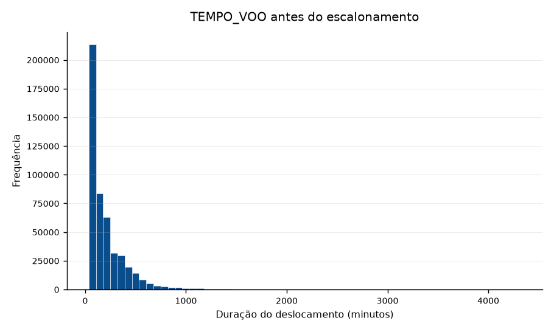<br>
  <sup>Fonte: Autoria própria.</sup>
</div>

<div align="center">
  <sub>Figura A.2 – Distribuição de TEMPO_VOO após padronização</sub><br>
  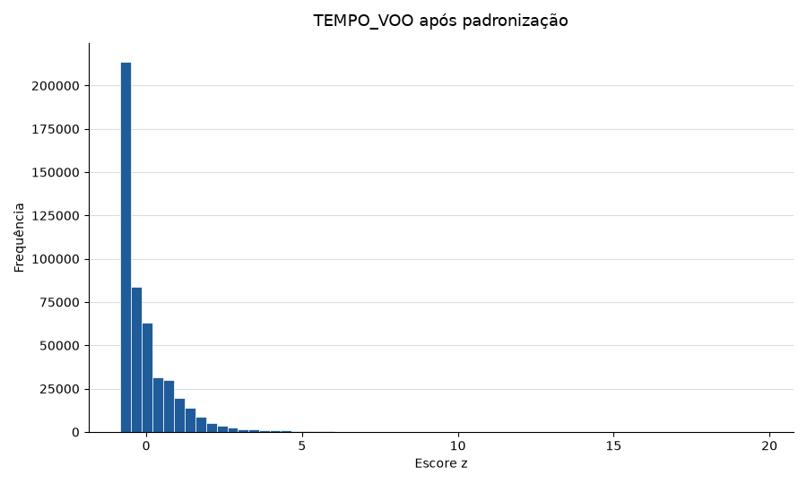<br>
  <sup>Fonte: Autoria própria.</sup>
</div>

<div align="center">
  <sub>Figura A.3 – Distribuição de ATRASO_CHEGADA antes do escalonamento</sub><br>
  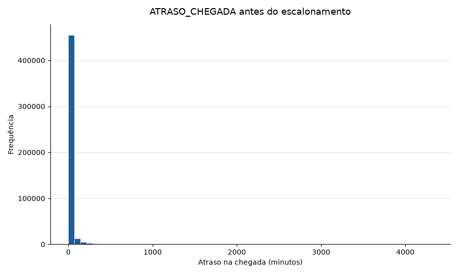<br>
  <sup>Fonte: Autoria própria.</sup>
</div>

<div align="center">
  <sub>Figura A.4 – Distribuição de ATRASO_CHEGADA após padronização</sub><br>
  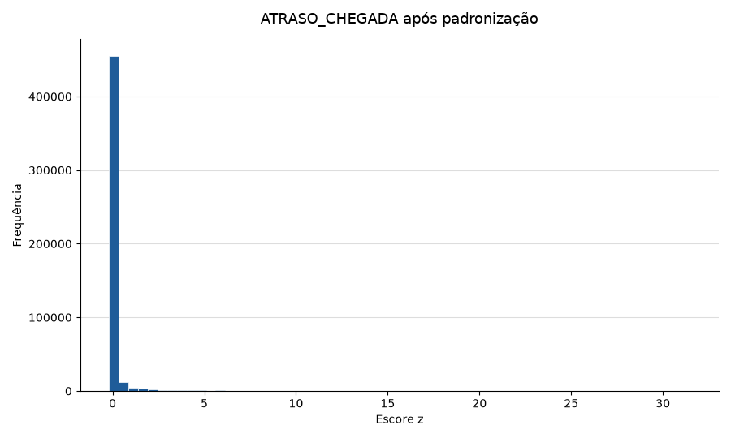<br>
  <sup>Fonte: Autoria própria.</sup>
</div>

<div align="center">
  <sub>Figura A.5 – Distribuição de QTDE_VIAGENS_12M antes do escalonamento</sub><br>
  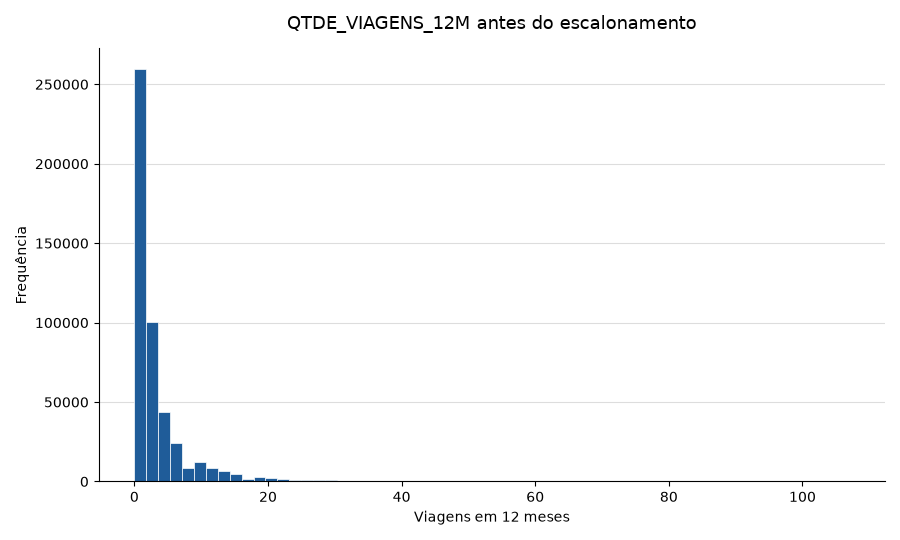<br>
  <sup>Fonte: Autoria própria.</sup>
</div>

<div align="center">
  <sub>Figura A.6 – Distribuição de QTDE_VIAGENS_12M após normalização</sub><br>
  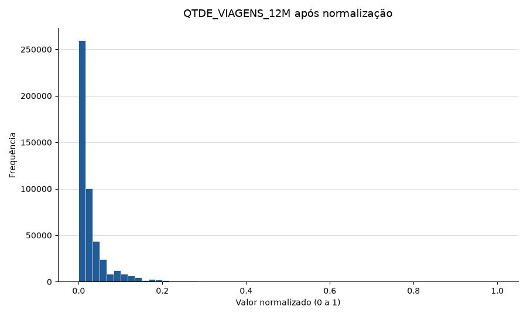<br>
  <sup>Fonte: Autoria própria.</sup>
</div>

&emsp;As três variáveis têm cauda longa, e isso tem uma consequência visual que precisa ser registrada para que as figuras acima não sejam lidas além do que mostram. Com 60 classes sobre o intervalo de 0 a 4.319 minutos de `ATRASO_CHEGADA`, cada classe cobre cerca de 72 minutos, de modo que a primeira delas reúne 454.993 registros, ou 93,83% da base, somando os 386.011 voos pontuais aos 68.982 com atraso de 1 a 71 minutos. Esses quatro valores não foram obtidos à mão: a seção 2 do notebook `notebooks/histogramas_anexo_a1.ipynb` os calcula com `numpy.histogram` sobre a mesma constante de 60 classes usada para desenhar as figuras, de modo que a contagem sai do mesmo agrupamento que gerou o gráfico. Na escala linear essa classe achata todo o restante da distribuição. O par abaixo repete a mesma variável com o eixo vertical em escala logarítmica, o que torna a cauda visível sem alterar o argumento desta subseção: como os dois lados usam a mesma escala, a silhueta continua idêntica antes e depois da transformação.

<div align="center">
  <sub>Figura A.7 – Distribuição de ATRASO_CHEGADA antes do escalonamento, com eixo vertical logarítmico</sub><br>
  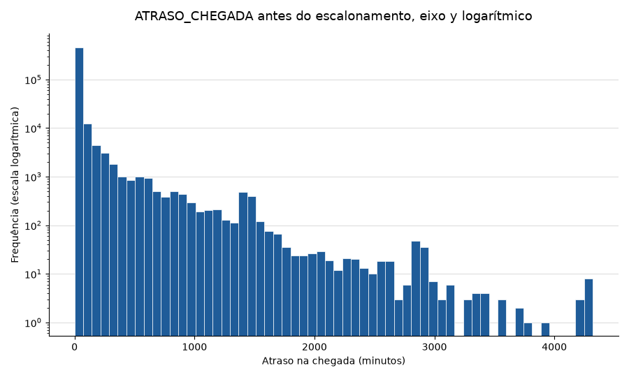<br>
  <sup>Fonte: Autoria própria.</sup>
</div>

<div align="center">
  <sub>Figura A.8 – Distribuição de ATRASO_CHEGADA após padronização, com eixo vertical logarítmico</sub><br>
  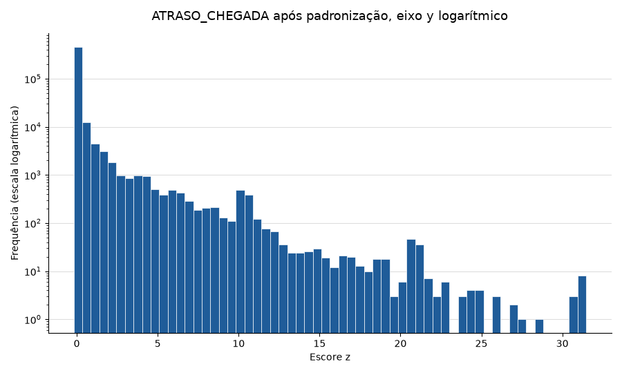<br>
  <sup>Fonte: Autoria própria.</sup>
</div>

&emsp;A comparação entre cada par revela o ponto central desta subseção: **o escalonamento não altera a forma da distribuição, apenas a escala em que ela é lida**. Os histogramas antes e depois são visualmente idênticos em silhueta, e o que muda é exclusivamente o eixo horizontal. Em `TEMPO_VOO`, o eixo deixa de ir de 35 a 4.320 minutos e passa a ir de −0,8265 a 19,7456 em escore z. Em `QTDE_VIAGENS_12M`, ele deixa de ir de 0 a 107 viagens e passa a ir de 0 a 1. A assimetria positiva, a concentração à esquerda e a cauda longa à direita permanecem exatamente as mesmas.

&emsp;Essa constatação é importante porque delimita o que o escalonamento resolve e o que ele não resolve. Ele resolve o problema de magnitude, colocando variáveis medidas em unidades diferentes, minutos e contagens, em faixas comparáveis, o que é pré-requisito para algoritmos sensíveis à escala. Ele **não** resolve o problema de assimetria: uma variável não normal continua não normal depois de escalonada. Nos testes usuais de normalidade, como Shapiro-Wilk e D’Agostino, os dados transformados produzem exatamente os mesmos valores de p obtidos sobre os dados originais, porque essas estatísticas não se alteram sob transformação afim de escala positiva, que é o caso tanto da padronização quanto da normalização min-max. A ressalva é que isso não vale para um teste que compare a amostra com uma normal fixa, como o Kolmogorov-Smirnov contra a normal padrão, cujo resultado depende da escala e portanto muda entre os dois lados do par. Corrigir assimetria exigiria outro tipo de transformação, como a logarítmica, que altera de fato o formato da distribuição.

&emsp;Duas observações específicas. Em `ATRASO_CHEGADA`, a classe que contém os voos pontuais permanece dominante depois da padronização, e o valor de referência dela deixa de ser o zero original e passa a ser −0,1880. Convém não confundir essa classe com os 79,6% de voos pontuais: por ter cerca de 72 minutos de largura, ela reúne também os atrasos curtos, e chega a 93,83% da base, conforme detalhado logo acima. Em `QTDE_VIAGENS_12M`, a normalização comprime toda a massa da distribuição contra a extremidade esquerda do intervalo de 0 a 1, tornando visualmente evidente o efeito de compressão que havia sido descrito numericamente na seção A.1.2 e quantificado na A.1.4.

#### A.1.6. Comparação entre dados originais e escalonados

&emsp;As duas tabelas abaixo apresentam dez registros da base analítica, primeiro em sua forma original e depois após a aplicação das equações da seção A.1.4. As linhas são as mesmas nas duas tabelas, de modo que cada registro pode ser acompanhado de uma para a outra. Os dez são fixados pelo `RESPONDENT_ID`, chave de integração das quatro fontes e único na base, e nunca pela posição, ainda que o identificador em si não seja reproduzido aqui: as tabelas usam um índice sequencial, que vale para as duas, porque o identificador é dado do parceiro e não é necessário ao que este anexo demonstra. O motivo é concreto: a rotina que descobre os arquivos em `scripts/preprocessamento_nps.py` os lista com `Path.iterdir()`, que não garante ordem alguma, de modo que `NPS_01` a `NPS_04` podem ser concatenados em ordens diferentes conforme o sistema de arquivos, e uma seleção posicional devolveria dez registros distintos sem que nada acusasse. Os escolhidos são os de menor `RESPONDENT_ID` da base, sem seleção por valor, para que a amostra não fique escolhida a favor do argumento.

**Dados originais**

| Registro | `TEMPO_VOO` (min) | `ATRASO_CHEGADA` (min) | `QTDE_VIAGENS_12M` |
|---:|---:|---:|---:|
| 1 | 640 | 0 | 0 |
| 2 | 90 | 0 | 0 |
| 3 | 110 | 0 | 0 |
| 4 | 75 | 0 | 1 |
| 5 | 210 | 0 | 0 |
| 6 | 65 | 76 | 13 |
| 7 | 95 | 0 | 10 |
| 8 | 340 | 33 | 0 |
| 9 | 65 | 31 | 0 |
| 10 | 80 | 104 | 0 |

**Dados escalonados**

| Registro | `TEMPO_VOO` (escore z) | `ATRASO_CHEGADA` (escore z) | `QTDE_VIAGENS_12M` (0 a 1) |
|---:|---:|---:|---:|
| 1 | 2,0781 | −0,1880 | 0,0000 |
| 2 | −0,5625 | −0,1880 | 0,0000 |
| 3 | −0,4664 | −0,1880 | 0,0000 |
| 4 | −0,6345 | −0,1880 | 0,0093 |
| 5 | 0,0137 | −0,1880 | 0,0000 |
| 6 | −0,6825 | 0,3689 | 0,1215 |
| 7 | −0,5385 | −0,1880 | 0,0935 |
| 8 | 0,6378 | 0,0538 | 0,0000 |
| 9 | −0,6825 | 0,0392 | 0,0000 |
| 10 | −0,6105 | 0,5741 | 0,0000 |

&emsp;A leitura conjunta das duas tabelas torna concreto o efeito de cada método. Três dos dez registros ficam acima da média de 207,1565 minutos e aparecem com escore positivo: o registro 1, com 640 minutos de deslocamento, em 2,0781; o registro 8, com 340 minutos, em 0,6378; e o registro 5, com 210 minutos, em 0,0137. Os outros sete produzem escores negativos. O registro 5 é o mais ilustrativo dos três, porque está a apenas três minutos da média e por isso quase coincide com o zero da escala padronizada, mostrando que o escore mede distância até a média e não magnitude absoluta. Os registros 2 e 9, com 90 e 65 minutos, ficam em −0,5625 e −0,6825: a diferença de 25 minutos entre eles vira uma diferença de 0,12 na escala padronizada, o que dá noção de quanto um desvio padrão de 208 minutos comprime as variações pequenas.

&emsp;Em `ATRASO_CHEGADA`, os seis registros com atraso zero produzem todos o mesmo valor, −0,1880, o que confirma que na padronização o valor de referência é a média e não o zero original. A amostra reproduz aqui, em escala reduzida, o que ocorre na base inteira: como 79,6% dos voos chegam pontualmente, esse mesmo −0,1880 se repete em 386.011 registros e é de longe o valor mais frequente da coluna transformada. Os registros 6, 8, 9 e 10, com 76, 33, 31 e 104 minutos de atraso, resultam em 0,3689, 0,0538, 0,0392 e 0,5741, preservando a ordem e as distâncias relativas entre eles.

&emsp;As duas tabelas e as três verificações comentadas abaixo, a contagem de registros pontuais, os registros acima da média de `TEMPO_VOO` e a faixa ocupada pela coluna normalizada, estão na seção 3 do notebook `notebooks/histogramas_anexo_a1.ipynb`. Em `QTDE_VIAGENS_12M`, os valores escalonados desta amostra vão de 0,0000 a 0,1215, ou seja, ocupam menos de 13% do intervalo disponível. O registro 6, de um Cliente com 13 viagens em doze meses, que está no percentil 95 da base inteira, aparece como 0,1215. É a ilustração mais direta do efeito de compressão discutido na seção A.1.2: mesmo um Cliente entre os 5% mais frequentes da companhia ocupa apenas a oitava parte da escala, porque o teto dela é definido pelo Cliente com 107 viagens.
