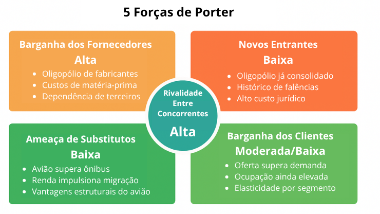

# Documentação Modelo Preditivo - Inteli

```
INSTRUÇÕES GERAIS (remova este trecho ao final)

Você deve editar este documento utilizando notação markdown - siga as convenções neste link 
https://docs.github.com/en/get-started/writing-on-github/getting-started-with-writing-and-formatting-on-github/basic-writing-and-formatting-syntax
```

## Nome da Solução
### Nome do grupo
#### (preencha aqui os nomes dos integrantes, em ordem alfabética, separados por vírgula)

## Sumário
[1. Introdução](#c1)

[2. Objetivos e Justificativa](#c2)

[3. Metodologia](#c3)

[4. Desenvolvimento e Resultados](#c4)

[5. Conclusões e Recomendações](#c5)

[6. Referências](#c6)

[Anexos](#attachments)


## <a name="c1"></a>1. Introdução
```
Apresente de forma sucinta o parceiro de negócio, seu porte, local, área de atuação e posicionamento no mercado. Maiores detalhes deverão ser descritos na seção 4. Descreva resumidamente o problema a ser resolvido (sem ainda mencionar a solução). 

Remova este bloco ao final
```

## <a name="c2"></a>2. Objetivos e Justificativa
### 2.1 Objetivos
```
Descreva resumidamente os objetivos gerais e específicos do seu parceiro de negócios.

Remova este bloco ao final
```

### 2.2 Proposta de solução
```
Descreva resumidamente sua proposta de modelo preditivo e como esse modelo pretende resolver o problema, atendendo os objetivos.

Remova este bloco ao final
```

### 2.3 Justificativa
```
Faça uma breve defesa de sua proposta de solução, escreva sobre seus potenciais, seus benefícios e como ela se diferencia.

Remova este bloco ao final
```

## <a name="c3"></a>3. Metodologia
```
Descreva a metodologia CRISP-DM e suas etapas de desenvolvimento, citando o referencial teórico. Você deve apenas enunciar os métodos, sem dizer ainda como eles foram aplicados, nem quais resultados foram obtidos.

Remova este bloco ao final
```

## <a name="c4"></a>4. Desenvolvimento e Resultados
### 4.1. Compreensão do Problema
#### 4.1.1. Contexto da indústria 

**Contexto Setorial**

O mercado doméstico brasileiro é dominado por três companhias — Latam, Gol e Azul. A Latam é a mais antiga, com origem em 1961 como Táxi Aéreo Marília, estruturando-se como companhia regional em 1976 e consolidando-se como líder nacional antes de se fundir com a chilena LAN, adotando a marca única Latam a partir de 2016. A Gol surgiu em 2001 como a primeira companhia low-cost do país, reduzindo custos via padronização de frota e eliminação de bilhetes de papel, mas também foi afetada pelas dificuldades estruturais do setor, pedindo recuperação judicial em 2024. A Azul, a mais recente das três, se diferencia por capilaridade e experiência do cliente, competindo menos por preço e mais por alcance geográfico e diferenciação de produto.

A Azul se posiciona como a companhia de maior capilaridade do Brasil, operando uma frota diversificada que combina aeronaves de médio/grande porte (Embraer 195, Airbus A320 e A330) com aeronaves de menor porte (Cessna 208 Caravan), o que permite acesso a localidades de difícil alcance para as concorrentes. Além da malha ampliada, a empresa aposta na diferenciação da experiência de bordo — entretenimento com TV ao vivo e opções de refeição pouco comuns no setor — como forma de fidelizar clientes sem depender exclusivamente de guerra de tarifas. Essa estratégia posiciona a Azul de forma distinta na análise de rivalidade: enquanto Gol e Latam historicamente competem por preço e escala, a Azul busca competir por diferenciação e cobertura geográfica.

O setor aéreo brasileiro segue hostil e sujeito a ciclos de crise financeira recorrentes — as três principais companhias, assim como marcas historicamente relevantes (Varig, Vasp, Transbrasil), já passaram ou estão em processo de recuperação judicial, evidenciando barreiras de saída altas que intensificam a rivalidade. Ao mesmo tempo, o transporte aéreo vem ganhando espaço estrutural: em 2025, pela primeira vez na série histórica, superou o transporte rodoviário por ônibus em número de viagens no país, impulsionado pelo aumento de renda do trabalhador. Some-se a isso a escassez global de aeronaves, que eleva o poder de barganha dos fabricantes (Boeing, Airbus, Embraer) e limita a capacidade das companhias de expandir oferta rapidamente, e o crescimento do mercado internacional, com disputa acirrada por rotas estratégicas (como Brasil-EUA) via expansão de rede e parcerias como a joint venture Latam-Delta.

**5 Forças de Porter**

<br>
Imagem 1: 5 Forças de Porter - Produção autoral

**Poder de barganha dos fornecedores: Alto**<br>
No setor de aviação comercial, apenas três fabricantes atendem as companhias aéreas brasileiras e mundiais: Boeing, Airbus e a nacional Embraer. Essa baixa quantidade de competidores concentra o poder de decisão nas mãos dos fornecedores, que ditam prazos e condições ao mercado. A escassez de matéria-prima para fabricação de aeronaves, intensificada após a pandemia, eleva os custos de produção e é repassada às companhias aéreas (TAMIOZZO, 2026). Some-se a isso a dependência de outros fornecedores críticos — infraestrutura aeroportuária, tecnologia e serviços de bordo —, que também exigem alto capital das companhias, reforçando o poder desse elo da cadeia (TAMIOZZO, 2026).

**Poder de barganha dos clientes: Moderado/Baixo**<br>
Em junho, a oferta de assentos cresceu mais que a demanda, o que em tese fortalece o poder de barganha do cliente (MARQUES, 2026). Ainda assim, a ocupação seguiu próxima de 80%, limitando esse poder na prática (MARQUES, 2026).

**Rivalidade entre concorrentes: Alta**<br>
No mercado doméstico, apenas três companhias predominam — Latam, Gol e Azul —, que competem reduzindo tarifas para ganhar passageiros, o que aperta suas margens e já levou as três a processos de recuperação judicial (NUNES; BOLZANI, 2026). Essa rivalidade é tão intensa que inviabilizou uma fusão entre Azul e Gol, motivada pela fragilidade financeira de ambas (NUNES; BOLZANI, 2026).

**Ameaça de produtos substitutos: Baixa**<br>
Em 2025, pela primeira vez na série histórica, o transporte aéreo superou o rodoviário por ônibus em número de viagens no Brasil, segundo o IBGE, impulsionado pelo aumento da renda do trabalhador (CAVALCANTI, 2025; PESQUISA DO IBGE..., 2025). Isso indica que o avião vem ganhando espaço, não perdendo, frente ao seu principal substituto.

**Entrada de novos concorrentes: Baixa**<br>
A criação de uma nova companhia aérea no Brasil enfrenta barreiras estruturais relevantes: oligopólio consolidado entre poucos competidores, capital elevado e volátil por depender do câmbio, alto custo de combustível (também dolarizado), juros altos para financiamento, alto custo jurídico e um histórico de falências de companhias brasileiras (POR QUE AS COMPANHIAS..., 2026). Em conjunto, esses elementos tornam a entrada de novos concorrentes pouco provável.

#### 4.1.2. Análise SWOT 
```
Posicione aqui sua análise SWOT.

Remova este bloco ao final
```

#### 4.1.3. Planejamento Geral da Solução
```
a) quais os dados disponíveis (fonte e conteúdo - exemplo: dados da área de Compras da empresa descrevendo seus fornecedores).
b) qual a solução proposta (pode ser um resumo do texto da Seção 2.2).
c) como a solução proposta deverá ser utilizada.
d) quais os benefícios trazidos pela solução proposta.
e) qual será o critério de sucesso.

Remova este bloco ao final
```

#### 4.1.4. Value Proposition Canvas
```
Posicione aqui seu canvas.

Remova este bloco ao final
```

#### 4.1.5. Matriz de Riscos
```
Posicione aqui sua matriz.

Remova este bloco ao final
```

#### 4.1.6. Personas
```
Posicione aqui suas Personas (indique se são personas que utilizam o modelo e/ou se são afetadas pelo modelo).

Remova este bloco ao final
```

#### 4.1.7. Jornadas do Usuário
```
Posicione aqui seus mapas de jornadas do usuário que utiliza o modelo.

Remova este bloco ao final
```

#### 4.1.8 Política de Privacidade
```
Posicione aqui sua política de privacidade em acordo com a LGPD

Remova este bloco ao final
```

### 4.2. Compreensão dos Dados

#### 4.2.1. Exploração de dados
```
Apresentar a estatística descritiva básica de cada coluna, identificar se a coluna é numérica ou categórica e pelo menos 3 gráficos para visualizar a relação entre colunas escolhidas pelo grupo.

Remova este bloco ao final
```

#### 4.2.2. Pré-processamento dos dados
```
Apresentar quais foram as ações realizadas de limpeza (tratamento de missing values e remoção de outliers) e transformação (normalização e codificação) das colunas. Se houverem outliers, cite quais são e qual(is) correção(ões) será(ão) aplicada(s).

Remova este bloco ao final
```

#### 4.2.3. Hipóteses
```
Descreva três hipóteses sobre a relação dos dados e o problema. Justifique cada uma delas. 

Remova este bloco ao final
```

### 4.3. Preparação dos Dados e Modelagem
```
Caso seu projeto seja Modelo Supervisionado, apresentar: 
a) Organização dos dados (conjunto de treinamento, validação e testes)
b) Modelagem para o problema (proposta de features com a explicação completa da linha de raciocínio).
c) Métricas relacionadas ao modelo (pelo menos 3).
d) Apresentar o primeiro modelo candidato, e uma discussão sobre os resultados deste modelo (discussão sobre as métricas para esse modelo candidato).

Caso seu projeto seja Modelo Não-Supervisionado, apresentar:
a) Modelagem para o problema (proposta de features com a explicação completa da linha de raciocínio).
b) Primeiro modelo candidato para o problema.
c) Justificativa para a definição do K do modelo.
d) Escolha de um tipo de sistema de recomendação e a justificativa para essa escolha.

Remova este bloco ao final
```

### 4.4. Comparação de Modelos
```
- Descrever e justificar a escolha da métrica de avaliação dos modelos com base no que é mais importante para o problema ao 
  se medir a qualidade desses modelos;
- Descrever ao menos três modelos candidatos, seus respectivos algoritmos, seus tunings de hiperparâmetros e suas métricas 
  alcançadas;

Remova este bloco ao final
```

### 4.5. Avaliação
```
- Descreva a solução final de modelo preditivo e justifique a escolha. Alinhe sua justificativa com a Seção 4.1, resgatando o entendimento 
  do negócio e das personas, explicando de que formas seu modelo atende os requisitos e definições. 
- Descreva também um plano de contingência para os casos em que o modelo falhar em suas predições.
- Além disso, discuta sobre a explicabilidade do modelo (se aplicável) e realize a verificação de aceitação ou refutação das hipóteses.
- Se aplicável, utilize equações, tabelas e gráficos de visualização de dados para melhor ilustrar seus argumentos. 

Remova este bloco ao final
```

## <a name="c5"></a>5. Conclusões e Recomendações
```
Escreva, de forma resumida, sobre os principais resultados do seu projeto e faça recomendações formais ao seu parceiro de negócios em relação ao uso desse modelo. Você pode aproveitar este espaço para comentar sobre possíveis materiais extras, como um manual de usuário mais detalhado na seção “Anexos”. Não se esqueça também das pessoas que serão potencialmente afetadas pelas decisões do modelo preditivo e elabore recomendações que ajudem seu parceiro a tratá-las de maneira estratégica e ética. 

Remova este bloco ao final
```

## <a name="c6"></a>6. Referências

CAVALCANTI, Glauce. Avião supera ônibus em viagens no país pela 1a vez desde 2020. Disponível em: <https://oglobo.globo.com/economia/noticia/2025/10/02/aviao-supera-onibus-em-viagens-no-pais-pela-1a-vez-desde-2020.ghtml>. Acesso em: 5 ago. 2026.


MARQUES, Vinícius. Brasil é o único grande mercado doméstico de aviação a crescer em junho; demanda global recua, diz IATA. Disponível em: <https://timesbrasil.com.br/empresas-e-negocios/aviacao/brasil-e-o-unico-grande-mercado-domestico-de-aviacao-a-crescer-em-junho-demanda-global-recua-diz-iata/>. Acesso em: 5 ago. 2026.


NUNES, Júlia; BOLZANI, Isabela. Por que as principais companhias aéreas do Brasil tiveram que pedir recuperação judicial? Disponível em: <https://g1.globo.com/economia/noticia/2025/05/28/por-que-as-principais-companhias-aereas-do-brasil-tiveram-que-pedir-recuperacao-judicial.ghtml>. Acesso em: 5 ago. 2026.


TAMIOZZO, Mateus. Por que faltam aviões para as companhias aéreas e como isso prejudica a sua viagem? Disponível em: <https://www.melhoresdestinos.com.br/falta-de-avioes.html>. Acesso em: 4 ago. 2026.


Pesquisa do IBGE revela mudança nos meios de transporte: avião supera ônibus pela primeira vez. YouTube, 2025. 1 vídeo (5:28). Disponível em: https://www.youtube.com/watch?v=jiSMLAnPCaQ. Acesso em: 05/08/2026.


Por que as Companhias Aéreas Brasileiras dão tanto PREJUÍZO? | Curioso Explica. YouTube, 2026. 1 vídeo (11:30). Disponível em: https://www.youtube.com/watch?v=hwI6NVrZGig. Acesso em: 05/08/2026.

## <a name="attachments"></a>Anexos
```
Utilize esta seção para anexar materiais como manuais de usuário, documentos complementares que ficaram grandes e não couberam no corpo do texto etc.

Remova este bloco ao final
```
